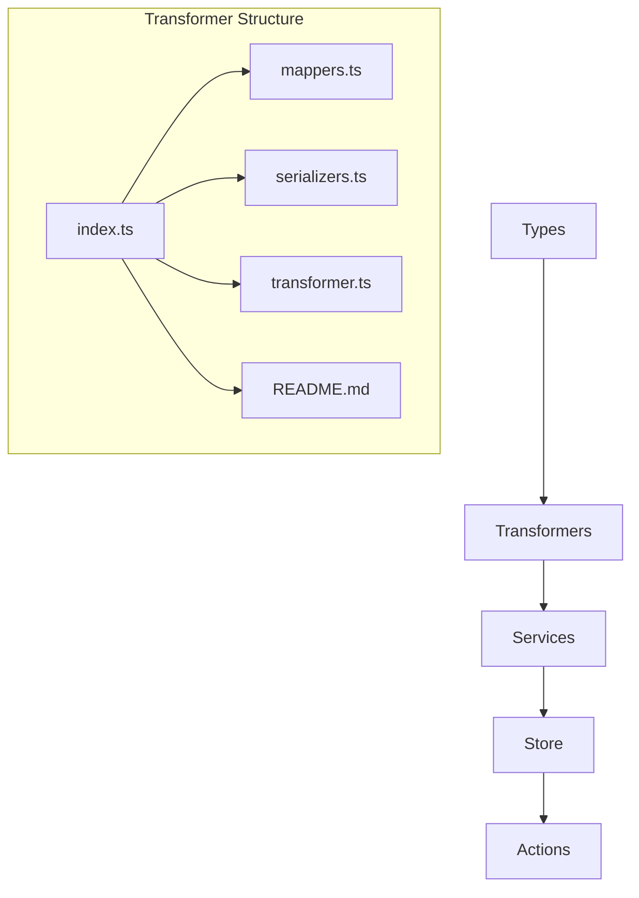

# 🎯 Copilot Instructions: Image Manager Project (2025)

<CORE_PRINCIPLES>
**Escribe el código como si el tipo que termine manteniendo tu código sea un psicópata violento que sabe dónde vives.**

## 🚀 Principios Fundamentales

- **SIEMPRE prioriza herramientas internas** sobre comandos de terminal (funcionan mejor).
- **Comenta y documenta en español** con emojis en comentarios clave.
- **Analiza flujo completo** antes de actuar. Busca en el codebase si no estás seguro.
- **Toda funcionalidad, tipo, componente o archivo modificado o creado debe ser documentado inmediatamente después de trabajarlo.**
- **Usa el stack real:** Next.js 15.3.3, React 19, Tailwind 4, Shadcn/ui, motion/react, PNPM, Prisma (migrando a Drizzle).
- **Prefiere Server Actions** para mutaciones y lógica de negocio; API solo para casos especiales.
- **Valida siempre con Zod** antes de persistir datos.
- **Usa tipos canónicos** y elimina legacy/duplicados.
- **Mantén CURRENT-TASK.md** actualizado y consulta guidelines.
- **Usa diagramas mermaid** para flujos y relaciones complejas.
- **NO crear directorios vacíos** - solo archivos con contenido funcional.
- **Nunca importar tipos de Prisma** en archivos que puedan ser importados por el cliente.

## 📋 Stack y Tecnologías

### Core Framework
- **Next.js 15.3.3** - App Router, Server Components, Server Actions
- **React 19** - Suspense, automatic batching, SSR mejorado
- **TypeScript** - Modo estricto, tipos canónicos, validación runtime

### Styling y UI
- **Tailwind CSS 4** - Clases utilitarias, responsive, dark mode
- **Shadcn/ui** - Componentes accesibles integrados con Tailwind
- **motion/react** - Animaciones modernas y performantes

### Estado y Datos
- **Zustand** - Estado global por features, middleware persist/immer
- **React Query** - Server state, caché, mutaciones optimistas
- **Prisma** - ORM actual (migrando progresivamente a Drizzle)
- **Zod** - Validación de datos en runtime

### Herramientas
- **PNPM** - Gestor de paquetes
- **Jest** - Testing unitario e integración
- **Bull** - Sistema de colas para procesamiento de imágenes
- **Lodash** - Utilidades funcionales (uso moderado y específico)
- **Radix UI** - Primitivos de UI accesibles
- **React Query (TanStack Query)** - Server state y caché inteligente

## 🏗️ Arquitectura y Estructura

### Organización de Carpetas
```
src/
├── app/           # Next.js App Router
│   ├── actions/   # Server Actions organizados por dominio
│   ├── api/       # API Routes (solo casos especiales)
│   └── ...
├── components/    # Componentes React
│   ├── ui/        # Componentes reutilizables (Shadcn/ui)
│   └── features/  # Componentes por feature
├── types/         # Tipos TypeScript por entidad
│   └── entities/  # Un directorio por entidad con types.ts
├── store/         # Stores Zustand por feature
├── transformers/  # Lógica de transformación de datos
├── services/      # Lógica de negocio y servicios externos
└── utils/         # Utilidades compartidas
```

### Entidades del Sistema
- **Activity**, **Album**, **Character**, **Collection**, **Concept**
- **Favorite**, **File**, **Folder**, **Group**, **Image**
- **Note**, **Place**, **Property**, **Prompt**, **Tag**
- **Task**, **Video**, **Wildcard**, **WorldItem**, **Profile**
- **Metadata**, **UploadedImage**, **QueueJob**

Cada entidad sigue el patrón: `types/ → transformers/ → services/ → store/ → actions/`

## 📝 Reglas por Tecnología

### Next.js 15 & React 19
- Server Components por defecto, 'use client' solo para interactividad
- Server Actions para mutaciones, integración con Prisma/Drizzle
- Usar features de React 19: Suspense, automatic batching
- Metadatos dinámicos para SEO, caché y streaming para datos pesados
- Estructura de actions organizada por dominio en `app/actions/`

### TypeScript
- Modo estricto en tsconfig.json, inferencia y generics
- Interfaces para entidades, types para utilidades
- Validación runtime con Zod, integración con Prisma/Drizzle
- Tipos canónicos, barrels limpios, documentación JSDoc
- **Prohibido**: importar tipos de Prisma en archivos cliente

### Tailwind CSS & Shadcn/ui
- Clases utilitarias en JSX, componentes Shadcn/ui
- Animaciones con motion/react, responsive y dark mode
- Custom utilities con @apply, clsx/tailwind-merge para dinámicas
- Componentes ui reutilizables en `components/ui/`

### Transformers (Capa crítica)
- **Estructura por entidad**: `index.ts → mappers.ts → serializers.ts → transformer.ts`
- **Nunca importar Prisma** en transformers (solo tipos de dominio)
- **Funciones específicas**: `from/to PrismaEntity`, `validate`, `extend`, `transform`
- **Documentación obligatoria**: README.md con ejemplos y diagramas

### Estado y Datos
- **Zustand**: Stores pequeños por feature, middleware persist/immer
- **React Query**: useQuery/useMutation, caché agresiva, hooks personalizados
- **Prisma**: Instancia única, validación Zod, migración a Drizzle
- **Server Actions**: Estructura funcional, validación, revalidación

### Seguridad
- Validación estricta uploads, sanitización EXIF
- CSP, CSRF, autenticación, URLs firmadas
- Rate limiting, auditoría y logging
- Nunca exponer tipos de Prisma al cliente

### Performance
- Lazy loading imágenes, BlurHash placeholders
- Code splitting, tree shaking, memoización
- Virtualización listas, Web Vitals monitoring
- Caché agresiva con React Query y Next.js

### Accesibilidad
- HTML semántico, navegación teclado, ARIA
- Contraste, foco visible, alt text descriptivo
- Testing con tecnologías asistivas
- Componentes Radix UI como base

## 🔧 Flujo de Trabajo

### Antes de Cada Tarea
1. **Buscar en codebase** - Revisar funcionalidad existente
2. **Actualizar CURRENT-TASK.md** - Plan de acción con diagrama mermaid
3. **Listar reglas activas** - Aplicables a la tarea actual

### Durante el Desarrollo
1. **Crear/modificar código** siguiendo patrones del proyecto
2. **Validar con herramientas** - get_errors, testing
3. **Documentar inmediatamente** - README.md, diagramas, ejemplos

### Después de Cada Tarea
1. **Verificar integración** - Testing, error checking
2. **Actualizar documentación** - Diagramas, ejemplos, best practices
3. **Limpiar legacy** - Eliminar código obsoleto o duplicado

## 🏛️ Arquitectura de Transformers

Los transformers son el corazón del sistema de datos. Cada entidad sigue esta estructura:



### Responsabilidades por Archivo:
- **`mappers.ts`**: Conversión entre formatos (Prisma ↔ Domain ↔ UI)
- **`serializers.ts`**: Validación, extensión y normalización
- **`transformer.ts`**: Funciones principales de transformación
- **`index.ts`**: Punto de entrada y exportaciones controladas
- **`README.md`**: Documentación específica con ejemplos

## 🛠️ Herramientas y Patrones Específicos

### Server Actions
- **Organización**: Por dominio en `app/actions/[entidad]/`
- **Patrón**: `crud.actions.ts`, `query.actions.ts`, `stats.actions.ts`
- **Validación**: Siempre con Zod antes de cualquier operación
- **Revalidación**: Paths específicos tras mutaciones

### Zustand Stores
- **Estructura**: Core + UI + Filters slices
- **Middleware**: persist (configuraciones), immer (updates)
- **Selectores**: createSelectors para optimización
- **Patrón**: `store/entities/[entidad]/store.ts`

### React Query
- **Keys**: Jerárquicos [`entidad`, id, filters]
- **Stale time**: 5min para datos estables, 30s para dinámicos
- **Cache time**: 10min por defecto
- **Optimistic updates**: Para mejora UX

### Components UI
- **Base**: Radix UI + Shadcn/ui
- **Animaciones**: motion/react para transiciones
- **Responsivo**: Mobile-first con Tailwind
- **Accesibilidad**: ARIA, focus, keyboard navigation

### Testing
- **Unitarios**: Jest + Testing Library
- **Mocks**: Centralizados en `src/tests/__mocks__/`
- **Fixtures**: Datos de prueba en `src/tests/__fixtures__/`
- **Integration**: Server Actions + Database

## 📚 Documentación Requerida

### Por Componente/Módulo
- **README.md** con descripción, estructura, ejemplos
- **Diagrama mermaid** de flujo y relaciones
- **Ejemplos de uso** en el proyecto
- **Best practices** específicas del componente

### Por Entidad
- **types.ts** - Tipos canónicos únicamente
- **documentation.md** - Estructura, flujo, ejemplos, integración
- **Diagramas** - Relaciones, flujo de datos, arquitectura

## 🚨 Reglas de Seguridad y Calidad

### Importaciones y Dependencias
- **Nunca** importar tipos de Prisma en archivos cliente (transformers, stores, components)
- **Usar** tipos de dominio de `@/types/entities/[entidad]/types.ts`
- **Validar** con Zod antes de persistir cualquier dato
- **Prefiere** transformers sobre lógica directa de Prisma

### Estructura de Archivos
- **Index files**: Solo reexportaciones controladas
- **Barrel exports**: Evitar circular dependencies
- **Naming**: camelCase para funciones, PascalCase para tipos
- **Paths**: Absolutos con `@/` alias

### Performance y Optimización
- **Lazy loading**: Componentes pesados y rutas
- **Memoización**: useCallback, useMemo para cálculos costosos
- **Virtualización**: Listas con más de 100 elementos
- **Bundle splitting**: Por features y vendors

## ⚠️ Prohibiciones y Limitaciones

### ❌ NO Hacer
- Crear directorios vacíos (solo archivos)
- Usar comandos terminal antes que herramientas internas
- Duplicar tipos o funcionalidades existentes
- Olvidar validación con Zod
- Crear código sin documentación inmediata
- Importar tipos de Prisma en archivos cliente

### ✅ SIEMPRE Hacer
- Buscar funcionalidad existente antes de crear
- Usar tipos canónicos y eliminar legacy
- Documentar con diagramas y ejemplos
- Validar errores con get_errors
- Mantener consistencia en naming y estructura

---

> **Última actualización:** 2025-06-10
> **Stack:** Next.js 15.3.3 + React 19 + Tailwind 4 + Shadcn/ui + Prisma→Drizzle
</CORE_PRINCIPLES>
