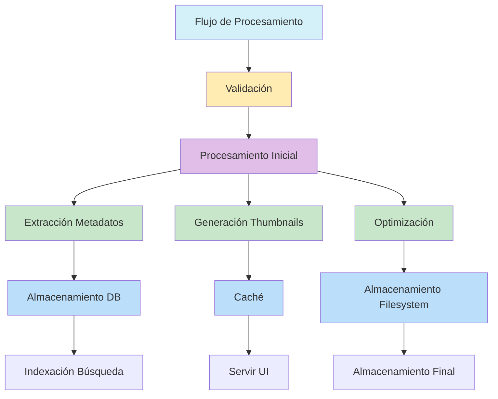

# Procesamiento de Imágenes: Mejores Prácticas

- **Sharp para procesamiento:** Usar Sharp para todas las operaciones de imágenes.
- **Procesamiento en background:** Usar Bull workers para tareas intensivas.
- **Thumbnails optimizados:** Generar múltiples resoluciones para diferentes vistas.
- **Extracción de metadatos EXIF:** Extraer y almacenar EXIF para búsqueda y organización.
- **Preservación de color:** Mantener perfiles ICC.
- **Optimización por formato:** Parámetros específicos para JPEG, PNG, WebP, AVIF.
- **Streaming para archivos grandes:** Reducir uso de memoria.
- **Validación de imágenes:** Validar archivos antes de procesar.
- **Orientación EXIF:** Corregir orientación automáticamente.
- **Límites de tamaño:** Limitar tamaño de uploads.
- **Procesamiento progresivo:** Indicadores de progreso con SSE/WebSockets.
- **Cacheo de resultados:** Cachear resultados frecuentes.
- **Limpieza de metadatos sensibles:** Eliminar GPS y datos privados.
- **Conversión de formatos:** Convertir a WebP/AVIF automáticamente.
- **Compresión inteligente:** Ajustar compresión según uso.

