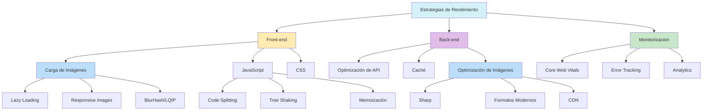

# Optimización de Performance: Mejores Prácticas

- **Lazy loading de imágenes:** Solo cargar imágenes visibles.
- **BlurHash:** Placeholders estéticos durante carga.
- **Selección responsive:** Diferentes tamaños según dispositivo.
- **Next.js Image Optimization:** Usa el componente Image para optimización automática.
- **Prefetching estratégico:** Precarga imágenes probables.
- **Code splitting:** Divide JS por rutas/características.
- **Tree shaking agresivo:** Solo código usado en bundles.
- **Web Vitals monitoring:** Monitorea Core Web Vitals, enfocado en LCP.
- **Optimización de fuentes:** Carga óptima y `font-display: swap`.
- **CSS crítico inline:** Evita bloqueo de render.
- **Paginación/infinite scroll:** Para grandes colecciones.
- **Virtualización de listas:** Renderiza solo lo visible.
- **Memoización de componentes:** Usa React.memo/useMemo estratégicamente.
- **Animaciones optimizadas:** Solo `transform` y `opacity` para fluidez.
- **Debounce/throttle:** En búsquedas y scroll.

