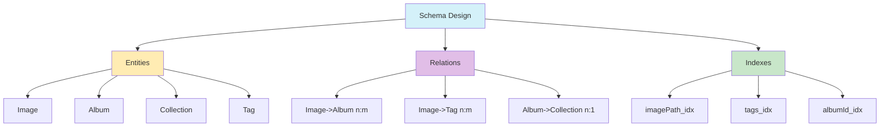

# Acceso a Datos: Prisma & Drizzle (2025)

- **Instancia única de Prisma Client:** Compartir instancia para evitar agotamiento de conexiones.
- **Migración progresiva a Drizzle:** Documentar y migrar módulos gradualmente.
- **Validación con Zod antes de persistir:** Validar todos los datos antes de guardar.
- **Transacciones para operaciones complejas.**
- **Optimización de queries:** Usar select/include y paginación.
- **Integración con Server Actions:** Acceso a datos desde Server Actions preferentemente.
- **Testing y seed de datos:** Mantener seeds y pruebas actualizadas.
- **Caché y performance:** Implementar caché LRU y optimización de índices.
- **Documentar diferencias y compatibilidad entre Prisma y Drizzle.**
- **Eliminar imports legacy de Prisma en el cliente.**
- **Diagramas mermaid para relaciones de entidades.**



**Ejemplo:**

```typescript
// lib/prisma.ts - Cliente Prisma singleton
import { PrismaClient } from '@prisma/client';
import { LRUCache } from 'lru-cache';
const imageMetadataCache = new LRUCache<string, any>({ max: 1000, ttl: 1000 * 60 * 5 });
const globalForPrisma = global as unknown as { prisma: PrismaClient };
export const prisma = globalForPrisma.prisma || new PrismaClient({
  log: process.env.NODE_ENV === 'development' ? ['query', 'error', 'warn'] : ['error'],
});
```
