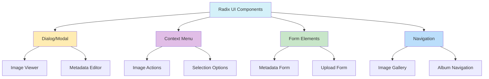

# Radix UI Accesibilidad: Mejores Prácticas

- **Props por defecto:** Mantener props por defecto para accesibilidad.
- **Patrones de teclado:** Seguir patrones Radix para navegación.
- **Tailwind custom:** Estilizar con Tailwind sin perder accesibilidad.
- **Extensión de componentes:** Mantener accesibilidad al extender.
- **Asociación de labels:** Etiquetas correctas en formularios.
- **Estados interactivos claros:** Hover, focus, active bien diferenciados.
- **Gestión de foco en modales/dialogs:** Usar focus management de Radix.
- **Entity cards accesibles:** Integrar Radix en tarjetas de imagen.
- **Tooltips accesibles:** Usar Tooltip de Radix con buen posicionamiento.
- **Composición de componentes complejos:** Componer desde primitivos Radix.
- **Animaciones accesibles:** Respetar preferencias de usuario.
- **Renderizado condicional:** Mantener foco correcto.
- **Responsive móvil:** Adaptar para móviles.
- **Estados de error accesibles:** Usar patrones Radix para errores.

