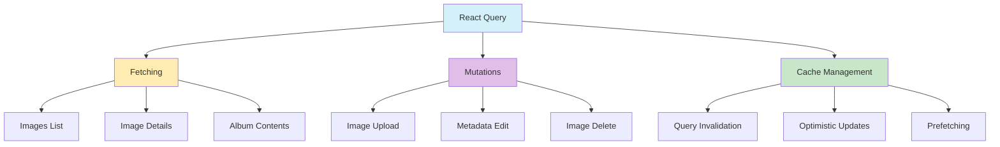

# React Query: Mejores Prácticas

- **useQuery para fetch, useMutation para mutaciones:** Usar hooks de React Query para imágenes y operaciones.
- **Manejo de errores y loading:** Skeletons y gestión visual de errores.
- **Caché agresiva:** Configura `staleTime` y `cacheTime` para thumbnails e imágenes.
- **Invalidación y revalidación:** Estrategias tras edición/eliminación.
- **Keys jerárquicas:** Ejemplo: `['images', { albumId, filters }]`.
- **Paginación e infinite loading:** Usa `useInfiniteQuery` para galerías.
- **Prefetching:** Precarga imágenes anticipando interacción.
- **Integración con Server Actions:** Combina React Query y Server Actions.
- **Hooks personalizados:** Ej: `useImageUpload`, `useImageMetadata`.
- **Optimistic updates:** Actualizaciones optimistas para favoritos, etiquetas, etc.
- **Suspense mode:** Usa suspense de React Query con React 19.
- **Configuración de QueryClient:** Defaults específicos para imágenes.
- **DevTools:** Usa React Query DevTools en desarrollo.
- **Dependent queries:** Carga detalles tras obtener colecciones.
- **Indicadores de background fetching:** Muestra refetch sutil en UI.

