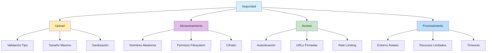

# Seguridad: Mejores Prácticas

- **Validación estricta de uploads:** Verifica MIME, extensión y contenido real.
- **Sanitización de metadatos EXIF:** Elimina datos sensibles (GPS, seriales).
- **Prevención de path traversal:** Usa `path.normalize` y valida rutas.
- **Almacenamiento seguro:** Nombres aleatorios, no predecibles.
- **Content Security Policy:** Implementa CSP para prevenir XSS.
- **Protección CSRF:** Usa tokens en mutaciones.
- **Autenticación:** Protege rutas de API y Server Actions.
- **CORS correcto:** Configura CORS según recursos.
- **Rate limiting:** Limita endpoints de upload/procesamiento.
- **Validación de tamaño:** Limita tamaño de uploads.
- **URLs firmadas:** Para acceso a imágenes privadas.
- **Sanitización SVG:** Sanitiza SVG para evitar XSS.
- **Escaneo de malware:** Implementa escaneo básico.
- **Aislamiento de procesamiento:** Usa entornos aislados si es posible.
- **Auditoría y logging:** Mantén logs detallados de uploads/accesos.

