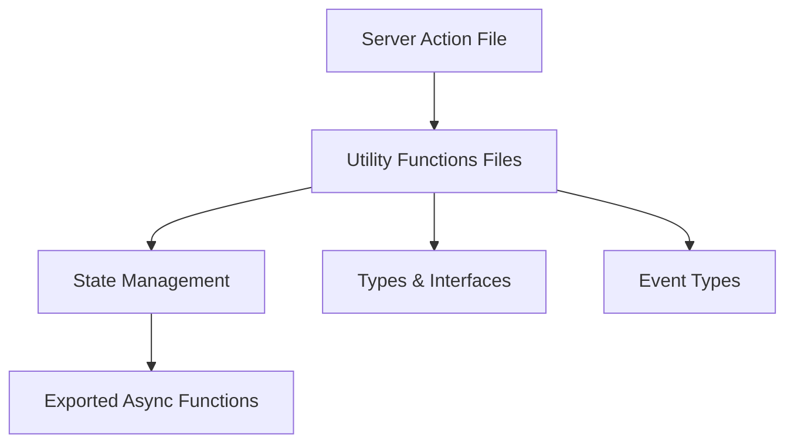

# Server Actions: Reglas de Estructura y Estilo

## Estructura Base



## Reglas Fundamentales

1. **Marcado de archivos:** Siempre 'use server' en la primera línea, sin imports antes.
2. **Estructura funcional:** No usar clases ni OOP, solo funciones y closures.
3. **Estado compartido:** Encapsular con closures, evitar globales mutables.
4. **Manejo de errores:** Usar enums y objetos simples para errores.
5. **Exportaciones:** Solo funciones async, nombres descriptivos.
6. **Eventos y revalidación:** Constantes para eventos y rutas, revalidación funcional.
7. **Funciones utilitarias:** Siempre puras y pequeñas.
8. **Procesamiento de imágenes:** Encapsular lógica intensiva en workers/servicios.

**Ejemplo:**

```typescript
'use server';
import { revalidatePath } from 'next/cache';
export async function createEntity(data) {
  // ...
  await revalidatePath('/entity');
}
```
