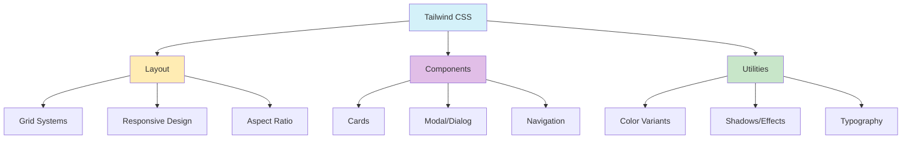

# Tailwind CSS 4 & Shadcn/ui: Mejores Prácticas (2025)

- **Clases utilitarias en JSX:** Usar clases Tailwind directamente en JSX.
- **Componentes shadcn/ui:** Usar componentes shadcn/ui integrados con Tailwind 4.
- **Animaciones con motion/react:** Integrar motion/react para animaciones en UI.
- **Responsive y dark mode:** Usar breakpoints y variantes dark de Tailwind.
- **Custom utilities y @apply:** Crear utilidades personalizadas con @apply.
- **Configuración en tailwind.config.js:** Personalizar colores y variables.
- **Condicionales con clsx/tailwind-merge:** Usar para clases dinámicas.
- **Patrones de layout modernos:** Grid, aspect-ratio, masonry, etc.
- **Testing visual y accesibilidad:** Probar componentes con herramientas de accesibilidad.
- **Documentación y ejemplos en cada componente.**



**Ejemplo:**

```tsx
export function ImageCard({ image, isSelected, onClick }) {
  return (
    <div
      className={clsx(
        "relative overflow-hidden rounded-lg transition-all duration-300",
        "aspect-[3/2]",
        "hover:ring-2 hover:ring-primary/70 hover:scale-[1.02]",
        isSelected && "ring-2 ring-primary shadow-lg"
      )}
      onClick={onClick}
    >
      
      <div className="absolute inset-0 bg-gradient-to-t from-black/70 to-transparent opacity-0 hover:opacity-100 transition-opacity duration-300">
        <div className="absolute bottom-0 left-0 right-0 p-3 text-white">
          <p className="font-medium text-sm line-clamp-1">{image.title || "Untitled"}</p>
          <p className="text-xs opacity-80">{image.dimensions}</p>
        </div>
      </div>
      {isSelected && (
        <div className="absolute top-2 right-2 w-6 h-6 rounded-full bg-primary text-white flex items-center justify-center">
          <svg xmlns="http://www.w3.org/2000/svg" viewBox="0 0 24 24" fill="none" stroke="currentColor" className="w-4 h-4">
            <polyline points="20 6 9 17 4 12" />
          </svg>
        </div>
      )}
    </div>
  );
}
```
