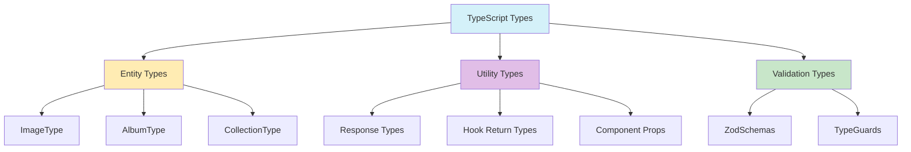

# TypeScript: Mejores Prácticas (2025)

- **Modo estricto en tsconfig.json**
- **Inferencia de tipos y generics:** Usar inferencia y generics para reutilización y seguridad.
- **Interfaces para entidades, types para utilidades.**
- **Validación runtime con Zod:** Siempre validar datos externos.
- **Integración con Prisma/Drizzle:** Usar tipos generados y migrar progresivamente.
- **Documentación con JSDoc y ejemplos.**
- **Tipos canónicos y barrels limpios:** Solo exportar tipos principales, sin duplicados.
- **Narrowing y type guards:** Usar narrowing y type guards para seguridad en runtime.
- **Preferir for...of sobre forEach.**
- **Estructura de tipos por dominio:** Un archivo types.ts por entidad.
- **Diagramas mermaid para relaciones complejas.**
- **Testing de tipos y validaciones.**



**Ejemplo:**

```typescript
// types/image.ts
export type ImageFormat = 'jpeg' | 'png' | 'gif' | 'webp' | 'avif' | 'tiff' | 'svg';
export interface ExifMetadata {
  make?: string;
  model?: string;
  exposureTime?: string;
  fNumber?: number;
  iso?: number;
  focalLength?: string;
  lensModel?: string;
  dateTimeOriginal?: string;
  gpsLatitude?: number;
  gpsLongitude?: number;
  orientation?: 1 | 2 | 3 | 4 | 5 | 6 | 7 | 8;
}
export interface ImageMetadata {
  width: number;
  height: number;
  format: ImageFormat;
  hasAlpha?: boolean;
  orientation?: number;
  colorSpace?: string;
  exif?: ExifMetadata;
  dateProcessed?: Date;
}
export interface Image {
  id: string;
  title?: string;
  description?: string;
  path: string;
  thumbnailPath?: string;
  metadata: ImageMetadata;
  tags: string[];
  albums?: Album[];
  userId: string;
  isPrivate: boolean;
  isFavorite: boolean;
  createdAt: Date;
  updatedAt: Date;
}
export function isValidImageFormat(format: string): format is ImageFormat {
  return ['jpeg', 'png', 'gif', 'webp', 'avif', 'tiff', 'svg'].includes(format);
}
```
