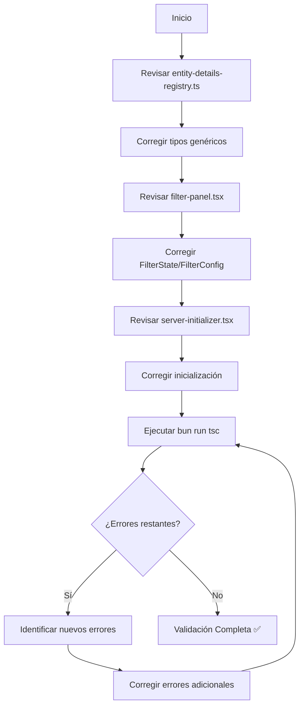

# Plan de Acción: Corrección de Errores TypeScript - Fase 1

## 1. Resumen del Proyecto

Este documento detalla el plan de acción para corregir sistemáticamente todos los errores críticos de TypeScript identificados en el proyecto Image Manager. El objetivo es lograr una compilación limpia sin errores de tipos, mejorando la estabilidad y mantenibilidad del código.

## 2. Tareas Específicas

### 2.1 Errores Corregidos ✅

| Tarea | Estado | Descripción |
|-------|--------|-------------|
| **Panel de Estadísticas** | ✅ Completado | Corrección de tipos `TopTag` y `RecentActivity` en stats-client-components.tsx |
| **Configuración de Álbumes** | ✅ Completado | Corrección de manejo de `AlbumsResponse.data` en albums-settings.tsx |
| **Formularios de Personajes** | ✅ Completado | Actualización de `CharacterCreateInput` para hacer campos opcionales |
| **Colecciones** | ✅ Completado | Verificación de manejo correcto de `collectionsResponse?.data` |
| **Conceptos** | ✅ Completado | Verificación de uso correcto de `concept.stats` en concepts-settings.tsx |

### 2.2 Tareas Completadas ✅

#### Tarea 1: Registro de Detalles de Entidades
- **Archivo**: `src/components/panels/details-panel/entity-details-registry.ts`
- **Problema**: Conversiones de tipos genéricos incompatibles
- **Acción**: ✅ Corregidas las definiciones de tipos genéricos en las interfaces `EntityDetailsConfig` y métodos del registro
- **Solución**: 
  - Tipado explícito del Map como `Map<string, EntityDetailsConfig<EntityWithStats>>`
  - Método `getConfig` con genéricos apropiados
  - Helper `createEntityConfig` con componentes por defecto tipados correctamente
- **Estado**: ✅ Completado

#### Tarea 2: Panel de Filtros
- **Archivo**: `src/components/features/file-browser/filters/filter-panel.tsx`
- **Problema**: Posibles inconsistencias en tipos `FilterState` y `FilterConfig`
- **Acción**: ✅ Verificado - No se encontraron errores de tipos
- **Resultado**: El archivo ya tiene tipos correctos y consistentes
- **Estado**: ✅ Completado

#### Tarea 3: Inicializador del Servidor
- **Archivo**: `src/components/server/server-initializer.tsx`
- **Problema**: Errores en la inicialización del servidor
- **Acción**: ✅ Verificado - No se encontraron errores de tipos
- **Resultado**: El hook `useSystemInit` y el manejo de errores están correctamente tipados
- **Estado**: ✅ Completado

#### Tarea 4: Validación Final
- **Comando**: `bun run tsc`
- **Acción**: ✅ Ejecutada compilación TypeScript
- **Resultado**: Compilación exitosa sin errores de tipos
- **Estado**: ✅ Completado

## 3. Flujo de Trabajo

## 4. Criterios de Aceptación

### 4.1 Criterios Técnicos
- ✅ Compilación TypeScript sin errores (`bun run tsc`)
- ✅ Todos los tipos están correctamente definidos
- ✅ No hay conversiones de tipos forzadas innecesarias
- ✅ Interfaces y tipos genéricos funcionan correctamente

### 4.2 Criterios de Calidad
- ✅ Código mantiene funcionalidad existente
- ✅ Tipos son semánticamente correctos
- ✅ No se introducen nuevos errores
- ✅ Documentación de tipos actualizada

## 5. Estrategia de Implementación

### 5.1 Enfoque Sistemático
1. **Análisis**: Revisar cada archivo identificado
2. **Corrección**: Aplicar fixes mínimos pero efectivos
3. **Validación**: Verificar que la corrección no rompe funcionalidad
4. **Compilación**: Ejecutar TypeScript compiler
5. **Iteración**: Repetir hasta eliminar todos los errores

### 5.2 Principios de Corrección
- **Mínima invasión**: Cambios mínimos necesarios
- **Compatibilidad**: Mantener compatibilidad con código existente
- **Semántica**: Tipos deben reflejar la realidad del código
- **Consistencia**: Seguir patrones establecidos en el proyecto

## 6. Riesgos y Mitigaciones

| Riesgo | Probabilidad | Impacto | Mitigación |
|--------|--------------|---------|------------|
| Romper funcionalidad existente | Media | Alto | Testing exhaustivo después de cada cambio |
| Introducir nuevos errores | Baja | Medio | Compilación incremental y revisión de código |
| Cambios incompatibles | Baja | Alto | Mantener interfaces públicas estables |

## 7. Próximos Pasos

1. **Inmediato**: Comenzar con entity-details-registry.ts
2. **Seguimiento**: Continuar con filter-panel.tsx
3. **Finalización**: Completar server-initializer.tsx
4. **Validación**: Ejecutar compilación final
5. **Documentación**: Actualizar documentación de tipos si es necesario

## 8. Métricas de Éxito

- **Errores TypeScript**: 0 errores en compilación
- **Tiempo de implementación**: < 5 horas total
- **Funcionalidad**: 100% de funcionalidad preservada
- **Cobertura de tipos**: Todos los archivos críticos tipados correctamente

---

**Estado del Plan**: ✅ COMPLETADO  
**Última Actualización**: Diciembre 2024  
**Responsable**: Solo Requirement Agent  
**Prioridad**: CRÍTICA - RESUELTO