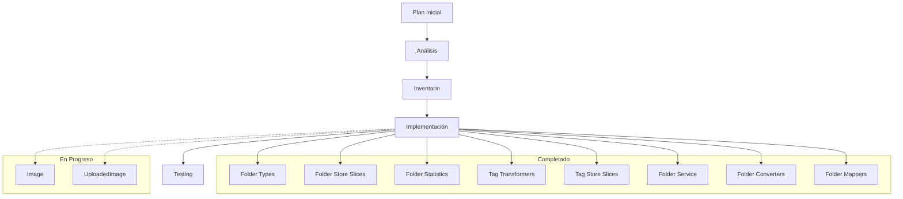

# Progreso: Alineación con schema.prisma

## Tareas realizadas

### 1. Mejoras en Folder
- ✅ Implementado `FolderStats` para estadísticas avanzadas
- ✅ Mejorado el store con filtros avanzados y mejor manejo de UI
- ✅ Integrado transformadores en el slice de core del store
- ✅ Implementadas nuevas funcionalidades de estadísticas
- ✅ Mejorado el manejo de caché con tags para revalidación
- ✅ Reorganizada la exportación de transformadores
- ✅ Implementado punto de entrada `transformFolder` para transformaciones unificadas
- ✅ Completado el servicio con enfoque funcional (CRUD completo)
- ✅ Completados converters con mejor tipado
- ✅ Implementados mappers para comunicación con Prisma
- ✅ Optimizadas las búsquedas y filtros
- ✅ Refactorizado sistema completo a enfoque funcional
- ✅ Implementado store con patrón de slices (core, UI, filters)
- ✅ Mejorada la gestión de tipos en todas las capas
- ✅ Implementados nuevos selectores derivados

### 2. Mejoras en Tag
- ✅ Refactorizado el transformador principal para eliminar la clase y usar funciones puras
- ✅ Creado `transformTag` como punto de entrada unificado para transformaciones
- ✅ Reorganizada la exportación de transformadores
- ✅ Mejorada la interfaz de acciones para usar las nuevas funciones
- ✅ Refactorizado store con patrón de slices (core, UI, filtros)
- ✅ Optimización de estructuras de datos y acciones CRUD
- ✅ Implementados selectores avanzados para filtrado y ordenación
- ✅ Mejorado manejo modal/UI con acciones específicas

## Próximos pasos

### 1. Mejoras en Image
- [ ] Revisar funcionalidad y alinear con Folder
- [ ] Implementar transformador unificado
- [ ] Mejorar store con slices
- [ ] Evaluar la necesidad de mejoras en relaciones

### 2. Mejoras en UploadedImage
- [ ] Completar tipos faltantes
- [ ] Implementar transformador unificado
- [ ] Implementar store con slices
- [ ] Mejorar servicio y acciones del servidor

## Diagrama de progreso

## Logros técnicos

### Transformadores
- ✅ Migración de enfoque a clases a enfoque funcional puro
- ✅ Creación de puntos de entrada unificados (`transformFolder`, `transformTag`)
- ✅ Mejora de exportaciones y funciones auxiliares
- ✅ Tipado más preciso y alineado con el schema
- ✅ Mejor manejo de errores con `handleTransformerError`
- ✅ Implementación de capas claras (converters, serializers, mappers, service)

### Stores
- ✅ Implementación completa del patrón de slices en Tag y Folder
- ✅ Separación clara de preocupaciones (core, UI, filtros)
- ✅ Optimización del estado para evitar renders innecesarios
- ✅ Uso de transformadores en las acciones CRUD
- ✅ Mejora de la persistencia con partialize para reducir almacenamiento
- ✅ Implementación de selectores derivados para filtros avanzados
- ✅ Gestión eficiente de modales y estados de UI

### Acciones
- ✅ Reorganización exportaciones para mejor uso
- ✅ Integración con transformadores refactorizados
- ✅ Mejora en validación y manejo de errores
- ✅ Implementación de funciones especializadas por entidad
- ✅ Separación clara de responsabilidades entre acciones

## Plan para Image

### 1. Estructura
- [ ] Crear transformador principal `transformImage`
- [ ] Implementar serializadores específicos
- [ ] Crear converters para formatos distintos
- [ ] Implementar mappers para Prisma

### 2. Store
- [ ] Implementar slice de core
- [ ] Implementar slice de UI
- [ ] Implementar slice de filtros
- [ ] Conectar con transformadores