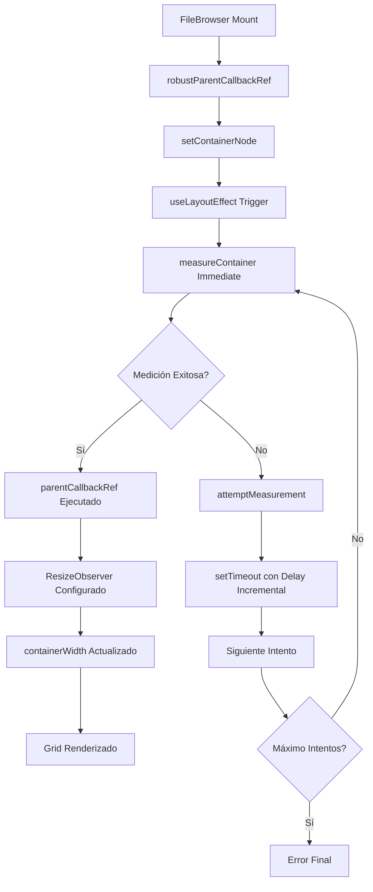

# 🔧 Solución para el Error `containerWidth: 0` en FileBrowser

## 📋 Resumen del Problema

El FileBrowser presentaba un error persistente donde `containerWidth` se calculaba como `0`, impidiendo:

- ❌ La carga correcta de miniaturas
- ❌ La virtualización del grid
- ❌ El renderizado correcto de los componentes de vista

### 🔍 Diagnóstico Original

```
❌ containerWidth inválido: 0
📊 Diagnóstico detallado del contenedor:
   - offsetWidth real: N/Apx
   - offsetHeight real: N/Apx
   - className del div: "N/A"
   - tiene padre: false
   - className del padre: "N/A"
```

## 🎯 Solución Implementada

### 1. **Sistema de Medición Robusta**

Implementé una estrategia de medición progresiva con múltiples intentos y diagnóstico detallado:

```typescript
// Función centralizada para medición robusta del contenedor
const measureContainer = useCallback((node: HTMLDivElement, strategy: string, attempt = 1): boolean => {
    // Validaciones exhaustivas de DOM y padre
    // Diagnóstico detallado de estilos CSS
    // Medición con múltiples métricas (offsetWidth, boundingClientRect)
    // Logging específico por intento
}, []);

// Sistema de intentos progresivos
const attemptMeasurement = useCallback((node: HTMLDivElement, attempt = 1) => {
    // Máximo 10 intentos con delay incremental
    // Cleanup automático si el nodo se desconecta
    // Ejecuta parentCallbackRef solo tras medición exitosa
}, [measureContainer, parentCallbackRef]);
```

### 2. **Coordinación Entre Hooks**

Mejoré la coordinación entre el callback ref del FileBrowser y el hook `useGridView`:

```typescript
// FileBrowser: Callback ref simplificado que inicia el proceso
const robustParentCallbackRef = useCallback((node: HTMLDivElement | null) => {
    setContainerNode(node);
    // El useLayoutEffect maneja la medición automáticamente
}, []);

// useLayoutEffect: Orquesta la medición progresiva
useLayoutEffect(() => {
    if (!containerNode) return;

    // Intento inmediato, luego RAF, luego intentos con timeout
    if (measureContainer(containerNode, 'immediate', 1)) {
        // Éxito inmediato
    } else {
        // Iniciar secuencia de intentos progresivos
    }
}, [containerNode, measureContainer, attemptMeasurement, parentCallbackRef]);
```

### 3. **Feedback Visual Mejorado**

Agregué indicadores de estado durante el proceso de medición:

```typescript
// Estado de medición visible para el usuario
const [isMeasuring, setIsMeasuring] = useState(false);

// Mensaje dinámico basado en el estado
const statusMessage = isMeasuring
    ? 'Midiendo contenedor...'
    : 'Calculando layout...';

const detailMessage = isMeasuring
    ? `Intento ${measurementAttemptsRef.current + 1}/${MAX_MEASUREMENT_ATTEMPTS}`
    : `containerWidth: ${containerWidth}`;
```

### 4. **Diagnóstico Detallado**

Cada intento de medición registra información completa:

```typescript
gridLogger.info(`📏 ${strategy} (intento ${attempt}) - Diagnóstico completo:`, {
    node: {
        tagName: node.tagName,
        className: node.className,
        offsetWidth, clientWidth, scrollWidth,
        boundingWidth: rect.width,
        display, position, visibility
    },
    parent: {
        tagName: parent.tagName,
        className: parent.className,
        offsetWidth: parent.offsetWidth,
        boundingWidth: parentRect.width,
        display, position, visibility
    }
});
```

## 🏗️ Arquitectura de la Solución



## 📊 Flujo de Estados

1. **Inicial**: `isMeasuring: true`, `containerWidth: 0`
2. **Medición**: Intentos progresivos con logs detallados
3. **Éxito**: `isMeasuring: false`, `containerWidth: valor válido`
4. **Error**: `isMeasuring: false`, mensaje de error con botón de reintento

## ✅ Beneficios de la Solución

### 🎯 **Robustez**

- ✅ Múltiples estrategias de medición (inmediata, RAF, timeouts)
- ✅ Máximo 10 intentos con delay incremental
- ✅ Cleanup automático y manejo de memoria

### 🔍 **Diagnóstico**

- ✅ Logging detallado por cada intento
- ✅ Información completa de DOM y CSS
- ✅ Tracking de intentos y estados

### 🎨 **UX**

- ✅ Feedback visual durante medición
- ✅ Skeleton con animación mientras se resuelve
- ✅ Botón de reintento manual

### 🚀 **Performance**

- ✅ Solo ejecuta callbacks tras medición exitosa
- ✅ Evita re-renders innecesarios
- ✅ Cleanup eficiente de timeouts y observers

## 🧪 Testing

Para verificar la solución:

1. **Monitorear logs**: Buscar mensajes de medición exitosa
2. **Verificar UI**: El skeleton debe desaparecer y mostrar el grid
3. **Probar reintento**: El botón manual debe funcionar
4. **Redimensionar**: ResizeObserver debe mantener sincronización

## 📝 Archivos Modificados

1. **`file-browser.tsx`**:
   - Sistema de medición robusta
   - Estados de feedback visual
   - Coordinación con useGridView

2. **`use-grid-view.ts`**:
   - Función `forceRecalcWidth` mejorada
   - Logging más detallado
   - Mejor manejo de errores

## 🔮 Próximos Pasos

1. **Monitorear** logs en producción para identificar patrones
2. **Optimizar** delays basado en métricas reales
3. **Considerar** MutationObserver para casos edge
4. **Documentar** best practices para medición de contenedores

---

> **Implementado**: 2025-01-27
> **Stack**: Next.js 15 + React 19 + TypeScript
> **Patrón**: Progressive Measurement Strategy
