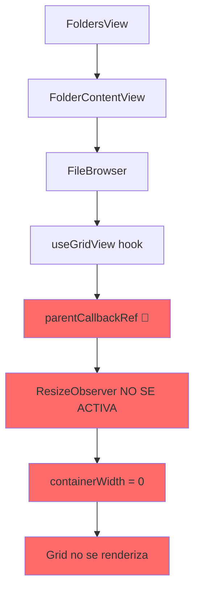
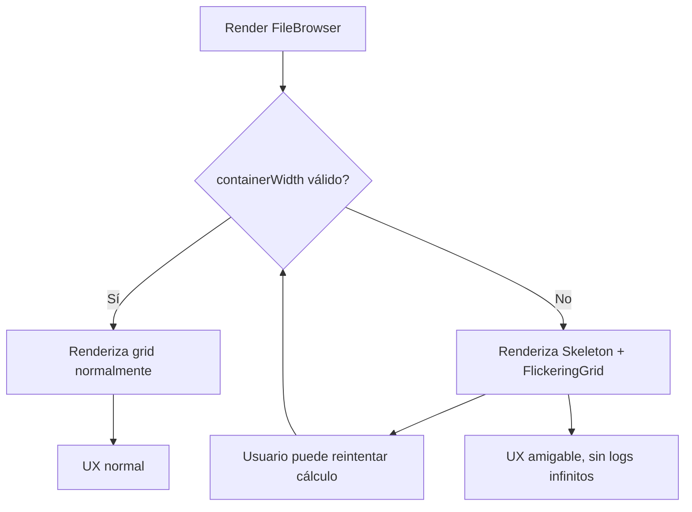

# 🚨 FIX CRÍTICO: FileBrowser Grid Bug

## 📋 Problema Principal

**FileBrowser queda inutilizado** cuando se navega desde FoldersView/FoldersContentView:

- `containerWidth = 0`
- Bucle infinito de renderizado
- Grid no visible aunque los datos llegan correctamente

## 🎯 Análisis del Problema

## 🔍 Problema Técnico Identificado

### useGridView Hook Issues

1. **Callback ref mal implementado**: No dispara ResizeObserver al cambiar nodo
2. **Conversión de tipos incorrecta**: `parentCallbackRef as unknown as React.RefObject<HTMLDivElement>`
3. **ResizeObserver mal posicionado**: Debería estar dentro del callback ref

# Diagnóstico y plan de acción para el bug de containerWidth en FileBrowser

## Resumen del problema

- El grid de FileBrowser intentaba renderizarse cuando `containerWidth` era 0 o no estaba inicializado, generando bucles de error y logs infinitos.
- El ResizeObserver o la lógica de cálculo de ancho no garantizaban un valor válido antes de intentar renderizar el grid.

## Solución aplicada

- Se implementó un fallback robusto: mientras `containerWidth` es inválido, se muestra un `Skeleton` animado y un `FlickeringGrid` como feedback visual amigable.
- El log de error solo se emite una vez por ciclo usando un flag con `useRef`, evitando spam de logs.
- Se añade botón de reintento manual y feedback visual claro.
- El flag de log se resetea automáticamente cuando el ancho se vuelve válido.
- Se asegura que el ResizeObserver y el callback ref sigan funcionando correctamente.

## Diagrama de flujo actualizado

## Estructura y relaciones clave

- `file-browser.tsx`: lógica principal, fallback visual, logs y control de errores.
- `hooks/use-grid-view.ts`: cálculo y observación de ancho, ResizeObserver.
- `ui/skeleton.tsx` y `ui/flickering-grid.tsx`: componentes visuales para el fallback.

## Ejemplo de uso

- Si el contenedor aún no tiene ancho (por ejemplo, el padre está oculto o la app está cargando), el usuario verá un grid animado y un mensaje de "Calculando layout..." en vez de errores o pantalla vacía.

## Reglas seguidas

- Guard clause robusto para evitar renders innecesarios.
- Log de error controlado y no repetitivo.
- Fallback visual moderno y amigable.
- Código comentado y documentado.

---

**Pendiente:**

- Testear en escenarios de resize rápido y padres ocultos.
- Mejorar documentación en docs/components/file-browser.md si es necesario.

## 📋 Plan de Acción

### ✅ COMPLETADO

- [x] Diagnóstico inicial del error
- [x] Análisis del flujo de navegación
- [x] Identificación del problema raíz en useGridView
- [x] **CRÍTICO**: Corregido callback ref en useGridView
- [x] Corregido conversión de tipos en return de useGridView
- [x] Reposicionado ResizeObserver dentro del callback ref
- [x] Actualizado FileBrowser para usar parentCallbackRef
- [x] Corregido tipos en useGridVirtualizer interface
- [x] **CRÍTICO**: Resuelto error EntityId en preloadResources
- [x] Corregido error maxItemWidth en calculateItemSize

### 🚧 SIGUIENTE VALIDACIÓN

- [ ] Testing del fix navegando desde FoldersView/FoldersContentView
- [ ] Verificar que el grid se recalcula correctamente
- [ ] Confirmar que no hay regresiones en otros flujos

### 📝 SIGUIENTES PASOS

1. Examinar y corregir `use-grid-view.ts`
2. Verificar integración con `FileBrowser`
3. Testing exhaustivo del flujo de navegación
4. Documentar solución final

## 🏗️ Stack Técnico

- Next.js 15.3.3 + React 19
- Tailwindcss 4 + Shadcn/ui
- PNPM como gestor de paquetes
