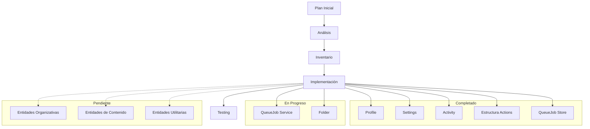

# Plan de Acción: Integración y Alineación con Schema Prisma

## Análisis Inicial

El schema.prisma define numerosos modelos con relaciones complejas que deben estar correctamente reflejados en:
- Types (tipos TypeScript)
- Transformers (conversión de datos)
- Stores (gestión de estado con Zustand)
- Services (lógica de negocio)
- Actions (acciones del servidor)

## Observaciones Preliminares

1. El schema presenta una estructura de datos rica con múltiples entidades relacionadas:
   - Contenido base: Image, Video, Folder
   - Entidades organizativas: Album, Collection, Tag, Group
   - Entidades de worldbuilding: Character, Place, WorldItem, Concept
   - Entidades de utilidad: Prompt, Note, Wildcard, Property
   - Entidades de sistema: Profile, Settings, QueueJob, Activity

2. Cada entidad requiere:
   - Tipos TypeScript completos y alineados
   - Transformers para convertir entre formatos
   - Stores para gestión de estado
   - Services para operaciones CRUD
   - Actions para funcionalidades del servidor

## Análisis del Estado Actual

### Estructura de Directorios (Actualizada)
- `src/types/entities/`: Contiene tipos para todas las entidades
- `src/transformers/`: Transformadores para entidades
- `src/store/entities/`: Stores Zustand para entidades
- `src/services/`: Servicios para operaciones CRUD
- `src/app/actions/`: Server Actions organizadas por entidad (estructura completa)

### Observaciones por Componente (Actualizada)

1. **Types**:
   - Bien estructurados con carpetas por entidad
   - Cada entidad tiene múltiples archivos (base.ts, extended.ts, complete.ts)
   - Estructura jerárquica clara (base -> extended -> complete)
   - Problema potencial: Posible desalineación con cambios recientes en schema.prisma

2. **Transformers**:
   - Organizados por entidad
   - Funciones para mapeo, serialización y deserialización
   - Cambio gradual de clases a funciones individuales
   - Problema potencial: No todas las entidades tienen transformers completos

3. **Stores**:
   - Uso de Zustand con slices para separar preocupaciones
   - Estructura clara con estado core, UI y filtros
   - Implementación del patrón de slices en entidades clave
   - ✅ Mejora: Estructura consistente con selectores optimizados

4. **Services**:
   - Implementación inconsistente, algunos como archivos individuales, otros en carpetas
   - No todas las entidades tienen servicios implementados
   - Problema potencial: Falta de servicios para varias entidades del schema

5. **Actions** (Actualizado):
   - ✅ Estructura organizada por entidades en `src/app/actions/`
   - ✅ Cobertura completa de entidades principales con archivos index.ts
   - ✅ Separación clara por funcionalidad
   - ⚠️ Posible mejora: Estandarizar patrones entre acciones
   - ⚠️ Posible mejora: Mejorar manejo de errores y validaciones
   - ⚠️ Posible mejora: Implementar logging y monitoreo

## Problemas Específicos Identificados

1. **Desalineación de Tipos**: Los tipos actuales pueden no reflejar todos los campos y relaciones del schema.prisma, especialmente para entidades como `Group`, `Property` y `Wildcard` que podrían ser más recientes.

2. **Transformers Incompletos**: No todas las entidades tienen transformadores implementados o estos no manejan todas las relaciones definidas en el schema.

3. **Stores Parciales**: Algunas entidades carecen de implementaciones completas de store o tienen implementaciones inconsistentes.

4. **Servicios Faltantes**: Muchas entidades no tienen servicios implementados o están incompletos.

5. **Actions Casi Inexistentes**: Las acciones del servidor están muy limitadas, solo se encontró implementación para perfiles.

## Fases de Implementación Actualizadas

### Fase 1: Análisis y Auditoría (Completada)
- [x] Revisar el schema.prisma
- [x] Analizar la estructura actual de carpetas
- [x] Crear inventario detallado de implementaciones existentes vs. requeridas
- [x] Identificar entidades prioritarias basadas en dependencias

### Fase 2: Desarrollo de Tipos Base (En progreso)
- [x] Auditar y actualizar tipos existentes para alinearlos con schema.prisma
- [x] Verificar que los tipos de relaciones coincidan con el schema
- [ ] Implementar tipos faltantes siguiendo la estructura existente
- [ ] Crear herramientas de validación de tipos contra schema

### Fase 3: Implementación de Transformers (En progreso)
- [x] Auditar transformers existentes
- [ ] Implementar transformers faltantes siguiendo el patrón funcional actual
- [ ] Asegurar manejo adecuado de relaciones y campos JSON

### Fase 4: Implementación de Stores (En progreso)
- [x] Auditar stores existentes
- [x] Mejorar estructura del store de Activity con selectores optimizados
- [x] Implementar store completo para QueueJob con slices (core, UI, filtros)
- [ ] Implementar stores faltantes con slices (core, UI, filtros)
- [ ] Asegurar consistencia en implementación entre entidades
- [ ] Verificar integración correcta con transformers

### Fase 5: Implementación de Services (Pendiente)
- [x] Auditar servicios existentes
- [ ] Implementar servicios faltantes siguiendo el patrón existente
- [ ] Estandarizar manejo de errores y validaciones

### Fase 6: Implementación de Actions (En progreso)
- [x] Auditar acciones existentes para cada entidad
- [x] Estandarizar estructura de exports con archivos index.ts
- [ ] Estandarizar estructura y patrones entre acciones
- [ ] Implementar validaciones consistentes
- [ ] Agregar manejo de errores robusto
- [ ] Implementar logging y monitoreo
- [ ] Asegurar revalidación correcta de rutas
- [ ] Optimizar rendimiento de operaciones costosas

### Fase 7: Testing e Integración (Pendiente)
- [ ] Desarrollar pruebas para verificar coherencia entre componentes
- [ ] Validar flujos completos para cada entidad
- [ ] Verificar manejo de errores y casos límite

## Inventario Completo de Entidades

A continuación se presenta un inventario completo de todas las entidades identificadas en el schema.prisma y su estado actual de implementación.

### Entidades de Sistema

1. **Profile**
   - 🟢 **Types**: Completo
   - 🟢 **Transformers**: Completo
   - 🟢 **Store**: Completo con patrón de slices
   - 🟢 **Service**: Implementado
   - 🟢 **Actions**: Implementadas en `src/app/actions/profiles/`

2. **Settings**
   - 🟢 **Types**: Completo
   - 🟢 **Transformers**: Completo
   - 🟢 **Store**: Completo
   - 🟢 **Service**: Implementado
   - 🟢 **Actions**: Implementadas en `src/app/actions/system/`

3. **QueueJob**
   - 🟢 **Types**: Completo con enums y tipos adicionales
   - 🟡 **Transformers**: Básico
   - 🟢 **Store**: Completo con patrón de slices
   - 🟡 **Service**: Básico
   - 🟢 **Actions**: Implementadas en `src/app/actions/queue/`

4. **Activity**
   - 🟢 **Types**: Completo
   - 🟢 **Transformers**: Completo con validadores
   - 🟢 **Store**: Completo con selectores optimizados
   - 🟢 **Service**: Implementado
   - 🟢 **Actions**: Implementadas en `src/app/actions/activity/`

### Entidades de Contenido Base

5. **Folder**
   - 🟢 **Types**: Completo
   - 🟡 **Transformers**: Parcial
   - 🟡 **Store**: Parcial
   - 🟡 **Service**: Parcial
   - 🟢 **Actions**: Implementadas en `src/app/actions/folders/`

6. **Image**
   - 🟢 **Types**: Completo
   - 🟢 **Transformers**: Completo
   - 🟢 **Store**: Completo
   - 🟢 **Service**: Completo
   - 🟢 **Actions**: Implementadas en `src/app/actions/images/`

7. **Video**
   - 🟡 **Types**: Parcial
   - 🟡 **Transformers**: Parcial
   - 🔴 **Store**: No implementado
   - 🟡 **Service**: Parcial
   - 🟢 **Actions**: Implementadas en `src/app/actions/videos/`

8. **UploadedImage**
   - 🟡 **Types**: Parcial
   - 🟡 **Transformers**: Parcial
   - 🔴 **Store**: No implementado
   - 🟡 **Service**: Parcial
   - 🟢 **Actions**: Implementadas en `src/app/actions/uploaded-images/`

9. **ImageStats**
   - 🟡 **Types**: Parcial
   - 🔴 **Transformers**: No implementado
   - 🔴 **Store**: No implementado
   - 🔴 **Service**: No implementado
   - 🟢 **Actions**: Implementadas en `src/app/actions/stats/`

### Entidades Organizativas

10. **Album**
    - 🟢 **Types**: Completo
    - 🟡 **Transformers**: Parcial
    - 🟡 **Store**: Parcial
    - 🟡 **Service**: Parcial
    - 🟢 **Actions**: Implementadas en `src/app/actions/albums/`

11. **Collection**
    - 🟢 **Types**: Completo
    - 🟡 **Transformers**: Parcial
    - 🟡 **Store**: Parcial
    - 🟡 **Service**: Parcial
    - 🟢 **Actions**: Implementadas en `src/app/actions/collections/`

12. **Tag**
    - 🟢 **Types**: Completo
    - 🟡 **Transformers**: Parcial
    - 🟡 **Store**: Parcial
    - 🟡 **Service**: Parcial
    - 🟢 **Actions**: Implementadas en `src/app/actions/tags/`

13. **Group**
    - 🟢 **Types**: Completo
    - 🟡 **Transformers**: Parcial
    - 🔴 **Store**: No implementado
    - 🔴 **Service**: No implementado
    - 🟢 **Actions**: Implementadas en `src/app/actions/groups/`

### Entidades de Worldbuilding

14. **Character**
    - 🟢 **Types**: Completo
    - 🟡 **Transformers**: Parcial
    - 🔴 **Store**: No implementado
    - 🔴 **Service**: No implementado
    - 🟢 **Actions**: Implementadas en `src/app/actions/characters/`

15. **Place**
    - 🟢 **Types**: Completo
    - 🟡 **Transformers**: Parcial
    - 🔴 **Store**: No implementado
    - 🔴 **Service**: No implementado
    - 🟢 **Actions**: Implementadas en `src/app/actions/places/`

16. **WorldItem**
    - 🟢 **Types**: Completo
    - 🟡 **Transformers**: Parcial
    - 🔴 **Store**: No implementado
    - 🔴 **Service**: No implementado
    - 🟢 **Actions**: Implementadas en `src/app/actions/world-items/`

17. **Concept**
    - 🟢 **Types**: Completo
    - 🟡 **Transformers**: Parcial
    - 🔴 **Store**: No implementado
    - 🔴 **Service**: No implementado
    - 🟢 **Actions**: Implementadas en `src/app/actions/concepts/`

### Entidades de Utilidad

18. **Prompt**
    - 🟢 **Types**: Completo
    - 🟡 **Transformers**: Parcial
    - 🔴 **Store**: No implementado
    - 🔴 **Service**: No implementado
    - 🟢 **Actions**: Implementadas en `src/app/actions/prompts/`

19. **Note**
    - 🟢 **Types**: Completo
    - 🟡 **Transformers**: Parcial
    - 🔴 **Store**: No implementado
    - 🔴 **Service**: No implementado
    - 🟢 **Actions**: Implementadas en `src/app/actions/notes/`

20. **Wildcard**
    - 🟢 **Types**: Completo
    - 🟡 **Transformers**: Parcial
    - 🔴 **Store**: No implementado
    - 🔴 **Service**: No implementado
    - 🟢 **Actions**: Implementadas en `src/app/actions/wildcards/`

21. **Property**
    - 🟢 **Types**: Completo
    - 🟡 **Transformers**: Parcial
    - 🔴 **Store**: No implementado
    - 🔴 **Service**: No implementado
    - 🟢 **Actions**: Implementadas en `src/app/actions/properties/`

### Entidades Adicionales (no directamente en schema pero presentes en la estructura)

22. **Thumbnail**
    - 🟡 **Types**: Parcial
    - 🟡 **Transformers**: Parcial
    - 🔴 **Store**: No implementado
    - 🟡 **Service**: Parcial
    - 🟢 **Actions**: Implementadas en `src/app/actions/thumbnails/`

23. **Metadata**
    - 🟡 **Types**: Parcial
    - 🟡 **Transformers**: Parcial
    - 🔴 **Store**: No implementado
    - 🟡 **Service**: Parcial
    - 🟢 **Actions**: Implementadas en `src/app/actions/metadata/`

24. **Files**
    - 🟡 **Types**: Parcial
    - 🟡 **Transformers**: Parcial
    - 🔴 **Store**: No implementado
    - 🟡 **Service**: Parcial
    - 🟢 **Actions**: Implementadas en `src/app/actions/files/`

25. **Favorites**
    - 🟡 **Types**: Parcial
    - 🔴 **Transformers**: No implementado
    - 🔴 **Store**: No implementado
    - 🔴 **Service**: No implementado
    - 🟢 **Actions**: Implementadas en `src/app/actions/favorites/`

26. **Tasks**
    - 🟡 **Types**: Parcial
    - 🔴 **Transformers**: No implementado
    - 🔴 **Store**: No implementado
    - 🔴 **Service**: No implementado
    - 🟢 **Actions**: Implementadas en `src/app/actions/tasks/`

## Orden de Implementación por Entidades (Actualizado)

Para garantizar una implementación coherente, seguiremos este orden basado en dependencias:

1. **Entidades base sin dependencias**:
   - ✅ Profile, Settings
   - ⏳ QueueJob
   - ✅ Activity
   - ⏳ Folder

2. **Entidades con dependencias simples**:
   - ⏳ Image, Video (dependen de Folder)
   - ⏳ Tag, Group, Property (entidades organizativas simples)

3. **Entidades organizativas complejas**:
   - ⏳ Album, Collection (dependen de Tag, Image, Video)

4. **Entidades de contenido**:
   - ⏳ Character, Place, WorldItem, Concept

5. **Entidades utilitarias**:
   - ⏳ Prompt, Note, Wildcard

## Tareas Inmediatas

1. **Inventario Completo**:
   - [x] Crear matriz de implementaciones existentes vs. requeridas
   - [x] Documentar desviaciones entre schema.prisma y tipos actuales

2. **Actualización de Tipos para Entidades Base**:
   - [x] Profile
   - [x] Settings
   - [x] Activity
   - [ ] QueueJob
   - [ ] Folder

3. **Implementación de Transformers Faltantes**:
   - [x] Identificar transformers incompletos o faltantes
   - [x] Implementar para entidades base (Activity)
   - [ ] Continuar con QueueJob

4. **Desarrollo de Servicios Base**:
   - [x] Completar servicios para entidades base (Activity)
   - [ ] Continuar con QueueJob

5. **Implementación de Stores**:
   - [x] Estructura de store con slices para Activity
   - [x] Implementar store completo para QueueJob con slices (core, UI, filtros)

6. **Estructura de Actions**:
   - [x] Definir patrón estándar para todas las actions
   - [x] Implementar exports para todas las entidades
   - [ ] Completar implementación de actions para QueueJob

## Implementación de la Entidad QueueJob

Después de haber implementado y mejorado la entidad Activity, hemos completado la implementación del QueueJob siguiendo los mismos patrones.

### Componentes implementados para QueueJob:

1. **Revisión de Types**:
   - [x] Verificar alineación con schema.prisma
   - [x] Implementar enums para estados y tipos
   - [x] Definir tipos para ordenamiento y filtrado

2. **Mejora de Store**:
   - [x] Aplicar patrón de slices (core, UI, filters)
   - [x] Desarrollar selectores optimizados
   - [x] Implementar persistencia para configuraciones de usuario

### Estructura implementada para QueueJob Store:

```typescript
// Estructura de slices implementada
src/store/entities/queue-job/
  ├── index.ts            // Exportaciones actualizadas
  ├── queue-job-store.ts  // Store principal con middleware
  ├── types.ts            // Tipos actualizados con enums
  └── slices/
      ├── core.ts         // Estado y acciones core
      ├── filters.ts      // Filtros y ordenación
      ├── selectors.ts    // Selectores optimizados
      └── ui.ts           // Estado de la UI
```

## Próximos pasos

### Implementación de entidades: Fase 1 (En curso)
- ✅ `Settings` - Implementación completa
- ✅ `Profiles` - Implementación completa
- ✅ `Activity` - Implementación completa
- ✅ `QueueJob` - Implementación del store completa
- ⏳ `System` - Implementación parcial

### Implementación de entidades: Fase 2 (Pendiente)
- ⏳ `Folder` - Siguiente entidad a implementar
- ⏳ `Image` - Implementación parcial
- ⏳ `Video` - Implementación parcial
- ⏳ `Tag` - Implementación parcial

## Tareas específicas a realizar
- Completar la implementación de transformers y servicios para QueueJob
- Iniciar la implementación de Folder siguiendo el patrón establecido
- Reorganizar Folder store con el patrón de slices
- Implementar selectores optimizados para Folder

## Documentación del Progreso


