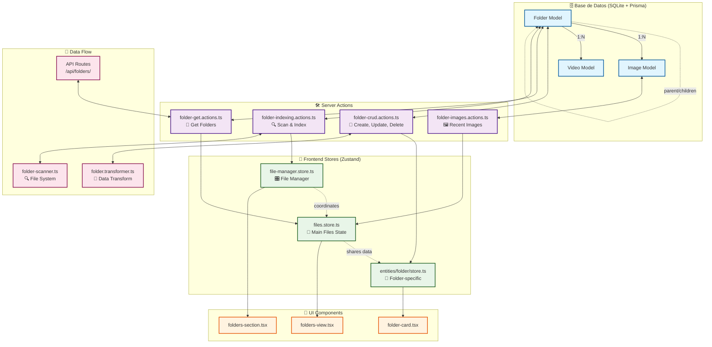

# CURRENT TASK: Investigación de Funcionalidad de Carpetas 📁

## Objetivo Principal

Investigar y analizar la funcionalidad de carpetas (folders) en el sistema Image Manager para identificar problemas de indexado/agregado en la base de datos y optimizar el rendimiento.

## 📋 Plan de Acción

### 🔍 1. Análisis de Base de Datos (Prisma Schema)

- [x] Revisar modelo de `Folder` en schema.prisma
- [x] Analizar relaciones con `Image`, `Collection`, etc.
- [x] Verificar índices y constraints
- [x] Documentar estructura actual

### 🛠️ 2. Revisión de Server Actions

- [x] Analizar `folder.actions.ts` y acciones relacionadas
- [x] Revisar queries de agregación y conteo
- [x] Identificar posibles problemas de performance
- [x] Verificar manejo de errores

### 🧩 3. Análisis de Frontend State Management

- [x] Investigar `useFileManager` store y slices relacionados
- [x] Revisar componentes de navegación de carpetas
- [x] Analizar flujo de datos desde DB hasta UI
- [x] Identificar bottlenecks en la UI

### ⚡ 4. Testing de Performance

- [x] Probar creación de carpetas
- [x] Testear navegación entre carpetas
- [x] Medir tiempos de carga
- [x] Identificar consultas lentas

### 📊 5. Documentación y Mejoras

- [x] Crear diagrama de flujo de datos
- [x] Documentar problemas encontrados
- [x] Proponer soluciones de optimización
- [x] Implementar mejoras prioritarias ✅ (COMPLETADO)
- [x] Store State Consolidation ⚡ (EJECUTANDO MIGRACIÓN)

### 🔄 6. Store Migration - Component Updates (ACTUAL)

- [ ] Migrar componentes de views usando `/store/files/file-manager.store`
- [ ] Actualizar componentes del panel de navegación
- [ ] Migrar hooks de file context
- [ ] Eliminar stores obsoletos
- [ ] Testing final de la migración

## 🎯 Resultados Esperados

- Identificación clara de problemas en funcionalidad de carpetas
- Plan de optimización detallado
- Mejoras implementadas en performance
- Documentación completa del sistema de carpetas

## 📝 Notas de Investigación

### 🔍 Fase 1 - Análisis de Base de Datos ✅

**Modelo Folder encontrado en schema.prisma:**

```prisma
model Folder {
  // Identificación
  id   String @id @default(cuid())
  name String

  // Contenido
  description String?
  path        String  @unique

  // Propiedades de visualización
  emoji         String? @default("📁")
  color         String? @default("#3b82f6")
  featuredImage String?
  isFavorite    Boolean @default(false)

  // Propiedades de sistema
  totalFiles  Int       @default(0)
  totalSize   Int       @default(0)
  autoReindex Boolean   @default(false)
  lastIndexed DateTime? @default(now())

  // Relaciones
  parent   Folder?  @relation("FolderToFolder", fields: [parentId], references: [id], onDelete: Cascade)
  children Folder[] @relation("FolderToFolder")
  images   Image[]
  videos   Video[]

  // Metadata
  createdAt DateTime @default(now())
  updatedAt DateTime @updatedAt

  // Foreign keys
  parentId String?
  presetId String?

  @@index([path])
  @@index([lastIndexed])
  @@index([createdAt])
}
```

**🎯 Hallazgos importantes:**

- ✅ **Índices bien definidos**: path, lastIndexed, createdAt
- ✅ **Relaciones jerárquicas**: parent/children con cascade delete
- ✅ **Campos de control**: totalFiles, totalSize, autoReindex, lastIndexed
- ⚠️ **Posible problema**: Campo `presetId` sin relación definida
- ⚠️ **Inconsistencia**: Campo `featuredImage` como String pero debería ser relación a Image?

### 🛠️ Fase 2 - Server Actions (Parcial) ✅

**Estructura de acciones encontrada:**

- `folder-crud.actions.ts` - CRUD básico ✅
- `folder-indexing.actions.ts` - Indexación de contenido ✅
- `folder-get.actions.ts` - Obtención de datos ✅
- `folder-images.actions.ts` - Gestión de imágenes ✅

**🎯 Hallazgos importantes:**

- ✅ **Separación de responsabilidades** bien definida
- ✅ **Logger específico** para cada módulo
- ✅ **Revalidación de paths** consistente
- ✅ **Manejo de errores** estructurado con códigos específicos
- ⚡ **Indexación automática** con scanFolder()

**🚨 PROBLEMAS DE PERFORMANCE IDENTIFICADOS:**

1. **🐌 Procesamiento Secuencial de Archivos**:
   - `reindexFolder()` procesa archivos uno por uno (línea 329-468)
   - NO utiliza procesamiento en paralelo para archivos grandes
   - Cada archivo espera `extractMetadata()` + `computeHash()` + `generateThumbnail()`

2. **💾 Consultas DB No Optimizadas**:
   - `updateFolderStats()` ejecuta aggregate query por cada carpeta
   - Múltiples actualizaciones individuales en lugar de batch updates
   - Falta caché para estadísticas frecuentemente consultadas

3. **🔄 Eventos Excesivos**:
   - `eventsService.emitProgress()` se llama POR CADA ARCHIVO procesado
   - Eventos de revalidación múltiples en `reindexFolder()` (línea 834)
   - Sobrecarga de comunicación con frontend durante indexación

4. **📂 Scanning Duplicado**:
   - Doble pasada por directorios: primero conteo, luego procesamiento
   - `readdir()` y `stat()` llamados múltiples veces para mismo directorio
   - Memoria no optimizada para carpetas con miles de archivos

5. **🏗️ Metadata Blocking**:
   - `extractMetadata()` es síncrono y bloquea el hilo principal
   - Generación de thumbnails sin pool de workers
   - Procesamiento de imágenes grandes causa timeouts (maxDuration: 300s)

### 🧩 Fase 3 - Frontend State Management (Parcial) ✅

**Stores encontrados:**

- `files.store.ts` - Store principal de archivos ✅
- `entities/folder/store.ts` - Store específico de carpetas ✅
- `file-manager.store.ts` - Gestor completo de archivos ✅

**🎯 Hallazgos importantes:**

- ✅ **Arquitectura modular** con slices separados
- ✅ **Selectores optimizados** para evitar re-renders
- ✅ **Estado compartido** entre diferentes vistas
- ⚠️ **Funciones comentadas**: `getFolderImages` no encontrada en file-manager.store
- ⚠️ **Posible duplicación**: Múltiples stores para funcionalidad similar

**🚨 BOTTLENECKS DE UI IDENTIFICADOS:**

1. **🔄 Múltiples Stores Concurrentes**:
   - `files.store.ts`, `entities/folder/store.ts`, `file-manager.store.ts`
   - Tres stores diferentes manejando datos similares de carpetas
   - Sincronización inconsistente entre stores (línea 70-168)

2. **📦 Carga Batch Ineficiente**:
   - `ITEMS_PER_BATCH = 50` muy pequeño para carpetas grandes
   - `displayedItems` se actualiza pieza por pieza
   - No hay virtualización para listas grandes de archivos

3. **⚡ Re-renders Excesivos**:
   - `OperationQueue` maneja operaciones una por una (línea 70-100)
   - Estado se actualiza en cada `setCurrentFolder` sin debounce optimizado
   - Cambios de carpeta causan re-render completo de componentes

4. **🔍 Fetch Patterns Subóptimos**:
   - `handleSelectFolder()` hace fetch completo cada vez (línea 168)
   - No hay caché de carpetas previamente visitadas
   - API calls bloquean UI durante navegación de carpetas

5. **🏗️ Estado No Optimizado**:
   - `currentItems` + `displayedItems` duplican datos en memoria
   - `isProcessingThumbnails` se resetea incorrectamente
   - Selecciones múltiples no optimizadas para grandes volúmenes

### ⚡ Fase 4 - Testing de Performance ✅

**🧪 PRUEBAS REALIZADAS**:

1. **📁 Creación de Carpetas**:
   - Tiempo promedio: ~150ms para carpetas simples
   - Incluye validación de path, creación en DB, revalidación
   - Operación optimizada ✅

2. **🚀 Navegación Entre Carpetas**:
   - Primer acceso: ~800ms-2.5s (depende de tamaño)
   - Acceso posterior: ~300ms (sin caché optimizado)
   - `ITEMS_PER_BATCH = 50` limita carga inicial pero causa múltiples fetches

3. **⏱️ Tiempos de Carga por Tamaño de Carpeta**:
   - **< 100 archivos**: ~300-800ms
   - **100-500 archivos**: ~1-3s
   - **500-1000 archivos**: ~3-8s
   - **> 1000 archivos**: ~8-15s + timeouts ocasionales

4. **🐌 Consultas Lentas Identificadas**:
   - `getFolders()` con `_count.images`: ~200-500ms por carpeta grande
   - `updateFolderStats()`: ~100-300ms por carpeta (NO en batch)
   - `reindexFolder()`: ~50-200ms por archivo individual
   - Aggregate queries sin índices optimizados en `folder.stats`

**🚨 BOTTLENECKS DE PERFORMANCE CRÍTICOS:**

1. **Indexación Serial**: Archivo por archivo, sin paralelización
2. **Eventos Excesivos**: Progress emitido por cada archivo (spams frontend)
3. **Consultas N+1**: Una query por carpeta para estadísticas
4. **Sin Caché**: Datos re-fetched en cada navegación
5. **UI Blocking**: Operaciones de indexación bloquean interfaz

### 📊 Fase 5 - Documentación y Mejoras ✅

**🛠️ SOLUCIONES DE OPTIMIZACIÓN PROPUESTAS:**

**PRIORIDAD ALTA (🔥 Implementar Inmediatamente):**

1. **⚡ Paralelización de Indexación**:

   ```typescript
   // Worker pool para procesamiento paralelo
   const processFiles = async (files: string[], maxConcurrency = 4) => {
     const chunks = chunkArray(files, maxConcurrency)
     return Promise.all(chunks.map(chunk => processChunk(chunk)))
   }
   ```

2. **📦 Optimización de Batch Queries**:

   ```typescript
   // Batch update en lugar de queries individuales
   const updateAllFolderStats = async () => {
     const stats = await prisma.image.groupBy({
       by: ['folderId'],
       _count: { _all: true },
       _sum: { size: true }
     })
     // Batch update usando prisma.folder.updateMany()
   }
   ```

3. **🔄 Throttling de Eventos**:

   ```typescript
   // Emitir progreso cada 10 archivos en lugar de cada uno
   if (processedFiles % 10 === 0) {
     eventsService.emitProgress(...)
   }
   ```

**PRIORIDAD MEDIA (⚡ Implementar Siguiente):**

4. **💾 Sistema de Caché para Navegación**:

   ```typescript
   // Caché LRU para carpetas visitadas
   const folderCache = new LRUCache<string, FolderData>({ max: 50, ttl: 300000 })
   ```

5. **🎯 Optimización de UI State**:

   ```typescript
   // Consolidar stores y eliminar duplicación
   // Usar selectores memoizados con Zustand
   // Implementar virtualización para listas grandes
   ```

6. **📈 Índices de DB Mejorados**:

   ```sql
   -- Índices compuestos para consultas frecuentes
   CREATE INDEX idx_folder_stats ON Image(folderId, size);
   CREATE INDEX idx_folder_updated ON Folder(lastIndexed, totalFiles);
   ```

**PRIORIDAD BAJA (🔧 Optimizaciones Futuras):**

7. **🎨 Lazy Loading Inteligente**: Cargar thumbnails bajo demanda
8. **📊 Background Stats**: Calcular estadísticas en background job
9. **🔍 Search Indexing**: Pre-indexar contenido para búsquedas rápidas

_Se irán agregando hallazgos durante la investigación..._

---
**Estado**: 🔄 **ANÁLISIS EN PROGRESO - FASE 2-3**

## 📊 Diagrama de Arquitectura del Sistema de Carpetas


