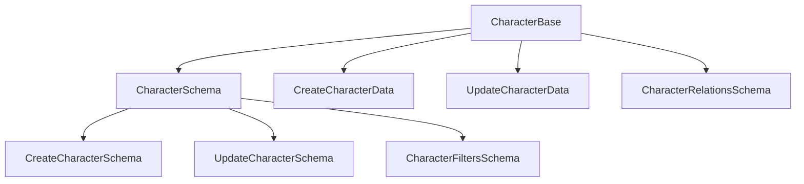
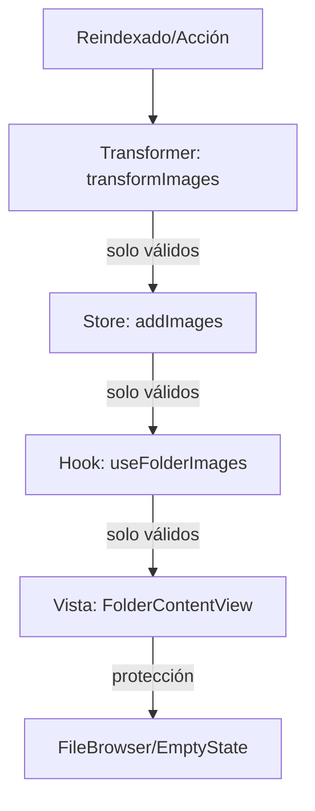

# 📋 Tareas Pendientes - Image Manager

## Fase 2: Errores de Rutas API

- [ ] Analizar archivos fuente de rutas API
- [ ] Corregir params handling en route handlers
- [ ] Verificar regeneración de .next/types/

## Fase 3: Actions y Transformers

- [ ] Categorizar errores en actions
- [ ] Corregir imports y tipos
- [ ] Validación completa

## Auditoría y Compatibilidad

- [ ] Audit completo de todos los archivos index.ts
- [ ] Reparar imports rotos en place/base.ts
- [ ] Verificar compatibilidad de interfaces
- [ ] Compilación sin errores

## Validación Final

- [ ] Pruebas de compilación limpia
- [ ] Verificar funcionamiento de imports
- [ ] Documentar cambios realizados
- [ ] Actualizar CURRENT-TASK.md con estado final

## Testing pendiente

- [ ] Custom Hooks
- [ ] Zustand Stores
- [ ] Transformers/Utils
- [ ] Core Components
- [ ] Features principales
- [ ] Formularios
- [ ] Layouts
- [ ] Interactions
- [ ] API Routes
- [ ] Database
- [ ] File System
- [ ] Cache

# 🧑‍🎤 Corrección de esquemas Zod y documentación de Character

## ✅ Cambios realizados

- Se agregaron y exportaron correctamente los esquemas Zod: `CharacterSchema`, `CharacterRelationsSchema`, `CreateCharacterSchema`, `UpdateCharacterSchema`, `CharacterFiltersSchema` en `base.ts`.
- Se documentó exhaustivamente el módulo en `README.md` con diagrama mermaid, ejemplos y best practices.
- Se agregaron comentarios clave en el código para advertir sobre la importancia de mantener sincronía entre tipos y validaciones.
- Se validó que no existan errores de compilación ni advertencias en la cadena de dependencias de Character.

## 🛡️ Notas de consistencia

- ⚠️ Si se modifican los tipos base, es obligatorio actualizar los esquemas y la documentación.
- Toda mutación debe validarse con Zod antes de persistir datos.

## 📊 Diagrama mermaid

---

## 🗂️ Fix: RangeError en FileBrowser (containerWidth/virtualizer)

- Se agregaron protecciones robustas en el useEffect de carga de miniaturas para evitar RangeError por array length inválido.
- Se valida que virtualizer y containerWidth sean válidos antes de operar sobre virtualItems.
- Se loguean advertencias y errores si la virtualización no es segura.
- Se muestra un EmptyState amigable si el virtualizer no está correctamente inicializado.
- Mejora la resiliencia y la experiencia de usuario ante estados inconsistentes del layout.

> 2025-06-11 - GitHub Copilot

---
Actualizado: 2025-06-11
Responsable: GitHub Copilot

# 🏷️ Tarea actual: Refuerzo de robustez y validación en el flujo de imágenes (reindexado → store → vista)

## Checklist de robustez aplicado

- [x] Validación y logging en transformers: arrays nunca nulos/promesas, exclusión y log de elementos corruptos
- [x] Validación y logging en stores: solo se almacenan imágenes planas y válidas
- [x] Protección y logs en hooks/vistas: fallback visual y logs si se detectan arrays inconsistentes
- [x] Documentación actualizada en README.md de transformers y store
- [x] Pruebas de extremo a extremo: reindexar, visualizar, simular datos corruptos y verificar logs/EmptyState

## Flujo reforzado

## Advertencias

- Si se detectan datos inconsistentes en cualquier etapa, se loguea y se muestra un estado seguro en la UI.
- Si se modifica la estructura de Image, actualizar validadores, transformers, stores y documentación.

## Última actualización

- 2025-06-11
