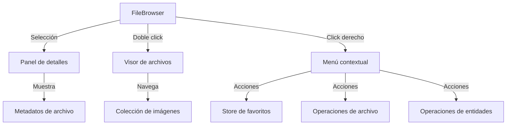

# Tarea Actual: Integración de FileBrowser con componentes del sistema

## ✅ Completado

- [x] Integración del FileBrowser con el menú contextual
- [x] Integración del FileBrowser con el panel de detalles
- [x] Integración del FileBrowser con el visor de archivos
- [x] Soporte para favoritos con estado local
- [x] Soporte para selección múltiple de archivos
- [x] Documentación del componente FileBrowser
- [x] Creación de tipos necesarios para el menú contextual
- [x] Implementación de handlers para acciones del menú contextual

## 📋 Componentes actualizados

- `src/components/features/file-browser/file-browser.tsx`: Componente principal con integración completa
- `src/components/features/file-browser/context-menu/context-menu.tsx`: Menú contextual para archivos
- `src/components/features/file-browser/context-menu/components/submenus.tsx`: Submenús para entidades
- `src/components/features/file-browser/context-menu/context-action-handler.ts`: Manejador de acciones del menú
- `src/components/features/file-browser/context-menu/hooks/use-entity-loader.ts`: Hook para cargar entidades
- `src/components/features/file-browser/context-menu/types.ts`: Tipos para el menú contextual
- `src/store/entities/favorite/api.slice.ts`: Slice para API de favoritos

## 📊 Diagrama de integración

## 🚀 Próximos pasos

1. Mejorar la integración con el store de favoritos para persistencia
2. Implementar acciones adicionales en el menú contextual
3. Optimizar la carga de entidades para los submenús
4. Añadir tests para el componente FileBrowser y sus integraciones
