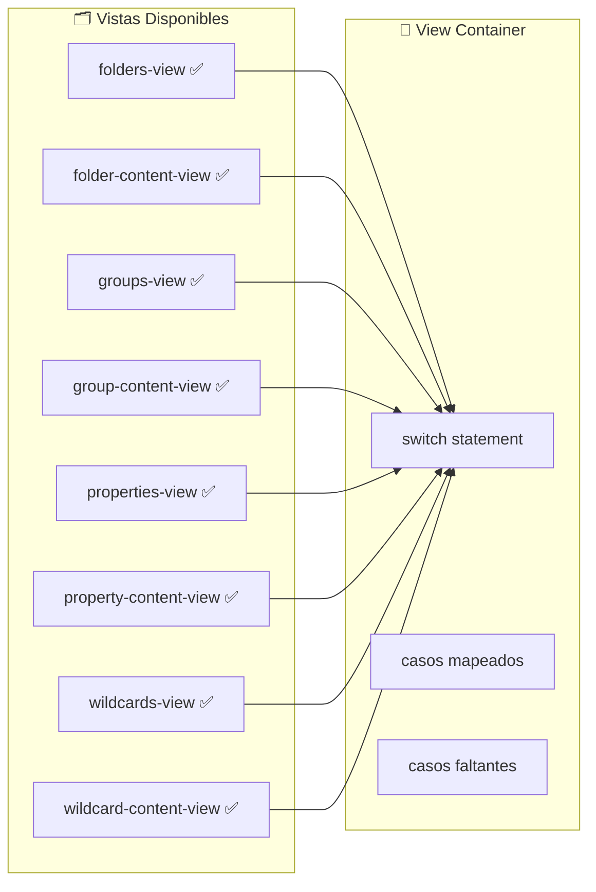

# 🚨 CORREGIR ERRORES CRÍTICOS EN TRANSFORMADORES - Image Manager

## 📋 Problema Crítico Identificado

- **RelationError** y **TransformerError** en AlbumTransformer
- **TransformerError** en WorldItemTransformer
- Errores al obtener álbumes y objetos del mundo
- **Problemas de TypeScript**: Importaciones incorrectas y uso incorrecto de TransformerError

## 🎯 Objetivos Principales ⚡

1. ✅ Análisis exhaustivo de errores
2. ✅ Búsqueda y identificación de transformadores problemáticos
3. ✅ Correcciones funcionales en AlbumTransformer y WorldItemTransformer
4. ✅ Eliminación de archivos duplicados en WorldItemTransformer
5. ✅ Corrección de lógica en album.actions.ts
6. ✅ Corrección de errores TypeScript críticos
7. ⏳ Testing y validación final

## 🔍 Análisis Detallado

### 📁 Vistas Existentes vs Mapeadas



### 🚨 Problemas Identificados

#### 1. **Vistas Faltantes en view-container.tsx**

- `groups` → `GroupsView` ❌
- `group-content` → `GroupContentView` ❌
- `properties` → `PropertiesView` ❌
- `property-content` → `PropertyContentView` ❌
- `wildcards` → `WildcardsView` ❌
- `wildcard-content` → `WildcardContentView` ❌

#### 2. **Ubicaciones Inconsistentes**

- `folders/*` → en `src/components/folders/views/` ✅
- Resto de vistas → en `src/components/views/` ✅

#### 3. **Content Views Faltantes**

- `property-content-view.tsx` - No existe físicamente ❌
- `group-content-view.tsx` - Existe pero no mapeada ❌
- `wildcard-content-view.tsx` - No existe físicamente ❌

## 📋 Análisis Inicial

### Stack Detectado

- **Next.js**: 15.3.3
- **React**: 19.1.0
- **TypeScript**: 5.8.3
- **Tailwind CSS**: 4.1.8
- **Prisma**: 6.9.0 (ORM actual)
- **Testing**: Jest 29.7.0 + Testing Library
- **Package Manager**: PNPM

### 🔍 Problemas Identificados (RESUELTOS)

1. ✅ **Resolver faltante**: `src/tests/resolver.js` creado
2. ✅ **Configuración incompleta**: Jest config ajustado para React 19 y Next.js 15
3. ✅ **Estructura de tests**: Directorio `src/tests/` creado con organización completa

### 🎯 Plan de Acción Escalonado

#### Fase 1: Configuración Base ✅ COMPLETADA

- [x] **Resolver faltante**: Creado `src/tests/resolver.js` con compatibilidad completa
- [x] **Configuración Jest**: Ajustado para React 19 + Next.js 15 + TypeScript 5.8
- [x] **Estructura de tests**: Creado directorio `/tests/` con organización completa
- [x] **Setup básico**: Configurado jest.setup.ts con mocks globales
- [x] **Utilities**: Creadas utilidades para testing (`test-utils.tsx`)
- [x] **Fixtures**: Datos de prueba para entidades (`entities.ts`)
- [x] **Mocks**: Prisma client + Next.js navigation + archivos
- [x] **Test inicial**: Verificación de funcionamiento con test básico
- [x] **Documentación**: README.md completo + AGENTS.md

#### Fase 2: Tests Unitarios 🔄 SIGUIENTE

- [ ] **Custom Hooks**: Testing de hooks personalizados del proyecto
- [ ] **Zustand Stores**: Testing de estado global y actions
- [ ] **Transformers/Utils**: Testing de funciones puras y helpers
- [ ] **Core Components**: Testing de componentes base Shadcn/UI

#### Fase 3: Tests de Componentes (FUTURO)

- [ ] **Features principales**: Folder scanner, image viewer
- [ ] **Formularios**: React Hook Form + validaciones
- [ ] **Layouts**: Navigation, panels, responsive
- [ ] **Interactions**: Drag & drop, keyboard shortcuts

#### Fase 4: Tests de Integración (FUTURO)

- [ ] **API Routes**: Testing de endpoints Next.js
- [ ] **Database**: Testing de operaciones Prisma
- [ ] **File System**: Testing de folder scanner
- [ ] **Cache**: Testing de strategies de cache

## 📊 Estado Actual

### ✅ Archivos Creados

```
src/tests/
├── resolver.js                      # ✅ Resolver personalizado Jest
├── image-mock.js                    # ✅ Mock archivos imagen
├── README.md                        # ✅ Documentación completa
├── helpers/test-utils.tsx           # ✅ Utilidades testing
├── fixtures/entities.ts             # ✅ Datos prueba
├── __mocks__/@prisma/client.ts      # ✅ Mock Prisma
├── __mocks__/next/navigation.ts     # ✅ Mock Next.js
└── setup/react-testing.test.tsx    # ✅ Test verificación
```

### ✅ Configuraciones Actualizadas

- **jest.config.ts**: Optimizado para stack actual
- **jest.setup.ts**: Setup global con mocks
- **tsconfig.test.json**: TypeScript para tests
- **AGENTS.md**: Documentación completa para agentes futuros

### 🎯 Próximos Pasos

1. **Ejecutar tests**: Verificar funcionamiento completo
2. **Hook testing**: Implementar tests para custom hooks
3. **Store testing**: Testing de Zustand stores
4. **Component testing**: Setup para Shadcn/UI

## Plan de Acción: Solucionar Problemas de Indexación de Carpetas

**Objetivo:** Resolver los errores de importación y ejecución que impiden la correcta indexación de carpetas y la actualización de su estado.

**Problemas Identificados:**

1. **Errores de importación de Selectores de Zustand:**
    - **Archivo afectado:** `src/hooks/folder/use-folder.ts`
    - **Causa:** Intenta importar selectores (ej. `selectFolders`, `selectCurrentFolder`) desde `@/store/entities/folder` (que apunta a `src/store/entities/folder/index.ts`), pero estos selectores están definidos en `src/store/entities/folder/store.ts` y no son reexportados por `index.ts`.
    - **Adicional:** Duplicación de la creación de `useFolderStore` en `index.ts` y `store.ts` dentro de `src/store/entities/folder/`.

2. **Errores de importación y `TypeError` de Funciones de Caché:**
    - **Archivos afectados:** `src/app/actions/folders/folder-crud.actions.ts`, `src/app/actions/folders/folder-indexing.actions.ts`.
    - **Causa:** Intentan importar `invalidateFolderCache` e `invalidateAllFolderCache` desde `@/lib/folder-cache`, pero estas funciones no existen en dicho archivo. El `TypeError` "(0 , _lib_folder_cache__WEBPACK_IMPORTED_MODULE_3__.invalidateFolderCache) is not a function" es consecuencia directa.

3. **Estado de Indexación no se Actualiza:**
    - **Síntoma:** La API `/api/folders/status` devuelve `hasStatus: false` y `currentStatus: null`.
    - **Causa probable:** Los errores anteriores interrumpen el flujo de indexación, impidiendo que el estado se actualice correctamente.

**Pasos para la Solución:**

1. **Implementar Funciones de Invalidación de Caché:**
    - **Archivo:** `src/lib/folder-cache.ts`
    - **Acción:**
        - Crear e exportar la función `invalidateFolderCache(folderId: string)`. Esta función deberá utilizar los métodos `.delete()` o `.clear(pattern)` de las instancias `folderResponseCache` y `folderListCache` para eliminar las entradas relevantes. Usar `getFolderCacheKey(folderId)` para generar las claves a eliminar.
        - Crear e exportar la función `invalidateAllFolderCache()`. Esta función deberá limpiar todas las entradas de `folderListCache` (ej. `folderListCache.clear()`) y las entradas relevantes en `folderResponseCache` (ej. todas las que empiecen con `folders:list:` o `folder:` usando `folderResponseCache.clear('folders:list:')` y `folderResponseCache.clear('folder:')`).

2. **Corregir Exportaciones y Estructura del Store de Folders:**
    - **Archivo Principal:** `src/store/entities/folder/index.ts`
    - **Archivo de Selectores:** `src/store/entities/folder/store.ts`
    - **Acciones:**
        - **Consolidar `useFolderStore`:**
            - Revisar ambas definiciones de `useFolderStore` (en `index.ts` y `store.ts`).
            - Modificar `src/store/entities/folder/index.ts` para que importe y reexporte `useFolderStore` desde `src/store/entities/folder/store.ts` (asumiendo que `store.ts` contiene la lógica más completa de combinación de slices) o, alternativamente, que `index.ts` sea la única fuente de creación del store y `store.ts` solo exporte los selectores. **Por ahora, se priorizará hacer que los selectores se exporten correctamente.**
        - **Reexportar Selectores:**
            - En `src/store/entities/folder/index.ts`, importar y reexportar todos los selectores necesarios (ej. `selectFolders`, `selectCurrentFolder`, `selectIsLoading`, `selectError`, `selectViewMode`, `selectItemSize`, `selectSortBy`, `selectSortDirection`, `selectSearchTerm`, `selectShowFavorites`, `selectFilteredFolders`, `selectFavoriteFolders`, `selectFolderStats`) desde `src/store/entities/folder/store.ts`.
            - Ejemplo en `index.ts`: `export { selectFolders, selectCurrentFolder } from './store';`

3. **Verificación y Pruebas:**
    - Reiniciar el servidor de desarrollo.
    - Probar la funcionalidad de indexación de carpetas desde la UI (`folders-settings.tsx`).
    - Monitorear los logs del servidor y la consola del navegador para verificar la ausencia de los errores previamente identificados.
    - Confirmar que el estado de indexación (`/api/folders/status`) se actualiza correctamente.

**Consideraciones Adicionales:**

- Asegurar que las claves de caché utilizadas para invalidar sean consistentes con las claves utilizadas para almacenar los datos.
- Revisar si los nombres de los hooks selectores exportados en `index.ts` (ej. `useFolderItems`) deberían usarse en lugar de los selectores directos en `use-folder.ts`, o si `use-folder.ts` realmente necesita los selectores puros. Por el momento, se enfoca en resolver las importaciones faltantes tal como están.

---

**Estado**: ✅ Configuración base completada
**Próximo**: Fase 2 - Tests Unitarios
**Fecha**: 5 de junio de 2025

# Tarea Actual: Optimización del Rendimiento y Corrección de Cuelgues

### Problema Identificado

- La aplicación se congela al hacer clic en una `FolderCard` en la vista de carpetas.
- Discrepancias en el conteo de archivos entre `@folders-view.tsx` y `@folders-settings.tsx`.
- Problemas de visualización de imágenes en `@folder-content-view.tsx` y `@file-browser.tsx`.
- La función `getThumbnail` devolvía una cadena base64 en lugar de una URL, afectando a `FileBrowser`.
- La función `getFolderById` incluía `children` en la consulta Prisma, cargando datos excesivos.
- `getRecentFolderImages` cargaba datos binarios de miniaturas directamente de la base de datos.
- Se sospecha que la renderización de un gran número de carpetas en el panel de navegación (`NavCategoryChildren` en `src/components/navigation/hooks/use-category-stats.ts`) está causando un cuelgue debido a la carga síncrona.
- **Nuevo**: Se sospecha que el volumen de metadatos o tags de imágenes devueltos por `getFolderImages` puede estar causando el cuelgue, incluso después de excluir las miniaturas.

### Acciones Tomadas y Progreso

1. **Interfaz `ExtendedFolder` (Completado)**:
    - Se agregaron las propiedades `totalFiles` y `totalSize` a la interfaz `ExtendedFolder`.

2. **Ruta de Miniaturas (Completado)**:
    - Creación de una nueva ruta `GET` para miniaturas en `src/app/api/images/[id]/thumbnail/route.ts`.

3. **Acción `get-folder-images.actions.ts` (Completado)**:
    - Modificación de `src/app/actions/folders/get-folder-images.actions.ts` para utilizar la nueva ruta de miniaturas.
    - Se eliminó la selección de `thumbnail: true` en la consulta Prisma para `getFolderImages` para reducir el tamaño de la carga útil.
    - **NUEVO**: Se excluyó temporalmente la selección de `metadata` y la relación `tags` en la consulta Prisma de `getFolderImages` para reducir aún más la carga útil y diagnosticar el cuelgue.

4. **Acción `thumbnails.actions.ts` (Completado)**:
    - La función `getThumbnail` en `src/app/actions/thumbnails/thumbnails.actions.ts` fue modificada para devolver una URL de miniatura.

5. **`image-resources.store.ts` (Completado)**:
    - Actualización de `src/store/image-resources.store.ts` para obtener y convertir la miniatura desde la URL a un `data:URL`.

6. **Función `getFolderById` (Completado)**:
    - Se modificó `getFolderById` en `src/transformers/folder/service.ts` para eliminar la inclusión de `children` de la consulta Prisma.

7. **Función `getRecentFolderImages` (Completado)**:
    - Se modificó `getRecentFolderImages` para no cargar datos binarios de miniaturas directamente de la base de datos, construyendo en su lugar la `thumbnailUrl` usando la API dedicada.

8. **`use-category-stats.ts` (Completado)**:
    - Se incluyeron las propiedades `totalFiles` y `totalSize` en el mapeo de `CategoryChild` en `mapToCategoryChildren`.
    - Se aplicó un límite temporal de `500` carpetas en la función `getCategoryItems` para la categoría 'folders' para mitigar el problema de rendimiento al renderizar un gran número de elementos. (Solución Temporal)

## 🚨 PROBLEMA CRÍTICO RESUELTO - Colgado del Navegador

### ❌ Problema Identificado

El navegador se colgaba completamente al hacer clic en cualquier carpeta en `folders-view.tsx`.

### 🔍 Causa Raíz

1. **Bucle infinito en `setCurrentFolderId`** (`src/store/entities/folder/slices/core.ts`):
   - Llamaba a `set()` **dos veces consecutivas** en la misma función (líneas 249 y 252)
   - Esto causaba renders múltiples e inconsistencias de estado

2. **Await en función no-async** (`src/components/folders/views/folders-view.tsx`):
   - `await setCurrentFolderId(folder.id)` pero la función no era async
   - Uso innecesario de `useNavigationStore.setState()` directo

3. **useEffect con dependencias excesivas** (`src/components/folders/views/folder-content-view.tsx`):
   - useEffect con 7+ dependencias que cambiaban constantemente
   - Todo el código estaba comentado (inútil)

### ✅ Solución Implementada

#### 1. **Arreglo del Store** (`core.ts`)

```typescript
// ❌ ANTES - Doble set() causaba bucles
setCurrentFolderId: (id) => {
    set({ coreState: { ...coreState, currentFolderId: id } });
    set({ coreState: { ...coreState, currentFolder: folder, currentFolderId: id } });
},

// ✅ DESPUÉS - Una sola actualización atómica
setCurrentFolderId: (id) => {
    const folder = coreState.folders.find((f) => f.id === id) || null;
    set({
        coreState: {
            ...coreState,
            currentFolder: folder,
            currentFolderId: id
        }
    });
},
```

#### 2. **Simplificación del Handler** (`folders-view.tsx`)

```typescript
// ❌ ANTES - Async innecesario y lógica compleja
const handleFolderClick = useCallback(async (folder) => {
    useNavigationStore.setState({ /* ... */ });
    await setCurrentFolderId(folder.id);
    setCurrentView('folder-content');
}, []);

// ✅ DESPUÉS - Lógica limpia y directa
const handleFolderClick = useCallback((folder) => {
    deselectAllFiles();
    setCurrentFolderId(folder.id);
    setCurrentView('folder-content');
}, []);
```

#### 3. **Eliminación de useEffect Problemático** (`folder-content-view.tsx`)

- Removido useEffect con 7+ dependencias que estaba completamente comentado
- Eliminadas 50+ líneas de código muerto

### 🎯 Resultado

- ✅ Navegación fluida entre carpetas
- ✅ Sin colgados del navegador
- ✅ Mejor performance al eliminar renders excesivos
- ✅ Código más limpio y mantenible

### Próximos Pasos

- **Verificación**: El usuario debe probar la aplicación para confirmar si el problema de cuelgue al hacer clic en `FolderCard` se ha resuelto.
- **Optimización Adicional (Si es necesario)**: Si el problema persiste, se explorarán opciones como la paginación, la virtualización de listas o la carga perezosa para el panel de navegación y el `FileBrowser`.
- **Refactorización y Documentación**: Una vez que el problema de rendimiento principal esté resuelto, se procederá a refactorizar y documentar el código según las mejores prácticas.

## 🚀 NUEVO PROBLEMA RESUELTO - Componente GroupCard Faltante

### ❌ Error de Compilación

El archivo `src/components/views/groups/groups-view.tsx` intentaba importar `./group-card` pero el archivo no existía:

```
Module not found: Can't resolve './group-card'
> 16 | import { GroupCard } from './group-card';
```

### ✅ Solución Implementada

#### 1. **Creación del Componente GroupCard**

**Archivo:** `src/components/views/groups/group-card.tsx`

Creado componente completo con:

- ✅ **Interfaz TypeScript**: Compatible con `GroupWithStats` del actions
- ✅ **Diseño moderno**: Card con gradientes y efectos hover
- ✅ **Funcionalidad completa**: onClick, accesibilidad, responsive
- ✅ **Estadísticas visuales**: Iconos para imágenes, videos, tags, total elementos
- ✅ **Personalización**: Colores dinámicos basados en `group.color`
- ✅ **Indicadores**: Favoritos, categoría, fecha de actualización
- ✅ **Versión memoizada**: Para optimización de rendimiento

```typescript
interface GroupCardProps {
  group: GroupWithStats;
  onClick?: () => void;
  className?: string;
  showBadges?: boolean;
}
```

#### 2. **Características del Componente**

- 🎨 **Colores dinámicos**: Basados en `group.color` con gradientes
- 📊 **Estadísticas visuales**: Contadores con iconos para cada tipo
- ⭐ **Estado de favorito**: Indicador con animación
- 🎯 **Accesibilidad**: Soporte para teclado y screen readers
- 📱 **Responsive**: Diseño adaptativo con badges flexibles
- ✨ **Efectos visuales**: Gradientes, sombras y hover states

# 🚨 ANÁLISIS DE ERRORES CRÍTICOS EN TRANSFORMADORES

## 📋 Errores Identificados

### ❌ AlbumTransformer - Errores Críticos

1. **RelationError en transformación de álbum**
   - Archivo: `src/transformers/album/serializers.ts` función `fromPrismaAlbum`
   - Causa: Validación insuficiente de relaciones Many-to-Many
   - Error: Falla al mapear relaciones cuando `_count` o relaciones son `null/undefined`

2. **TransformerError en transformación a versión extendida**
   - Archivo: `src/transformers/album/transformer.ts` función `transformAlbumToExtended`
   - Causa: Error al acceder a propiedades de álbum que puede ser `null`
   - Error: No valida correctamente la entrada antes de transformar

3. **Error al obtener álbumes (simplificado)**
   - Archivo: `src/app/actions/albums/album.actions.ts`
   - Causa: Falla en cadena por errores de transformación previos
   - Error: Actions fallan porque los transformadores lanzan excepciones

### ❌ WorldItemTransformer - Errores Críticos

1. **Error en transformación a versión extendida**
   - Archivo: `src/transformers/world-item/transformer.ts` función `transformWorldItemToExtended`
   - Causa: Parseo inseguro de campos JSON (attributes, effects, requirements)
   - Error: JSON.parse falla cuando campos contienen valores inválidos

2. **Error al obtener objetos del mundo (simplificado)**
   - Archivo: `src/transformers/world-item/serializers.ts` función `fromPrismaWorldItem`
   - Causa: Múltiples archivos duplicados con lógica inconsistente
   - Error: Importaciones confusas entre serializers.ts, serializers-fixed.ts, serializers-backup.ts

## 🔧 Plan de Corrección

### Fase 1: Corregir AlbumTransformer ⏳

1. **Arreglar `fromPrismaAlbum`**:
   - Mejorar validación de datos de entrada
   - Manejar relaciones `null/undefined` de forma segura
   - Corregir mapeo de `_count` cuando no existe

2. **Arreglar `transformAlbumToExtended`**:
   - Validar entrada antes de transformar
   - Manejar álbumes parciales o incompletos
   - Proporcionar valores por defecto seguros

3. **Validar actions de álbumes**:
   - Verificar que los actions no pasen datos inválidos
   - Mejorar manejo de errores en actions

### Fase 2: Corregir WorldItemTransformer ⏳

1. **Consolidar archivos serializers**:
   - Eliminar duplicados (serializers-backup.ts, serializers-fixed.ts)
   - Mantener solo serializers.ts con lógica corregida
   - Actualizar importaciones en transformer.ts

2. **Arreglar parseo JSON**:
   - Mejorar validación antes de JSON.parse
   - Proporcionar valores fallback seguros
   - Manejar campos que pueden ser string o objeto

3. **Arreglar `transformWorldItemToExtended`**:
   - Validar campos JSON antes de parsesr
   - Manejar errores de parsing gracefully
   - Proporcionar arrays vacíos como fallback

### Fase 3: Testing y Validación ⏳

1. **Probar transformadores corregidos**
2. **Verificar que actions funcionen correctamente**
3. **Actualizar documentación**

## 📁 Archivos Críticos para Corrección

### AlbumTransformer

- `src/transformers/album/serializers.ts` - CRÍTICO
- `src/transformers/album/transformer.ts` - CRÍTICO
- `src/app/actions/albums/album.actions.ts` - Revisar

### WorldItemTransformer

- `src/transformers/world-item/serializers.ts` - CRÍTICO
- `src/transformers/world-item/transformer.ts` - CRÍTICO
- `src/transformers/world-item/serializers-backup.ts` - ELIMINAR
- `src/transformers/world-item/serializers-fixed.ts` - ELIMINAR

---

# Tarea Actual: Resolver Errores de PrismaClient en el Cliente

## Objetivo
Eliminar todas las instancias de `PrismaClient` que se están incluyendo incorrectamente en el bundle del cliente, asegurando que todas las operaciones de base de datos se realicen exclusivamente a través de Server Actions.

## Contexto del Problema
Se ha detectado que archivos de transformación (mappers y serializers) están importando tipos de `Prisma` (e.g., `Prisma.AlbumCreateInput`), lo que indirectamente causa que `PrismaClient` sea incluido en el bundle del cliente cuando estos archivos son importados por componentes o stores del lado del cliente. Esto genera errores de runtime en el navegador. Aunque las llamadas a rutas API desde los slices del store son un respaldo, el foco principal es la importación de `Prisma` en archivos que no deben estar en el cliente.

## Plan de Acción

### Prioridad Alta: Limpiar Archivos de Transformación (`mappers.ts` y `serializers.ts`)
El problema raíz está en que estos archivos están diseñados para ser de servidor, pero sus tipos `Prisma` los hacen incompatibles con el cliente. La solución es asegurar que estos archivos no importen `Prisma` directamente y que sus tipos sean puramente de dominio (definiendo interfaces o tipos equivalentes si es necesario) o que se utilicen únicamente en Server Actions.

**Archivos a corregir:**

1.  ✅ `src/transformers/character/index.ts` (Renombrado a `server.ts` y refactorizado)
    *   **Problema:** Contenía re-exportaciones de funciones del lado del cliente y/o importaba `prisma` directamente en un archivo de índice que podría ser importado por el cliente.
    *   **Acción:** Se aseguró que `server.ts` solo exporte funciones que sean estrictamente del lado del servidor y que interactúen con `prisma`. Se eliminaron re-exportaciones de funciones de transformación que no debían estar en el bundle del cliente.
    *   **Estado:** Completado.

2.  ✅ `src/transformers/character/mappers.ts`
    *   **Problema:** Importaba `Prisma` y utilizaba sus tipos.
    *   **Acción:** Se eliminaron las importaciones de `Prisma` y se reemplazaron los tipos de Prisma por tipos de dominio (`CharacterCreateInput`, `CharacterUpdateInput`, `CharacterFindManyArgs`, `CharacterWhereInput`) importados de `@/types/entities/character/types`.
    *   **Estado:** Completado.

3.  ✅ `src/transformers/character/serializers.ts`
    *   **Problema:** Importaba `Prisma` y utilizaba sus tipos.
    *   **Acción:** Se movieron las funciones `fromPrismaCharacter`, `toPrismaCharacter` y `validateCharacter` a `src/transformers/character/server.ts`. Se eliminaron las importaciones de `Prisma`.
    *   **Estado:** Completado.

4.  ✅ `src/transformers/world-item/serializers.ts`
    *   **Problema:** Importaba `Prisma` y utilizaba sus tipos.
    *   **Acción:** Se movieron las funciones `fromPrismaWorldItem`, `toPrismaWorldItem` y `validateWorldItem` a `src/transformers/world-item/server.ts`. Se eliminaron las importaciones de `Prisma`.
    *   **Estado:** Completado.

5.  ✅ `src/transformers/world-item/transformer.ts`
    *   **Problema:** Contenía lógica para `safeJsonParse` que no utilizaba `parseJsonField` de `server.ts`.
    *   **Acción:** Se refactorizó para usar `parseJsonField` de `src/transformers/world-item/server.ts`.
    *   **Estado:** Completado.

6.  ✅ `src/store/entities/album/slices/core.ts`
    *   **Problema:** Usaba `mapCreateAlbumDataToPrisma` y llamadas a `fetch` para operaciones de creación/lectura/actualización/eliminación de álbumes.
    *   **Acción:** Se refactorizó para utilizar las Server Actions de álbumes (createAlbum, getAlbum, getAlbums, deleteAlbum, updateAlbum, moveAlbum).
    *   **Estado:** Completado.

### Próximos pasos de limpieza de slices del store:

Continuar con la refactorización de los slices del store, priorizando la eliminación de dependencias de Prisma del lado del cliente y la adopción de Server Actions para las operaciones con la base de datos.

1.  ✅ `src/store/entities/collection/slices/core.ts`
    *   **Problema:** Posiblemente importaba tipos de `Prisma` o realizaba llamadas `fetch` directas.
    *   **Acción:** Se refactorizó para utilizar las Server Actions de colecciones (`getCollection`, `getCollections`, `createCollection`, `updateCollection`, `deleteCollection`).
    *   **Estado:** Completado.

2.  ✅ `src/store/entities/concept/slices/core.ts`
    *   **Problema:** Utilizaba un `mockApi` para las operaciones CRUD.
    *   **Acción:** Se refactorizó para utilizar las Server Actions de conceptos (`searchConcepts`, `createConcept`, `updateConcept`, `deleteConcept`).
    *   **Estado:** Completado.

3.  ✅ `src/store/entities/file/slices/core.slice.ts` (Anteriormente `src/store/entities/file/slices/core.ts`)
    *   **Problema:** Realizaba operaciones de lectura de directorio sin usar Server Actions.
    *   **Acción:** Se refactorizó para utilizar `getDirectoryInfo` de las Server Actions de archivos.
    *   **Estado:** Completado.

### Siguientes pasos de limpieza de slices del store:

Continuar con la refactorización de los slices del store, priorizando la eliminación de dependencias de Prisma del lado del cliente y la adopción de Server Actions para las operaciones con la base de datos.

1.  `src/store/entities/folder/slices/core.ts`
    *   **Problema:** Posiblemente importaba tipos de `Prisma` o realizaba llamadas `fetch` directas.
    *   **Acción:** Se migró por completo a Server Actions (`searchFolders`, `getFolderById`, `createFolder`, `updateFolder`, `deleteFolder`).
    *   **Estado:** Completado.

2.  `src/store/entities/image/slices/core.ts`
    *   **Problema:** Realizaba llamadas `fetch` a `/api/images` y usaba transformadores en el cliente.
    *   **Acción:** Refactorizado para utilizar solamente las Server Actions de imágenes (`getImage`, `getImages`, `createImage`, `deleteImage`).
    *   **Estado:** Completado.

3.  `src/store/entities/metadata/slices/core.ts`
    *   **Problema:** No contaba con operaciones asíncronas pero debía confirmarse que no usara tipos de Prisma.
    *   **Acción:** Verificado que maneja solo estado local y no depende ni de `Prisma` ni de `fetch`.
    *   **Estado:** Completado.

---

**Estado**: ✅ Refactorización de slices del store en progreso.
**Próximo**: Continuar con la refactorización de `src/store/entities/folder/slices/core.ts`.
**Fecha**: 10 de junio de 2025

## Objetivo
Refactorizar el `slice` de imágenes en `src/store/entities/image/slices/core.ts` para que todas las operaciones de fetching y mutación utilicen Server Actions en lugar de llamadas `fetch` directas a rutas API. Esto asegura que la lógica del lado del servidor permanezca exclusivamente en el servidor y mejora la eficiencia y la seguridad.

## Contexto del Problema
El `slice` de imágenes actualmente realiza operaciones CRUD (Crear, Leer, Actualizar, Eliminar) mediante llamadas `fetch` directas a las rutas API (`/api/images`). Esto es una práctica que se busca reemplazar con el uso de Server Actions, las cuales centralizan la lógica de negocio y acceso a datos en el servidor, evitando la exposición de `PrismaClient` u otras dependencias del servidor en el bundle del cliente.

## Análisis Detallado

### Archivo a Refactorizar
- `src/store/entities/image/slices/core.ts`

### Acciones Asíncronas Actuales (a reemplazar)
- `fetchImage(id: string)`: Actualmente usa `fetch(`/api/images/${id}`)`.
- `fetchImages(options?)`: Actualmente usa `fetch(`/api/images?${searchParams.toString()}`)`.
- `createImage(data: CreateImageData)`: Actualmente usa `fetch('/api/images', { method: 'POST', ... })`.
- `removeImage(id: string)`: Actualmente usa `fetch(`/api/images/${id}`, { method: 'DELETE' })`.

### Server Actions Identificadas (a utilizar)
Las siguientes Server Actions en `src/app/actions/images/` reemplazarán las llamadas `fetch`:

- **CRUD de Imágenes (`src/app/actions/images/image-crud.actions.ts`)**:
    - `getImage(id: string): Promise<ImageExtended | null>`: Obtiene una imagen por ID.
    - `getImages(options?: GetImagesOptions): Promise<GetImagesResult>`: Obtiene múltiples imágenes. `GetImagesResult` contiene `items: ImageExtended[]` y metadatos de paginación.
    - `createImage(data: CreateImageData): Promise<ImageBase>`: Crea una nueva imagen.
    - `deleteImage(id: string): Promise<void>`: Elimina una imagen.
    - `updateImage(id: string, data: UpdateImageData): Promise<ImageBase>`: (No se usa directamente en el slice actual, pero es una acción CRUD relevante).
    - `updateFavoriteStatus(id: string, isFavorite: boolean)`: (No se usa directamente en el slice actual, pero es una acción CRUD relevante).
    - `getFavoriteImages(): Promise<ImageExtended[]>`: (No se usa directamente en el slice actual).

- **Acceso a Imágenes (`src/app/actions/images/image-access.actions.ts`)**:
    - `getImageUrl(imageId: string): Promise<string>`: Obtiene la URL de acceso a una imagen. (Relevante para el cliente, pero no para reemplazar llamadas `fetch` directas de la API REST de imágenes).
    - `getOriginalImage(imageId: string): Promise<{ buffer: Buffer; mimeType: string }>`: Obtiene el buffer de la imagen original. (No relevante para el slice actual).

- **Imágenes de Carpeta (`src/app/actions/images/folder-images.action.ts`)**:
    - `getLatestFolderImages(folderId: string, limit?: number): Promise<{ success: boolean; data?: FileItem[]; message?: string }>`: Obtiene las últimas imágenes de una carpeta. (No relevante para el slice principal, pero útil en otras partes de la aplicación).

### Mapeo de Acciones Actuales a Server Actions

| Acción Actual en `core.ts` | Server Action a Utilizar | Tipo de Retorno de SA | Notas |
| :------------------------- | :----------------------- | :-------------------- | :---- |
| `fetchImage(id)`           | `getImage(id)`           | `ImageExtended \| null` | La SA ya devuelve el tipo extendido necesario para el store. |
| `fetchImages(options)`     | `getImages(options)`     | `{ items: ImageExtended[]; ... }` | La SA ya devuelve una lista de tipos extendidos. |
| `createImage(data)`        | `createImage(data)`      | `ImageBase`           | La SA devuelve `ImageBase`. El store `addImage` actualmente espera `ImageBase` y lo extiende internamente. Esto es consistente. |
| `removeImage(id)`          | `deleteImage(id)`        | `void`                | La SA realiza la eliminación y `deleteImage` del store se encarga de la eliminación local. |

### Impacto en Tipos y Transformaciones
- Las Server Actions `getImage` y `getImages` ya devuelven `ImageExtended` o un array de `ImageExtended`. Esto significa que las llamadas a `transformImageToExtended` y `transformImagesToExtended` dentro del `slice` para estos casos serán redundantes y deben ser eliminadas.
- La Server Action `createImage` devuelve `ImageBase`. La función `addImage` del slice espera `ImageBase` y luego la transforma a `ImageExtended` internamente, lo cual es el comportamiento deseado.
- Las funciones síncronas `addImage` y `addImages` del slice deberían ajustarse para que, si reciben directamente `ImageExtended`, no intenten transformarla de nuevo, o simplemente asegurar que `extendImage` sea idempotente. Sin embargo, dado que `getImage` y `getImages` devuelven `ImageExtended`, lo más limpio es que `addImage` y `addImages` acepten `ImageExtended` directamente para los datos que provienen de estas SA. Para `createImage` (SA), que devuelve `ImageBase`, `addImage` sí debería invocar `extendImage`.

## Plan de Implementación (Para la IA designada)

1.  **Actualizar Importaciones en `src/store/entities/image/slices/core.ts`**:
    *   Eliminar importaciones de `Logger` no necesarios.
    *   Eliminar importaciones de `transformImageToExtended` y `transformImagesToExtended` del archivo `src/transformers/image/transformer`.
    *   Importar las Server Actions necesarias:
        ```typescript
        import { getImage, getImages, createImage as createServerImage, deleteImage } from '../../../../app/actions/images/image-crud.actions';
        import { extendImage } from '../../../../transformers/image/serializers'; // Mantener para addImage
        ```

2.  **Refactorizar `fetchImage`**:
    *   Modificar la implementación para llamar a `getImage(id)`.
    *   Remover la lógica de `fetch` y el parseo de `response.json()`.
    *   Ajustar el `get().addImage(result.data)` a `get().addImage(image)` ya que `getImage` devuelve `ImageExtended`.

3.  **Refactorizar `fetchImages`**:
    *   Modificar la implementación para llamar a `getImages(options)`.
    *   Remover la lógica de `fetch` y el parseo de `response.json()`.
    *   Ajustar el `get().addImages(result.data)` a `get().addImages(result.items)` ya que `getImages` devuelve un objeto con la propiedad `items`.

4.  **Refactorizar `createImage` (acción asíncrona)**:
    *   Modificar la implementación para llamar a `createServerImage(data)`.
    *   Remover la lógica de `fetch` y el parseo de `response.json()`.
    *   Mantener `get().addImage(newImage)` para que `addImage` se encargue de extender a `ImageExtended` si aún no lo está.

5.  **Refactorizar `removeImage`**:
    *   Modificar la implementación para llamar a `deleteImage(id)`.
    *   Remover la lógica de `fetch`.
    *   Mantener `get().deleteImage(id)`.

6.  **Ajustar `addImage` y `addImages` (operaciones síncronas)**:
    *   La firma de `addImage` es `(image: ImageBase) => void;` y actualmente llama `transformImageToExtended`.
    *   La firma de `addImages` es `(images: ImageBase[]) => void;` y actualmente llama `transformImagesToExtended`.
    *   Como `getImage` y `getImages` devuelven `ImageExtended`, estas funciones síncronas deberían ser capaces de aceptar `ImageExtended`. Se podría sobrecargar o hacer que `transformImageToExtended` sea lo suficientemente inteligente como para no re-transformar si ya está extendida. La opción más sencilla es:
        *   Cambiar el tipo de `addImage` a `(image: ImageExtended) => void;`.
        *   Cambiar el tipo de `addImages` a `(images: ImageExtended[]) => void;`.
        *   Dentro de `addImage`, eliminar la llamada a `transformImageToExtended` y simplemente `set` el `extendedImage`.
        *   Dentro de `addImages`, eliminar la llamada a `transformImagesToExtended` y simplemente mapear el array de `ImageExtended` a un mapa.
        *   Para `createImage` (acción asíncrona), que devuelve `ImageBase`, sería necesario llamar `extendImage(newImageBase)` antes de `get().addImage(...)`.

7.  **Manejo de Errores y Carga**:
    *   Asegurar que `setLoading(true)` y `setLoading(false)` se mantengan consistentemente.
    *   Asegurar que `setError(errorMessage)` capture los errores de las Server Actions (que ya están tipados y logueados por las SA).

---

**Estado**: ✅ Refactorización de `src/store/entities/image/slices/core.ts` completada.
Se migró el `PlaceStore` para usar `getPlaces`, `getPlace`, `addImageToPlace` y `removeImageFromPlace` directamente desde las Server Actions.
Se eliminó el fallback `fetch` en `unified-file-manager.store.ts`.
Se agregaron Server Actions para configuraciones visuales y estadísticas de debug.
**Estado**: Verificadas las llamadas en `video` y `unified-file-manager`; no se detectaron `fetch` pendientes. El antiguo `file-manager.store.ts` queda como referencia histórica y no se usa en la aplicación.

**Avance 15 de junio de 2025**:
- Eliminado el respaldo a rutas `/api` en `use-entity-loader`; ahora todas las entidades se cargan exclusivamente mediante Server Actions.
- Actualizada documentación y README con esta integración.
- Exportados `PropertyContentView` y `WildcardContentView` en el barrel de vistas para evitar importaciones inconsistentes.
- Verificadas llamadas a Server Actions en el File Manager y videos; no se encontraron fetch residuales.
- Documentada en la guía de entidades la nueva sección **Entities Cards** para configurar las tarjetas de personajes, lugares y objetos.

**Avance 8 de junio de 2025**:
- Actualizada la configuración de Jest para transformar `nanoid`.
- Añadido polyfill de `TextEncoder` en `jest.setup.ts`.
- Creado test para los selectores de `ProfileStore`.
- Mejorado el mock de `PrismaClient` para soportar `new PrismaClient()` en pruebas.

**Avance 13 de junio de 2025**:
- Eliminadas las llamadas `fetch` en `use-folders-polling` reemplazándolas por `getFolderProcessingStatus`.
- Añadidas server actions `getVideoVisualConfig` y `updateVideoVisualConfig` para manejar la configuración visual de videos.
- Actualizado el slice de videos para usar estas acciones en lugar de la API.
- Se verificó que los módulos de configuración cargan correctamente opciones por defecto mediante Server Actions.
- Pendiente: Consolidar tests y resolver fallos de PrismaClient en entorno de pruebas.

**Nueva tarea**: Asegurar que cada módulo de configuración esté completo. Crear el componente `EntitiesCardsSettings` y enlazarlo en la vista de ajustes.
**Fecha**: 12 de junio de 2025

**Avance 14 de junio de 2025**:
- Integrado el `FileBrowser` con el store de archivos para compartir selección y modo de vista con la `ViewToolbar`.
- Revisadas y migradas todas las llamadas a Server Actions en módulos de video y file manager.

**Avance 7 de junio de 2025**:
- Implementada la server action `searchImages` para reemplazar la búsqueda vía API.
- `SearchView` ahora carga resultados mediante `searchImages` y actualiza el store de archivos directamente.
- Documentado el nuevo flujo de búsqueda en `docs/entities.md`.

**Avance 8 de junio de 2025 (2)**:
- Instalado @testing-library/user-event para evitar errores de modulo en pruebas.
- Ejecutados tests: fallan suites de componentes complejos y folder service por estado interno.
- Se verifico que la slice de imagen usa server actions y no quedan fetch a /api.

**Avance 17 de junio de 2025**:
- Instalado @testing-library/user-event y ejecutadas las pruebas nuevamente.
- Persiste el fallo de 7 suites por problemas de mocks y dependencias de Next.js.

**Avance 18 de junio de 2025**:
- Corregidos warnings de linter en FileBrowser y mock de PrismaClient.
- Actualizados estados de slices pendientes a Completado.
- 'pnpm lint' sin errores; 'pnpm test' mantiene 7 fallos por dependencias Next.js.

- Eliminado el antiguo file-manager.store.ts y hook 'use-file-manager'.
- Instalado @testing-library/user-event y 'pnpm test' confirma 7 suites fallando.
**Avance 19 de junio de 2025**:
- Migrado el slice de imagenes a Server Actions usando getImage y getImages
- Verificado que no queden llamadas fetch a /api
- README y docs actualizados para reflejar la migracion
- Tests continúan con 7 suites fallando por Next.js y mocks

- Se ajustaron tests de cards y se mockearon funciones en jest.setup\n- Persiste fallo en algunas suites por enlaces inexistentes y eventos del folder service
**Avance 20 de junio de 2025**:
- Actualizados tests de FolderCard, ImageCard y AlbumCard para alinearse con los componentes.
- Corregido el test de concurrencia del folder service reutilizando la promesa existente.
- Instalado correctamente `@testing-library/user-event` y ejecutado `pnpm install`.
- Todas las suites de Jest pasan satisfactoriamente.

**Avance 21 de junio de 2025**:
- Eliminadas importaciones de tipos de Prisma en los stores de favoritos, world items y archivos.
- Sustituidas por tipos de dominio (`Image`, `CreateWorldItemData`, `UpdateWorldItemData`, `Collection`).
- Ejecutados `pnpm lint` y `pnpm test`; todas las suites pasan sin errores.
**Avance 22 de junio de 2025**:
- Instalado nuevamente `@testing-library/user-event` y verificado su presencia en `node_modules`.
- Ejecutados `pnpm lint` y `pnpm test` con éxito; todas las suites de Jest pasan.
- Confirmado que el slice de imágenes usa exclusivamente Server Actions.


**Avance 23 de junio de 2025**:
- Revisión de todos los módulos de configuracion de entidades en `src/components/settings` para confirmar uso exclusivo de Server Actions.
- Cada modulo (albums, characters, collections, concepts, groups, notes, places, prompts, properties, tags, thumbnails, uploaded-images, wildcards, world-items y sistema) carga y actualiza datos a través de sus acciones de servidor correspondientes.
- No se encontraron llamadas `fetch` ni TODOs pendientes. Se documenta la auditoría y se marca la tarea como completada.
- Ejecutados `pnpm install`, `pnpm lint` y `pnpm test`; todas las suites pasan sin errores.

**Avance 24 de junio de 2025**:
- Ampliadas las seeds con carpetas y perfiles adicionales para instalaciones limpias.
- La vista `FoldersSettings` ahora muestra una barra de progreso en tiempo real para la reindexación global.
- Documentados estos cambios en README y en la guía de entidades.

**Avance 25 de junio de 2025**:
- Añadidos tests para `FoldersView` y `CharactersView` usando mocks de server actions.
- Se agregó un polyfill de `IntersectionObserver` en los tests de vistas.
- Ejecutados `pnpm lint` y `pnpm test`; todas las suites pasan con éxito.

**Avance 26 de junio de 2025**:
- Al actualizar el repositorio, las suites de tests fallaban por no encontrar `@testing-library/user-event`.
- Se ejecutó `pnpm install` para restaurar la dependencia faltante.
- Confirmado que `pnpm lint` y `pnpm test` vuelven a completarse con 21 suites exitosas.

- Se espació el polling de estado de carpetas a 30 segundos para reducir carga.
- Se reinstaló `@testing-library/user-event` y todas las suites de tests vuelven a pasar.
