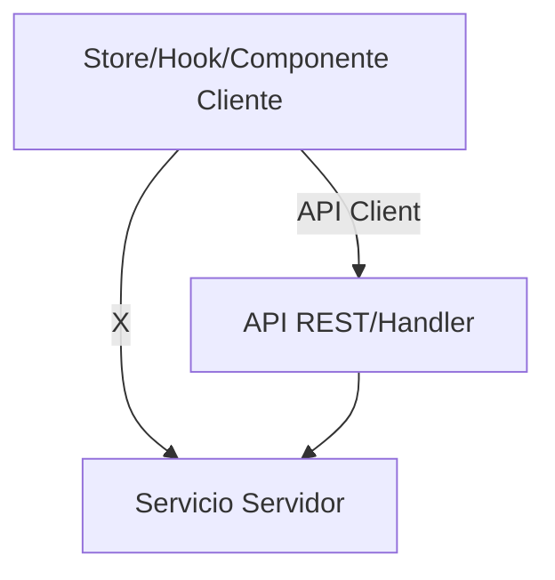

[001] Refactorización global: Aislamiento cliente-servidor en stores, hooks y componentes

## Contexto

Actualmente existen múltiples violaciones de arquitectura donde código del lado cliente (stores Zustand, hooks, componentes React) importa servicios del servidor (`src/services/*`). Esto genera errores de runtime en Vite/React 19 y rompe la separación de responsabilidades. Es necesario migrar todo acceso a datos a través de clientes de API (`src/lib/api/client/`) o rutas `/api/`.

## Subtareas

### [HIGH] [BIG] Refactorizar todos los stores Zustand
- [x] [002] [HIGH] [BIG] Refactorizar `src/store/unified-file-manager.store.ts` para usar cliente de API
 - [x] [003] [HIGH] [BIG] Refactorizar `src/store/entities/json-file/json-file.store.ts`
- [x] [004] [HIGH] [BIG] Refactorizar `src/store/entities/tag/slices/core.slice.ts`
- [x] [005] [HIGH] [BIG] Refactorizar `src/store/entities/tag/slices/core.slice.v2.ts`
- [x] [006] [HIGH] [BIG] Refactorizar `src/store/entities/video/slices/core.ts`
- [x] [007] [HIGH] [BIG] Refactorizar `src/store/entities/wildcard/slices/core.ts`
- [x] [008] [HIGH] [BIG] Refactorizar `src/store/entities/world-item/slices/core.ts`
- [x] [009] [HIGH] [BIG] Refactorizar `src/store/entities/workflow/slices/core.slice.ts`
- [x] [010] [HIGH] [BIG] Refactorizar `src/store/entities/file/slices/core.slice.ts`
- [x] [011] [HIGH] [BIG] Refactorizar `src/store/entities/profile/actions.ts`
- [x] [012] [HIGH] [BIG] Refactorizar `src/store/entities/queue-job/slices/core.ts`
- [x] [013] [HIGH] [BIG] Refactorizar `src/store/entities/place/index.ts`
- [x] [014] [HIGH] [BIG] Refactorizar `src/store/entities/property/slices/core.ts`
- [x] [015] [HIGH] [BIG] Refactorizar `src/store/entities/note/slices/core.ts`
- [x] [016] [HIGH] [BIG] Refactorizar `src/store/entities/file-3d/file-3d.store.ts`
- [x] [017] [HIGH] [BIG] Refactorizar `src/store/entities/group/slices/core.ts`
- [x] [018] [HIGH] [BIG] Refactorizar `src/store/entities/concept/index.ts`
- [x] [019] [HIGH] [BIG] Refactorizar `src/store/entities/collection/slices/core.ts`
- [x] [020] [HIGH] [BIG] Refactorizar `src/store/stats.store.ts`
- [x] [021] [HIGH] [BIG] Refactorizar `src/store/entities/audio/audio.store.ts`
- [x] [022] [HIGH] [BIG] Refactorizar `src/store/entities/document/slices/core.slice.ts`
- [x] [023] [HIGH] [BIG] Refactorizar `src/store/entities/album/slices/core.slice.ts`
- [ ] [024] [HIGH] [BIG] Refactorizar `src/store/entities/activity/index.ts`

### [HIGH] [BIG] Refactorizar hooks personalizados y utilidades
- [ ] [025] [HIGH] [BIG] Refactorizar `src/lib/hooks/entities/note/useNotes.ts`
- [ ] [026] [HIGH] [BIG] Refactorizar `src/lib/hooks/files/use-folder-images.ts`
- [ ] [027] [HIGH] [BIG] Refactorizar `src/lib/hooks/system/use-stats.ts`
- [ ] [028] [HIGH] [BIG] Refactorizar `src/lib/hooks/system/use-stats-service.ts`

### [HIGH] [BIG] Refactorizar componentes React que importan servicios
- [ ] [029] [HIGH] [BIG] Refactorizar `src/components/views/uploaded-images/uploaded-images-view.tsx`
- [ ] [030] [HIGH] [BIG] Refactorizar `src/components/views/folders/views/folders-view.tsx`

### [MEDIUM] [MEDIUM] Crear clientes de API faltantes
- [ ] [031] [MEDIUM] [MEDIUM] Crear cliente de API para cada entidad que no lo tenga en `src/lib/api/client/`

## Especificaciones técnicas
- Todos los stores y hooks deben consumir datos solo vía clientes de API o fetch a endpoints, nunca servicios directos.
- Si una función de servicio es necesaria en el cliente, debe exponerse vía API y consumirse desde el cliente de API.
- Dejar comentarios claros en cada archivo refactorizado explicando el cambio y el motivo.
- Validar que no queden importaciones directas de `src/services/` en ningún archivo de cliente.

## Diagrama de flujo (Mermaid)

