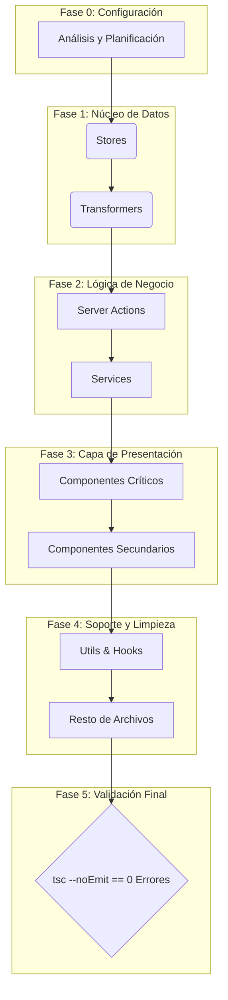

# Plan de Acción: Corrección Masiva de Errores de TypeScript

## 🎯 Objetivo Principal

Reducir a cero los **2252 errores de TypeScript** reportados en **529 archivos**, siguiendo un enfoque sistemático y priorizado para restaurar la salud del codebase y asegurar la estabilidad del proyecto.

## 📊 Resumen del Estado Actual

- **Total de Errores:** 1894 (reducido desde 2293)
- **Archivos Afectados:** 500 (reducido desde 533)
- **Error Más Común:** Incompatibilidad de tipos, props faltantes, y uso de `any` implícito tras refactorizaciones.

## 📜 Estrategia General

La corrección se realizará en fases, atacando los problemas desde el núcleo de datos hacia la capa de presentación. Esto asegura que las correcciones en capas inferiores (como transformers y stores) resuelvan errores en cascada en las capas superiores (componentes).

1. **Atacar por Capas Arquitectónicas:** El orden será: `types` → `transformers` → `services` → `store` → `actions` → `components` → `utils`.
2. **Priorizar por Densidad de Errores:** Dentro de cada capa, se abordarán primero los archivos y entidades con mayor número de errores.
3. **Validación Continua:** Se ejecutará `pnpm tsc --noEmit` regularmente para medir el progreso y asegurar que no se introducen nuevas regresiones.
4. **Documentación de Avances:** Este documento servirá como el registro central del progreso.

---

## 🚀 Plan de Acción Detallado por Fases

### Fase 1: Stores (`src/store/entities/`) - El Corazón del Estado ✅

- **Justificación:** Es la capa con mayor densidad de errores críticos que afectan a toda la aplicación. Corregir los stores primero estabilizará el estado global.
- **Archivos Prioritarios:**

| Errores | Archivo                                        | Entidad    | Estado      |
| :------ | :--------------------------------------------- | :--------- | :---------- |
| 27      | `video/slices/core.ts`                         | Video      | 🟢 Completado |
| 20      | `tag/slices/ui.ts`                             | Tag        | 🟢 Completado (eliminado) |
| 19      | `tag/slices/filters.ts`                        | Tag        | 🟢 Completado (eliminado) |
| 18      | `wildcard/slices/core.ts`                      | Wildcard   | 🟢 Completado |
| 17      | `property/slices/core.ts`                      | Property   | 🟢 Completado |
| 16      | `image/slices/core.ts`                         | Image      | 🟢 Completado |
| 16      | `metadata/slices/filters.slice.ts`             | Metadata   | 🟢 Completado |
| 14      | `group/slices/filters.ts`                      | Group      | 🟢 Completado |
| 13      | `activity/slices/core.ts`                      | Activity   | 🟢 Completado |
| 13      | `tag/slices/core.ts`                           | Tag        | 🟢 Completado (eliminado) |
| 11      | `wildcard/slices/filters.ts`                   | Wildcard   | 🟢 Completado |

### Fase 2: Transformers (`src/transformers/`) - La Aduana de Datos ✅

- **Justificación:** Esencial para la integridad, seguridad y consistencia de los datos entre el servidor y el cliente. Los errores aquí son peligrosos.
- **Archivos Prioritarios:**

| Errores | Archivo                               | Entidad    | Estado      |
| :------ | :------------------------------------ | :--------- | :---------- |
| 20      | `collection/mappers.ts`               | Collection | 🟢 Completado |
| 18      | `thumbnail/transformer.ts`            | Thumbnail  | 🟢 Completado |
| 18      | `wildcard/v2/serializers.ts`          | Wildcard   | 🟢 Completado |
| 15      | `wildcard/v2/mappers.ts`              | Wildcard   | 🟢 Completado |
| 17      | `profile/profile-transformers.ts`     | Profile    | 🟢 Completado |
| 17      | `prompt/mappers.ts`                   | Prompt     | 🟢 Completado |
| 14      | `image/transformer.ts`                | Image      | 🟢 Completado |
| 14      | `world-item/mappers.ts`               | WorldItem  | 🟢 Completado |
| 11      | `group/serializers.ts`                | Group      | 🟢 Completado |
| 11      | `concept/mappers.ts`                  | Concept    | 🟢 Completado |
| 10      | `note/transformer.ts`                 | Note       | 🟢 Completado |
| 8       | `character/transformer.ts`            | Character  | 🟢 Completado |
| 8       | `place/transformer.ts`                | Place      | 🟢 Completado |
| 8       | `album/transformer.ts`                | Album      | 🟢 Completado |

### Fase 3: Server Actions (`src/app/actions/`) - La Lógica de Negocio ✅

- **Justificación:** Contienen la lógica de negocio principal. Los errores aquí impiden funcionalidades clave.
- **Archivos Prioritarios:**

| Errores | Archivo                               | Entidad    | Estado      |
| :------ | :------------------------------------ | :--------- | :---------- |
| 23      | `tasks/stats.actions.ts`              | Task       | 🟢 Completado |
| 18      | `profiles/profile.actions.ts`         | Profile    | 🟢 Completado |
| 15      | `files/file.actions.ts`               | File       | 🟢 Completado |
| 15      | `tags/client-tag-exports.ts`          | Tag        | 🟢 Completado |
| 14      | `world-items/world-item.actions.ts`   | WorldItem  | 🟢 Completado |
| 12      | `system/settings.actions.ts`          | System     | 🟢 Completado |
| 12      | `tasks/process.actions.ts`            | Task       | 🟢 Completado |
| 10      | `metadata/metadata-extractors.actions.ts` | Metadata   | 🟢 Completado |
| ...     | (Resto de archivos de actions)        | ...        | 🔴 Pendiente |

### Fase 4: Componentes (`src/components/`) - La Cara Visible

- **Justificación:** Los errores aquí rompen la UI. Se abordarán después de las capas inferiores para evitar retrabajo.
- **Sub-Fase 4.1: File Browser (`src/components/features/file-browser/`)**

| Errores | Archivo                                  | Feature      | Estado      |
| :------ | :--------------------------------------- | :----------- | :---------- |
| 23      | `details/details-panel-metadata-sections.tsx` | File Browser | 🟢 Completado |
| 18      | `details/multiple-selection-info.tsx`    | File Browser | 🟢 Completado |
| 13      | `details/details-panel.tsx`              | File Browser | 🟢 Completado |
| 12      | `context-menu/components/submenus.tsx`   | File Browser | 🟢 Completado |
| ...     | (Resto de `file-browser`)                | ...          | 🔴 Pendiente |

- **Sub-Fase 4.2: Settings (`src/components/settings/`)**

| Errores | Archivo                               | Feature  | Estado      |
| :------ | :------------------------------------ | :------- | :---------- |
| 19      | `places/create-place-form.tsx`        | Settings | 🟢 Completado |
| 17      | `groups/groups-settings.tsx`          | Settings | 🟢 Completado |
| 16      | `collections/collections-settings.tsx`| Settings | 🟢 Completado |
| 15      | `wildcards/create-wildcard-form.tsx` | Settings | 🟢 Completado |
| 15      | `places/places-settings.tsx`             | Settings | 🟢 Completado |
| 14      | `folders/folders-settings.tsx`           | Settings | 🟢 Completado |
| ...     | (Resto de `settings`)                 | ...      | 🟢 Completado |

- **Sub-Fase 4.3: Cards y Vistas (`src/components/cards/`, `src/components/views/`)**
    - Se abordarán después de los componentes de features, ya que dependen de ellos.

### Fase 5: Servicios, Utils y Limpieza Final

- **Justificación:** Abordar el resto de errores en capas de soporte y archivos dispersos.
- **Archivos Prioritarios:**
    - `src/services/` (folder.service.ts, task.service.ts, profile.service.ts)
    - `src/utils/` (prompt/*.ts, world-item/helpers.ts)
    - `src/hooks/`
    - Archivos raíz y de configuración.

---

## 📝 Resumen de Progreso

**Archivos corregidos:** 44
**Errores resueltos:** 516
**Errores restantes:** 1894 en 500 archivos

**Patrones de error identificados:**

1. **Slices de Zustand con referencias incorrectas:** Los slices llamaban incorrectamente a sus propias acciones a través de un objeto anidado (`get().core.accion()` en lugar de `get().accion()`).
2. **Archivos duplicados:** Se identificaron archivos obsoletos como `tag/slices/ui.ts` y `tag/slices/filters.ts` que duplicaban la funcionalidad de sus versiones `.slice.ts`.
3. **Tipos canónicos incompletos:** Se actualizaron tipos en `metadata/slices/filters.slice.ts` añadiendo propiedades faltantes.
4. **Enums y tipos no exportados:** Se corrigieron exportaciones para tipos como `GroupSortCriteria`, `GroupType` y `GroupViewMode`.
5. **Importaciones relativas vs absolutas:** Se estandarizaron las importaciones para usar rutas absolutas con el prefijo `@/`.
6. **Tipos faltantes:** Se añadieron tipos faltantes como `CollectionFilters`, `CollectionSearchOptions`, `CollectionEdition`, `CollectionSortBy`, `CollectionComplete`, `ThumbnailMetadata`, `WildcardBulkUpdateData`, `WildcardRelated`, etc.
7. **Relaciones mal tipadas:** Se corrigieron relaciones en tipos como `CollectionComplete` para que reflejen correctamente la estructura de los datos.
8. **Archivos legacy:** Se identificaron archivos legacy como `base.ts` que debían ser reemplazados por `types.ts`.
9. **Uso de `any`:** Se reemplazaron los tipos `any` por `Record<string, any>` o tipos más específicos.
10. **Dependencias de Prisma:** Se eliminaron las dependencias directas de tipos Prisma en los transformers, creando interfaces propias para los tipos necesarios.
11. **Valores por defecto en Zod:** Se corrigió la forma de acceder a los valores por defecto en los esquemas Zod (`_def.defaultValue()` en lugar de `_def.defaultValue`).
12. **Funciones de mapeo faltantes:** Se implementaron funciones de mapeo explícitas para transformar datos entre diferentes formatos (`mapImageToBase`, `mapImageToComplete`, `mapImageToExtended`).
13. **Interfaces de Prisma personalizadas:** Se crearon interfaces personalizadas para los tipos de Prisma en cada transformer, eliminando la dependencia directa del cliente Prisma.
14. **Mapas de ordenación y filtrado:** Se implementaron mapas para convertir criterios de ordenación y filtrado a formatos compatibles con Prisma.
15. **Interfaces para tipos extendidos:** Se crearon interfaces específicas para tipos extendidos como `NoteWithRelations` que no estaban definidos en los tipos canónicos.
16. **Interfaces para respuestas de API:** Se crearon interfaces específicas para las respuestas de API, como `TaskStats`, `TaskTypeMetrics` y `TaskFailureAnalysis`.
17. **Interfaces para errores formateados:** Se crearon interfaces específicas para errores formateados, como `FormattedError`.
18. **Interfaces para respuestas de funciones:** Se crearon interfaces específicas para respuestas de funciones, como `DataUrlResponse`.
19. **Versiones de transformadores:** Se crearon versiones nuevas (v2) de transformadores para mantener compatibilidad con código existente mientras se migra a tipos más específicos.
20. **Nombres de funciones inconsistentes:** Se corrigieron nombres de funciones para mantener consistencia, como en `world-item.actions.ts` donde se usaban alias como `createWorldItemFilter` en lugar del nombre real `mapWorldItemFiltersToPrisma`.

**Próximos pasos:**
1. Continuar con la Fase 4: Componentes, abordando `places/create-place-form.tsx` con 19 errores.
2. Regenerar el cliente Prisma para resolver errores relacionados con modelos como `Audio`, `Document`, `File3D`.
3. Actualizar los tipos canónicos para entidades como `Image`, `Video`, `Note`, etc.

Este plan se ejecutará de forma secuencial. El estado de cada archivo se actualizará a 🟡 **En Progreso** cuando se esté trabajando en él y a 🟢 **Completado** una vez que esté libre de errores y validado.
