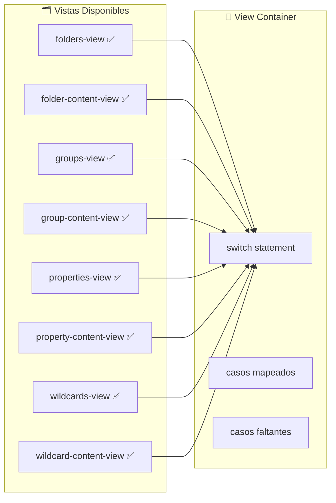

# 🚨 CORREGIR ERRORES CRÍTICOS EN TRANSFORMADORES - Image Manager

## 📋 Problema Crítico Identificado

- **RelationError** y **TransformerError** en AlbumTransformer
- **TransformerError** en WorldItemTransformer
- Errores al obtener álbumes y objetos del mundo
- **Problemas de TypeScript**: Importaciones incorrectas y uso incorrecto de TransformerError

## 🎯 Objetivos Principales ⚡

1. ✅ Análisis exhaustivo de errores
2. ✅ Búsqueda y identificación de transformadores problemáticos
3. ✅ Correcciones funcionales en AlbumTransformer y WorldItemTransformer
4. ✅ Eliminación de archivos duplicados en WorldItemTransformer
5. ✅ Corrección de lógica en album.actions.ts
6. 🔧 **EN CURSO**: Corrección de errores TypeScript críticos
7. ⏳ Testing y validación final

## 🔍 Análisis Detallado

### 📁 Vistas Existentes vs Mapeadas



### 🚨 Problemas Identificados

#### 1. **Vistas Faltantes en view-container.tsx**

- `groups` → `GroupsView` ❌
- `group-content` → `GroupContentView` ❌
- `properties` → `PropertiesView` ❌
- `property-content` → `PropertyContentView` ❌
- `wildcards` → `WildcardsView` ❌
- `wildcard-content` → `WildcardContentView` ❌

#### 2. **Ubicaciones Inconsistentes**

- `folders/*` → en `src/components/folders/views/` ✅
- Resto de vistas → en `src/components/views/` ✅

#### 3. **Content Views Faltantes**

- `property-content-view.tsx` - No existe físicamente ❌
- `group-content-view.tsx` - Existe pero no mapeada ❌
- `wildcard-content-view.tsx` - No existe físicamente ❌

## 📋 Análisis Inicial

### Stack Detectado

- **Next.js**: 15.3.3
- **React**: 19.1.0
- **TypeScript**: 5.8.3
- **Tailwind CSS**: 4.1.8
- **Prisma**: 6.9.0 (ORM actual)
- **Testing**: Jest 29.7.0 + Testing Library
- **Package Manager**: PNPM

### 🔍 Problemas Identificados (RESUELTOS)

1. ✅ **Resolver faltante**: `src/tests/resolver.js` creado
2. ✅ **Configuración incompleta**: Jest config ajustado para React 19 y Next.js 15
3. ✅ **Estructura de tests**: Directorio `src/tests/` creado con organización completa

### 🎯 Plan de Acción Escalonado

#### Fase 1: Configuración Base ✅ COMPLETADA

- [x] **Resolver faltante**: Creado `src/tests/resolver.js` con compatibilidad completa
- [x] **Configuración Jest**: Ajustado para React 19 + Next.js 15 + TypeScript 5.8
- [x] **Estructura de tests**: Creado directorio `/tests/` con organización completa
- [x] **Setup básico**: Configurado jest.setup.ts con mocks globales
- [x] **Utilities**: Creadas utilidades para testing (`test-utils.tsx`)
- [x] **Fixtures**: Datos de prueba para entidades (`entities.ts`)
- [x] **Mocks**: Prisma client + Next.js navigation + archivos
- [x] **Test inicial**: Verificación de funcionamiento con test básico
- [x] **Documentación**: README.md completo + AGENTS.md

#### Fase 2: Tests Unitarios 🔄 SIGUIENTE

- [ ] **Custom Hooks**: Testing de hooks personalizados del proyecto
- [ ] **Zustand Stores**: Testing de estado global y actions
- [ ] **Transformers/Utils**: Testing de funciones puras y helpers
- [ ] **Core Components**: Testing de componentes base Shadcn/UI

#### Fase 3: Tests de Componentes (FUTURO)

- [ ] **Features principales**: Folder scanner, image viewer
- [ ] **Formularios**: React Hook Form + validaciones
- [ ] **Layouts**: Navigation, panels, responsive
- [ ] **Interactions**: Drag & drop, keyboard shortcuts

#### Fase 4: Tests de Integración (FUTURO)

- [ ] **API Routes**: Testing de endpoints Next.js
- [ ] **Database**: Testing de operaciones Prisma
- [ ] **File System**: Testing de folder scanner
- [ ] **Cache**: Testing de strategies de cache

## 📊 Estado Actual

### ✅ Archivos Creados

```
src/tests/
├── resolver.js                      # ✅ Resolver personalizado Jest
├── image-mock.js                    # ✅ Mock archivos imagen
├── README.md                        # ✅ Documentación completa
├── helpers/test-utils.tsx           # ✅ Utilidades testing
├── fixtures/entities.ts             # ✅ Datos prueba
├── __mocks__/@prisma/client.ts      # ✅ Mock Prisma
├── __mocks__/next/navigation.ts     # ✅ Mock Next.js
└── setup/react-testing.test.tsx    # ✅ Test verificación
```

### ✅ Configuraciones Actualizadas

- **jest.config.ts**: Optimizado para stack actual
- **jest.setup.ts**: Setup global con mocks
- **tsconfig.test.json**: TypeScript para tests
- **AGENTS.md**: Documentación completa para agentes futuros

### 🎯 Próximos Pasos

1. **Ejecutar tests**: Verificar funcionamiento completo
2. **Hook testing**: Implementar tests para custom hooks
3. **Store testing**: Testing de Zustand stores
4. **Component testing**: Setup para Shadcn/UI

## Plan de Acción: Solucionar Problemas de Indexación de Carpetas

**Objetivo:** Resolver los errores de importación y ejecución que impiden la correcta indexación de carpetas y la actualización de su estado.

**Problemas Identificados:**

1. **Errores de importación de Selectores de Zustand:**
    - **Archivo afectado:** `src/hooks/folder/use-folder.ts`
    - **Causa:** Intenta importar selectores (ej. `selectFolders`, `selectCurrentFolder`) desde `@/store/entities/folder` (que apunta a `src/store/entities/folder/index.ts`), pero estos selectores están definidos en `src/store/entities/folder/store.ts` y no son reexportados por `index.ts`.
    - **Adicional:** Duplicación de la creación de `useFolderStore` en `index.ts` y `store.ts` dentro de `src/store/entities/folder/`.

2. **Errores de importación y `TypeError` de Funciones de Caché:**
    - **Archivos afectados:** `src/app/actions/folders/folder-crud.actions.ts`, `src/app/actions/folders/folder-indexing.actions.ts`.
    - **Causa:** Intentan importar `invalidateFolderCache` e `invalidateAllFolderCache` desde `@/lib/folder-cache`, pero estas funciones no existen en dicho archivo. El `TypeError` "(0 , _lib_folder_cache__WEBPACK_IMPORTED_MODULE_3__.invalidateFolderCache) is not a function" es consecuencia directa.

3. **Estado de Indexación no se Actualiza:**
    - **Síntoma:** La API `/api/folders/status` devuelve `hasStatus: false` y `currentStatus: null`.
    - **Causa probable:** Los errores anteriores interrumpen el flujo de indexación, impidiendo que el estado se actualice correctamente.

**Pasos para la Solución:**

1. **Implementar Funciones de Invalidación de Caché:**
    - **Archivo:** `src/lib/folder-cache.ts`
    - **Acción:**
        - Crear e exportar la función `invalidateFolderCache(folderId: string)`. Esta función deberá utilizar los métodos `.delete()` o `.clear(pattern)` de las instancias `folderResponseCache` y `folderListCache` para eliminar las entradas relevantes. Usar `getFolderCacheKey(folderId)` para generar las claves a eliminar.
        - Crear e exportar la función `invalidateAllFolderCache()`. Esta función deberá limpiar todas las entradas de `folderListCache` (ej. `folderListCache.clear()`) y las entradas relevantes en `folderResponseCache` (ej. todas las que empiecen con `folders:list:` o `folder:` usando `folderResponseCache.clear('folders:list:')` y `folderResponseCache.clear('folder:')`).

2. **Corregir Exportaciones y Estructura del Store de Folders:**
    - **Archivo Principal:** `src/store/entities/folder/index.ts`
    - **Archivo de Selectores:** `src/store/entities/folder/store.ts`
    - **Acciones:**
        - **Consolidar `useFolderStore`:**
            - Revisar ambas definiciones de `useFolderStore` (en `index.ts` y `store.ts`).
            - Modificar `src/store/entities/folder/index.ts` para que importe y reexporte `useFolderStore` desde `src/store/entities/folder/store.ts` (asumiendo que `store.ts` contiene la lógica más completa de combinación de slices) o, alternativamente, que `index.ts` sea la única fuente de creación del store y `store.ts` solo exporte los selectores. **Por ahora, se priorizará hacer que los selectores se exporten correctamente.**
        - **Reexportar Selectores:**
            - En `src/store/entities/folder/index.ts`, importar y reexportar todos los selectores necesarios (ej. `selectFolders`, `selectCurrentFolder`, `selectIsLoading`, `selectError`, `selectViewMode`, `selectItemSize`, `selectSortBy`, `selectSortDirection`, `selectSearchTerm`, `selectShowFavorites`, `selectFilteredFolders`, `selectFavoriteFolders`, `selectFolderStats`) desde `src/store/entities/folder/store.ts`.
            - Ejemplo en `index.ts`: `export { selectFolders, selectCurrentFolder } from './store';`

3. **Verificación y Pruebas:**
    - Reiniciar el servidor de desarrollo.
    - Probar la funcionalidad de indexación de carpetas desde la UI (`folders-settings.tsx`).
    - Monitorear los logs del servidor y la consola del navegador para verificar la ausencia de los errores previamente identificados.
    - Confirmar que el estado de indexación (`/api/folders/status`) se actualiza correctamente.

**Consideraciones Adicionales:**

- Asegurar que las claves de caché utilizadas para invalidar sean consistentes con las claves utilizadas para almacenar los datos.
- Revisar si los nombres de los hooks selectores exportados en `index.ts` (ej. `useFolderItems`) deberían usarse en lugar de los selectores directos en `use-folder.ts`, o si `use-folder.ts` realmente necesita los selectores puros. Por el momento, se enfoca en resolver las importaciones faltantes tal como están.

---

**Estado**: ✅ Configuración base completada
**Próximo**: Fase 2 - Tests Unitarios
**Fecha**: 5 de junio de 2025

# Tarea Actual: Optimización del Rendimiento y Corrección de Cuelgues

### Problema Identificado

- La aplicación se congela al hacer clic en una `FolderCard` en la vista de carpetas.
- Discrepancias en el conteo de archivos entre `@folders-view.tsx` y `@folders-settings.tsx`.
- Problemas de visualización de imágenes en `@folder-content-view.tsx` y `@file-browser.tsx`.
- La función `getThumbnail` devolvía una cadena base64 en lugar de una URL, afectando a `FileBrowser`.
- La función `getFolderById` incluía `children` en la consulta Prisma, cargando datos excesivos.
- `getRecentFolderImages` cargaba datos binarios de miniaturas directamente de la base de datos.
- Se sospecha que la renderización de un gran número de carpetas en el panel de navegación (`NavCategoryChildren` en `src/components/navigation/hooks/use-category-stats.ts`) está causando un cuelgue debido a la carga síncrona.
- **Nuevo**: Se sospecha que el volumen de metadatos o tags de imágenes devueltos por `getFolderImages` puede estar causando el cuelgue, incluso después de excluir las miniaturas.

### Acciones Tomadas y Progreso

1. **Interfaz `ExtendedFolder` (Completado)**:
    - Se agregaron las propiedades `totalFiles` y `totalSize` a la interfaz `ExtendedFolder`.

2. **Ruta de Miniaturas (Completado)**:
    - Creación de una nueva ruta `GET` para miniaturas en `src/app/api/images/[id]/thumbnail/route.ts`.

3. **Acción `get-folder-images.actions.ts` (Completado)**:
    - Modificación de `src/app/actions/folders/get-folder-images.actions.ts` para utilizar la nueva ruta de miniaturas.
    - Se eliminó la selección de `thumbnail: true` en la consulta Prisma para `getFolderImages` para reducir el tamaño de la carga útil.
    - **NUEVO**: Se excluyó temporalmente la selección de `metadata` y la relación `tags` en la consulta Prisma de `getFolderImages` para reducir aún más la carga útil y diagnosticar el cuelgue.

4. **Acción `thumbnails.actions.ts` (Completado)**:
    - La función `getThumbnail` en `src/app/actions/thumbnails/thumbnails.actions.ts` fue modificada para devolver una URL de miniatura.

5. **`image-resources.store.ts` (Completado)**:
    - Actualización de `src/store/image-resources.store.ts` para obtener y convertir la miniatura desde la URL a un `data:URL`.

6. **Función `getFolderById` (Completado)**:
    - Se modificó `getFolderById` en `src/transformers/folder/service.ts` para eliminar la inclusión de `children` de la consulta Prisma.

7. **Función `getRecentFolderImages` (Completado)**:
    - Se modificó `getRecentFolderImages` para no cargar datos binarios de miniaturas directamente de la base de datos, construyendo en su lugar la `thumbnailUrl` usando la API dedicada.

8. **`use-category-stats.ts` (Completado)**:
    - Se incluyeron las propiedades `totalFiles` y `totalSize` en el mapeo de `CategoryChild` en `mapToCategoryChildren`.
    - Se aplicó un límite temporal de `500` carpetas en la función `getCategoryItems` para la categoría 'folders' para mitigar el problema de rendimiento al renderizar un gran número de elementos. (Solución Temporal)

## 🚨 PROBLEMA CRÍTICO RESUELTO - Colgado del Navegador

### ❌ Problema Identificado

El navegador se colgaba completamente al hacer clic en cualquier carpeta en `folders-view.tsx`.

### 🔍 Causa Raíz

1. **Bucle infinito en `setCurrentFolderId`** (`src/store/entities/folder/slices/core.ts`):
   - Llamaba a `set()` **dos veces consecutivas** en la misma función (líneas 249 y 252)
   - Esto causaba renders múltiples e inconsistencias de estado

2. **Await en función no-async** (`src/components/folders/views/folders-view.tsx`):
   - `await setCurrentFolderId(folder.id)` pero la función no era async
   - Uso innecesario de `useNavigationStore.setState()` directo

3. **useEffect con dependencias excesivas** (`src/components/folders/views/folder-content-view.tsx`):
   - useEffect con 7+ dependencias que cambiaban constantemente
   - Todo el código estaba comentado (inútil)

### ✅ Solución Implementada

#### 1. **Arreglo del Store** (`core.ts`)

```typescript
// ❌ ANTES - Doble set() causaba bucles
setCurrentFolderId: (id) => {
    set({ coreState: { ...coreState, currentFolderId: id } });
    set({ coreState: { ...coreState, currentFolder: folder, currentFolderId: id } });
},

// ✅ DESPUÉS - Una sola actualización atómica
setCurrentFolderId: (id) => {
    const folder = coreState.folders.find((f) => f.id === id) || null;
    set({
        coreState: {
            ...coreState,
            currentFolder: folder,
            currentFolderId: id
        }
    });
},
```

#### 2. **Simplificación del Handler** (`folders-view.tsx`)

```typescript
// ❌ ANTES - Async innecesario y lógica compleja
const handleFolderClick = useCallback(async (folder) => {
    useNavigationStore.setState({ /* ... */ });
    await setCurrentFolderId(folder.id);
    setCurrentView('folder-content');
}, []);

// ✅ DESPUÉS - Lógica limpia y directa
const handleFolderClick = useCallback((folder) => {
    deselectAllFiles();
    setCurrentFolderId(folder.id);
    setCurrentView('folder-content');
}, []);
```

#### 3. **Eliminación de useEffect Problemático** (`folder-content-view.tsx`)

- Removido useEffect con 7+ dependencias que estaba completamente comentado
- Eliminadas 50+ líneas de código muerto

### 🎯 Resultado

- ✅ Navegación fluida entre carpetas
- ✅ Sin colgados del navegador
- ✅ Mejor performance al eliminar renders excesivos
- ✅ Código más limpio y mantenible

### Próximos Pasos

- **Verificación**: El usuario debe probar la aplicación para confirmar si el problema de cuelgue al hacer clic en `FolderCard` se ha resuelto.
- **Optimización Adicional (Si es necesario)**: Si el problema persiste, se explorarán opciones como la paginación, la virtualización de listas o la carga perezosa para el panel de navegación y el `FileBrowser`.
- **Refactorización y Documentación**: Una vez que el problema de rendimiento principal esté resuelto, se procederá a refactorizar y documentar el código según las mejores prácticas.

## 🚀 NUEVO PROBLEMA RESUELTO - Componente GroupCard Faltante

### ❌ Error de Compilación

El archivo `src/components/views/groups/groups-view.tsx` intentaba importar `./group-card` pero el archivo no existía:

```
Module not found: Can't resolve './group-card'
> 16 | import { GroupCard } from './group-card';
```

### ✅ Solución Implementada

#### 1. **Creación del Componente GroupCard**

**Archivo:** `src/components/views/groups/group-card.tsx`

Creado componente completo con:

- ✅ **Interfaz TypeScript**: Compatible con `GroupWithStats` del actions
- ✅ **Diseño moderno**: Card con gradientes y efectos hover
- ✅ **Funcionalidad completa**: onClick, accesibilidad, responsive
- ✅ **Estadísticas visuales**: Iconos para imágenes, videos, tags, total elementos
- ✅ **Personalización**: Colores dinámicos basados en `group.color`
- ✅ **Indicadores**: Favoritos, categoría, fecha de actualización
- ✅ **Versión memoizada**: Para optimización de rendimiento

```typescript
interface GroupCardProps {
  group: GroupWithStats;
  onClick?: () => void;
  className?: string;
  showBadges?: boolean;
}
```

#### 2. **Características del Componente**

- 🎨 **Colores dinámicos**: Basados en `group.color` con gradientes
- 📊 **Estadísticas visuales**: Contadores con iconos para cada tipo
- ⭐ **Estado de favorito**: Indicador con animación
- 🎯 **Accesibilidad**: Soporte para teclado y screen readers
- 📱 **Responsive**: Diseño adaptativo con badges flexibles
- ✨ **Efectos visuales**: Gradientes, sombras y hover states

# 🚨 ANÁLISIS DE ERRORES CRÍTICOS EN TRANSFORMADORES

## 📋 Errores Identificados

### ❌ AlbumTransformer - Errores Críticos

1. **RelationError en transformación de álbum**
   - Archivo: `src/transformers/album/serializers.ts` función `fromPrismaAlbum`
   - Causa: Validación insuficiente de relaciones Many-to-Many
   - Error: Falla al mapear relaciones cuando `_count` o relaciones son `null/undefined`

2. **TransformerError en transformación a versión extendida**
   - Archivo: `src/transformers/album/transformer.ts` función `transformAlbumToExtended`
   - Causa: Error al acceder a propiedades de álbum que puede ser `null`
   - Error: No valida correctamente la entrada antes de transformar

3. **Error al obtener álbumes (simplificado)**
   - Archivo: `src/app/actions/albums/album.actions.ts`
   - Causa: Falla en cadena por errores de transformación previos
   - Error: Actions fallan porque los transformadores lanzan excepciones

### ❌ WorldItemTransformer - Errores Críticos

1. **Error en transformación a versión extendida**
   - Archivo: `src/transformers/world-item/transformer.ts` función `transformWorldItemToExtended`
   - Causa: Parseo inseguro de campos JSON (attributes, effects, requirements)
   - Error: JSON.parse falla cuando campos contienen valores inválidos

2. **Error al obtener objetos del mundo (simplificado)**
   - Archivo: `src/transformers/world-item/serializers.ts` función `fromPrismaWorldItem`
   - Causa: Múltiples archivos duplicados con lógica inconsistente
   - Error: Importaciones confusas entre serializers.ts, serializers-fixed.ts, serializers-backup.ts

## 🔧 Plan de Corrección

### Fase 1: Corregir AlbumTransformer ⏳

1. **Arreglar `fromPrismaAlbum`**:
   - Mejorar validación de datos de entrada
   - Manejar relaciones `null/undefined` de forma segura
   - Corregir mapeo de `_count` cuando no existe

2. **Arreglar `transformAlbumToExtended`**:
   - Validar entrada antes de transformar
   - Manejar álbumes parciales o incompletos
   - Proporcionar valores por defecto seguros

3. **Validar actions de álbumes**:
   - Verificar que los actions no pasen datos inválidos
   - Mejorar manejo de errores en actions

### Fase 2: Corregir WorldItemTransformer ⏳

1. **Consolidar archivos serializers**:
   - Eliminar duplicados (serializers-backup.ts, serializers-fixed.ts)
   - Mantener solo serializers.ts con lógica corregida
   - Actualizar importaciones en transformer.ts

2. **Arreglar parseo JSON**:
   - Mejorar validación antes de JSON.parse
   - Proporcionar valores fallback seguros
   - Manejar campos que pueden ser string o objeto

3. **Arreglar `transformWorldItemToExtended`**:
   - Validar campos JSON antes de parsesr
   - Manejar errores de parsing gracefully
   - Proporcionar arrays vacíos como fallback

### Fase 3: Testing y Validación ⏳

1. **Probar transformadores corregidos**
2. **Verificar que actions funcionen correctamente**
3. **Actualizar documentación**

## 📁 Archivos Críticos para Corrección

### AlbumTransformer

- `src/transformers/album/serializers.ts` - CRÍTICO
- `src/transformers/album/transformer.ts` - CRÍTICO
- `src/app/actions/albums/album.actions.ts` - Revisar

### WorldItemTransformer

- `src/transformers/world-item/serializers.ts` - CRÍTICO
- `src/transformers/world-item/transformer.ts` - CRÍTICO
- `src/transformers/world-item/serializers-backup.ts` - ELIMINAR
- `src/transformers/world-item/serializers-fixed.ts` - ELIMINAR

---

# Tarea Actual: Corrección de Errores de Linting

## Errores a Corregir:

1.  **`prisma/__tests__/schema.test.ts`**: Reemplazar `forEach` con un bucle `for...of`.
2.  **`src/components/features/file-browser/image-renderer.tsx`**:
    *   Corregir advertencias de `useExhaustiveDependencies` eliminando dependencias innecesarias.
3.  **`src/components/features/file-browser/file-browser.tsx`**:
    *   Corregir advertencias de `useExhaustiveDependencies` eliminando dependencias innecesarias.
    *   Corregir `useJsxKeyInIterable` añadiendo la prop `key`.
4.  **`src/hooks/use-folder-images.ts`**:
    *   Corregir `noUselessCatch` eliminando el bloque `try/catch`.
    *   Corregir advertencias de `useExhaustiveDependencies` eliminando dependencias innecesarias.
5.  **`src/components/views/groups/group-card.tsx`**: Reemplazar `parseInt` con `Number.parseInt`.
6.  **`src/entities/group/transformer.ts`**: Refactorizar `GroupTransformer` para usar funciones en lugar de una clase solo estática.
7.  **`src/lib/folder-cache.ts`**:
    *   Corregir `noInferrableTypes` eliminando anotaciones de tipo.
    *   Corregir `noForEach` reemplazando `forEach` con un bucle `for...of`.
8.  **`src/tests/__mocks__/@prisma/client.ts`**: Reemplazar `forEach` con bucles `for...of`.
9.  **`src/tests/setup/react-testing.test.tsx`**: Añadir la prop `type` explícita al elemento `button`.
10. **`src/store/unified-file-manager.store.ts`**: Reemplazar el `template literal` con un `string literal`.

---
