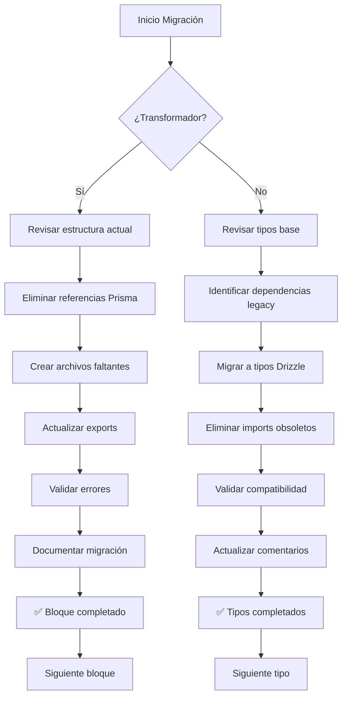

# [034] Migración masiva de transformadores a Drizzle/local + Migración paralela de tipos base

## Contexto

Actualmente existen múltiples violaciones de arquitectura donde código del lado cliente (stores Zustand, hooks, componentes React) importa servicios del servidor (`src/services/*`). Esto genera errores de runtime en Vite/React 19 y rompe la separación de responsabilidades. Es necesario migrar todo acceso a datos a través de clientes de API (`src/lib/api/client/`) o rutas `/api/`.

## Subtareas

### [HIGH] [BIG] Refactorizar todos los stores Zustand
- [x] [002] [HIGH] [BIG] Refactorizar `src/store/unified-file-manager.store.ts` para usar cliente de API
 - [x] [003] [HIGH] [BIG] Refactorizar `src/store/entities/json-file/json-file.store.ts`
- [x] [004] [HIGH] [BIG] Refactorizar `src/store/entities/tag/slices/core.slice.ts`
- [x] [005] [HIGH] [BIG] Refactorizar `src/store/entities/tag/slices/core.slice.v2.ts`
- [x] [006] [HIGH] [BIG] Refactorizar `src/store/entities/video/slices/core.ts`
- [x] [007] [HIGH] [BIG] Refactorizar `src/store/entities/wildcard/slices/core.ts`
- [x] [008] [HIGH] [BIG] Refactorizar `src/store/entities/world-item/slices/core.ts`
- [x] [009] [HIGH] [BIG] Refactorizar `src/store/entities/workflow/slices/core.slice.ts`
- [x] [010] [HIGH] [BIG] Refactorizar `src/store/entities/file/slices/core.slice.ts`
- [x] [011] [HIGH] [BIG] Refactorizar `src/store/entities/profile/actions.ts`
- [x] [012] [HIGH] [BIG] Refactorizar `src/store/entities/queue-job/slices/core.ts`
- [x] [013] [HIGH] [BIG] Refactorizar `src/store/entities/place/index.ts`
- [x] [014] [HIGH] [BIG] Refactorizar `src/store/entities/property/slices/core.ts`
- [x] [015] [HIGH] [BIG] Refactorizar `src/store/entities/note/slices/core.ts`
- [x] [016] [HIGH] [BIG] Refactorizar `src/store/entities/file-3d/file-3d.store.ts`
- [x] [017] [HIGH] [BIG] Refactorizar `src/store/entities/group/slices/core.ts`
- [x] [018] [HIGH] [BIG] Refactorizar `src/store/entities/concept/index.ts`
- [x] [019] [HIGH] [BIG] Refactorizar `src/store/entities/collection/slices/core.ts`
- [x] [020] [HIGH] [BIG] Refactorizar `src/store/stats.store.ts`
- [x] [021] [HIGH] [BIG] Refactorizar `src/store/entities/audio/audio.store.ts`
- [x] [022] [HIGH] [BIG] Refactorizar `src/store/entities/document/slices/core.slice.ts`
- [x] [023] [HIGH] [BIG] Refactorizar `src/store/entities/album/slices/core.slice.ts`
- [x] [024] [HIGH] [BIG] Refactorizar `src/store/entities/activity/index.ts` ✅

### [HIGH] [BIG] Refactorizar hooks personalizados y utilidades
- [x] [025] [HIGH] [BIG] Refactorizar `src/lib/hooks/entities/note/useNotes.ts` ✅
- [x] [026] [HIGH] [BIG] Refactorizar `src/lib/hooks/files/use-folder-images.ts` ✅
- [x] [027] [HIGH] [BIG] Refactorizar `src/lib/hooks/system/use-stats.ts` ✅
- [x] [028] [HIGH] [BIG] Refactorizar `src/lib/hooks/system/use-stats-service.ts` ✅

### [HIGH] [BIG] Refactorizar componentes React que importan servicios
- [x] [029] [HIGH] [BIG] Refactorizar `src/components/views/uploaded-images/uploaded-images-view.tsx` ✅
- [x] [030] [HIGH] [BIG] Refactorizar `src/components/views/folders/views/folders-view.tsx` ✅

### [MEDIUM] [MEDIUM] Crear clientes de API faltantes
- [ ] [031] [MEDIUM] [MEDIUM] Crear cliente de API para cada entidad que no lo tenga en `src/lib/api/client/`
=======
**Objetivo Principal:** Eliminar toda dependencia de Prisma en los transformadores y tipos base, asegurando alineación total con Drizzle y tipos locales.

**Alcance:** 29 bloques de transformadores + 13+ archivos de tipos base

**Criterios de éxito:**

- Sin referencias a Prisma (tipos, funciones, comentarios, alias)
- Solo tipos Drizzle/locales
- Exportaciones limpias y consistentes en index.ts
- API pública alineada con stores y vistas
- Comentarios claros de migración
- Sin exportaciones rotas ni legacy

## 🎯 Tarea Principal: Migración de Transformadores (29 bloques)

### Subtareas Transformadores (Orden alfabético)

[✅] [CRITICAL] [MEDIUM] Migrar bloque activity ⬅️ COMPLETADO
[✅] [CRITICAL] [MEDIUM] Migrar bloque album ⬅️ COMPLETADO  
[✅] [CRITICAL] [MEDIUM] Migrar bloque audio ⬅️ COMPLETADO
[✅] [CRITICAL] [MEDIUM] Migrar bloque character ⬅️ COMPLETADO
[✅] [CRITICAL] [MEDIUM] Migrar bloque collection ⬅️ COMPLETADO
[✅] [CRITICAL] [MEDIUM] Migrar bloque concept ⬅️ COMPLETADO
[✅] [CRITICAL] [MEDIUM] Migrar bloque document ⬅️ COMPLETADO
[✅] [CRITICAL] [MEDIUM] Migrar bloque favorite ⬅️ COMPLETADO
[ ] [CRITICAL] [MEDIUM] Migrar bloque file ⬅️ SIGUIENTE
[ ] [CRITICAL] [MEDIUM] Migrar bloque file
[ ] [CRITICAL] [MEDIUM] Migrar bloque file3d
[ ] [CRITICAL] [MEDIUM] Migrar bloque folder
[ ] [CRITICAL] [MEDIUM] Migrar bloque group
[ ] [CRITICAL] [MEDIUM] Migrar bloque image
[ ] [CRITICAL] [MEDIUM] Migrar bloque json-file
[ ] [CRITICAL] [MEDIUM] Migrar bloque metadata
[ ] [CRITICAL] [MEDIUM] Migrar bloque note
[ ] [CRITICAL] [MEDIUM] Migrar bloque place
[ ] [CRITICAL] [MEDIUM] Migrar bloque profile
[ ] [CRITICAL] [MEDIUM] Migrar bloque prompt
[ ] [CRITICAL] [MEDIUM] Migrar bloque property
[ ] [CRITICAL] [MEDIUM] Migrar bloque queue-job
[ ] [CRITICAL] [MEDIUM] Migrar bloque settings
[ ] [CRITICAL] [MEDIUM] Migrar bloque tag
[ ] [CRITICAL] [MEDIUM] Migrar bloque thumbnail
[ ] [CRITICAL] [MEDIUM] Migrar bloque uploaded-image
[ ] [CRITICAL] [MEDIUM] Migrar bloque video
[ ] [CRITICAL] [MEDIUM] Migrar bloque wildcard
[ ] [CRITICAL] [MEDIUM] Migrar bloque workflow
[ ] [CRITICAL] [MEDIUM] Migrar bloque world-item

## 🔗 Tarea Paralela: Migración de Tipos Base (13+ archivos)

### Estado Tipos Base: ⚠️ 40% migrados (~7/18)

### Subtareas Tipos Base (Prioridad por uso)

[✅] [HIGH] [MEDIUM] Migrar tipos base collection ⬅️ COMPLETADO
[✅] [HIGH] [MEDIUM] Migrar tipos base concept ⬅️ COMPLETADO
[✅] [HIGH] [MEDIUM] Migrar tipos base image ⬅️ COMPLETADO
[✅] [HIGH] [MEDIUM] Migrar tipos base document ⬅️ COMPLETADO
[✅] [HIGH] [MEDIUM] Migrar tipos base video ⬅️ COMPLETADO
[ ] [HIGH] [MEDIUM] Migrar tipos base file ⬅️ SIGUIENTE PARALELO
[ ] [HIGH] [MEDIUM] Migrar tipos base file
[ ] [HIGH] [MEDIUM] Migrar tipos base folder
[ ] [HIGH] [MEDIUM] Migrar tipos base tag
[ ] [HIGH] [MEDIUM] Migrar tipos base group
[ ] [HIGH] [MEDIUM] Migrar tipos base document
[ ] [MEDIUM] [MEDIUM] Migrar tipos base note
[ ] [MEDIUM] [MEDIUM] Migrar tipos base prompt
[ ] [MEDIUM] [MEDIUM] Migrar tipos base property
[ ] [MEDIUM] [MEDIUM] Migrar tipos base workflow
[ ] [MEDIUM] [MEDIUM] Migrar tipos base world-item
[ ] [LOW] [SMALL] Migrar tipos base metadata
[ ] [LOW] [SMALL] Migrar tipos base thumbnail
[ ] [LOW] [SMALL] Migrar tipos base task
[ ] [LOW] [SMALL] Migrar tipos base wildcard
[ ] [LOW] [SMALL] Migrar tipos base queue-job

## Estrategia para cada bloque de transformadores

1. **Revisión de archivos:** mappers.ts, serializers.ts, transformer.ts, index.ts
2. **Eliminación de Prisma:** Borrar cualquier referencia (import, tipo, función, comentario, alias)
3. **Estructura estándar:** Crear archivos faltantes (validators.ts, schema.ts)
4. **Unificación de exportaciones:** Limpiar y dejar solo lo relevante en index.ts
5. **Alineación API pública:** Validar que lo exportado es lo que usan stores y vistas
6. **Comentarios de migración:** Añadir comentarios claros de migración y actualización
7. **Validación final:** Revisar que no queden rastros legacy ni exportaciones rotas

## Estrategia para cada archivo de tipos base

1. **Identificación de dependencias:** Buscar imports de Prisma, BaseEntity, tipos legacy
2. **Migración a Drizzle:** Convertir tipos Prisma a tipos Drizzle nativos
3. **Eliminación de imports legacy:** Remover dependencias obsoletas
4. **Estructura canónica:** Aplicar patrón `Base + Statistics + WithStats`
5. **Validación de compatibilidad:** Asegurar que transformadores y stores funcionen
6. **Comentarios de migración:** Marcar claramente el estado migrado

## Especificaciones técnicas

### Para Transformadores
- Estructura estándar: `mappers.ts`, `serializers.ts`, `validators.ts`, `schema.ts`, `index.ts`
- Sin referencias a Prisma en ningún archivo
- Comentarios de migración `✅ MIGRADO A DRIZZLE - Julio 2025`
- Exportaciones limpias en `index.ts` con `export * from './archivo'`
- Tipos Drizzle para operaciones de base de datos
- Esquemas Zod para validación

### Para Tipos Base
- Estructura canónica: `Base`, `Statistics`, `WithStats`
- Sin imports de `@prisma/client` o tipos legacy
- Compatibilidad completa con transformadores migrados
- Documentación actualizada si existe

## Diagrama de flujo (Mermaid)

## Progreso Actual

### ✅ Transformadores Migrados (6/29)

1. **activity** - Completo con documentación actualizada
2. **album** - Completo con estructura estándar  
3. **audio** - Completo con validadores y schemas
4. **character** - Completo sin referencias legacy
5. **collection** - Completo con tipos Drizzle y validación Zod
6. **concept** - Completo con patrón Base+Statistics+WithStats

### ✅ Tipos Base Migrados (3/18)

1. **collection** - Migrado a patrón Base + Statistics + WithStats
2. **concept** - Migrado a patrón Base + Statistics + WithStats
3. **image** - Migrado a patrón Base + Statistics + WithStats

### 🔄 Próximos Pasos

- **Transformador:** Continuar con `document`
- **Tipos Base:** Continuar con `video` en paralelo
