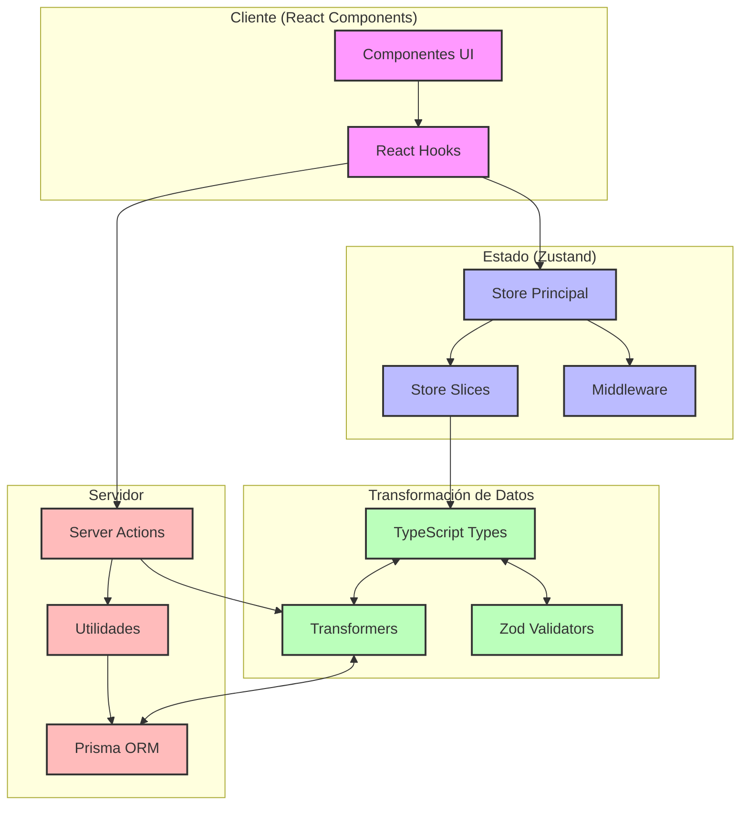

# ! importante !

Este documento se usará para hacer seguimiento de la tarea actual que estemos desarrollando.

El resto de documentación especifica se encuentra en sus lugares pertinentes, si no existe, crearla.

---

# Plan de trabajo: Types, Stores, Transformers y Utils para entidades de Prisma

## Descripción general
Implementación de estructuras de tipos, gestión de estado, transformadores y utilidades para todas las entidades definidas en el schema.prisma, con el fin de facilitar su uso en los server actions de la aplicación.

## Tecnologías y estándares
- NextJS 15.2 con App Router
- React 19
- Prisma como ORM (futura migración a Drizzle)
- TypeScript
- Zustand para gestión de estado
- TailwindCSS 4
- Shadcn/UI

## Estructura actual del proyecto
```
src/
├── app/
│   └── actions/ (server actions organizados por entidad)
│       ├── albums/
│       ├── activity/
│       ├── characters/
│       └── ... (resto de entidades)
├── types/
│   ├── entities/ (tipos específicos para cada entidad)
│   │   ├── profile/
│   │   ├── queueJob/
│   │   ├── folders.ts
│   │   └── ... (resto de entidades)
│   └── prisma.ts (tipos relacionados con Prisma)
├── store/ (estados con Zustand)
│   ├── entities/ (stores por entidad)
│   │   ├── profile/
│   │   ├── queueJob/
│   │   ├── albums.store.ts
│   │   └── ... (resto de entidades)
│   └── base.store.ts (funcionalidad común)
├── transformers/ (transformadores para serialización)
│   ├── profile/
│   ├── queueJob/
│   └── ... (pendiente para el resto de entidades)
└── server/ (lógica del servidor)
    └── actions/ (actions adicionales)
```

## Patrón de implementación por entidad

Para cada entidad definida en el esquema de Prisma, necesitamos implementar los siguientes componentes:

### 1. Types (📝)
- **Ubicación**: `src/types/entities/[entidad]/`
- **Archivos**:
  - `index.ts` - Exportaciones
  - `base.ts` - Tipos base derivados de Prisma
  - `extended.ts` - Tipos extendidos con propiedades de UI
  - `enums.ts` - Enumeraciones y constantes

### 2. Transformers (🔄)
- **Ubicación**: `src/transformers/[entidad]/`
- **Archivos**:
  - `index.ts` - Exportaciones
  - `serializers.ts` - Funciones para serializar/deserializar
  - `mappers.ts` - Mapeo entre diferentes formatos

### 3. Utils (🛠️)
- **Ubicación**: `src/utils/[entidad]/` (crear si no existe)
- **Archivos**:
  - `index.ts` - Exportaciones
  - `helpers.ts` - Funciones auxiliares
  - `validators.ts` - Validación con Zod

### 4. Store (📦)
- **Ubicación**: `src/store/entities/[entidad]/`
- **Archivos**:
  - `index.ts` - Exportación del store
  - `slices/` - Funcionalidad compartimentada
    - `core.ts` - Operaciones CRUD básicas
    - `ui.ts` - Estado relacionado con la UI
    - `filters.ts` - Filtrado y ordenación

### 5. Integraciones con Server Actions (🔄)
- Asegurar que los server actions existentes en `src/app/actions/[entidad]/` utilicen los tipos, transformers y utils correspondientes

## Estado actual y tareas pendientes

A continuación se detalla el estado de implementación para cada entidad y las tareas prioritarias:

### 📝 QueueJob (🟢 Parcialmente implementado)
- **Estado**:
  - ✅ Types básicos
  - ✅ Store básico
  - ✅ Transformers básicos
- **Tareas pendientes**:
  - [ ] Completar tipos para estados y prioridades
  - [ ] Mejorar store para seguimiento de trabajos asíncronos
  - [ ] Implementar utils para manejo de colas
  - [ ] Integrar con server actions

### 👤 Profile (🟢 Parcialmente implementado)
- **Estado**:
  - ✅ Types básicos
  - ✅ Store básico
  - ✅ Transformers básicos
  - ✅ Server actions integrados
- **Tareas pendientes**:
  - [ ] Completar interfaces para preferencias de usuario
  - [ ] Implementar utils para temas y preferencias
  - [ ] Mejorar store con persistent middleware

### 📁 Folder y FolderVisualConfig (🟢 Implementado)
- **Estado**:
  - ✅ Types completos (types/entities/folder/)
  - ✅ Transformers implementados (transformers/folder/)
  - ✅ Store específico implementado (store/entities/folder/)
  - ✅ Utils implementados (utils/folder/)
- **Tareas pendientes**:
  - [x] Crear estructura completa en types/entities/folder/
  - [x] Implementar transformers para serialización
  - [x] Crear utils para operaciones con rutas
  - [x] Implementar store específico

### 🖼️ Image, ImageVisualConfig e ImageStats (🟢 Implementado)
- **Estado**:
  - ✅ Types completos (types/entities/image/)
  - ✅ Transformers implementados (transformers/image/)
  - ✅ Store específico implementado (store/entities/image/)
  - ✅ Utils implementados (utils/image/)
- **Tareas completadas**:
  - [x] Crear estructura completa en types/entities/image/
  - [x] Implementar transformers para metadatos y thumbnails
  - [x] Crear utils para procesamiento de imágenes
  - [x] Refactorizar stores existentes

### 📹 Video y VideoVisualConfig (🟢 Implementado)
- **Estado**:
  - ✅ Types completos (types/entities/video/)
  - ✅ Transformers implementados (transformers/video/)
  - ✅ Store específico implementado (store/entities/video/)
  - ✅ Utils implementados (utils/video/)
- **Tareas pendientes**:
  - [x] Crear estructura completa en types/entities/video/
  - [x] Implementar transformers para metadatos
  - [x] Crear utils para procesamiento
  - [x] Implementar store específico

### 📊 Activity (🟢 Implementado)
- **Estado**:
  - ✅ Types específicos implementados (types/entities/activity/)
  - ✅ Transformers implementados (transformers/activity/)
  - ✅ Store implementado (store/entities/activity/)
  - ✅ Utils implementados (utils/activity/)
- **Tareas completadas**:
  - [x] Crear estructura completa en types/entities/activity/
  - [x] Implementar transformers para eventos
  - [x] Crear utils para registro y filtrado
  - [x] Implementar store para historial
  - [x] Implementar validadores con Zod

### 🏷️ Tag (🟢 Implementado)
- **Estado**:
  - ✅ Types completos (types/entities/tag/)
  - ✅ Transformers implementados (transformers/tag/)
  - ✅ Store específico implementado (store/entities/tag/)
  - ✅ Utils implementados (utils/tag/)
- **Tareas completadas**:
  - [x] Unificar y mejorar tipos en types/entities/tag/
  - [x] Implementar transformers
  - [x] Crear utils específicos
  - [x] Mejorar integración con server actions

### 📚 Album (🟢 Implementado)
- **Estado**:
  - ✅ Types completos (types/entities/album/)
  - ✅ Transformers implementados (transformers/album/)
  - ✅ Store específico implementado (store/entities/album/)
  - ✅ Utils implementados (utils/album/)
- **Tareas completadas**:
  - [x] Crear estructura completa en types/entities/album/
  - [x] Implementar transformers
  - [x] Crear utils específicos
  - [x] Mejorar integración con server actions

### 🌟 Collection (🟢 Implementado)
- **Estado**:
  - ✅ Types completos (types/entities/collection/)
  - ✅ Transformers implementados (transformers/collection/)
  - ✅ Store específico implementado (store/entities/collection/)
  - ✅ Utils implementados (utils/collection/)
- **Tareas completadas**:
  - [x] Crear estructura completa en types/entities/collection/
  - [x] Implementar transformers
  - [x] Crear utils específicos
  - [x] Mejorar integración con server actions

### 👥 Character (🟢 Implementado)
- **Estado**:
  - ✅ Types completos (types/entities/character/)
  - ✅ Transformers implementados (transformers/character/)
  - ✅ Store específico implementado (store/entities/character/)
  - ✅ Utils implementados (utils/character/)
- **Tareas completadas**:
  - [x] Crear estructura completa en types/entities/character/
  - [x] Implementar transformers
  - [x] Crear utils específicos
  - [x] Mejorar integración con server actions

### 📍 Place (🟢 Implementado)
- **Estado**:
  - ✅ Types básicos (places.ts)
  - ✅ Transformers implementados (transformers/place/)
  - ✅ Store básico (places.store.ts)
  - ✅ Utils implementados (utils/place/)
- **Tareas pendientes**:
  - [ ] Crear estructura completa en types/entities/place/
  - [ ] Implementar transformers
  - [ ] Crear utils específicos
  - [ ] Mejorar integración con server actions

### 🎯 WorldItem (🟢 Implementado)
- **Estado**:
  - ✅ Types completos (types/entities/world-item/)
  - ✅ Transformers implementados (transformers/world-item/)
  - ✅ Store específico implementado (store/entities/world-item/)
  - ✅ Utils implementados (utils/world-item/)
- **Tareas completadas**:
  - [x] Crear estructura completa en types/entities/world-item/
  - [x] Implementar transformers
  - [x] Crear utils específicos
  - [x] Mejorar integración con server actions

### 💡 Concept (🟢 Implementado)
- **Estado**:
  - ✅ Types completos (types/entities/concept/)
  - ✅ Transformers implementados (transformers/concept/)
  - ✅ Store específico implementado (store/entities/concept/)
  - ✅ Utils implementados (utils/concept/)
- **Tareas completadas**:
  - [x] Unificar y crear estructura completa en types/entities/concept/
  - [x] Implementar transformers
  - [x] Crear utils específicos
  - [x] Consolidar stores
  - [x] Corregir errores en la estructura del store

### 🎯 Prompt (🟢 Implementado)
- **Estado**:
  - ✅ Types básicos (prompts.ts)
  - ✅ Transformers implementados (transformers/prompt/)
  - ✅ Store básico (prompt.store.ts)
  - ✅ Utils implementados (utils/prompt/)
- **Tareas completadas**:
  - [x] Crear estructura completa en types/entities/prompt/
  - [x] Implementar transformers
  - [x] Crear utils específicos
  - [x] Mejorar integración con server actions

### 📝 Note (🟡 Implementación en progreso)
- **Estado**:
  - ✅ Types básicos (notes.ts)
  - ❌ Transformers pendientes
  - ✅ Store básico (note.store.ts)
- **Tareas pendientes**:
  - [ ] Crear estructura completa en types/entities/note/
  - [ ] Implementar transformers
  - [ ] Crear utils específicos
  - [ ] Mejorar integración con server actions
  - [ ] Consolidar store con patrón de slices

### 🎨 VisualPreset y configuraciones visuales (🟢 Implementado)
- **Estado**:
  - ✅ Types completos (types/entities/visual-preset/)
  - ✅ Transformers implementados (transformers/visual-preset/)
  - ✅ Store específico implementado (store/entities/visual-preset/)
  - ✅ Utils implementados (utils/visual-preset/)
- **Tareas completadas**:
  - [x] Crear estructura completa en types/entities/visual-preset/
  - [x] Implementar transformers para configuraciones complejas
  - [x] Crear utils para aplicación de presets
  - [x] Implementar store para gestión de presets con patrón de slices (core, ui, filters)
  - [x] Implementar selectores optimizados para acceso al estado

## Desafíos específicos a resolver

### 1. Serialización de JSON en campos de string
Muchas entidades tienen campos que almacenan JSON como string. Necesitamos:
- [ ] Crear transformadores genéricos para estas conversiones
- [ ] Implementar validación con Zod para estos campos
- [ ] Definir tipos TypeScript para cada estructura serializada

### 2. Optimización de relaciones y carga de datos
- [ ] Crear utilidades para cargar relaciones eficientemente
- [ ] Implementar estrategias para minimizar consultas a la base de datos
- [ ] Añadir funcionalidad de prefetch en stores para datos frecuentemente usados

### 3. Consistencia entre tipos y validación
- [ ] Asegurar que todos los tipos TypeScript sean compatibles con los esquemas Zod
- [ ] Crear helpers para derivar tipos desde esquemas de validación
- [ ] Documentar patrones para mantener sincronizados tipos y validadores

### 4. Gestión de estado optimizada
- [ ] Implementar middleware para persistencia selectiva
- [ ] Crear slices reutilizables para comportamientos comunes
- [ ] Optimizar actualización de estado para evitar re-renders innecesarios

### 5. Preparación para migración a Drizzle
- [ ] Aislar lógica específica de Prisma en transformers y utils
- [ ] Crear interfaces de abstracción para operaciones de base de datos
- [ ] Documentar patrones para facilitar la futura migración

## Plan de implementación priorizado

### Fase 1: Completar estructura base y patrones
1. [x] Crear plantillas para types, transformers, stores y utils
2. [ ] Implementar utilidades y transformadores genéricos
3. [ ] Definir patrones de integración con server actions
4. [ ] Desarrollar middleware de Zustand reutilizables

### Fase 2: Entidades críticas
1. [x] Folder y FolderVisualConfig
2. [x] Image, ImageVisualConfig e ImageStats
3. [x] Tag
4. [x] Collection
5. [ ] Album

### Fase 3: Entidades secundarias
1. [x] Character
2. [x] Place
3. [x] WorldItem
4. [x] Concept
5. [x] Prompt
6. [x] Note

### Fase 4: Entidades especiales
1. [ ] Video y VideoVisualConfig
2. [ ] Activity
3. [ ] VisualPreset
4. [ ] Completar QueueJob
5. [ ] Completar Profile

## Próximos pasos inmediatos

1. [x] Crear plantillas base para cada tipo de componente
2. [x] Analizar server actions existentes para comprender patrones actuales
3. [x] Implementar un ejemplo completo para la entidad Image
4. [x] Documentar el proceso para el resto de implementaciones
5. [ ] Implementar estructura completa para la entidad Note (types, transformers, store, utils)
6. [ ] Integrar los nuevos componentes con los server actions existentes

## Diagrama de arquitectura propuesta



## Consideraciones futuras

1. Implementar mecanismos de caché para datos frecuentemente utilizados
2. Desarrollar estrategias de invalidación de caché para mantener consistencia
3. Explorar optimizaciones para reducir la transferencia de datos
4. Considerar estrategias de paginación para colecciones grandes
5. Implementar mecanismos de sincronización en tiempo real para futuras funcionalidades colaborativas

# Current Task Progress

## Entities Implementation

- [x] Image (types, transformers, store, utils) ✅
- [x] Album (types, transformers, store, utils) ✅
- [x] Character (types, transformers, store, utils) ✅
- [x] Place (types, transformers, store, utils) ✅
- [x] Concept (types, transformers, store, utils) ✅
- [x] Note (types, transformers, store, utils) ✅
- [x] Prompt (types, transformers, store, utils) ✅
- [x] Tag (types, transformers, store, utils) ✅
- [x] VisualPreset (types, transformers, store, utils) ✅

## Entity Details

### Image
Status: Completed ✅
Files:
- [x] src/types/entities/image/
- [x] src/transformers/image/
- [x] src/store/entities/image/
- [x] src/utils/image/

### Album
Status: Completed ✅
Files:
- [x] src/types/entities/album/
- [x] src/transformers/album/
- [x] src/store/album.ts
- [x] src/utils/album/

### Character
Status: Completed ✅
Files:
- [x] src/types/entities/character/
- [x] src/transformers/character/
- [x] src/store/character.ts
- [x] src/utils/character/

### Place
Status: Completed ✅
Files:
- [x] src/types/entities/place/
- [x] src/transformers/place/
- [x] src/store/places/index.ts
- [x] src/utils/place/

### Concept
Status: Completed ✅
Files:
- [x] src/types/entities/concept/
- [x] src/transformers/concept/
- [x] src/store/entities/concept/
- [x] src/utils/concept/

### Note
Status: Completed ✅
Files:
- [x] src/types/entities/note/
- [x] src/transformers/note/
- [x] src/store/entities/note/
- [x] src/utils/note/

### Prompt
Status: Completed ✅
Files:
- [x] src/types/entities/prompt/
- [x] src/transformers/prompt/
- [x] src/store/entities/prompt/
- [x] src/utils/prompt/

### Tag
Status: Completed ✅
Files:
- [x] src/types/entities/tag/
- [x] src/transformers/tag/
- [x] src/store/entities/tag/
- [x] src/utils/tag/

### WorldItem
Status: Completed ✅
Files:
- [x] src/types/entities/world-item/
- [x] src/transformers/world-item/
- [x] src/store/entities/world-item/
- [x] src/utils/world-item/

### VisualPreset
Status: Completed ✅
Files:
- [x] src/types/entities/visual-preset/
- [x] src/transformers/visual-preset/
- [x] src/store/entities/visual-preset/
- [x] src/utils/visual-preset/

## Próximos pasos

1. Integrar los stores de entidades con server actions
2. Refactorizar componentes UI para usar los nuevos stores
3. Eliminar código duplicado o deprecado
4. Implementar hooks personalizados para facilitar el uso de los stores
5. Documentar patrones de uso para el equipo
