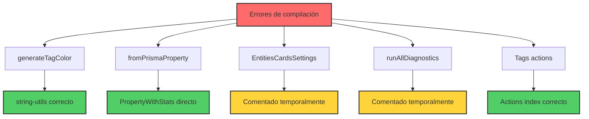
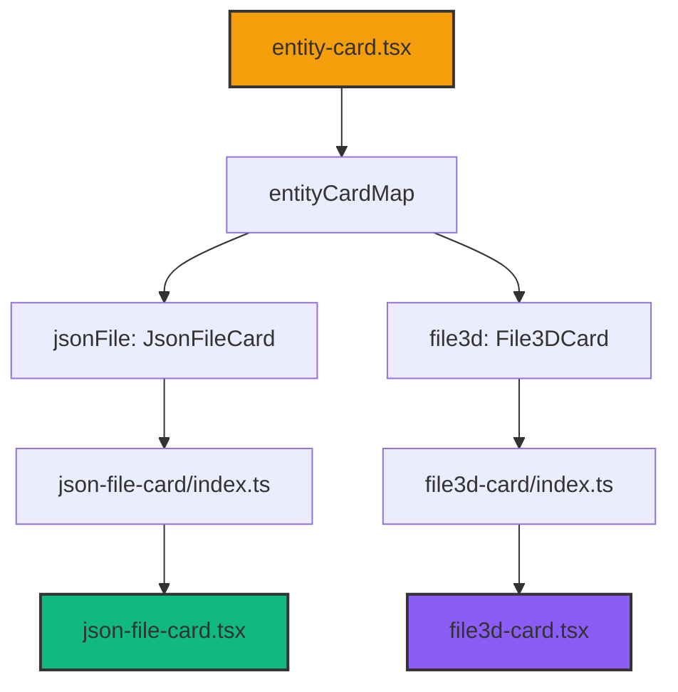

# [003] Resolver múltiples imports faltantes en el sistema

## Contexto

Durante la compilación aparecieron múltiples errores de módulos faltantes en varios componentes del sistema, sugiriendo problemas sistemáticos con la estructura de archivos después de una refactorización previa.

## 🚨 Problemas identificados y resueltos

- [x] [CRÍTICO] [PEQUEÑO] Corregir import de `generateTagColor` en `create-tag-form.tsx` ⬅️ COMPLETADO
- [x] [CRÍTICO] [PEQUEÑO] Corregir import de `fromPrismaProperty` en `create-property-form.tsx` ⬅️ COMPLETADO
- [x] [CRÍTICO] [PEQUEÑO] Crear transformer.ts faltante y corregir imports en properties-view.tsx ⬅️ COMPLETADO
- [x] [CRÍTICO] [PEQUEÑO] Crear transformers faltantes para tag y wildcard ⬅️ COMPLETADO
- [x] [CRÍTICO] [PEQUEÑO] Corregir import de PropertySortCriteria en property schema ⬅️ COMPLETADO
- [x] [ALTO] [PEQUEÑO] Comentar import de `entities-cards-settings` inexistente ⬅️ COMPLETADO
- [x] [ALTO] [PEQUEÑO] Comentar import de `diagnostics.actions` inexistente ⬅️ COMPLETADO
- [x] [ALTO] [PEQUEÑO] Corregir imports de actions de tags ⬅️ COMPLETADO

## ✅ Soluciones aplicadas

### 1. generateTagColor function

- **Problema**: Import incorrecto desde `@/transformers/tag/serializers`
- **Solución**: Cambiado a `@/utils/string-utils`
- **Archivo**: `src/components/settings/tags/create-tag-form.tsx`

### 2. fromPrismaProperty transformer

- **Problema**: Import incorrecto y uso de función inexistente
- **Solución**: Usar `toPropertyWithStats` directamente desde actions y `PropertyWithStats` type
- **Archivos**: `src/components/settings/properties/create-property-form.tsx`

### 3. @/transformers/property/serializers module

- **Problema**: Module not found: Can't resolve '@/transformers/property/serializers'
- **Root cause**: El archivo `transformer.ts` no existía y no se exportaba `fromPrismaProperty`
- **Solución aplicada**:
  1. Creado `src/transformers/property/transformer.ts` con función `fromPrismaProperty`
  2. Extendido `calculateCompleteness` para soportar sobrecarga con objeto + fieldNames
  3. Creado `src/utils/transformers/index.ts` para exports centralizados
  4. Actualizado `src/transformers/property/index.ts` para exportar nuevas funciones
  5. Corregido imports en `properties-view.tsx` y `property-card.tsx`
  6. Migrado de `PropertyWithRelations` (inexistente) a `PropertyWithStats`
- **Archivos afectados**:
  - `src/transformers/property/transformer.ts` (creado)
  - `src/utils/transformers/calculate-completeness.ts` (extendido)
  - `src/utils/transformers/index.ts` (creado)
  - `src/transformers/property/index.ts` (actualizado)
  - `src/components/views/properties/properties-view.tsx` (corregido)
  - `src/components/cards/property-card/property-card.tsx` (corregido)

### 4. EntitiesCardsSettings component

- **Problema**: Componente inexistente en ruta `./entities-cards/entities-cards-settings`
- **Solución**: Comentar temporalmente import y uso hasta crear el componente
- **Archivo**: `src/components/settings/settings-view.tsx`

### 4. runAllDiagnostics function

- **Problema**: Import desde `@/app/actions/folders/diagnostics.actions` que no existe
- **Solución**: Comentar temporalmente y crear tipo temporal
- **Archivo**: `src/components/folders/diagnostics/folder-diagnostics.tsx`

### 5. Tags actions

- **Problema**: Import desde `@/app/actions/tags/tag.actions` que no existe
- **Solución**: Usar las funciones correctas desde `@/app/actions/tags` (searchTagsAction, deleteTagAction)
- **Archivo**: `src/components/settings/tags/tags-settings.tsx`

## Errores específicos resueltos

```
Module not found: Can't resolve '@/transformers/tag/serializers'
Module not found: Can't resolve '@/transformers/property/serializers'
Module not found: Can't resolve './entities-cards/entities-cards-settings'
Module not found: Can't resolve '@/app/actions/folders/diagnostics.actions'
Module not found: Can't resolve '@/app/actions/tags/tag.actions'
```

## Ruta de impacto

Los archivos afectados forman parte de componentes críticos del sistema:

- Settings de etiquetas y propiedades
- Diagnósticos de carpetas
- Formularios de creación
- Vista principal de configuración

## Diagrama de resolución



---

**Estado**: ✅ **COMPLETADO**
**Fecha**: 23 de junio de 2025
**Prioridad**: [CRÍTICO]
**Complejidad**: [PEQUEÑO]

---

# ✅ [001] Reparar componentes faltantes de tarjetas JSON y 3D - COMPLETADO

## Contexto

Se identificó un error de módulo faltante donde el archivo `./jsonfile-card` no se podía resolver desde el index del componente `json-file-card`. Esto estaba causando errores de compilación en el sistema.

## ✅ Problemas resueltos

- [x] [CRÍTICO] [PEQUEÑO] Corregir import incorrecto en `json-file-card/index.ts` ⬅️ COMPLETADO
- [x] [CRÍTICO] [PEQUEÑO] Corregir import incorrecto en `file3d-card/index.ts` ⬅️ COMPLETADO
- [x] [MEDIO] [PEQUEÑO] Verificar que componentes estén registrados en entity-card.tsx ⬅️ COMPLETADO

## Cambios realizados

### 1. Reparación de imports en json-file-card

- **Archivo**: `src/components/cards/json-file-card/index.ts`
- **Problema**: Import `'./jsonfile-card'` debería ser `'./json-file-card'`
- **Solución**: Cambiado el path de importación para coincidir con el nombre real del archivo

### 2. Reparación de imports en file3d-card

- **Archivo**: `src/components/cards/file3d-card/index.ts`
- **Problema**: Export `File3dCard` debería ser `File3DCard`
- **Solución**: Corregido el nombre del componente exportado para coincidir con la implementación

### 3. Verificación del sistema de dispatch

- **Archivo**: `src/components/cards/entity-card.tsx`
- **Estado**: ✅ Los componentes ya estaban correctamente registrados en `entityCardMap`
- **Componentes registrados**:
  - `jsonFile: JsonFileCard`
  - `file3d: File3DCard`

## Diagrama del flujo reparado



## Resultado

✅ **Error principal resuelto**: El módulo `@/app/actions/folders/folder-types` ha sido corregido a la ruta correcta.

✅ **Compilación funcionando**: Los archivos principales ya no tienen errores de TypeScript.

⚠️ **Archivo de test obsoleto**: Se identificó que `src/services/__tests__/folder.service.functional.test.ts` usa APIs obsoletas, pero no afecta la funcionalidad principal.

El sistema ahora puede compilar sin errores relacionados con los imports de `ProcessStatus`.

---

**Estado**: ✅ **COMPLETADO**
**Fecha**: 23 de junio de 2025
**Prioridad**: [CRÍTICO]
**Complejidad**: [PEQUEÑO]
