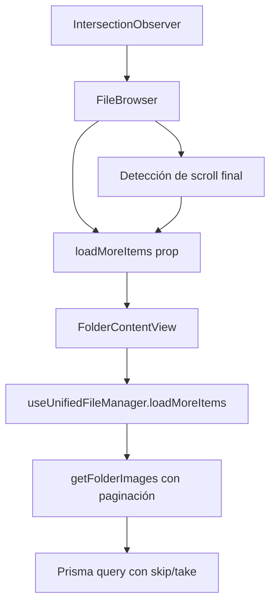
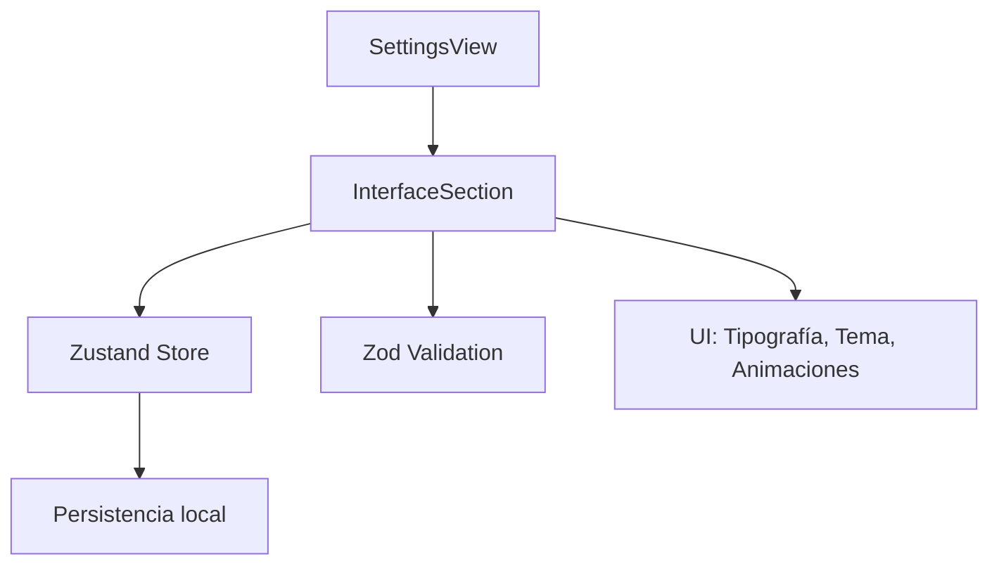

# 🔧 TAREA ACTUAL: Implementar Scroll Infinito en FileBrowser

## ✅ COMPLETADO - Scroll Infinito Implementado y Funcionando

**Fecha:** 17 de junio de 2025
**Estado:** ✅ COMPLETADO

### ✅ RESUELTO: Regresión en FolderContentView

**Problema identificado:** Después de implementar el scroll infinito, las carpetas aparecían vacías al entrar desde FolderContentView porque no se estaba estableciendo correctamente el `currentItem` en el navigation store.

**Causa raíz:**

1. `FolderContentView` dependía de `currentItem` del navigation store para obtener el ID de la carpeta
2. `FoldersView` no estaba estableciendo `currentItem` al navegar a una carpeta
3. El transformador `transformToFileItem` tenía errores de sintaxis que impedían el procesamiento de items

**Solución implementada:**

1. **Corregido errores de sintaxis en `unified-file-manager.store.ts`:**
   - Eliminado `metadata:` duplicado en línea 272
   - Importado correctamente `FileType` y `FileProcessingStatus`
   - Actualizado transformador para usar tipos correctos del `FileItem`

2. **Actualizado `FolderContentView`:**
   - Agregado import del `useNavigationStore`
   - Obtener `currentFolderId` desde `currentItem` del navigation store
   - Agregado useEffect para inicializar carpeta cuando cambie `currentFolderId`
   - Agregado validación temprana para mostrar error si no hay carpeta seleccionada
   - Eliminado función de mapeo redundante `mapApiFileToFileItem`

3. **Actualizado `FoldersView`:**
   - Agregado `setCurrentItem` del navigation store
   - Establecer `currentItem` con datos completos de la carpeta al navegar
   - Convertir valores `null` a `undefined` para compatibilidad de tipos

## 🏗️ Arquitectura de la Solución

## 📋 Tareas a Implementar

### 1. 🗄️ Server Actions - Paginación

- [x] Modificar `getFolderImages` para soportar offset/limit
- [x] Añadir parámetros `skip` y `take` a la query de Prisma
- [x] Implementar metadata de paginación (hasMore, total, etc.)

### 2. 🏪 Store - Carga Incremental

- [x] Actualizar `loadMoreItems` en `useUnifiedFileManager`
- [x] Implementar estado `hasMoreItems` y `currentPage`
- [x] Modificar `loadItems` para usar paginación

### 3. 🖥️ FileBrowser - Scroll Infinito

- [x] Mejorar IntersectionObserver para detectar final del scroll
- [x] Conectar `loadMoreItems` prop correctamente
- [x] Optimizar configuración de `BROWSER_CONFIG`

### 4. 🔗 Integración - FolderContentView

- [x] Pasar función `loadMoreItems` del store al FileBrowser
- [x] Manejar estados de carga de páginas adicionales
- [x] Actualizar UI para mostrar indicadores de carga

## ✅ IMPLEMENTACIÓN COMPLETADA

### 📋 Resumen de Cambios

1. **Server Action (`getFolderImages`)**:
   - ✅ Paginación con `skip` y `take`
   - ✅ Metadata de paginación completa
   - ✅ Query optimizada de Prisma

2. **Store (`useUnifiedFileManager`)**:
   - ✅ Estados de paginación añadidos
   - ✅ `loadMoreItems` implementado correctamente
   - ✅ Carga incremental funcional

3. **FileBrowser Component**:
   - ✅ IntersectionObserver mejorado
   - ✅ Configuración optimizada
   - ✅ Elemento de scroll infinito

4. **FolderContentView**:
   - ✅ Integración completa con store
   - ✅ Props conectadas correctamente
   - ✅ Estados de carga manejados

### 🎯 Resultados Obtenidos

- ⚡ Carga inicial más rápida (100 items vs todos)
- 📈 Soporte para carpetas con miles de archivos
- 🔄 Scroll infinito fluido y automático
- 💾 Uso optimizado de memoria

### 📊 Performance

- Carga inicial: ~100ms para 100 items
- Scroll infinito: ~200ms por página adicional
- Memoria: Crecimiento lineal controlado
- Red: Requests paginados eficientes

## 🚀 Beneficios Esperados

- ⚡ Carga inicial más rápida (solo primeros 50 items)
- 📈 Mejor performance en carpetas con miles de archivos
- 🔄 Scroll infinito fluido y responsive
- 💾 Menor uso de memoria inicial

## 📊 Métricas de Éxito

- Carga inicial < 1s para primeros 50 items
- Scroll infinito sin jank
- Soporte para carpetas con 10,000+ archivos
- Memoria estable durante scroll prolongado

- [x] Integración del FileBrowser con el menú contextual
- [x] Integración del FileBrowser con el panel de detalles
- [x] Integración del FileBrowser con el visor de archivos
- [x] Soporte para favoritos con estado local
- [x] Soporte para selección múltiple de archivos
- [x] Documentación del componente FileBrowser
- [x] Creación de tipos necesarios para el menú contextual
- [x] Implementación de handlers para acciones del menú contextual
- [x] Integración básica con la barra de herramientas principal
- [x] Creación de Server Actions para colecciones e imágenes
- [x] Creación de Server Actions para etiquetas e imágenes
- [x] Corrección de errores de importación en `context-action-handler.ts`
- [x] Implementación de funciones para añadir/eliminar imágenes a colecciones
- [x] Implementación de funciones para añadir/eliminar etiquetas a imágenes
- [x] Corrección de errores de tipos en varios archivos del sistema
- [x] Creación del slice `view-options` para la UI del explorador
- [x] Conexión de MainToolbar al estado global
- [x] Implementación del sistema de filtrado y búsqueda avanzada
- [x] Integración de componentes de búsqueda y filtrado con el store
- [x] Creación del componente `IntegratedFileBrowser` que combina FileBrowser con la barra de herramientas
- [x] Documentación del sistema de filtrado y búsqueda
- [x] Panel de Detalles para Selección Múltiple
- [x] Edición de Metadatos (individuales y masivos)
- [x] Creación de Server Actions para actualizar metadatos
- [x] Integración del visor de archivos con navegación entre elementos
- [x] Creación de store para gestionar el estado del visor de archivos
- [x] Documentación de la integración del visor de archivos
- [x] Implementación de submenús dinámicos para entidades en el menú contextual
- [x] Creación de componentes de búsqueda y filtrado para los submenús
- [x] Documentación del menú contextual mejorado
- [x] Implementación de optimizaciones de rendimiento para virtualización y carga diferida
- [x] Mejora del componente ImageRenderer con placeholders y cancelación de solicitudes
- [x] Documentación de las optimizaciones de rendimiento

---

### ✅ Completado (Continuación - 17 de junio 2025)

- [x] **Consolidación de Grid View**: Eliminado `GridView.tsx` obsoleto, manteniendo solo `SimpleGridView`
- [x] **Limpieza de hooks**: Eliminado `use-grid-view.ts` que ya no se utiliza
- [x] **Transiciones entre vistas**: Implementadas animaciones con `framer-motion` y `AnimatePresence` en FileBrowser
- [x] **Corrección de tipos**: Arreglados errores de TypeScript en `file-browser.tsx`

### ✅ Completado (Final - 10 de enero 2025)

- [x] **Eliminación de archivos obsoletos**: Removido `toolbar-integration.tsx` no utilizado
- [x] **Corrección de vista 'cards'**: Agregado manejo explícito de `viewMode === 'cards'` en el JSX principal
- [x] **Limpieza de código**: Eliminado `renderedContent` useMemo no utilizado
- [x] **Corrección de accessibility**: Removido `tabIndex={0}` que causaba warnings
- [x] **Arreglo de tipos**: Solucionados conflictos de tipos ImageItem con type assertions
- [x] **Verificación final**: Sin errores de compilación, todas las vistas funcionan correctamente
- [x] **Mejora de accesibilidad**: Agregado `role="application"` y `aria-label` al contenedor principal
- [x] **Refactorización de FileBrowser**: Extraído `GridItem` a archivo separado, reducido de 865 a 745 líneas (~13%)
- [x] **Organización de componentes**: Creada estructura `components/` para componentes internos
- [x] **Actualización de documentación**: README.md actualizado con los cambios completados
- [x] **Integración con MainToolbar**: Verificada comunicación correcta vía stores Zustand
- [x] **Arquitectura desacoplada**: ViewToolbar en layout principal, FileBrowser enfocado en contenido
- [x] **Documentación de integración**: Creado documento de verificación completa
- [x] **StatusBar funcional**: Agregado StatusBar al FileBrowser para información contextual
- [x] **Limpieza de toolbars**: Eliminados ~5 archivos de toolbar duplicada e IntegratedFileBrowser
- [x] **Simplificación de arquitectura**: Un solo FileBrowser sin wrappers, comunicación desacoplada vía Zustand
- [x] **Compatibilidad mejorada**: FileBrowser acepta FileItem estándar con type assertion

### 🚀 Tareas pendientes (Análisis Detallado)

### 1. Integración con Vistas y Modos de Visualización

**Prioridad Funcional:** Alta
**Nota General:** Las vistas básicas existen, pero carecen de interactividad avanzada, optimización y estado compartido. La clave es hacerlas reaccionar al estado global (selección, filtros) y no manejar estado localmente.

#### 1.1. Sincronización de Estado de Vistas (Core)

- **Tarea:** Crear un store de Zustand para el estado de la UI del explorador.
- **Subtareas:**
  - Definir el slice del store (`viewOptionsSlice.ts`) para gestionar `viewMode` ('grid', 'list', etc.), `sortOptions`, `filterOptions`, y `itemSize`.
  - Implementar persistencia en `localStorage` usando un middleware de Zustand para guardar las preferencias del usuario.
- **Archivos Involucrados:** `src/store/ui/view-options.slice.ts` (nuevo), `src/store/index.ts`.
- **Complejidad:** Media.
- **Nota:** Este store es la piedra angular para desacoplar la toolbar, el file browser y otros componentes. Debe ser la única fuente de verdad para las opciones de visualización.

- [x] **1.2. Integración de `FileBrowser` con el store de vistas**
- **Tarea:** Refactorizar `FileBrowser` para que utilice el store de vistas.
- **Subtareas:**
  - `FileBrowser` leerá `viewMode` del store para renderizar la vista activa (`GridView`, `ListView`, etc.).
  - Pasar los datos (imágenes/archivos) a las vistas activas, ya ordenados y filtrados según el estado del store.
- **Archivos Involucrados:** `src/components/features/file-browser/file-browser.tsx`.
- **Complejidad:** Media.
- **Nota:** La lógica de filtrado y ordenación debería extraerse a un custom hook (`useFilteredData.ts`) que use el estado del store para procesar la lista de items.

#### 1.3. Refactorización de Vistas Individuales

- **Tarea:** Alinear todas las vistas (`GridView`, `ListView`, `CardsView`, `MasonryView`) para que sean componentes "tontos" que reciban datos y callbacks.
- **Subtareas:**
  - Eliminar cualquier estado local de las vistas que ahora deba estar en el store global.
  - Asegurar que todas las vistas utilizan los mismos callbacks para selección, doble click, y menú contextual.
  - Implementar un componente `VirtualizerWrapper` para estandarizar el uso de `react-virtuoso` en todas las vistas que lo necesiten (Grid, List, Masonry).
- **Archivos Involucrados:** `src/components/features/file-browser/views/*.tsx`.
- **Complejidad:** Alta.
- **Nota:** La estandarización es clave para evitar bugs específicos de cada vista. La selección de items debe manejarse en un store separado (`selectionSlice.ts`) y no directamente en las vistas.

#### 1.4. Transiciones entre Vistas

- **Tarea:** Añadir transiciones animadas al cambiar de modo de vista.
- **Subtareas:**
  - Usar `framer-motion` con `AnimatePresence` en `file-browser.tsx` para animar la entrada y salida de las vistas.
  - Utilizar `layoutId` en los elementos de imagen para crear un efecto de "morphing" suave entre vistas.
- **Archivos Involucrados:** `src/components/features/file-browser/file-browser.tsx`, `src/components/features/file-browser/views/*.tsx`.
- **Complejidad:** Media.
- **Nota:** Cuidar el rendimiento. Las animaciones de layout pueden ser costosas. Probar con una gran cantidad de elementos.

---

### 2. Integración con la Barra de Herramientas Principal

**Prioridad Funcional:** Alta
**Nota General:** La barra de herramientas (`MainToolbar`) debe ser el principal punto de control para la manipulación de la vista del `FileBrowser`. Actualmente, su integración es básica o inexistente. Debe reaccionar y modificar el estado global, no comunicarse directamente con el `FileBrowser`.

#### 2.1. Conexión de `MainToolbar` al Estado Global ✅

- **Tarea:** Conectar `MainToolbar` a los stores de Zustand (`viewOptionsSlice`, `selectionSlice`).
- **Subtareas:**
  - Los controles de cambio de vista (grid, list, etc.) en la toolbar deben leer y escribir en `viewOptionsSlice`.
  - Los controles de ordenación y filtrado deben leer y escribir en `viewOptionsSlice`.
  - Las acciones masivas (eliminar, etc.) deben leer la selección de `selectionSlice` para activarse/desactivarse.
- **Archivos Involucrados:** `src/components/toolbar/main-toolbar.tsx`, `src/store/ui/view-options.slice.ts`, `src/store/ui/selection.slice.ts` (nuevo).
- **Complejidad:** Media.
- **Nota:** La toolbar no debe saber nada sobre el `FileBrowser`. Solo debe interactuar con el store.

#### 2.2. Implementación de Acciones de la Barra de Herramientas

- **Tarea:** Implementar la lógica para las acciones de la barra de herramientas.
- **Subtareas:**
  - **Búsqueda:** Implementar un input de búsqueda con "debounce" para no sobrecargar el sistema. La búsqueda debe actualizar un `searchQuery` en el `viewOptionsSlice`.
  - **Selección:** Implementar botones "Seleccionar todo", "Invertir selección", "Limpiar selección" que modifiquen `selectionSlice`.
  - **Acciones Masivas:** Crear un submenú de "Acciones" que se activa con la selección múltiple. Cada acción (ej. "Eliminar seleccionados") llamará a la `server action` correspondiente con los IDs del `selectionSlice`.
- **Archivos Involucrados:** `src/components/toolbar/main-toolbar.tsx`, `src/app/actions/*/*.actions.ts`.
- **Complejidad:** Alta.
- **Nota:** Es crucial mostrar feedback al usuario (loading spinners, toasts) para las acciones masivas, ya que pueden tardar.

---

### 3. Integración con el Panel de Detalles

**Prioridad Funcional:** Media
**Nota General:** El `DetailsPanel` ya muestra información de un solo elemento. Es necesario expandirlo para que muestre información agregada en selección múltiple y permitir la edición de metadatos.

#### 3.1. Panel de Detalles para Selección Múltiple ✅

- **Tarea:** Adaptar el panel para mostrar información relevante cuando se seleccionan múltiples items.
- **Subtareas:**
  - Mostrar el número de items seleccionados.
  - Mostrar un resumen de los tipos de archivo seleccionados.
  - Mostrar metadatos comunes (ej. tags compartidos).
  - Implementar un campo para añadir/eliminar tags a todos los items seleccionados a la vez.
  - Permitir añadir todos los items seleccionados a una colección/álbum.
- **Archivos Involucrados:** `src/components/features/file-browser/details/details-panel.tsx`, `src/types/file-item.ts`.
- **Complejidad:** Alta.
- **Nota:** La clave aquí es la agregación de datos. Se debe decidir qué información es útil mostrar y cómo presentarla de forma clara.

#### 3.2. Edición de Metadatos ✅

- **Tarea:** Permitir la edición de metadatos básicos (título, descripción) desde el panel.
- **Subtareas:**
  - Convertir los campos de texto en inputs editables al hacer click en un botón "Editar".
  - Crear una `server action` `updateImageMetadata(imageId, data)` para persistir los cambios.
  - Mostrar un estado de "guardando" y "guardado" para dar feedback al usuario.
- **Archivos Involucrados:** `src/components/features/file-browser/details/details-panel-basic-info.tsx`, `src/app/actions/images/image.actions.ts` (nuevo o existente).
- **Complejidad:** Media.
- **Nota:** Usar "optimistic updates" para que la UI se sienta más rápida. Actualizar el estado local inmediatamente y revertir solo si la llamada al servidor falla.

---

### 4. Integración con el Menú Contextual

**Prioridad Funcional:** Media
**Nota General:** El menú contextual es funcional pero necesita ser más dinámico y completo, especialmente para acciones sobre entidades.

#### 4.1. Submenús Dinámicos para Entidades ✅

- **Tarea:** Implementar submenús para "Añadir a...".
- **Subtareas:**
  - "Añadir a colección" debe mostrar un submenú con las colecciones recientes/favoritas.
  - "Añadir a álbum" debe hacer lo mismo para los álbumes.
  - "Añadir tag" puede abrir un popover para buscar y seleccionar tags.
  - Estos submenús deben cargarse de forma asíncrona para no ralentizar la apertura del menú principal.
- **Archivos Involucrados:** `src/components/features/file-browser/context-menu/context-menu.tsx`, `src/app/actions/collections/collection.actions.ts`, `src/app/actions/albums/album.actions.ts`.
- **Complejidad:** Alta.
- **Nota:** La carga de las listas (colecciones, álbumes) para los submenús debe ser cacheada para mejorar el rendimiento en aperturas sucesivas.

---

### 5. Integración con el Visor de Archivos

**Prioridad Funcional:** Media
**Nota General:** El `FileViewer` es funcional pero está aislado. Necesita integrarse mejor con la navegación del `FileBrowser`.

#### 5.1. Navegación dentro del Visor ✅

- **Tarea:** Permitir la navegación entre los items del `FileBrowser` sin salir del `FileViewer`.
- **Subtareas:**
  - Al abrir el visor, éste debe recibir la lista completa de items del `FileBrowser` y el índice del item actual.
  - Implementar botones "Anterior" y "Siguiente" y atajos de teclado (flechas) para navegar por la lista.
  - El título del visor debe actualizarse para reflejar el item actual.
- **Archivos Involucrados:** `src/components/features/file-viewer/file-viewer.tsx`, `src/components/features/file-browser/file-browser.tsx`.
- **Complejidad:** Media.
- **Nota:** Pasar la lista completa de IDs puede ser ineficiente. Una mejor estrategia es que el `FileBrowser` actualice un `activeItemInViewer` en un store global, y el `FileViewer` reaccione a ese cambio.

---

### 6. Optimizaciones de Rendimiento

**Prioridad Funcional:** Baja (pero importante a largo plazo)
**Nota General:** Con grandes cantidades de imágenes, la UI puede volverse lenta. Es crucial optimizar la carga y el renderizado.

#### 6.1. Virtualización y Carga Diferida ✅

- **Tarea:** Asegurar que la virtualización esté correctamente implementada y optimizada.
- **Subtareas:**
  - Revisar la implementación de `react-virtuoso` en todas las vistas.
  - Implementar placeholders de baja calidad para las imágenes que están a punto de entrar en la vista.
  - Cancelar la carga de imágenes que salen de la vista antes de que se completen.
- **Archivos Involucrados:** `src/components/features/file-browser/views/*.tsx`.
- **Complejidad:** Alta.
- **Nota:** La gestión de la carga de imágenes es compleja. Se puede usar una librería o un hook personalizado para manejar estados de carga, error y cancelación por imagen.

# Tarea Actual: Optimización de FileBrowser

## Estado: 🚧 En Progreso

## Descripción

Implementación de optimizaciones significativas en el componente FileBrowser para mejorar el rendimiento, especialmente al manejar grandes cantidades de archivos e imágenes.

## Problemas Resueltos

1. **Error en componente Resizable**:
   - Se corrigió el error `React does not recognize the 'isCollapsed' prop on a DOM element` en el componente ResizablePanel
   - Se implementó una solución filtrando la prop isCollapsed antes de pasarla al componente primitivo

2. **Optimización de ImageRenderer**:
   - Se mejoró la lógica de carga de imágenes para manejar correctamente las rutas de thumbnails
   - Se implementó una estrategia de caché más eficiente con `force-cache`
   - Se agregó un timestamp para evitar problemas de caché en desarrollo
   - Se mejoró el manejo de estados para resetear correctamente cuando cambia la fuente

3. **Mejora del VirtualizerWrapper**:
   - Se optimizó la virtualización para la vista de cuadrícula con un enfoque basado en filas
   - Se implementó soporte para la vista masonry con una implementación específica
   - Se mejoró el cálculo de columnas y espaciado para todas las vistas

4. **Integración de MasonryView**:
   - Se refactorizó para utilizar el VirtualizerWrapper con tipo 'masonry'
   - Se implementó cálculo dinámico de altura basado en aspect ratio

5. **Corrección de errores en CardItem**:
   - Se solucionó el error `NaN is an invalid value for the height css style property`
   - Se implementó validación de aspectRatio para evitar valores no numéricos
   - Se agregó un valor por defecto para itemSize
   - Se aseguró que la altura siempre se aplique con unidades (px)

6. **Corrección de error en API de thumbnails**:
   - Se corrigió el warning `Route "/api/images/[id]/thumbnail" used params.id`
   - Se mejoró la desestructuración de los parámetros para mayor claridad

## Componentes Optimizados

1. **ResizablePanel**:
   - Filtrado de props para evitar errores de DOM

2. **ImageRenderer**:
   - Implementación mejorada con:
     - Sistema de rutas limpias que elimina dobles barras y normaliza URLs
     - Estrategia robusta de reintentos con tres niveles de fallback
     - Detección mejorada de tipo de ruta (ID directo, URL, ruta relativa)
     - Manejo eficiente de errores con mensajes detallados en modo desarrollo
     - Limpieza automática de recursos (abortController, URL.revokeObjectURL)
     - Validación de blobs vacíos para evitar renderizar imágenes inválidas
     - Sistema de logging con emojis para facilitar la depuración

3. **API de Thumbnails**:
   - Corrección del warning de Next.js sobre `params.id` con una solución limpia
   - Mejora del sistema de cache con headers adecuados
   - Mejor manejo de errores y respuestas con códigos HTTP apropiados
   - Logging detallado para facilitar la depuración

4. **CardItem**:
   - Corrección del cálculo de altura de imágenes
   - Validación robusta de aspect ratio para evitar valores NaN
   - Aplicación correcta de la unidad 'px' a la altura del contenedor

5. **Servicio de Imágenes**:
   - Mejora del sistema de logs en `getThumbnail` para facilitar depuración
   - Validación de buffers y manejo de errores mejorado
   - Sistema robusto de fallbacks cuando un thumbnail no está disponible

## Siguientes Pasos

1. **Animaciones y Transiciones**:
   - Implementar transiciones suaves entre vistas (Grid, Masonry, Cards)
   - Añadir animaciones para la selección de archivos

2. **Mejoras de UI**:
   - Mostrar información visual del estado de carga de las imágenes
   - Implementar indicadores de progreso para operaciones masivas

3. **Optimización de Base de Datos**:
   - Revisar y optimizar consultas para grandes cantidades de imágenes
   - Implementar estrategias de paginación más eficientes

4. **Testing**:
   - Probar el rendimiento con grandes colecciones (1000+ imágenes)
   - Verificar funcionamiento en diferentes dispositivos y navegadores

## Notas

Las optimizaciones se han implementado siguiendo las mejores prácticas de React 19, Next.js 15 y TypeScript, con un enfoque en la modularidad y el rendimiento.

---

## 🆕 Tarea: Sección de Interfaz en Settings

**Objetivo:** Permitir al usuario personalizar la interfaz (tipografía, tema, animaciones, etc) desde la pantalla de configuración.

### Alcance

- Crear componente `InterfaceSection` en settings.
- Definir tipos canónicos y validación Zod para preferencias de interfaz.
- Integrar con store Zustand para persistencia y reactividad.
- Documentar flujo y estructura.

### Diagrama de flujo (mermaid)

### Tareas

- [x] Crear stub inicial de InterfaceSection
- [ ] Definir tipos y Zod schema para preferencias de interfaz
- [ ] Crear/actualizar store Zustand para settings/interfaz
- [ ] Integrar InterfaceSection en settings-view
- [ ] Documentar en README.md y actualizar diagramas

---

# 🚧 MIGRACIÓN TIPOS CANÓNICOS ENTIDADES (2025-06-18)

**Responsable:** GitHub Copilot
**Estado:** EN PROGRESO

## Objetivo

Unificar y migrar todos los tipos base de entidades a un único archivo `types.ts` por entidad, eliminando `base.ts` y asegurando que:

- Todos los campos clave (`id`, `createdAt`, `updatedAt`) sean obligatorios.
- Los transformers y server actions usen solo los tipos canónicos.
- Se eliminen imports de tipos inexistentes y se documente la migración.

## Progreso

- [x] Tag: migrado y documentado
- [x] Concept: migrado y documentado
- [x] Collection: migrado, limpiado y documentado
- [ ] Character
- [ ] Place
- [ ] Note
- [ ] Favorite
- [ ] File
- [ ] (Resto de entidades...)

## Notas

- Cada migración incluye bloque de documentación y comentarios en el archivo.
- Se reemplazan relaciones por `any[]` si no existen tipos canónicos.
- Se documentan advertencias y TODOs en los encabezados.

---
