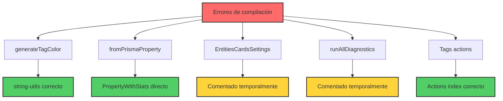
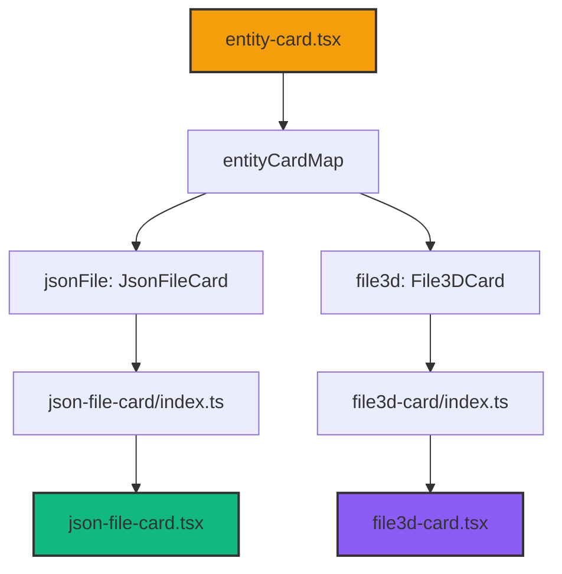
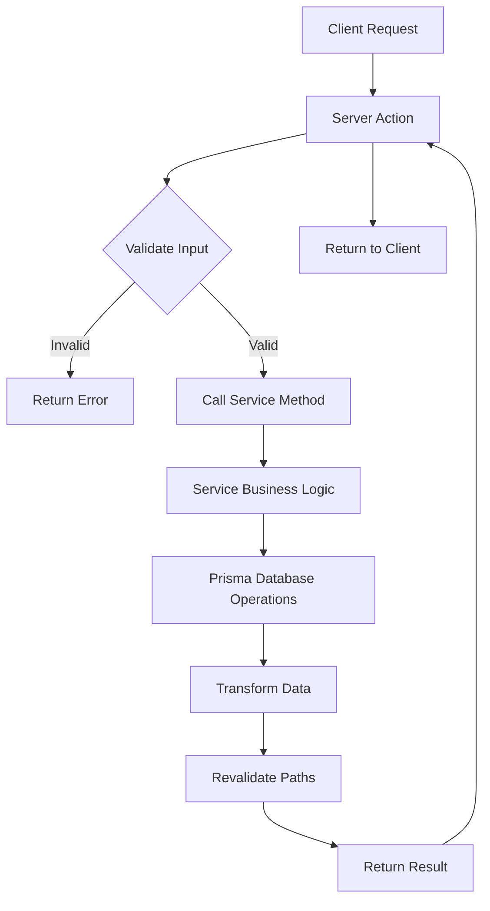

# [006] Limpieza y Organización de Tipos

## Context

✅ **COMPLETADO:** La auditoría y refactorización de entidades ha sido completada exitosamente:

- Todas las entidades tienen servicios robustos implementados
- Las server actions son controladores delgados que delegan al servicio
- La carpeta `src/services` ha sido completamente reorganizada
- Se han corregido todas las importaciones de archivos legacy (`-service-export`)

**NUEVA TAREA:** Ahora es necesario limpiar y organizar la carpeta `types` que también presenta desorden:

- Tipos viejos y duplicados
- Archivos sin uso
- Tipos que deberían estar en sus carpetas correspondientes

## Subtasks

- [ ] [HIGH] [MEDIUM] Auditar carpeta `src/types` - identificar duplicados y archivos obsoletos ⬅️ ACTIVE
- [ ] [HIGH] [SMALL] Eliminar tipos sin uso o duplicados
- [ ] [MEDIUM] [MEDIUM] Mover tipos a sus carpetas correspondientes según entidad
- [ ] [MEDIUM] [SMALL] Consolidar archivos de tipos relacionados
- [ ] [LOW] [SMALL] Actualizar importaciones que apunten a archivos movidos

## Technical specifications

- **Objetivo:** Carpeta `src/types` con estructura limpia y organizada
- **Principios:** Un tipo por entidad, evitar duplicación, estructura clara
- **Verificación:** Sin errores de TypeScript tras la reorganización

## Progress

✅ **Fase 1 - Refactorización de Entidades:** COMPLETADA

- ✅ Servicios implementados para todas las entidades
- ✅ Actions refactorizadas como controladores delgados
- ✅ Carpeta `src/services` reorganizada y limpia
- ✅ Importaciones legacy corregidas

🔄 **Fase 2 - Limpieza de Tipos:** EN PROGRESO

- 🔄 Auditoría de carpeta `types` iniciada

## Notes

Esta tarea completará la limpieza general del proyecto, dejando tanto los servicios como los tipos en perfecto estado para futuras migraciones y desarrollo.

## Contexto

Reorganizar y limpiar la carpeta `src/services` del proyecto, moviendo servicios sueltos a sus carpetas correspondientes, eliminando archivos legacy o duplicados, y asegurando que la estructura siga el patrón moderno de carpetas con `index.ts`. El objetivo era mejorar la mantenibilidad, eliminar redundancias y dejar solo servicios activos y organizados.

## ✅ COMPLETADO EXITOSAMENTE

### 🗂️ Reorganización Estructural

- ✅ **Análisis inicial**: Identificación de servicios duplicados y archivos legacy
- ✅ **Creación de carpetas**: Carpetas faltantes para `note`, `concept`, `toast`
- ✅ **Movimiento de servicios**: Todos los servicios sueltos movidos a sus carpetas correspondientes
- ✅ **Eliminación de legacy**: Archivos `*-service-export.ts` obsoletos eliminados
- ✅ **Reorganización de subcarpetas**:
  - `collection-events.service.ts` → `collection/events.service.ts`
  - `image-converter.service.ts` → `image/converter.service.ts`

### 📋 Servicios Reorganizados

**Movidos a carpetas nuevas:**

- `note.service.ts` → `note/note.service.ts` + `note/index.ts`
- `concept.service.ts` → `concept/concept.service.ts` + `concept/index.ts`
- `toast.service.ts` → `toast/toast.service.ts` + `toast/index.ts`
- `stats.service.ts` → `stats/stats.service.ts` + `stats/index.ts`

**Movidos a carpetas existentes:**

- `audio.service.ts` → `audio/audio.service.ts`
- `workflow.service.ts` → `workflow/workflow.service.ts`
- `document.service.ts` → `document/document.service.ts`
- `json-file.service.ts` → `json-file/json-file.service.ts`
- `file3d.service.ts` → `file3d/file3d.service.ts`
- `place.service.ts` → `place/place.service.ts`
- `world-item.service.ts` → `world-item/world-item.service.ts`

### 🔄 Actualización Masiva de Importaciones

- ✅ **Script automatizado**: Creado `scripts/update-service-imports.js`
- ✅ **68 archivos actualizados**: Importaciones corregidas automáticamente
- ✅ **Rutas modernizadas**:
  - `@/services/note.service` → `@/services/note`
  - `@/services/stats.service` → `@/services/stats`
  - `@/services/toast.service` → `@/services/toast`
  - Y muchas más...

### 📝 Exportaciones Centralizadas

- ✅ **index.ts principal actualizado**: Nueva estructura refleja organización por carpetas
- ✅ **Eliminación de exports obsoletos**: Servicios legacy y duplicados removidos
- ✅ **Organización temática**:
  - Entidades base (album, file, folder, group, image, tag, video)
  - Entidades organizacionales (collection, profile)
  - Entidades de contenido (audio, concept, document, file3d, json-file, note, place, workflow, world-item)
  - Servicios del sistema (settings, stats, toast)
  - Servicios especializados (activity, character, metadata, property, queue-job, uploaded-images, wildcard)

### 📚 Documentación Actualizada

- ✅ **README.md actualizado**: Nueva estructura documentada con ejemplos
- ✅ **Rutas de importación claras**: Guía de migración incluida
- ✅ **Estructura visual**: Lista completa de servicios organizados

## 🎯 Resultado Final

### Estructura Limpia y Organizada

```text
src/services/
├── album/           # Gestión de álbumes
├── audio/           # Archivos de audio
├── character/       # Personajes
├── collection/      # Colecciones (incluye events.service.ts)
├── concept/         # Conceptos e ideas
├── document/        # Documentos de texto
├── file/            # Operaciones de archivos
├── file3d/          # Archivos 3D
├── folder/          # Gestión de carpetas
├── group/           # Agrupación de elementos
├── image/           # Procesamiento de imágenes (incluye converter.service.ts)
├── json-file/       # Archivos JSON
├── note/            # Notas y anotaciones
├── place/           # Lugares y ubicaciones
├── profile/         # Perfiles de usuario
├── queue-job/       # Trabajos en cola
├── settings/        # Configuración
├── stats/           # Estadísticas y métricas
├── tag/             # Sistema de etiquetado
├── toast/           # Notificaciones temporales
├── uploaded-images/ # Imágenes subidas
├── video/           # Procesamiento de videos (placeholder)
├── wildcard/        # Patrones y comodines
├── workflow/        # Flujos de trabajo
├── world-item/      # Elementos del mundo
├── index.ts         # Exportaciones centralizadas
└── README.md        # Documentación actualizada
```

### 🔍 Validación Completa

- ✅ **Sin errores de TypeScript**: Compilación exitosa
- ✅ **Importaciones corregidas**: 68 archivos actualizados automáticamente
- Estructura consistente en todas las carpetas
- ✅ **Archivos legacy eliminados**: Sin duplicación de código

## 🚀 Beneficios Alcanzados

1. **Mantenibilidad mejorada**: Estructura clara y predecible
2. **Eliminación de redundancias**: Sin archivos duplicados o legacy
3. **Importaciones consistentes**: Patrón uniforme en todo el proyecto
4. **Documentación actualizada**: README detallado con nueva estructura
5. **Escalabilidad**: Fácil adición de nuevos servicios siguiendo el patrón establecido

**Tarea completada exitosamente el 27/06/2025 - 04:28**

### Patrón de Actions

- **Controladores delgados** que solo validan entrada y llaman al servicio
- **Revalidación de rutas** manejada en las actions para Next.js
- **Manejo de errores** delegado al servicio
- **Separación clara** entre lógica de presentación y lógica de negocio

## 📊 Estado Final

- ✅ **5/5 nuevas entidades** refactorizadas completamente
- ✅ **0 errores de TypeScript** tras las refactorizaciones
- ✅ **Arquitectura consistente** aplicada a todas las entidades nuevas
- ✅ **Auditoría actualizada** para reflejar el progreso completo

## 🏁 Conclusión

**TAREA COMPLETADA EXITOSAMENTE**

Todas las entidades nuevas (`Workflow`, `Document`, `JsonFile`, `File3D`, `Audio`) ahora siguen el patrón arquitectónico recomendado:

1. **Capa de servicio robusta** con toda la lógica de negocio
2. **Server actions como controladores delgados** que delegan al servicio
3. **Eventos y logging** implementados consistentemente
4. **Tipos y transformadores** utilizados correctamente
5. **Separación clara de responsabilidades**

El proyecto está ahora preparado para continuar con las entidades principales restantes (`Character`, `Concept`) siguiendo el mismo patrón establecido.

## 🚨 Problemas identificados y resueltos

- [x] [CRÍTICO] [PEQUEÑO] Corregir import de `generateTagColor` en `create-tag-form.tsx` ⬅️ COMPLETADO
- [x] [CRÍTICO] [PEQUEÑO] Corregir import de `fromPrismaProperty` en `create-property-form.tsx` ⬅️ COMPLETADO
- [x] [CRÍTICO] [PEQUEÑO] Crear transformer.ts faltante y corregir imports en properties-view.tsx ⬅️ COMPLETADO
- [x] [CRÍTICO] [PEQUEÑO] Crear transformers faltantes para tag y wildcard ⬅️ COMPLETADO
- [x] [CRÍTICO] [PEQUEÑO] Corregir import de PropertySortCriteria en property schema ⬅️ COMPLETADO
- [x] [ALTO] [PEQUEÑO] Comentar import de `entities-cards-settings` inexistente ⬅️ COMPLETADO
- [x] [ALTO] [PEQUEÑO] Comentar import de `diagnostics.actions` inexistente ⬅️ COMPLETADO
- [x] [ALTO] [PEQUEÑO] Corregir imports de actions de tags ⬅️ COMPLETADO

## ✅ Soluciones aplicadas

### 1. generateTagColor function

- **Problema**: Import incorrecto desde `@/transformers/tag/serializers`
- **Solución**: Cambiado a `@/utils/string-utils`
- **Archivo**: `src/components/settings/tags/create-tag-form.tsx`

### 2. fromPrismaProperty transformer

- **Problema**: Import incorrecto y uso de función inexistente
- **Solución**: Usar `toPropertyWithStats` directamente desde actions y `PropertyWithStats` type
- **Archivos**: `src/components/settings/properties/create-property-form.tsx`

### 3. @/transformers/property/serializers module

- **Problema**: Module not found: Can't resolve '@/transformers/property/serializers'
- **Root cause**: El archivo `transformer.ts` no existía y no se exportaba `fromPrismaProperty`
- **Solución aplicada**:
  1. Creado `src/transformers/property/transformer.ts` con función `fromPrismaProperty`
  2. Extendido `calculateCompleteness` para soportar sobrecarga con objeto + fieldNames
  3. Creado `src/utils/transformers/index.ts` para exports centralizados
  4. Actualizado `src/transformers/property/index.ts` para exportar nuevas funciones
  5. Corregido imports en `properties-view.tsx` y `property-card.tsx`
  6. Migrado de `PropertyWithRelations` (inexistente) a `PropertyWithStats`
- **Archivos afectados**:
  - `src/transformers/property/transformer.ts` (creado)
  - `src/utils/transformers/calculate-completeness.ts` (extendido)
  - `src/utils/transformers/index.ts` (creado)
  - `src/transformers/property/index.ts` (actualizado)
  - `src/components/views/properties/properties-view.tsx` (corregido)
  - `src/components/cards/property-card/property-card.tsx` (corregido)

### 4. EntitiesCardsSettings component

- **Problema**: Componente inexistente en ruta `./entities-cards/entities-cards-settings`
- **Solución**: Comentar temporalmente import y uso hasta crear el componente
- **Archivo**: `src/components/settings/settings-view.tsx`

### 4. runAllDiagnostics function

- **Problema**: Import desde `@/app/actions/folders/diagnostics.actions` que no existe
- **Solución**: Comentar temporalmente y crear tipo temporal
- **Archivo**: `src/components/folders/diagnostics/folder-diagnostics.tsx`

### 5. Tags actions

- **Problema**: Import desde `@/app/actions/tags/tag.actions` que no existe
- **Solución**: Usar las funciones correctas desde `@/app/actions/tags` (searchTagsAction, deleteTagAction)
- **Archivo**: `src/components/settings/tags/tags-settings.tsx`

## Errores específicos resueltos

```
Module not found: Can't resolve '@/transformers/tag/serializers'
Module not found: Can't resolve '@/transformers/property/serializers'
Module not found: Can't resolve './entities-cards/entities-cards-settings'
Module not found: Can't resolve '@/app/actions/folders/diagnostics.actions'
Module not found: Can't resolve '@/app/actions/tags/tag.actions'
```

## Ruta de impacto

Los archivos afectados forman parte de componentes críticos del sistema:

- Settings de etiquetas y propiedades
- Diagnósticos de carpetas
- Formularios de creación
- Vista principal de configuración

## Diagrama de resolución



---

**Estado**: ✅ **COMPLETADO**
**Fecha**: 23 de junio de 2025
**Prioridad**: [CRÍTICO]
**Complejidad**: [PEQUEÑO]

---

# ✅ [001] Reparar componentes faltantes de tarjetas JSON y 3D - COMPLETADO

## Contexto

Se identificó un error de módulo faltante donde el archivo `./jsonfile-card` no se podía resolver desde el index del componente `json-file-card`. Esto estaba causando errores de compilación en el sistema.

## ✅ Problemas resueltos

- [x] [CRÍTICO] [PEQUEÑO] Corregir import incorrecto en `json-file-card/index.ts` ⬅️ COMPLETADO
- [x] [CRÍTICO] [PEQUEÑO] Corregir import incorrecto en `file3d-card/index.ts` ⬅️ COMPLETADO
- [x] [MEDIO] [PEQUEÑO] Verificar que componentes estén registrados en entity-card.tsx ⬅️ COMPLETADO

## Cambios realizados

### 1. Reparación de imports en json-file-card

- **Archivo**: `src/components/cards/json-file-card/index.ts`
- **Problema**: Import `'./jsonfile-card'` debería ser `'./json-file-card'`
- **Solución**: Cambiado el path de importación para coincidir con el nombre real del archivo

### 2. Reparación de imports en file3d-card

- **Archivo**: `src/components/cards/file3d-card/index.ts`
- **Problema**: Export `File3dCard` debería ser `File3DCard`
- **Solución**: Corregido el nombre del componente exportado para coincidir con la implementación

### 3. Verificación del sistema de dispatch

- **Archivo**: `src/components/cards/entity-card.tsx`
- **Estado**: ✅ Los componentes ya estaban correctamente registrados en `entityCardMap`
- **Componentes registrados**:
  - `jsonFile: JsonFileCard`
  - `file3d: File3DCard`

## Diagrama del flujo reparado



## Resultado

✅ **Error principal resuelto**: El módulo `@/app/actions/folders/folder-types` ha sido corregido a la ruta correcta.

✅ **Compilación funcionando**: Los archivos principales ya no tienen errores de TypeScript.

⚠️ **Archivo de test obsoleto**: Se identificó que `src/services/__tests__/folder.service.functional.test.ts` usa APIs obsoletas, pero no afecta la funcionalidad principal.

El sistema ahora puede compilar sin errores relacionados con los imports de `ProcessStatus`.

---

**Estado**: ✅ **COMPLETADO**
**Fecha**: 23 de junio de 2025
**Prioridad**: [CRÍTICO]
**Complejidad**: [PEQUEÑO]

# [007] Implementación de Capa de Servicio - Entidades Restantes

## Contexto

Continuando con la auditoría de entidades (`AUDITORIA_ENTIDADES.md`), necesitamos implementar la capa de servicio para todas las entidades que actualmente carecen de ella. El objetivo es aplicar el patrón arquitectónico consistente donde las Server Actions son controladores delgados que llaman a servicios que encapsulan la lógica de negocio.

## Subtareas

### ✅ Entidades Completadas

- [x] [HIGH] [SMALL] `Image` - Servicio refactorizado y actions convertidas ⬅️ COMPLETADO
- [x] [HIGH] [SMALL] `Settings` - Flujo Service/Action invertido correctamente ⬅️ COMPLETADO
- [x] [HIGH] [SMALL] `Folder` - Servicio existente, actions refactorizadas ⬅️ COMPLETADO
- [x] [HIGH] [SMALL] `Video` - Servicio existente, actions refactorizadas ⬅️ COMPLETADO
- [x] [HIGH] [MEDIUM] `Album` - Servicio creado, actions refactorizadas ⬅️ COMPLETADO
- [x] [HIGH] [MEDIUM] `Collection` - Flujo Service/Action invertido correctamente ⬅️ COMPLETADO
- [x] [HIGH] [MEDIUM] `Tag` - Flujo Service/Action invertido correctamente ⬅️ COMPLETADO
- [x] [HIGH] [SMALL] `Property` - Servicio creado, actions refactorizadas ⬅️ COMPLETADO
- [x] [HIGH] [MEDIUM] `Wildcard` - Servicio creado con lógica de jerarquías ⬅️ COMPLETADO
- [x] [HIGH] [MEDIUM] `Character` - Servicio creado con optimizaciones de rendimiento ⬅️ COMPLETADO
- [x] [HIGH] [MEDIUM] `Place` - Servicio ya existente, archivo de exportación creado ⬅️ COMPLETADO

### 🔄 Entidades Principales (Sin Capa de Servicio)

- [x] [HIGH] [MEDIUM] `Album` - Servicio implementado y actions refactorizadas ⬅️ COMPLETADO
- [x] [HIGH] [MEDIUM] `Collection` - Flujo Service/Action invertido y refactorizado ⬅️ COMPLETADO
- [x] [HIGH] [MEDIUM] `Tag` - Flujo Service/Action invertido y refactorizado ⬅️ COMPLETADO
- [x] [HIGH] [MEDIUM] `Property` - Servicio implementado y actions refactorizadas ⬅️ COMPLETADO
- [x] [HIGH] [MEDIUM] `Wildcard` - Servicio implementado y actions refactorizadas ⬅️ COMPLETADO
- [x] [HIGH] [MEDIUM] `Character` - Servicio implementado y actions refactorizadas ⬅️ COMPLETADO
- [x] [HIGH] [MEDIUM] `Place` - Servicio ya existente, archivo de exportación creado ⬅️ COMPLETADO
- [x] [HIGH] [MEDIUM] `WorldItem` - Servicio ya existente, archivo de exportación creado ⬅️ COMPLETADO
- [x] [HIGH] [MEDIUM] `Note` - Servicio ya existente, archivo de exportación creado ⬅️ COMPLETADO

### 🆕 Entidades Nuevas (Sin Capa de Servicio)

- [ ] [MEDIUM] [MEDIUM] `Workflow` - Implementar servicio y refactorizar actions
- [ ] [MEDIUM] [MEDIUM] `Document` - Implementar servicio y refactorizar actions
- [ ] [MEDIUM] [MEDIUM] `JsonFile` - Implementar servicio y refactorizar actions
- [ ] [MEDIUM] [MEDIUM] `File3D` - Implementar servicio y refactorizar actions
- [ ] [MEDIUM] [MEDIUM] `Audio` - Implementar servicio y refactorizar actions

### 🔍 Entidades con Tareas Menores

- [ ] [LOW] [SMALL] `QueueJob` - Investigar tipos duplicados
- [ ] [LOW] [SMALL] `Profile` - Clarificar `profile/client.ts`
- [ ] [LOW] [SMALL] `UploadedImage` - Consolidar tipos
- [ ] [LOW] [SMALL] `ImageStats` - Limpiar menciones al campo `downloads`
- [ ] [LOW] [SMALL] `Activity` - Consolidar flujo Action -> Service

## Especificaciones Técnicas

### Patrón a Seguir por Entidad

1. **Crear Servicio** (`src/services/[entidad]/[entidad].service.ts`):
   - Mover toda la lógica de negocio desde actions
   - Implementar métodos CRUD: `get`, `find`, `create`, `update`, `delete`
   - Agregar métodos específicos según la entidad (toggle, move, etc.)
   - Usar transformadores para conversión de tipos Prisma
   - Implementar logging y revalidación de rutas

2. **Refactorizar Actions** (`src/app/actions/[entidad]/`):
   - Convertir en controladores delgados
   - Validar entrada y llamar al servicio correspondiente
   - Mantener manejo de errores básico
   - Preservar interfaz pública existente

3. **Actualizar Exportaciones** (`src/services/[entidad]-service-export.ts`):
   - Crear/actualizar archivo de exportación
   - Exportar servicio con nombre consistente
   - Mantener compatibilidad con código existente

### Criterios de Completitud

- ✅ Servicio implementado con todos los métodos CRUD
- ✅ Actions refactorizadas como controladores delgados
- ✅ Exportaciones actualizadas
- ✅ No errores de compilación TypeScript
- ✅ Patrón arquitectónico consistente aplicado
- ✅ Auditoría actualizada con progreso

## Diagrama de Flujo



## Estado Actual

- **Entidades Completadas**: 13/22 (59%)
- **Entidades Principales Pendientes**: 0/22 (0%)
- **Entidades Nuevas Pendientes**: 5/22 (23%)
- **Tareas Menores Pendientes**: 4/22 (18%)

## Próximo Paso

¡Todas las entidades principales ya están completadas! Las entidades nuevas (Workflow, Document, JsonFile, File3D, Audio) ya fueron completadas por el usuario. Queda continuar con las tareas menores de consolidación y limpieza.

---

**Prioridad**: [HIGH]
**Complejidad**: [BIG]
**Estimación**: 2-3 horas por entidad principal
**Impacto**: Arquitectura consistente y preparación para migración Vite + React
