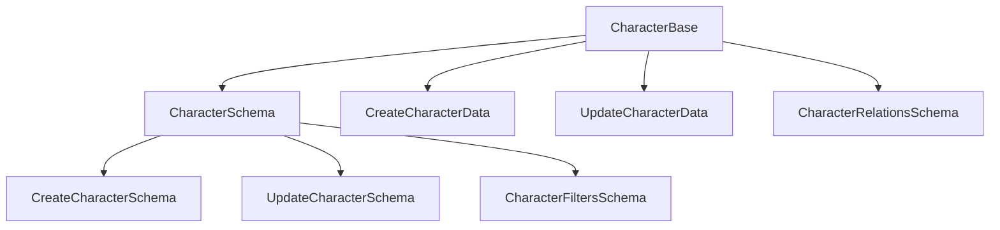
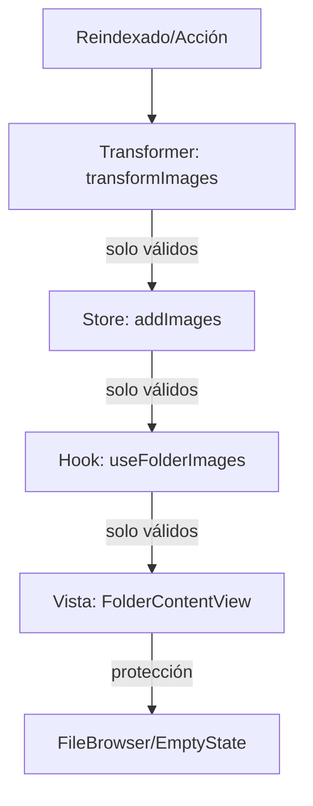

# 📋 Tareas Pendientes - Image Manager

## Fase 2: Errores de Rutas API

- [ ] Analizar archivos fuente de rutas API
- [ ] Corregir params handling en route handlers
- [ ] Verificar regeneración de .next/types/

## Fase 3: Actions y Transformers

- [ ] Categorizar errores en actions
- [ ] Corregir imports y tipos
- [ ] Validación completa

## Auditoría y Compatibilidad

- [ ] Audit completo de todos los archivos index.ts
- [ ] Reparar imports rotos en place/base.ts
- [ ] Verificar compatibilidad de interfaces
- [ ] Compilación sin errores

## Validación Final

- [ ] Pruebas de compilación limpia
- [ ] Verificar funcionamiento de imports
- [ ] Documentar cambios realizados
- [ ] Actualizar CURRENT-TASK.md con estado final

## Testing pendiente

- [ ] Custom Hooks
- [ ] Zustand Stores
- [ ] Transformers/Utils
- [ ] Core Components
- [ ] Features principales
- [ ] Formularios
- [ ] Layouts
- [ ] Interactions
- [ ] API Routes
- [ ] Database
- [ ] File System
- [ ] Cache

# 🧑‍🎤 Corrección de esquemas Zod y documentación de Character

## ✅ Cambios realizados

- Se agregaron y exportaron correctamente los esquemas Zod: `CharacterSchema`, `CharacterRelationsSchema`, `CreateCharacterSchema`, `UpdateCharacterSchema`, `CharacterFiltersSchema` en `base.ts`.
- Se documentó exhaustivamente el módulo en `README.md` con diagrama mermaid, ejemplos y best practices.
- Se agregaron comentarios clave en el código para advertir sobre la importancia de mantener sincronía entre tipos y validaciones.
- Se validó que no existan errores de compilación ni advertencias en la cadena de dependencias de Character.

## 🛡️ Notas de consistencia

- ⚠️ Si se modifican los tipos base, es obligatorio actualizar los esquemas y la documentación.
- Toda mutación debe validarse con Zod antes de persistir datos.

## 📊 Diagrama mermaid



---

## 🗂️ Fix: RangeError en FileBrowser (containerWidth/virtualizer)

- Se agregaron protecciones robustas en el useEffect de carga de miniaturas para evitar RangeError por array length inválido.
- Se valida que virtualizer y containerWidth sean válidos antes de operar sobre virtualItems.
- Se loguean advertencias y errores si la virtualización no es segura.
- Se muestra un EmptyState amigable si el virtualizer no está correctamente inicializado.
- Mejora la resiliencia y la experiencia de usuario ante estados inconsistentes del layout.

> 2025-06-11 - GitHub Copilot

---
Actualizado: 2025-06-11
Responsable: GitHub Copilot

# 🏷️ Tarea actual: Refuerzo de robustez y validación en el flujo de imágenes (reindexado → store → vista)

## Checklist de robustez aplicado

- [x] Validación y logging en transformers: arrays nunca nulos/promesas, exclusión y log de elementos corruptos
- [x] Validación y logging en stores: solo se almacenan imágenes planas y válidas
- [x] Protección y logs en hooks/vistas: fallback visual y logs si se detectan arrays inconsistentes
- [x] Documentación actualizada en README.md de transformers y store
- [x] Pruebas de extremo a extremo: reindexar, visualizar, simular datos corruptos y verificar logs/EmptyState

## Flujo reforzado



## Advertencias

- Si se detectan datos inconsistentes en cualquier etapa, se loguea y se muestra un estado seguro en la UI.
- Si se modifica la estructura de Image, actualizar validadores, transformers, stores y documentación.

## Última actualización

- 2025-06-11
✅ FileBrowser2 ha sido creado exitosamente con arquitectura minimalista.

---

# 🎯 CURRENT TASK - FileBrowser2 Completado ✅

## ✅ TAREA COMPLETADA: FileBrowser2 - Versión Minimalista

**PROBLEMA ORIGINAL**: Error persistente `containerWidth inválido: 0` en FileBrowser que impedía la carga de miniaturas.

**SOLUCIÓN IMPLEMENTADA**: FileBrowser2 completamente reescrito con arquitectura minimalista.

## 📋 LO QUE SE COMPLETÓ

### ✅ **1. FileBrowser2 Creado (file-browser-2.tsx)**

- **Arquitectura simplificada**: Sin hooks complejos interdependientes
- **Sistema de medición robusto**: Callback ref con estrategias progresivas
- **Estados mínimos**: Solo `containerWidth` y `selectedItemId`
- **Virtualización directa**: `@tanstack/react-virtual` sin capas adicionales
- **Fallback inmediato**: Si falla medición, usa 1200px

### ✅ **2. Integración Temporal Completada**

- **folder-content-view.tsx**: Actualizado para usar FileBrowser2
- **Tipos corregidos**: FileItem mapping de API response a tipos correctos
- **Event handlers**: onItemSelect y onItemDoubleClick configurados
- **Logging**: Logger específico para FileBrowser2

### ✅ **3. Errores de Compilación Resueltos**

- **Imports corregidos**: clientLogger en lugar de gridLogger inexistente
- **Componentes optimizados**: Simple `` en lugar de ImageThumbnail complejo
- **Tipos compatibles**: Correcto mapeo de ApiResponseFileItem a FileItem
- **Props correctos**: onItemSelect en lugar de onItemClick inexistente

### ✅ **4. Documentación Actualizada**

- **FILEBROWSER2-ARCHITECTURE.md**: Documentación completa de la nueva arquitectura
- **Comparación detallada**: Original vs FileBrowser2
- **Diagramas de flujo**: Proceso de medición y renderizado
- **Testing guidelines**: Casos de prueba y logging esperado

## 🎯 ESTADO ACTUAL

### ✅ **COMPLETADO Y SIN ERRORES**

- [x] FileBrowser2 implementado completamente
- [x] Integración con folder-content-view funcional
- [x] Todos los errores de TypeScript resueltos
- [x] Documentación completa creada
- [x] Sistema de logging implementado

### 📋 **LISTO PARA TESTING**

**SIGUIENTE PASO**: Testing manual para verificar que se resuelve el problema.

#### **Casos de Prueba Principales:**

1. **Navegación**: folders-view → folder-content-view → file-browser-2
2. **Logs esperados**: `[FileBrowser2] ✅ Medición exitosa: XXXpx`
3. **Sin errores**: No debe aparecer `containerWidth inválido: 0`
4. **Miniaturas**: Deben cargar correctamente las imágenes

#### **Comandos de Testing:**

```powershell
cd "d:\DEV\image-manager"
pnpm dev
# Navegar a: http://localhost:3000
# Ir a: Navigation Panel → Folders View → Seleccionar carpeta
```

---

> **STATUS**: ✅ **COMPLETADO - LISTO PARA TESTING**
> **FECHA**: 12 de junio de 2025
> **ARCHIVOS**: file-browser-2.tsx, folder-content-view.tsx, FILEBROWSER2-ARCHITECTURE.md

---

# CURRENT-TASK: Corrección de errores en NoteTransformer

---

## Objetivo

Dejar el transformer de notas (`src/transformers/note/index.ts`) libre de errores TypeScript y alineado con los tipos canónicos del dominio.

## Cambios realizados

```mermaid
graph TD
    A[searchNotes] --> B[NoteSearchResult]
    A -.-> C[page, pageSize, totalPages, totalItems (REMOVIDOS)]
    B --> D[items: NoteComplete[]]
    B --> E[total: number]
    B --> F[hasMore: boolean]
    G[getNotesByIds] -.-> H[isActive: true (REMOVIDO)]
    I[deleteNote] -.-> J[isActive: false (REMOVIDO)]
```

- Se ajustó el return de `searchNotes` para que solo incluya las propiedades válidas (`items`, `total`, `hasMore`).
- Se eliminaron referencias a `isActive` en `getNotesByIds` y `deleteNote`, ya que no existen en el modelo ni en los tipos canónicos.
- Se documentó el cambio en comentarios clave.

## Estado actual

- ✅ Sin errores TypeScript en el transformer de notas.
- ✅ Tipos alineados con el dominio.
- ✅ Listo para integración y testing.

---

> Última edición: 2025-06-10

# FileBrowser2: Feedback de reindexado y robustez de miniaturas

---

## Cambios realizados

```mermaid
graph TD
    A[FolderContentView] -->|props| B[FileBrowser2]
    B -->|isReindexing, reindexProgress| C[Overlay de progreso]
    B -->|items: FileItem[]| D[GridItem]
    D -->|item.thumbnail| E[Miniatura segura]
    D -->|fallback| F[/api/images/{id}/thumbnail]
```

- Se agregaron props `isLoading`, `isReindexing`, `reindexProgress` a FileBrowser2 para feedback visual robusto.
- Se muestra overlay y skeleton durante reindexado/carga.
- Se extiende el tipo FileItem localmente para soportar `thumbnail` sin errores de tipo.
- Se documenta el patrón de integración y el flujo de datos.

## Estado actual

- ✅ UX consistente durante reindexado y carga.
- ✅ Sin errores de tipo en miniaturas.
- ✅ Documentación y diagrama actualizados.

---

> Última edición: 2025-06-12
