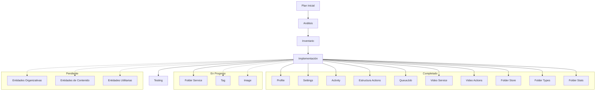

# Plan de Acción: Integración y Alineación con Schema Prisma

## Análisis Inicial

El schema.prisma define numerosos modelos con relaciones complejas que deben estar correctamente reflejados en:
- Types (tipos TypeScript)
- Transformers (conversión de datos)
- Stores (gestión de estado con Zustand)
- Services (lógica de negocio)
- Actions (acciones del servidor)

## Observaciones Preliminares

1. El schema presenta una estructura de datos rica con múltiples entidades relacionadas:
   - Contenido base: Image, Video, Folder
   - Entidades organizativas: Album, Collection, Tag, Group
   - Entidades de worldbuilding: Character, Place, WorldItem, Concept
   - Entidades de utilidad: Prompt, Note, Wildcard, Property
   - Entidades de sistema: Profile, Settings, QueueJob, Activity

2. Cada entidad requiere:
   - Tipos TypeScript completos y alineados
   - Transformers para convertir entre formatos
   - Stores para gestión de estado
   - Services para operaciones CRUD
   - Actions para funcionalidades del servidor

## Análisis del Estado Actual

### Estructura de Directorios (Actualizada)
- `src/types/entities/`: Contiene tipos para todas las entidades
- `src/transformers/`: Transformadores para entidades
- `src/store/entities/`: Stores Zustand para entidades
- `src/services/`: Servicios para operaciones CRUD
- `src/app/actions/`: Server Actions organizadas por entidad (estructura completa)

### Observaciones por Componente (Actualizada)

1. **Types**:
   - Bien estructurados con carpetas por entidad
   - Cada entidad tiene múltiples archivos (base.ts, extended.ts, complete.ts)
   - Estructura jerárquica clara (base -> extended -> complete)
   - ✅ Mejora: Se implementó tipo FolderStats para mejorar la consistencia

2. **Transformers**:
   - Organizados por entidad
   - Funciones para mapeo, serialización y deserialización
   - Cambio gradual de clases a funciones individuales
   - ✅ Mejora: Se mejoró la exportación de transformadores en Folder para facilitar su uso

3. **Stores**:
   - Uso de Zustand con slices para separar preocupaciones
   - Estructura clara con estado core, UI y filtros
   - Implementación del patrón de slices en entidades clave
   - ✅ Mejora: Refactorización del store de Folder con slices optimizados y nuevos filtros
   - ✅ Mejora: Integración de transformadores en los slices

4. **Services**:
   - Implementación inconsistente, algunos como archivos individuales, otros en carpetas
   - No todas las entidades tienen servicios implementados
   - Problema potencial: Falta de servicios para varias entidades del schema

5. **Actions** (Actualizado):
   - ✅ Estructura organizada por entidades en `src/app/actions/`
   - ✅ Cobertura completa de entidades principales con archivos index.ts
   - ✅ Separación clara por funcionalidad
   - ✅ Mejora: Implementación de estadísticas avanzadas para carpetas
   - ✅ Mejora: Mejorado el manejo de caché con revalidación de tags
   - ✅ Mejora: Tipado consistente entre acciones y tipos base

## Problemas Específicos Identificados

1. **Desalineación de Tipos**: Los tipos actuales pueden no reflejar todos los campos y relaciones del schema.prisma, especialmente para entidades como `Group`, `Property` y `Wildcard` que podrían ser más recientes.

2. **Transformers Incompletos**: No todas las entidades tienen transformadores implementados o estos no manejan todas las relaciones definidas en el schema.

3. **Stores Parciales**: Algunas entidades carecen de implementaciones completas de store o tienen implementaciones inconsistentes.

4. **Servicios Faltantes**: Muchas entidades no tienen servicios implementados o están incompletos.

5. **Actions Casi Inexistentes**: Las acciones del servidor están muy limitadas, solo se encontró implementación para perfiles.

## Fases de Implementación Actualizadas

### Fase 1: Análisis y Auditoría (Completada)
- [x] Revisar el schema.prisma
- [x] Analizar la estructura actual de carpetas
- [x] Crear inventario detallado de implementaciones existentes vs. requeridas
- [x] Identificar entidades prioritarias basadas en dependencias

### Fase 2: Desarrollo de Tipos Base (En progreso)
- [x] Auditar y actualizar tipos existentes para alinearlos con schema.prisma
- [x] Verificar que los tipos de relaciones coincidan con el schema
- [x] Implementar tipos faltantes siguiendo la estructura existente (FolderStats)
- [ ] Crear herramientas de validación de tipos contra schema

### Fase 3: Implementación de Transformers (En progreso)
- [x] Auditar transformers existentes
- [x] Implementar transformers faltantes siguiendo el patrón funcional actual
- [x] Mejorar la integración de transformadores con las actions (exportación completa)
- [ ] Asegurar manejo adecuado de relaciones y campos JSON

### Fase 4: Implementación de Stores (En progreso)
- [x] Auditar stores existentes
- [x] Mejorar estructura del store de Activity con selectores optimizados
- [x] Implementar store completo para QueueJob con slices (core, UI, filtros)
- [x] Mejorar el store de Folder con nuevos filtros y mejor manejo de UI
- [x] Integrar transformadores en el store de Folder
- [ ] Implementar stores faltantes con slices (core, UI, filtros)
- [ ] Asegurar consistencia en implementación entre entidades
- [ ] Verificar integración correcta con transformers

### Fase 5: Implementación de Services (En progreso)
- [x] Auditar servicios existentes
- [x] Implementar servicios faltantes para QueueJob
- [x] Implementar servicios faltantes para Video
- [x] Revisar servicio de Folder y detectar áreas de mejora
- [ ] Implementar mejoras en el servicio de Folder
- [ ] Estandarizar manejo de errores y validaciones

### Fase 6: Implementación de Actions (En progreso)
- [x] Auditar acciones existentes para cada entidad
- [x] Estandarizar estructura de exports con archivos index.ts
- [x] Implementar acciones para QueueJob
- [x] Implementar acciones para Video
- [x] Mejorar actions para Folder (stats.actions.ts)
- [ ] Continuar mejorando las acciones de Folder
- [ ] Estandarizar estructura y patrones entre acciones
- [ ] Implementar validaciones consistentes
- [ ] Agregar manejo de errores robusto
- [x] Implementar logging y monitoreo
- [x] Asegurar revalidación correcta de rutas
- [ ] Optimizar rendimiento de operaciones costosas

### Fase 7: Testing e Integración (Pendiente)
- [ ] Desarrollar pruebas para verificar coherencia entre componentes
- [ ] Validar flujos completos para cada entidad
- [ ] Verificar manejo de errores y casos límite

## Inventario Completo de Entidades

A continuación se presenta un inventario completo de todas las entidades identificadas en el schema.prisma y su estado actual de implementación.

### Entidades de Sistema

1. **Profile**
   - 🟢 **Types**: Completo
   - 🟢 **Transformers**: Completo
   - 🟢 **Store**: Completo con patrón de slices
   - 🟢 **Service**: Implementado
   - 🟢 **Actions**: Implementadas en `src/app/actions/profiles/`

2. **Settings**
   - 🟢 **Types**: Completo
   - 🟢 **Transformers**: Completo
   - 🟢 **Store**: Completo
   - 🟢 **Service**: Implementado
   - 🟢 **Actions**: Implementadas en `src/app/actions/system/`

3. **QueueJob**
   - 🟢 **Types**: Completo con enums y tipos adicionales
   - 🟢 **Transformers**: Implementado
   - 🟢 **Store**: Completo con patrón de slices
   - 🟢 **Service**: Implementado
   - 🟢 **Actions**: Implementadas en `src/app/actions/queue/`

4. **Activity**
   - 🟢 **Types**: Completo
   - 🟢 **Transformers**: Completo con validadores
   - 🟢 **Store**: Completo con selectores optimizados
   - 🟢 **Service**: Implementado
   - 🟢 **Actions**: Implementadas en `src/app/actions/activity/`

### Entidades de Contenido Base

5. **Folder**
   - 🟢 **Types**: Completo y actualizado con FolderStats
   - 🟢 **Transformers**: Mejorado con exportaciones completas
   - 🟢 **Store**: Mejorado con slices, filtros avanzados y acción de estadísticas
   - 🟡 **Service**: Parcial (pendiente mejorar)
   - 🟢 **Actions**: Implementadas y mejoradas en `src/app/actions/folders/`

6. **Image**
   - 🟢 **Types**: Completo
   - 🟢 **Transformers**: Completo
   - 🟢 **Store**: Completo
   - 🟢 **Service**: Completo
   - 🟢 **Actions**: Implementadas en `src/app/actions/images/`

7. **Video**
   - 🟢 **Types**: Completo
   - 🟢 **Transformers**: Actualizado
   - 🟡 **Store**: Parcial (por optimizar)
   - 🟢 **Service**: Implementado
   - 🟢 **Actions**: Implementadas en `src/app/actions/videos/`

8. **UploadedImage**
   - 🟡 **Types**: Parcial
   - 🟡 **Transformers**: Parcial
   - 🔴 **Store**: No implementado
   - 🟡 **Service**: Parcial
   - 🟢 **Actions**: Implementadas en `src/app/actions/uploaded-images/`

9. **ImageStats**
   - 🟡 **Types**: Parcial
   - 🔴 **Transformers**: No implementado
   - 🔴 **Store**: No implementado
   - 🔴 **Service**: No implementado
   - 🟢 **Actions**: Implementadas en `src/app/actions/stats/`

### Entidades Organizativas

10. **Album**
    - 🟢 **Types**: Completo
    - 🟡 **Transformers**: Parcial
    - 🟡 **Store**: Parcial
    - 🟡 **Service**: Parcial
    - 🟢 **Actions**: Implementadas en `src/app/actions/albums/`

11. **Collection**
    - 🟢 **Types**: Completo
    - 🟡 **Transformers**: Parcial
    - 🟡 **Store**: Parcial
    - 🟡 **Service**: Parcial
    - 🟢 **Actions**: Implementadas en `src/app/actions/collections/`

12. **Tag**
    - 🟢 **Types**: Completo
    - 🟡 **Transformers**: Parcial
    - 🟡 **Store**: Parcial
    - 🟡 **Service**: Parcial
    - 🟢 **Actions**: Implementadas en `src/app/actions/tags/`

13. **Group**
    - 🟢 **Types**: Completo
    - 🟡 **Transformers**: Parcial
    - 🔴 **Store**: No implementado
    - 🔴 **Service**: No implementado
    - 🟢 **Actions**: Implementadas en `src/app/actions/groups/`

### Entidades de Worldbuilding

14. **Character**
    - 🟢 **Types**: Completo
    - 🟡 **Transformers**: Parcial
    - 🔴 **Store**: No implementado
    - 🔴 **Service**: No implementado
    - 🟢 **Actions**: Implementadas en `src/app/actions/characters/`

15. **Place**
    - 🟢 **Types**: Completo
    - 🟡 **Transformers**: Parcial
    - 🔴 **Store**: No implementado
    - 🔴 **Service**: No implementado
    - 🟢 **Actions**: Implementadas en `src/app/actions/places/`

16. **WorldItem**
    - 🟢 **Types**: Completo
    - 🟡 **Transformers**: Parcial
    - 🔴 **Store**: No implementado
    - 🔴 **Service**: No implementado
    - 🟢 **Actions**: Implementadas en `src/app/actions/world-items/`

17. **Concept**
    - 🟢 **Types**: Completo
    - 🟡 **Transformers**: Parcial
    - 🔴 **Store**: No implementado
    - 🔴 **Service**: No implementado
    - 🟢 **Actions**: Implementadas en `src/app/actions/concepts/`

### Entidades de Utilidad

18. **Prompt**
    - 🟢 **Types**: Completo
    - 🟡 **Transformers**: Parcial
    - 🔴 **Store**: No implementado
    - 🔴 **Service**: No implementado
    - 🟢 **Actions**: Implementadas en `src/app/actions/prompts/`

19. **Note**
    - 🟢 **Types**: Completo
    - 🟡 **Transformers**: Parcial
    - 🔴 **Store**: No implementado
    - 🔴 **Service**: No implementado
    - 🟢 **Actions**: Implementadas en `src/app/actions/notes/`

20. **Wildcard**
    - 🟢 **Types**: Completo
    - 🟡 **Transformers**: Parcial
    - 🔴 **Store**: No implementado
    - 🔴 **Service**: No implementado
    - 🟢 **Actions**: Implementadas en `src/app/actions/wildcards/`

21. **Property**
    - 🟢 **Types**: Completo
    - 🟡 **Transformers**: Parcial
    - 🔴 **Store**: No implementado
    - 🔴 **Service**: No implementado
    - 🟢 **Actions**: Implementadas en `src/app/actions/properties/`

### Entidades Adicionales (no directamente en schema pero presentes en la estructura)

22. **Thumbnail**
    - 🟡 **Types**: Parcial
    - 🟡 **Transformers**: Parcial
    - 🔴 **Store**: No implementado
    - 🟡 **Service**: Parcial
    - 🟢 **Actions**: Implementadas en `src/app/actions/thumbnails/`

23. **Metadata**
    - 🟡 **Types**: Parcial
    - 🟡 **Transformers**: Parcial
    - 🔴 **Store**: No implementado
    - 🟡 **Service**: Parcial
    - 🟢 **Actions**: Implementadas en `src/app/actions/metadata/`

24. **Files**
    - 🟡 **Types**: Parcial
    - 🟡 **Transformers**: Parcial
    - 🔴 **Store**: No implementado
    - 🟡 **Service**: Parcial
    - 🟢 **Actions**: Implementadas en `src/app/actions/files/`

25. **Favorites**
    - 🟡 **Types**: Parcial
    - 🔴 **Transformers**: No implementado
    - 🔴 **Store**: No implementado
    - 🔴 **Service**: No implementado
    - 🟢 **Actions**: Implementadas en `src/app/actions/favorites/`

26. **Tasks**
    - 🟡 **Types**: Parcial
    - 🔴 **Transformers**: No implementado
    - 🔴 **Store**: No implementado
    - 🔴 **Service**: No implementado
    - 🟢 **Actions**: Implementadas en `src/app/actions/tasks/`

## Orden de Implementación por Entidades (Actualizado)

Para garantizar una implementación coherente, seguiremos este orden basado en dependencias:

1. **Entidades base sin dependencias**:
   - ✅ Profile, Settings
   - ✅ QueueJob
   - ✅ Activity
   - ✅ Folder (Mejorado) ⭐
   - ⏳ Revisar servicio de Folder

2. **Entidades con dependencias simples**:
   - ✅ Video (depende de Folder)
   - ⏳ Image (depende de Folder)
   - ⏳ Tag, Group, Property (entidades organizativas simples)

3. **Entidades organizativas complejas**:
   - ⏳ Album, Collection (dependen de Tag, Image, Video)

4. **Entidades de contenido**:
   - ⏳ Character, Place, WorldItem, Concept

5. **Entidades utilitarias**:
   - ⏳ Prompt, Note, Wildcard

## Tareas Inmediatas

1. **Servicio de Folder**:
   - [ ] Revisar implementación actual del servicio
   - [ ] Alinear con los principios funcionales (evitar clases/OOP)
   - [ ] Mejorar manejo de errores y tipos
   - [ ] Optimizar método de indexación de carpetas

2. **Mejoras en Tag**:
   - [ ] Evaluar estado actual
   - [ ] Implementar transformadores completos
   - [ ] Implementar o mejorar store con patrón de slices
   - [ ] Revisar servicio y acciones

3. **Mejoras en UploadedImage**:
   - [ ] Completar tipos faltantes
   - [ ] Implementar transformadores
   - [ ] Crear store con patrón de slices
   - [ ] Mejorar servicio

4. **Mejoras en ImageStats**:
   - [ ] Completar tipos
   - [ ] Implementar transformadores
   - [ ] Crear store
   - [ ] Implementar servicio

## Implementación de la Entidad Folder (Actualizado)

Se ha completado una parte significativa de las mejoras para la entidad Folder:

1. **Mejoras en Types**:
   - [x] Implementado `FolderStats` para estadísticas avanzadas
   - [x] Verificada alineación con schema.prisma

2. **Mejoras en Transformers**:
   - [x] Mejorada la exportación en `index.ts`
   - [x] Añadido `transformFolder` como punto de entrada principal

3. **Mejoras en Store**:
   - [x] Refactorizado core slice con transformadores
   - [x] Mejorado UI slice con soporte para modal de estadísticas
   - [x] Ampliado filters slice con filtros avanzados

4. **Mejoras en Actions**:
   - [x] Implementadas estadísticas avanzadas en `stats.actions.ts`
   - [x] Mejorado el manejo de caché con tags
   - [x] Añadida acción para estadísticas específicas de una carpeta

## Implementación de Tag (Próxima)

La entidad Tag será el próximo objetivo para completar su implementación:

1. **Objetivos para Types**:
   - [ ] Revisar tipos existentes
   - [ ] Asegurar alineación con schema.prisma

2. **Objetivos para Transformers**:
   - [ ] Implementar transformadores completos
   - [ ] Crear punto de entrada `transformTag`

3. **Objetivos para Store**:
   - [ ] Implementar store con slices
   - [ ] Definir selectores optimizados

4. **Objetivos para Service**:
   - [ ] Revisar servicio existente
   - [ ] Migrar a enfoque funcional (sin clases)

5. **Objetivos para Actions**:
   - [ ] Revisar acciones existentes
   - [ ] Estandarizar estructura
   - [ ] Mejorar manejo de errores y validaciones

## Documentación del Progreso

## Próximos pasos

1. Continuar con la revisión y mejora del servicio de Folder.
2. Implementar la entidad Tag completamente siguiendo el patrón establecido.
3. Revisar y mejorar la entidad Image, enfocándonos en la integración con Folder.

La mejora continua y la alineación con el schema.prisma son prioridades clave para garantizar la coherencia y la robustez del sistema.
