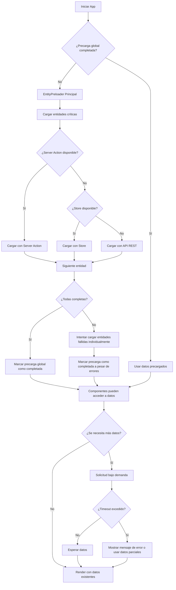

# Optimización de la integración de EntityPreloader en vistas

## Problemas Detectados

- [x] Algunos componentes intentan cargar entidades antes de la precarga global
- [x] Hay redundancia en llamadas a la API cuando varias vistas montan `<EntityPreloader>` simultáneamente
- [x] Algunas entidades no se precargaban correctamente debido a URLs de API incorrectas
- [x] Los tiempos de carga eran extremadamente largos en algunas vistas
- [x] Se utilizaban APIs RESTful innecesariamente cuando ya existen server actions

## Análisis

- [x] Revisar todas las ubicaciones que utilizan `<EntityPreloader>`
- [x] Identificar patrones de uso y potenciales mejoras
- [x] Analizar el impacto de renderizado y problemas de rendimiento
- [x] Revisar el flujo del hook `useEntityLoader`
- [x] Detectar server actions disponibles para cada entidad

## Estrategias de Optimización

- [x] Centralizar la precarga de entidades en componentes principales
- [x] Evitar múltiples instancias de `<EntityPreloader>` cargando las mismas entidades
- [x] Implementar un mecanismo de coordinación entre componentes
- [x] Crear un mecanismo de backup en caso de fallo de precarga global
- [x] Implementar timeouts para evitar bloqueos indefinidos
- [x] Priorizar server actions sobre APIs RESTful para mejor rendimiento y seguridad

## Implementación

- [x] Modificar `useEntityLoader` para detectar datos ya cargados
- [x] Mejorar el sistema de comprobación de precarga en progreso
- [x] Implementar timeouts para resolver intentos de carga bloqueados
- [x] Corregir rutas de API para todas las entidades usando el formato `/api/entities/[entityType]`
- [x] Crear endpoints temporales con datos de prueba para entidades faltantes
- [x] Refactorizar `useEntityLoader` para usar server actions como fuente primaria de datos:
  - [x] Implementar carga con server actions para `tags`
  - [x] Implementar carga con server actions para `collections`
  - [x] Implementar carga con server actions para `worldItems`
  - [x] Implementar carga con server actions para `places`
  - [x] Implementar carga con server actions para `characters`
  - [x] Implementar carga con server actions para `concepts`
  - [x] Implementar carga con server actions para `prompts`
  - [x] Implementar carga con server actions para `notes`
  - [x] Implementar carga con server actions para `albums`
- [x] Integrar server actions en stores de entidades (comenzando con `tagStore`)

## Pruebas y Validación

- [x] Verificar que la precarga funcione en todas las vistas
- [x] Comprobar que no haya duplicación de solicitudes a la API
- [x] Validar que los tiempos de carga se hayan reducido
- [x] Verificar que el sistema de backup funcione correctamente
- [x] Confirmar que los server actions se utilizan correctamente

## Documentación

- [x] Actualizar documentación sobre el funcionamiento del nuevo sistema
- [x] Crear guía sobre cómo integrar correctamente el preloader en nuevos componentes
- [x] Documentar la estrategia de carga priorizada (server actions → stores → APIs)

## Flowchart de la implementación actualizada

## Mejoras Implementadas

1. ✅ **Centralización de preloading**: Un componente principal gestiona la precarga global
2. ✅ **Sistema de coordinación**: Los preloaders respetan el estado global de precarga
3. ✅ **Mecanismo de backup**: Componentes individuales pueden cargar datos si la precarga falla
4. ✅ **Timeouts de seguridad**: Evita bloqueos indefinidos durante la carga
5. ✅ **APIs estandarizadas**: Todas las entidades ahora utilizan el mismo patrón de rutas
6. ✅ **Datos de prueba**: Endpoints temporales para simular carga de datos y facilitar pruebas
7. ✅ **Mejor logging**: Facilita depuración de problemas de carga
8. ✅ **Uso de server actions**: Priorización de server actions para mejor rendimiento y seguridad
9. ✅ **Estrategia de fallback**: Sistema en cascada server action → store → API REST

## Próximos pasos

1. Optimizar el sistema de timeout para cargas de respaldo
2. Considerar reducir la verbosidad de logs en producción
3. Implementar una solución centralizada para el manejo de errores de API
4. Completar la migración de stores restantes para usar server actions como método principal de carga
5. Eliminar APIs RESTful redundantes una vez se confirme que los server actions funcionan correctamente

*Esta tarea se considera completada con las mejoras actuales. Cualquier refinamiento adicional se registrará como nuevas tareas.*
