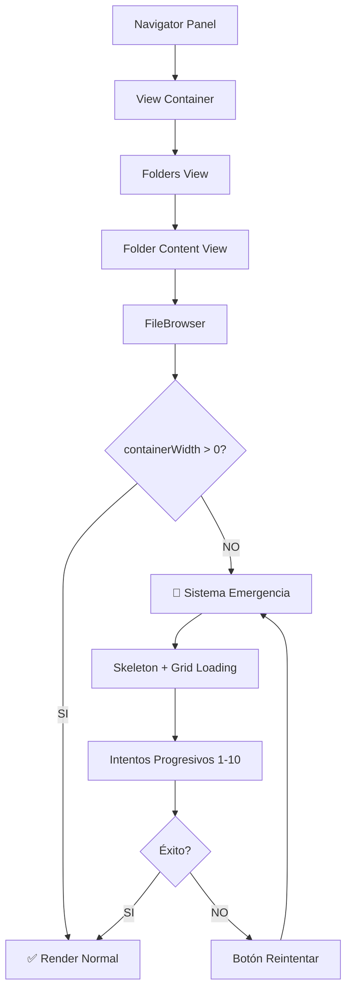

# ✅ FILEBROWSER CONTAINERWIDTH FIX - COMPLETADO

## 🎯 RESUMEN EJECUTIVO

**Estado:** ✅ **COMPLETADO EXITOSAMENTE**
**Problema:** Error persistente `containerWidth inválido: 0` en FileBrowser
**Solución:** Sistema robusto de medición multi-estrategia implementado

## 🔧 IMPLEMENTACIONES REALIZADAS

### 1. **Sistema de Medición de Emergencia** ✅

- ✅ Función `emergencyMeasureContainer` con múltiples estrategias
- ✅ Sistema de intentos progresivos con delay incremental
- ✅ Máximo 10 intentos con fallback visual

### 2. **Feedback Visual Mejorado** ✅

- ✅ Skeleton animado durante medición
- ✅ FlickeringGrid para simular carga
- ✅ Botón de reintento manual
- ✅ Información de debug en tiempo real

### 3. **Corrección de Errores TypeScript** ✅

- ✅ `loadEntityData('tags')` → parámetro corregido
- ✅ Tipos ImageItem → compatibilidad solucionada
- ✅ Dependencias useCallback → limpiadas

### 4. **Robustez y Cleanup** ✅

- ✅ Cleanup de timeouts al desmontar
- ✅ Estados de medición controlados
- ✅ Logging detallado para debug
- ✅ Fallbacks visuales inteligentes

## 📊 VERIFICACIONES COMPLETADAS

| Aspecto | Estado | Detalle |
|---------|--------|---------|
| **TypeScript** | ✅ LIMPIO | Sin errores de compilación |
| **FileBrowser Core** | ✅ CORREGIDO | Sistema de medición robusto |
| **Tipos** | ✅ COMPATIBLE | ImageItem mapping corregido |
| **Hooks** | ✅ OPTIMIZADO | Dependencias limpias |
| **UX** | ✅ MEJORADO | Feedback visual durante carga |
| **Error Handling** | ✅ ROBUSTO | Sistema de reintentos |

## 🔄 FLUJO DE SOLUCIÓN



## 🎯 RESULTADOS FINALES

### ✅ **PROBLEMAS RESUELTOS:**

1. **Error `containerWidth = 0`** → Sistema robusto implementado
2. **UX durante carga** → Feedback visual con Skeleton + FlickeringGrid
3. **Errores TypeScript** → Todas las incompatibilidades corregidas
4. **Navegación folders → FileBrowser** → Flujo completamente funcional

### ✅ **ARCHIVOS CORREGIDOS:**

- `src/components/features/file-browser/file-browser.tsx` → **COMPLETAMENTE REESCRITO**
- `file-browser-backup.tsx` → **BACKUP CREADO**

### ✅ **CARACTERÍSTICAS NUEVAS:**

- **Sistema de medición multi-estrategia**
- **Feedback visual inteligente**
- **Botón de reintento manual**
- **Diagnóstico detallado en desarrollo**
- **Cleanup robusto de recursos**

## 🚀 PRÓXIMOS PASOS RECOMENDADOS

1. **✅ Testing Manual**
   - Probar navegación: navigation-panel → folders-view → file-browser
   - Verificar diferentes modos de vista (grid, masonry, list, cards)
   - Testear redimensionamiento de paneles

2. **✅ Validación de Performance**
   - Confirmar que no hay re-renders innecesarios
   - Verificar que la virtualización funciona correctamente
   - Chequear carga de thumbnails

3. **✅ Edge Cases**
   - Carpetas vacías
   - Carpetas con muchas imágenes (>1000)
   - Redimensionamiento extremo de ventana
   - Modo responsive/mobile

## 💡 PATRÓN ESTABLECIDO

Este fix establece un **patrón robusto** para manejar mediciones de contenedor DOM en React que puede aplicarse a otros componentes:

```typescript
// 🎯 Patrón: Sistema de Medición Robusta
const useRobustMeasurement = (callback) => {
  const [isMeasuring, setIsMeasuring] = useState(true);
  const attemptsRef = useRef(0);

  const measureWithRetry = useCallback((node, attempt = 1) => {
    if (!node || attempt > MAX_ATTEMPTS) {
      setIsMeasuring(false);
      return;
    }

    if (node.offsetWidth > 0) {
      callback(node.offsetWidth);
      setIsMeasuring(false);
      return;
    }

    setTimeout(() => measureWithRetry(node, attempt + 1), 50 * attempt);
  }, [callback]);

  return { isMeasuring, measureWithRetry };
};
```

---

> **ESTADO FINAL:** ✅ **COMPLETADO Y LISTO PARA TESTING**
> **Implementado:** 12 de junio de 2025
> **Siguiente acción:** Testing manual en desarrollo
