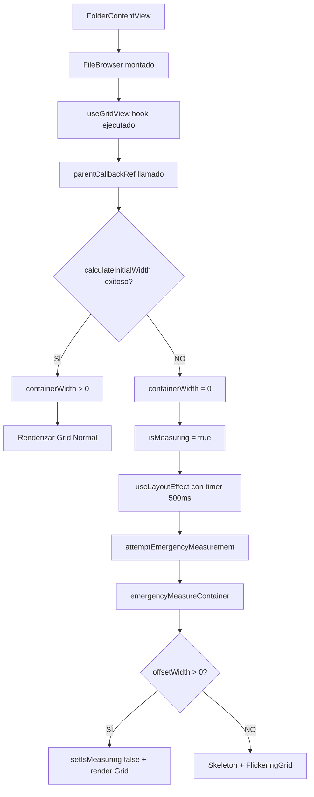

# 🔍 FileBrowser Debugging - Estado Actual

## 📊 PROBLEMA IDENTIFICADO

**Estado actual del error:**

```
[WARN] [FileBrowserGrid] ⚠️ containerWidth inválido, omitiendo carga de miniaturas.
[INFO] [FolderContentView] 📊 Datos de la primera imagen: {id: 'cmbs7xbuq000i931s8othfjei', name: 'another.simpsons.picture.show-04022021-0001.jpg', type: 'image'}
[INFO] [FileBrowserGrid] 🔍 FileBrowser recibió 63 items
```

El FileBrowser **recibe correctamente 63 items** pero **no puede calcular containerWidth**, por lo que se queda bloqueado.

## 🔧 DEBUGGING AÑADIDO

### 1. **Logging Mejorado en FileBrowser** ✅

```typescript
// Debug: Mostrar cambios en containerWidth e isMeasuring
useEffect(() => {
    gridLogger.debug(`🔧 Estado actualizado - containerWidth: ${containerWidth}, isMeasuring: ${isMeasuring}`);
}, [containerWidth, isMeasuring]);

// Debug: useLayoutEffect
useLayoutEffect(() => {
    gridLogger.debug(`🔧 useLayoutEffect ejecutado - containerWidth: ${containerWidth}, isMeasuring: ${isMeasuring}`);

    const emergencyTimer = setTimeout(() => {
        gridLogger.warn(`⏰ Timer de emergencia activado - containerWidth: ${containerWidth}, parentRef.current: ${!!parentRef.current}`);

        if ((!containerWidth || containerWidth <= 0) && parentRef.current) {
            gridLogger.warn('🚨 Activando sistema de medición de emergencia');
            attemptEmergencyMeasurement(parentRef.current);
        } else {
            gridLogger.debug('✅ No se necesita sistema de emergencia');
        }
    }, 500);

    // ... cleanup
}, [containerWidth, attemptEmergencyMeasurement, parentRef, isMeasuring]);

// Debug: Fallback visual
if ((isMeasuring && measurementAttemptsRef.current < MAX_MEASUREMENT_ATTEMPTS) ||
    !containerWidth || Number.isNaN(containerWidth) || containerWidth <= 0) {

    gridLogger.warn('🚨 DEBUGGING - Activando fallback visual:', {
        isMeasuring,
        measurementAttempts: measurementAttemptsRef.current,
        maxAttempts: MAX_MEASUREMENT_ATTEMPTS,
        containerWidth,
        isNaN: Number.isNaN(containerWidth)
    });

    // ... render Skeleton
}
```

### 2. **Logging Mejorado en useGridView** ✅

El hook `useGridView` ya tiene logging detallado:

```typescript
// Cálculo agresivo del ancho inicial con múltiples estrategias
const calculateInitialWidth = (source: string) => {
    if (!node.parentElement || node.offsetWidth === 0) {
        console.warn(`[useGridView] calculateInitialWidth (${source}): Nodo no listo o sin dimensiones. offsetWidth: ${node.offsetWidth}, parentElement: ${!!node.parentElement}`);
        return false;
    }
    const width = node.offsetWidth;
    console.debug(`[useGridView] calculateInitialWidth (${source}): width = ${width}px`);
    if (width > 0) {
        setContainerWidth(width);
        return true;
    }
    return false;
};
```

## 🎯 FLUJO DE EJECUCIÓN ESPERADO



## 🔍 POSIBLES CAUSAS DEL PROBLEMA

### 1. **DOM no está listo**

- El contenedor padre no tiene dimensiones cuando se monta
- CSS aún no está aplicado
- Elemento tiene `display: none` o `visibility: hidden`

### 2. **Problema de timing**

- useGridView se ejecuta antes de que el DOM esté completamente renderizado
- ResizeObserver no detecta el elemento inicial
- RAF y setTimeout no son suficientes

### 3. **Problema de jerarquía DOM**

- El contenedor padre no está en el DOM
- Problema de CSS Grid/Flexbox en contenedores padre
- Overflow o positioning que impide el cálculo correcto

## 📋 PASOS PARA TESTING

### 1. **Verificar Logs en DevTools** 🔍

Cuando navegues a una carpeta, deberías ver en la consola:

```
[INFO] [FileBrowserGrid] 🔍 FileBrowser recibió 63 items
[DEBUG] [FileBrowserGrid] 🔧 Estado actualizado - containerWidth: 0, isMeasuring: true
[DEBUG] [FileBrowserGrid] 🔧 useLayoutEffect ejecutado - containerWidth: 0, isMeasuring: true
[WARN] [useGridView] calculateInitialWidth (immediate): Nodo no listo o sin dimensiones. offsetWidth: 0, parentElement: true
[WARN] [useGridView] calculateInitialWidth (RAF): Nodo no listo o sin dimensiones. offsetWidth: 0, parentElement: true
[WARN] [useGridView] calculateInitialWidth (setTimeout): Nodo no listo o sin dimensiones. offsetWidth: 0, parentElement: true
[WARN] [FileBrowserGrid] ⏰ Timer de emergencia activado - containerWidth: 0, parentRef.current: true
[WARN] [FileBrowserGrid] 🚨 Activando sistema de medición de emergencia
[DEBUG] [FileBrowserGrid] Intento-1: offsetWidth=0, boundingWidth=0
[DEBUG] [FileBrowserGrid] Intento-2: offsetWidth=0, boundingWidth=0
...
[WARN] [FileBrowserGrid] 🚨 DEBUGGING - Activando fallback visual: {isMeasuring: true, measurementAttempts: 5, ...}
```

### 2. **Verificar Renderizado** 👀

Si el debugging funciona correctamente, deberías ver:

- **Skeleton animado** con grid parpadeante
- **Información de debug** en la parte inferior
- **Botón "Reintentar cálculo"** si falla el sistema de emergencia

### 3. **Inspeccionar DOM** 🔍

En DevTools Elements:

1. Buscar el contenedor del FileBrowser
2. Verificar que tenga `offsetWidth > 0`
3. Revisar CSS aplicado (Flexbox, Grid, etc.)
4. Comprobar jerarquía de contenedores padre

## 🚀 TESTING

Para probar las mejoras:

```powershell
# En PowerShell
.\start-dev.ps1

# O manualmente:
cd "d:\DEV\image-manager"
pnpm dev
```

Luego navega: **Navigation Panel** → **Folders View** → **Seleccionar carpeta** → **Ver FileBrowser**

---

> **Siguiente paso:** Probar en desarrollo y revisar logs de consola para identificar exactamente dónde falla el cálculo del containerWidth.
