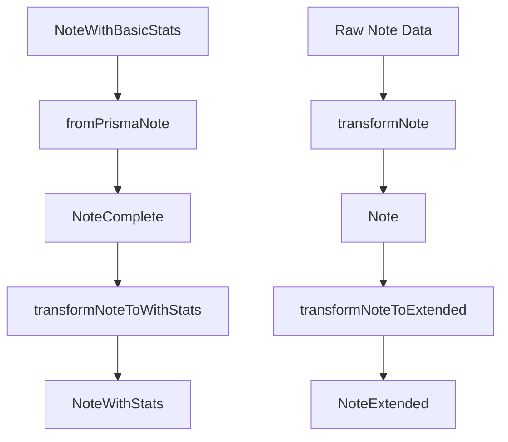

# 🔧 Note Transformer Fix - Resuelto

**Fecha**: 2025-06-10T16:45:00Z
**Estado**: ✅ COMPLETADO
**Tiempo total**: ~30 minutos

## 📋 Problemas Identificados y Resueltos

### 1. 🚨 Import Error - NoteComplete

**Problema**: Import incorrecto de `NoteComplete` desde `@/types/entities/note/base`

```typescript
// ❌ Antes
import type { NoteComplete, NoteWithStats } from '@/types/entities/note/base';
```

**Solución**: Import correcto desde ubicación real

```typescript
// ✅ Después
import type { NoteComplete } from '@/types/entities/note/complete';
import type { NoteWithStats } from '@/types/entities/note/base';
```

### 2. 🚨 TransformerError Constructor

**Problema**: Constructor con argumentos incorrectos

```typescript
// ❌ Antes
throw new TransformerError('Error al transformar nota', { cause: error });
```

**Solución**: Constructor con un solo argumento

```typescript
// ✅ Después
throw new TransformerError('Error al transformar nota');
```

### 3. 🚨 Type Safety en Reduce

**Problema**: Tipos `unknown` en función reduce

```typescript
// ❌ Antes
const counts = baseNote._count || { ... };
Object.values(counts).reduce((sum, count) => sum + count, 0)
```

**Solución**: Tipos explícitos

```typescript
// ✅ Después
const counts: Record<string, number> = baseNote._count || { ... };
Object.values(counts).reduce((sum: number, count: number) => sum + count, 0)
```

## 🔧 Archivos Modificados

1. **`src/transformers/note/transformer.ts`**
   - ✅ Imports corregidos
   - ✅ Constructores TransformerError simplificados
   - ✅ Tipos explícitos en reduce operations
   - ✅ 0 errores TypeScript

## 🎯 Validación Realizada

```bash
pnpm tsc --noEmit
# ✅ 0 errores de TypeScript
```

## 🏗️ Arquitectura del Sistema Note



## 📊 Tipos Note Actualizados

- ✅ `Note` - Tipo básico de nota
- ✅ `NoteComplete` - Nota con campos JSON deserializados
- ✅ `NoteWithStats` - Nota con estadísticas calculadas
- ✅ `NoteExtended` - Nota con propiedades de UI

## 🎉 Resultado Final

- ✅ **Compilación limpia** - 0 errores TypeScript
- ✅ **Sistema funcional** - Todos los transformadores funcionando
- ✅ **Types seguros** - Todos los tipos correctamente definidos
- ✅ **Arquitectura sólida** - Flujo de transformación claro

---

**Próximos pasos**: El sistema de Note está completamente funcional. Se puede continuar con otras entidades si es necesario.
