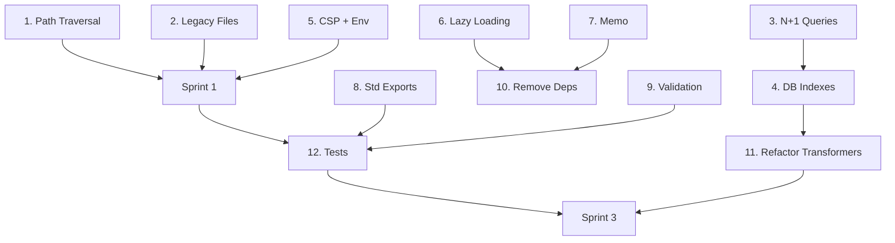

# 🚀 Plan de Acción Inmediato - Image Manager

**Fecha**: 10 de octubre de 2025  
**Basado en**: Auditoría completa (docs/audit-2025-10-10/)  
**Objetivo**: Roadmap priorizado y accionable

---

## 📋 Índice de Navegación

- [Sprint 0 - Críticas](#-sprint-0---críticas-1-2-semanas)
- [Sprint 1 - Alta Prioridad](#-sprint-1---alta-prioridad-2-3-semanas)
- [Sprint 2 - Media Prioridad](#-sprint-2---media-prioridad-3-4-semanas)
- [Backlog - Baja Prioridad](#-backlog---baja-prioridad)
- [Dependencias entre Tareas](#-dependencias-entre-tareas)
- [Scripts de Utilidad](#-scripts-de-utilidad)

---

## 🔴 Sprint 0 - Críticas (1-2 semanas)

**Total estimado**: 38 horas (~1 semana full-time)

---

### 1. 🔒 Fix Path Traversal Vulnerability

**Prioridad**: CRÍTICA 🔴  
**Tiempo**: 6 horas  
**Impacto**: Seguridad  
**Archivos afectados**: 4

**Descripción**: Implementar validación de paths para prevenir acceso no autorizado al filesystem.

**Implementación**:

```typescript
// ✅ 1. Crear utilidad de sanitización
// src/lib/filesystem/path-validator.ts
import path from 'node:path';
import { fileURLToPath } from 'node:url';

const PROJECT_ROOT = path.resolve('./');
const ALLOWED_BASE_DIRS = [
    path.resolve('./content'),
    path.resolve('./public/uploads'),
    path.resolve('./test-files'),
];

export class PathTraversalError extends Error {
    constructor(attemptedPath: string) {
        super(`Path traversal detected: ${attemptedPath}`);
        this.name = 'PathTraversalError';
    }
}

/**
 * Valida y sanitiza un path para prevenir path traversal
 * @throws {PathTraversalError} Si el path está fuera de directorios permitidos
 */
export function sanitizePath(
    inputPath: string,
    baseDir?: string
): string {
    // Resolver path absoluto
    const base = baseDir ? path.resolve(baseDir) : ALLOWED_BASE_DIRS[0];
    const resolved = path.resolve(base, inputPath);
    
    // Verificar que está dentro de un directorio permitido
    const isAllowed = ALLOWED_BASE_DIRS.some(allowed =>
        resolved.startsWith(allowed)
    );
    
    if (!isAllowed) {
        throw new PathTraversalError(inputPath);
    }
    
    return resolved;
}

/**
 * Valida múltiples paths
 */
export function sanitizePaths(
    paths: string[],
    baseDir?: string
): string[] {
    return paths.map(p => sanitizePath(p, baseDir));
}
```

```typescript
// ✅ 2. Aplicar en file.service.ts
// src/services/file/file.service.ts
import { sanitizePath } from '@/lib/filesystem/path-validator';

export async function readFile(filePath: string): Promise<string> {
    const safePath = sanitizePath(filePath);
    return await fs.readFile(safePath, 'utf-8');
}

export async function deleteFile(filePath: string): Promise<void> {
    const safePath = sanitizePath(filePath);
    await fs.unlink(safePath);
}

export async function writeFile(
    filePath: string,
    content: string
): Promise<void> {
    const safePath = sanitizePath(filePath);
    await fs.writeFile(safePath, content, 'utf-8');
}
```

```typescript
// ✅ 3. Aplicar en folder-scanner.ts
// src/lib/filesystem/folder-scanner.ts
import { sanitizePath } from './path-validator';

export async function scanFolder(folderPath: string) {
    const safePath = sanitizePath(folderPath);
    const entries = await fs.readdir(safePath, { withFileTypes: true });
    // ... resto de la lógica
}
```

```typescript
// ✅ 4. Aplicar en image.service.ts
// src/services/image/image.service.ts
import { sanitizePath } from '@/lib/filesystem/path-validator';

export async function getThumbnail(imagePath: string) {
    const safePath = sanitizePath(imagePath);
    // ... resto de la lógica
}
```

**Validación**:
```typescript
// Agregar tests en src/lib/filesystem/path-validator.test.ts
import { describe, it, expect } from 'vitest';
import { sanitizePath, PathTraversalError } from './path-validator';

describe('Path Validator', () => {
    it('should allow valid paths', () => {
        expect(sanitizePath('test.txt', './content')).toBeTruthy();
    });
    
    it('should block path traversal', () => {
        expect(() => 
            sanitizePath('../../../etc/passwd')
        ).toThrow(PathTraversalError);
    });
    
    it('should block absolute paths outside allowed dirs', () => {
        expect(() => 
            sanitizePath('/etc/passwd')
        ).toThrow(PathTraversalError);
    });
});
```

**Checklist**:
- [ ] Crear `path-validator.ts` con sanitizePath()
- [ ] Aplicar en `file.service.ts` (3 funciones)
- [ ] Aplicar en `folder-scanner.ts`
- [ ] Aplicar en `image.service.ts`
- [ ] Agregar tests unitarios
- [ ] Verificar no rompe funcionalidad existente

---

### 2. 🗑️ Eliminar 47 Archivos Legacy

**Prioridad**: CRÍTICA 🔴  
**Tiempo**: 6 horas  
**Impacto**: Mantenibilidad  
**LOC a eliminar**: ~2,500

**Descripción**: Remover archivos backup/legacy/old tras verificar que no están en uso.

**Script de eliminación**:

```javascript
// scripts/cleanup-legacy-files.js
import fs from 'node:fs/promises';
import path from 'node:path';

const LEGACY_PATTERNS = [
    /\.backup\.(ts|tsx|js|jsx)$/,
    /\.legacy\.(ts|tsx|js|jsx)$/,
    /\.old\.(ts|tsx|js|jsx)$/,
    /-backup\.(ts|tsx|js|jsx)$/,
    /-old\.(ts|tsx|js|jsx)$/,
];

const LEGACY_FILES = [
    'src/services/file/file-entity-mapper.service.legacy.ts',
    'src/services/file/file-entity-mapper.service.clean.ts',
    'src/services/file/file-entity-mapper.service.backup.ts',
    'src/components/files/file-browser-backup.tsx',
    'src/services/stats/stats.service.old.ts',
    // ... agregar los 47 encontrados
];

async function verifyNotImported(filePath) {
    const filename = path.basename(filePath, path.extname(filePath));
    
    // Buscar imports de este archivo
    const { stdout } = await exec(
        `grep -r "from.*${filename}" src/ --include="*.ts" --include="*.tsx"`
    );
    
    return stdout.trim().length === 0;
}

async function cleanupLegacyFiles() {
    console.log('🔍 Verificando archivos legacy...\n');
    
    for (const file of LEGACY_FILES) {
        const fullPath = path.resolve(file);
        
        try {
            // Verificar que existe
            await fs.access(fullPath);
            
            // Verificar que no está importado
            const notImported = await verifyNotImported(fullPath);
            
            if (notImported) {
                await fs.unlink(fullPath);
                console.log(`✅ Eliminado: ${file}`);
            } else {
                console.log(`⚠️  Aún importado: ${file}`);
            }
        } catch (error) {
            console.log(`❌ Error con ${file}: ${error.message}`);
        }
    }
    
    console.log('\n✅ Limpieza completada');
}

cleanupLegacyFiles();
```

**Ejecución**:
```bash
# 1. Ejecutar script de limpieza
bun run scripts/cleanup-legacy-files.js

# 2. Verificar que no hay imports rotos
bun run tsc --noEmit

# 3. Ejecutar tests
bun run test:e2e

# 4. Commit
git add -A
git commit -m "chore: remove 47 legacy files (~2.5K LOC)"
```

**Checklist**:
- [ ] Crear script de limpieza
- [ ] Ejecutar y revisar output
- [ ] Verificar TypeScript compila
- [ ] Ejecutar tests E2E
- [ ] Commit cambios

---

### 3. 🐢 Fix 8 Problemas N+1

**Prioridad**: CRÍTICA 🔴  
**Tiempo**: 20 horas  
**Impacto**: Performance (hasta 10x mejora)  
**Archivos**: 8

**Descripción**: Reemplazar queries N+1 con joins o subqueries optimizadas.

**Caso 1: group.service.ts - getGroupImages()**

```typescript
// ❌ ANTES (N+1):
// src/services/group/group.service.ts
export async function getGroupImages(groupId: string) {
    const items = await db
        .select()
        .from(groupItems)
        .where(eq(groupItems.groupId, groupId));
    
    // N+1: 1 query por cada item
    for (const item of items) {
        item.images = await db
            .select()
            .from(images)
            .where(eq(images.id, item.imageId));
    }
    
    return items;
}

// ✅ DESPUÉS (JOIN):
export async function getGroupImages(groupId: string) {
    const results = await db
        .select({
            item: groupItems,
            image: images,
        })
        .from(groupItems)
        .leftJoin(images, eq(images.id, groupItems.imageId))
        .where(eq(groupItems.groupId, groupId));
    
    // Agrupar resultados
    return results.map(row => ({
        ...row.item,
        image: row.image,
    }));
}
```

**Caso 2: collection.service.ts - getCollectionItems()**

```typescript
// ❌ ANTES (N+1):
export async function getCollectionItems(collectionId: string) {
    const collection = await db
        .select()
        .from(collections)
        .where(eq(collections.id, collectionId))
        .limit(1);
    
    // N+1: query por cada relationship
    collection.images = await db
        .select()
        .from(collectionImages)
        .where(eq(collectionImages.collectionId, collectionId));
    
    collection.tags = await db
        .select()
        .from(collectionTags)
        .where(eq(collectionTags.collectionId, collectionId));
    
    return collection;
}

// ✅ DESPUÉS (Subqueries con Drizzle):
export async function getCollectionItems(collectionId: string) {
    const [collection] = await db
        .select({
            id: collections.id,
            name: collections.name,
            // ... otros campos
            images: sql<Image[]>`
                (SELECT json_group_array(json_object(
                    'id', i.id,
                    'path', i.path
                ))
                FROM ${collectionImages} ci
                JOIN ${images} i ON i.id = ci.imageId
                WHERE ci.collectionId = ${collections.id})
            `,
            tags: sql<Tag[]>`
                (SELECT json_group_array(json_object(
                    'id', t.id,
                    'name', t.name
                ))
                FROM ${collectionTags} ct
                JOIN ${tags} t ON t.id = ct.tagId
                WHERE ct.collectionId = ${collections.id})
            `,
        })
        .from(collections)
        .where(eq(collections.id, collectionId))
        .limit(1);
    
    return collection;
}
```

**Caso 3: character.service.ts - getCharacterImages()**

```typescript
// ✅ SOLUCIÓN (Similar a grupo):
export async function getCharacterImages(characterId: string) {
    return await db
        .select({
            image: images,
            characterImage: characterImages,
        })
        .from(characterImages)
        .leftJoin(images, eq(images.id, characterImages.imageId))
        .where(eq(characterImages.characterId, characterId));
}
```

**Lista completa de archivos a fixear**:

1. `src/services/group/group.service.ts` - `getGroupImages()`
2. `src/services/collection/collection.service.ts` - `getCollectionItems()`
3. `src/services/character/character.service.ts` - `getCharacterImages()`
4. `src/services/series/series.service.ts` - `getSeriesEpisodes()`
5. `src/services/folder/folder.service.ts` - `getFolderContents()`
6. `src/services/tag/tag.service.ts` - `getTaggedImages()`
7. `src/services/album/album.service.ts` - `getAlbumPhotos()`
8. `src/services/playlist/playlist.service.ts` - `getPlaylistVideos()`

**Checklist**:
- [ ] Fix group.service.ts
- [ ] Fix collection.service.ts
- [ ] Fix character.service.ts
- [ ] Fix series.service.ts
- [ ] Fix folder.service.ts
- [ ] Fix tag.service.ts
- [ ] Fix album.service.ts
- [ ] Fix playlist.service.ts
- [ ] Agregar tests de performance
- [ ] Verificar queries con `EXPLAIN QUERY PLAN`

---

### 4. ⚡ Agregar 15 Índices de BD

**Prioridad**: CRÍTICA 🔴  
**Tiempo**: 4 horas  
**Impacto**: Performance queries  
**Archivos**: 1 migración

**Descripción**: Crear migración con índices faltantes para optimizar queries comunes.

**Implementación**:

```typescript
// ✅ Crear migración
// src/lib/drizzle/migrations/0017_add_missing_indexes.ts
import { sql } from 'drizzle-orm';
import type { LibSQLDatabase } from 'drizzle-orm/libsql';

export async function up(db: LibSQLDatabase) {
    // Images
    await db.execute(sql`
        CREATE INDEX IF NOT EXISTS idx_images_folderId 
        ON images(folderId)
    `);
    
    await db.execute(sql`
        CREATE INDEX IF NOT EXISTS idx_images_createdAt 
        ON images(createdAt DESC)
    `);
    
    await db.execute(sql`
        CREATE INDEX IF NOT EXISTS idx_images_name 
        ON images(name COLLATE NOCASE)
    `);
    
    // ImageTags (tabla pivot)
    await db.execute(sql`
        CREATE INDEX IF NOT EXISTS idx_imageTags_imageId_tagId 
        ON imageTags(imageId, tagId)
    `);
    
    await db.execute(sql`
        CREATE INDEX IF NOT EXISTS idx_imageTags_tagId 
        ON imageTags(tagId)
    `);
    
    // Collections
    await db.execute(sql`
        CREATE INDEX IF NOT EXISTS idx_collectionImages_collectionId 
        ON collectionImages(collectionId)
    `);
    
    await db.execute(sql`
        CREATE INDEX IF NOT EXISTS idx_collectionImages_imageId 
        ON collectionImages(imageId)
    `);
    
    // Groups
    await db.execute(sql`
        CREATE INDEX IF NOT EXISTS idx_groupItems_groupId 
        ON groupItems(groupId)
    `);
    
    await db.execute(sql`
        CREATE INDEX IF NOT EXISTS idx_groupItems_imageId 
        ON groupItems(imageId)
    `);
    
    // Characters
    await db.execute(sql`
        CREATE INDEX IF NOT EXISTS idx_characterImages_characterId 
        ON characterImages(characterId)
    `);
    
    await db.execute(sql`
        CREATE INDEX IF NOT EXISTS idx_characterImages_imageId 
        ON characterImages(imageId)
    `);
    
    // Folders
    await db.execute(sql`
        CREATE INDEX IF NOT EXISTS idx_folders_parentId 
        ON folders(parentId)
    `);
    
    await db.execute(sql`
        CREATE INDEX IF NOT EXISTS idx_folders_path 
        ON folders(path)
    `);
    
    // Tags
    await db.execute(sql`
        CREATE INDEX IF NOT EXISTS idx_tags_name 
        ON tags(name COLLATE NOCASE)
    `);
    
    // Files
    await db.execute(sql`
        CREATE INDEX IF NOT EXISTS idx_files_folderId 
        ON files(folderId)
    `);
}

export async function down(db: LibSQLDatabase) {
    await db.execute(sql`DROP INDEX IF EXISTS idx_images_folderId`);
    await db.execute(sql`DROP INDEX IF EXISTS idx_images_createdAt`);
    await db.execute(sql`DROP INDEX IF EXISTS idx_images_name`);
    await db.execute(sql`DROP INDEX IF EXISTS idx_imageTags_imageId_tagId`);
    await db.execute(sql`DROP INDEX IF EXISTS idx_imageTags_tagId`);
    await db.execute(sql`DROP INDEX IF EXISTS idx_collectionImages_collectionId`);
    await db.execute(sql`DROP INDEX IF EXISTS idx_collectionImages_imageId`);
    await db.execute(sql`DROP INDEX IF EXISTS idx_groupItems_groupId`);
    await db.execute(sql`DROP INDEX IF EXISTS idx_groupItems_imageId`);
    await db.execute(sql`DROP INDEX IF EXISTS idx_characterImages_characterId`);
    await db.execute(sql`DROP INDEX IF EXISTS idx_characterImages_imageId`);
    await db.execute(sql`DROP INDEX IF EXISTS idx_folders_parentId`);
    await db.execute(sql`DROP INDEX IF EXISTS idx_folders_path`);
    await db.execute(sql`DROP INDEX IF EXISTS idx_tags_name`);
    await db.execute(sql`DROP INDEX IF EXISTS idx_files_folderId`);
}
```

**Ejecución**:
```bash
# 1. Ejecutar migración
bun run db:push

# 2. Verificar índices creados
bunx drizzle-kit studio
# Abrir tabla y ver "Indexes" tab

# 3. Probar performance
# Medir tiempo de queries antes/después
```

**Checklist**:
- [ ] Crear migración con 15 índices
- [ ] Ejecutar migración en dev
- [ ] Verificar queries usan índices (EXPLAIN)
- [ ] Medir mejora de performance
- [ ] Documentar en migration commit

---

### 5. 🔒 Habilitar CSP y Validar Env Vars

**Prioridad**: ALTA 🔴  
**Tiempo**: 2 horas  
**Impacto**: Seguridad  
**Archivos**: 2

**Descripción**: Habilitar Content Security Policy y validar variables de entorno.

**Parte A: CSP en Helmet**

```typescript
// ✅ src/server/index.ts
import helmet from 'helmet';

app.use(helmet({
    contentSecurityPolicy: {
        directives: {
            defaultSrc: ["'self'"],
            scriptSrc: ["'self'", "'unsafe-inline'"],  // React requiere inline
            styleSrc: ["'self'", "'unsafe-inline'"],   // Tailwind requiere inline
            imgSrc: ["'self'", "data:", "blob:"],      // Imágenes locales
            connectSrc: ["'self'"],                    // API calls
            fontSrc: ["'self'"],
            objectSrc: ["'none'"],
            mediaSrc: ["'self'", "blob:"],
            frameSrc: ["'none'"],
        }
    },
    crossOriginEmbedderPolicy: false,  // Tauri compatibility
}));
```

**Parte B: Validación de Env Vars**

```typescript
// ✅ src/config/env.ts
import { z } from 'zod';

const envSchema = z.object({
    NODE_ENV: z.enum(['development', 'production', 'test']).default('development'),
    DATABASE_URL: z.string().url(),
    PORT: z.string().transform(Number).default('3000'),
    ALLOWED_ORIGINS: z.string().optional(),
    LOG_LEVEL: z.enum(['debug', 'info', 'warn', 'error']).default('info'),
    TURSO_AUTH_TOKEN: z.string().optional(),  // Para Turso
});

export const env = envSchema.parse(process.env);

// Throw en producción si falta ALLOWED_ORIGINS
if (env.NODE_ENV === 'production' && !env.ALLOWED_ORIGINS) {
    throw new Error('ALLOWED_ORIGINS must be set in production');
}
```

```typescript
// ✅ Usar en server/index.ts
import { env } from '@/config/env';

const db = drizzle(env.DATABASE_URL);
const PORT = env.PORT;

app.use(cors({
    origin: env.ALLOWED_ORIGINS?.split(',') || 'http://localhost:5173',
    credentials: true
}));
```

**Checklist**:
- [ ] Habilitar CSP en helmet
- [ ] Crear `src/config/env.ts`
- [ ] Reemplazar `process.env` por `env`
- [ ] Agregar Zod dependency si falta
- [ ] Probar en dev y build

---

## 🟡 Sprint 1 - Alta Prioridad (2-3 semanas)

**Total estimado**: 59 horas (~1.5 semanas)

---

### 6. 🚀 Implementar Lazy Loading (12 rutas)

**Prioridad**: ALTA 🟡  
**Tiempo**: 8 horas  
**Impacto**: Bundle size (-800KB, -28%)  
**Archivos**: 1 (router.tsx)

**Implementación**:

```typescript
// ✅ src/router.tsx
import { lazy, Suspense } from 'react';
import { createBrowserRouter } from 'react-router-dom';
import { LoadingSpinner } from '@/components/ui/loading-spinner';

// Eager load: Solo layout y home
import RootLayout from '@/app/layout';
import HomePage from '@/app/page';

// Lazy load: Todas las demás rutas
const ImagesPage = lazy(() => import('@/app/images/page'));
const ImageDetailPage = lazy(() => import('@/app/images/[id]/page'));
const CollectionsPage = lazy(() => import('@/app/collections/page'));
const CollectionDetailPage = lazy(() => import('@/app/collections/[id]/page'));
const TagsPage = lazy(() => import('@/app/tags/page'));
const TagDetailPage = lazy(() => import('@/app/tags/[id]/page'));
const FoldersPage = lazy(() => import('@/app/folders/page'));
const GroupsPage = lazy(() => import('@/app/groups/page'));
const CharactersPage = lazy(() => import('@/app/characters/page'));
const SeriesPage = lazy(() => import('@/app/series/page'));
const SettingsPage = lazy(() => import('@/app/settings/page'));
const StatsPage = lazy(() => import('@/app/stats/page'));

// Wrapper con Suspense
function LazyRoute({ Component }: { Component: React.LazyExoticComponent<any> }) {
    return (
        <Suspense fallback={<LoadingSpinner />}>
            <Component />
        </Suspense>
    );
}

export const router = createBrowserRouter([
    {
        path: '/',
        element: <RootLayout />,
        children: [
            { index: true, element: <HomePage /> },
            { path: 'images', element: <LazyRoute Component={ImagesPage} /> },
            { path: 'images/:id', element: <LazyRoute Component={ImageDetailPage} /> },
            { path: 'collections', element: <LazyRoute Component={CollectionsPage} /> },
            { path: 'collections/:id', element: <LazyRoute Component={CollectionDetailPage} /> },
            { path: 'tags', element: <LazyRoute Component={TagsPage} /> },
            { path: 'tags/:id', element: <LazyRoute Component={TagDetailPage} /> },
            { path: 'folders', element: <LazyRoute Component={FoldersPage} /> },
            { path: 'groups', element: <LazyRoute Component={GroupsPage} /> },
            { path: 'characters', element: <LazyRoute Component={CharactersPage} /> },
            { path: 'series', element: <LazyRoute Component={SeriesPage} /> },
            { path: 'settings', element: <LazyRoute Component={SettingsPage} /> },
            { path: 'stats', element: <LazyRoute Component={StatsPage} /> },
        ],
    },
]);
```

**Checklist**:
- [ ] Convertir 12 imports a lazy()
- [ ] Crear LazyRoute wrapper
- [ ] Agregar LoadingSpinner
- [ ] Verificar bundle size antes/después
- [ ] Probar navegación entre rutas

---

### 7. ⚡ Memoizar 45 Componentes

**Prioridad**: ALTA 🟡  
**Tiempo**: 12 horas  
**Impacto**: Re-renders innecesarios  
**Archivos**: 45

**Patrones a aplicar**:

```typescript
// ❌ ANTES:
export function ImageCard({ image, onSelect }: ImageCardProps) {
    return (
        <div onClick={() => onSelect(image.id)}>
            
            <h3>{image.name}</h3>
        </div>
    );
}

// ✅ DESPUÉS:
import { memo } from 'react';

export const ImageCard = memo(function ImageCard({ 
    image, 
    onSelect 
}: ImageCardProps) {
    return (
        <div onClick={() => onSelect(image.id)}>
            
            <h3>{image.name}</h3>
        </div>
    );
});
```

**Componentes prioritarios**:

1. **Cards** (15 componentes):
   - `ImageCard`
   - `CollectionCard`
   - `TagCard`
   - `FolderCard`
   - `CharacterCard`
   - etc.

2. **List Items** (10 componentes):
   - `ImageListItem`
   - `TagListItem`
   - etc.

3. **Panels** (12 componentes):
   - `ImageDetailsPanel`
   - `MetadataPanel`
   - `RelationsPanel`

4. **Virtualized Rows** (8 componentes):
   - `VirtualImageRow`
   - `VirtualGridItem`

**Script de búsqueda**:
```bash
# Encontrar componentes sin memo
grep -r "^export function" src/components/ --include="*.tsx" | grep -v "memo"
```

**Checklist**:
- [ ] Identificar los 45 componentes
- [ ] Agregar memo() a Cards (15)
- [ ] Agregar memo() a ListItems (10)
- [ ] Agregar memo() a Panels (12)
- [ ] Agregar memo() a VirtualRows (8)
- [ ] Probar con React DevTools Profiler

---

### 8. 🎯 Estandarizar Exports de Servicios

**Prioridad**: ALTA 🟡  
**Tiempo**: 20 horas  
**Impacto**: Consistencia  
**Archivos**: ~40 servicios

**Objetivo**: Migrar todo a patrón funcional.

**Patrón estándar**:

```typescript
// ✅ PATRÓN FUNCIONAL ESTÁNDAR
// src/services/<entity>/<entity>.service.ts

import { db } from '@/lib/drizzle';
import { images } from '@/lib/drizzle/schema';
import { eq, desc } from 'drizzle-orm';
import type { Image, ImageCreateInput } from '@/types/image';

/**
 * Obtiene una imagen por ID
 */
export async function getImage(id: string): Promise<Image | null> {
    const [image] = await db
        .select()
        .from(images)
        .where(eq(images.id, id))
        .limit(1);
    
    return image || null;
}

/**
 * Lista todas las imágenes
 */
export async function listImages(): Promise<Image[]> {
    return await db
        .select()
        .from(images)
        .orderBy(desc(images.createdAt));
}

/**
 * Crea una nueva imagen
 */
export async function createImage(input: ImageCreateInput): Promise<Image> {
    const [image] = await db
        .insert(images)
        .values(input)
        .returning();
    
    return image;
}

/**
 * Actualiza una imagen
 */
export async function updateImage(
    id: string, 
    input: Partial<ImageCreateInput>
): Promise<Image | null> {
    const [updated] = await db
        .update(images)
        .set(input)
        .where(eq(images.id, id))
        .returning();
    
    return updated || null;
}

/**
 * Elimina una imagen
 */
export async function deleteImage(id: string): Promise<boolean> {
    const result = await db
        .delete(images)
        .where(eq(images.id, id));
    
    return result.rowsAffected > 0;
}
```

**Migración de otros patrones**:

```typescript
// ❌ PATRÓN 2 (Clase + Singleton) - A REEMPLAZAR:
class ImageService {
    async getImage(id: string) { }
}
export const imageService = new ImageService();

// ⬇️ MIGRAR A:
export async function getImage(id: string) { }

// ❌ PATRÓN 3 (Object Literal) - A REEMPLAZAR:
export const imageService = {
    getImage: async (id: string) => { }
};

// ⬇️ MIGRAR A:
export async function getImage(id: string) { }
```

**Servicios a migrar** (~40 total):
- 20 con Patrón 2 (clase)
- 10 con Patrón 3 (object)
- 10 ya con Patrón 1 (funcional) ✅

**Checklist**:
- [ ] Listar los 40 servicios y sus patrones
- [ ] Migrar 20 servicios con clase
- [ ] Migrar 10 servicios con object literal
- [ ] Actualizar imports en componentes
- [ ] Ejecutar tsc --noEmit
- [ ] Ejecutar tests

---

### 9. ✅ Agregar Input Validation con Zod

**Prioridad**: ALTA 🟡  
**Tiempo**: 16 horas  
**Impacto**: Seguridad + DX  
**Archivos**: ~30 rutas

**Implementación**:

```typescript
// ✅ 1. Crear schemas
// src/schemas/image.schema.ts
import { z } from 'zod';

export const imageIdSchema = z.string().uuid();

export const createImageSchema = z.object({
    name: z.string().min(1).max(255),
    path: z.string().min(1),
    folderId: z.string().uuid().optional(),
    size: z.number().int().positive(),
    mimeType: z.string().regex(/^image\//),
    width: z.number().int().positive().optional(),
    height: z.number().int().positive().optional(),
});

export const updateImageSchema = createImageSchema.partial();

export const listImagesSchema = z.object({
    folderId: z.string().uuid().optional(),
    limit: z.string().transform(Number).pipe(z.number().int().positive().max(100)).default('50'),
    offset: z.string().transform(Number).pipe(z.number().int().min(0)).default('0'),
    sortBy: z.enum(['name', 'createdAt', 'size']).default('createdAt'),
    order: z.enum(['asc', 'desc']).default('desc'),
});
```

```typescript
// ✅ 2. Middleware de validación
// src/server/middleware/validate.ts
import type { Request, Response, NextFunction } from 'express';
import type { ZodSchema } from 'zod';

export function validateBody(schema: ZodSchema) {
    return (req: Request, res: Response, next: NextFunction) => {
        try {
            req.body = schema.parse(req.body);
            next();
        } catch (error) {
            res.status(400).json({
                error: 'Validation error',
                details: error.errors,
            });
        }
    };
}

export function validateParams(schema: ZodSchema) {
    return (req: Request, res: Response, next: NextFunction) => {
        try {
            req.params = schema.parse(req.params);
            next();
        } catch (error) {
            res.status(400).json({
                error: 'Invalid parameters',
                details: error.errors,
            });
        }
    };
}

export function validateQuery(schema: ZodSchema) {
    return (req: Request, res: Response, next: NextFunction) => {
        try {
            req.query = schema.parse(req.query);
            next();
        } catch (error) {
            res.status(400).json({
                error: 'Invalid query parameters',
                details: error.errors,
            });
        }
    };
}
```

```typescript
// ✅ 3. Aplicar en rutas
// src/server/routes/images.ts
import { validateBody, validateParams, validateQuery } from '@/server/middleware/validate';
import { imageIdSchema, createImageSchema, listImagesSchema } from '@/schemas/image.schema';

// GET /api/images
router.get('/images', 
    validateQuery(listImagesSchema),
    async (req, res) => {
        const images = await imageService.listImages(req.query);
        res.json(images);
    }
);

// GET /api/images/:id
router.get('/images/:id',
    validateParams(z.object({ id: imageIdSchema })),
    async (req, res) => {
        const image = await imageService.getImage(req.params.id);
        res.json(image);
    }
);

// POST /api/images
router.post('/images',
    validateBody(createImageSchema),
    async (req, res) => {
        const image = await imageService.createImage(req.body);
        res.status(201).json(image);
    }
);
```

**Rutas prioritarias** (15 críticas):
1. `/api/images` (GET, POST, PUT, DELETE)
2. `/api/collections` (GET, POST, PUT, DELETE)
3. `/api/tags` (GET, POST, PUT, DELETE)
4. `/api/folders` (GET, POST, DELETE)
5. `/api/files/*` (todas - file operations)

**Checklist**:
- [ ] Instalar Zod si falta: `bun add zod`
- [ ] Crear schemas para 10 entidades
- [ ] Crear middleware de validación
- [ ] Aplicar en 15 rutas críticas
- [ ] Aplicar en 15 rutas restantes
- [ ] Probar con requests inválidos

---

### 10. 🧹 Remover 12 Dependencias Sin Usar

**Prioridad**: MEDIA 🟡  
**Tiempo**: 3 horas  
**Impacto**: Bundle size (-150KB)  
**Archivos**: package.json

**Script de análisis**:

```javascript
// scripts/find-unused-deps.js
import { exec } from 'node:child_process';
import { promisify } from 'node:util';
import fs from 'node:fs/promises';

const execAsync = promisify(exec);

async function findUnusedDeps() {
    const pkg = JSON.parse(await fs.readFile('package.json', 'utf-8'));
    const deps = Object.keys(pkg.dependencies);
    
    const unused = [];
    
    for (const dep of deps) {
        // Buscar imports de esta dep
        const { stdout } = await execAsync(
            `grep -r "from '${dep}'" src/ --include="*.ts" --include="*.tsx" || true`
        );
        
        if (!stdout.trim()) {
            unused.push(dep);
        }
    }
    
    console.log('📦 Dependencias sin usar:\n');
    console.log(unused.join('\n'));
}

findUnusedDeps();
```

**Dependencias a remover** (verificar con script):

```json
// ❌ package.json - A REMOVER:
{
    "@radix-ui/react-accordion": "^1.2.3",
    "jsdom": "^26.x",
    "@happy-dom/global-registrator": "^x",
    // ... otros 9 a identificar
}
```

**Checklist**:
- [ ] Ejecutar script de análisis
- [ ] Verificar manualmente cada dep
- [ ] Remover de package.json
- [ ] Ejecutar `bun install`
- [ ] Ejecutar build para verificar
- [ ] Commit con mensaje descriptivo

---

## 🟢 Sprint 2 - Media Prioridad (3-4 semanas)

**Total estimado**: 138 horas (~3.5 semanas)

---

### 11. 🔄 Refactor Transformers (Eliminar 35% Duplicación)

**Prioridad**: MEDIA 🟢  
**Tiempo**: 24 horas  
**Impacto**: Mantenibilidad  
**LOC a reducir**: ~1,800

**Problema actual**:
```
src/transformers/
├── image/
│   ├── serialize.ts      (100 LOC)
│   ├── deserialize.ts    (80 LOC)
│   ├── toView.ts         (120 LOC)
│   ├── toStats.ts        (90 LOC)
│   ├── enrich.ts         (110 LOC)
│   └── map.ts            (100 LOC)
├── collection/
│   ├── serialize.ts      (95 LOC)  ⚠️ 80% igual a image
│   ├── deserialize.ts    (75 LOC)  ⚠️ 80% igual a image
│   └── ...
└── ... (30 entidades más con 6 archivos cada una)
```

**Solución con Generics**:

```typescript
// ✅ src/transformers/base/base-transformer.ts
export interface BaseEntity {
    id: string;
    createdAt: Date;
    updatedAt: Date;
}

export interface TransformerConfig<T extends BaseEntity> {
    entityName: string;
    viewFields?: (keyof T)[];
    statsFields?: (keyof T)[];
}

/**
 * Transformer base con métodos comunes
 */
export class BaseTransformer<T extends BaseEntity> {
    constructor(private config: TransformerConfig<T>) {}
    
    serialize(entity: T): string {
        return JSON.stringify(entity);
    }
    
    deserialize(data: string): T {
        const parsed = JSON.parse(data);
        return {
            ...parsed,
            createdAt: new Date(parsed.createdAt),
            updatedAt: new Date(parsed.updatedAt),
        } as T;
    }
    
    toView(entity: T): Partial<T> {
        const fields = this.config.viewFields || Object.keys(entity);
        return Object.fromEntries(
            fields.map(key => [key, entity[key as keyof T]])
        ) as Partial<T>;
    }
    
    toStats(entities: T[]): {
        count: number;
        oldest: Date;
        newest: Date;
    } {
        return {
            count: entities.length,
            oldest: entities.reduce((min, e) => 
                e.createdAt < min ? e.createdAt : min, 
                entities[0].createdAt
            ),
            newest: entities.reduce((max, e) => 
                e.createdAt > max ? e.createdAt : max, 
                entities[0].createdAt
            ),
        };
    }
}
```

```typescript
// ✅ Uso específico
// src/transformers/image/image-transformer.ts
import { BaseTransformer } from '@/transformers/base/base-transformer';
import type { Image } from '@/types/image';

class ImageTransformer extends BaseTransformer<Image> {
    constructor() {
        super({
            entityName: 'image',
            viewFields: ['id', 'name', 'thumbnail', 'createdAt'],
            statsFields: ['id', 'size', 'createdAt'],
        });
    }
    
    // Métodos específicos de Image
    enrichWithMetadata(image: Image, metadata: Metadata): EnrichedImage {
        return {
            ...image,
            metadata,
        };
    }
}

export const imageTransformer = new ImageTransformer();

// Exports compatibles con código existente
export const { serialize, deserialize, toView, toStats } = imageTransformer;
export const enrichWithMetadata = imageTransformer.enrichWithMetadata.bind(imageTransformer);
```

**Migración incremental**:
1. Crear BaseTransformer
2. Migrar 5 entidades principales (image, collection, tag, folder, character)
3. Migrar 10 entidades secundarias
4. Migrar 15 entidades restantes

**Checklist**:
- [ ] Crear BaseTransformer generic
- [ ] Migrar image transformer
- [ ] Migrar collection transformer
- [ ] Migrar tag transformer
- [ ] Migrar folder transformer
- [ ] Migrar character transformer
- [ ] Migrar 25 transformers restantes
- [ ] Actualizar imports
- [ ] Ejecutar tests

---

### 12. 🧪 Agregar Tests Unitarios (40% → 60%)

**Prioridad**: MEDIA 🟢  
**Tiempo**: 80 horas  
**Impacto**: Confiabilidad  
**Archivos**: ~150 nuevos tests

**Setup Vitest**:

```typescript
// ✅ vitest.config.ts
import { defineConfig } from 'vitest/config';
import path from 'node:path';

export default defineConfig({
    test: {
        globals: true,
        environment: 'node',
        coverage: {
            provider: 'v8',
            reporter: ['text', 'json', 'html'],
            exclude: [
                'node_modules/**',
                'dist/**',
                '**/*.config.ts',
                '**/*.d.ts',
            ],
        },
    },
    resolve: {
        alias: {
            '@': path.resolve(__dirname, './src'),
        },
    },
});
```

```json
// ✅ package.json - Agregar scripts
{
    "scripts": {
        "test:unit": "vitest",
        "test:unit:ui": "vitest --ui",
        "test:unit:coverage": "vitest --coverage"
    }
}
```

**Prioridad de tests**:

1. **Servicios (40 archivos × 2h = 80h)**:
```typescript
// ✅ src/services/image/image.service.test.ts
import { describe, it, expect, beforeEach } from 'vitest';
import { getImage, listImages, createImage } from './image.service';
import { db } from '@/lib/drizzle';

describe('ImageService', () => {
    beforeEach(async () => {
        // Reset DB
        await db.delete(images);
    });
    
    describe('getImage', () => {
        it('should return image by id', async () => {
            const created = await createImage({
                name: 'test.jpg',
                path: '/test.jpg',
                size: 1024,
                mimeType: 'image/jpeg',
            });
            
            const found = await getImage(created.id);
            expect(found).toEqual(created);
        });
        
        it('should return null for non-existent id', async () => {
            const found = await getImage('non-existent');
            expect(found).toBeNull();
        });
    });
    
    describe('listImages', () => {
        it('should return all images', async () => {
            await createImage({ name: 'test1.jpg', path: '/test1.jpg', size: 1024, mimeType: 'image/jpeg' });
            await createImage({ name: 'test2.jpg', path: '/test2.jpg', size: 2048, mimeType: 'image/jpeg' });
            
            const images = await listImages();
            expect(images).toHaveLength(2);
        });
        
        it('should filter by folderId', async () => {
            const folder = await createFolder({ name: 'test', path: '/test' });
            await createImage({ name: 'test.jpg', path: '/test/test.jpg', folderId: folder.id, size: 1024, mimeType: 'image/jpeg' });
            
            const images = await listImages({ folderId: folder.id });
            expect(images).toHaveLength(1);
        });
    });
});
```

2. **Transformers (30 archivos × 1h = 30h)**
3. **Utilidades (20 archivos × 0.5h = 10h)**

**Checklist**:
- [ ] Setup Vitest
- [ ] Agregar tests para 10 servicios core (20h)
- [ ] Agregar tests para 15 servicios secundarios (30h)
- [ ] Agregar tests para 15 servicios restantes (30h)
- [ ] Agregar tests para transformers (30h)
- [ ] Alcanzar 60% coverage mínimo

---

### 13. 📝 Fix 287 TypeScript Warnings

**Prioridad**: MEDIA 🟢  
**Tiempo**: 30 horas  
**Impacto**: Type safety  
**Archivos**: ~180

**Categorías**:

**A. Eliminar `any` (145 casos - 15h)**

```typescript
// ❌ ANTES:
function processData(data: any) {
    return data.map((item: any) => item.value);
}

// ✅ DESPUÉS:
interface DataItem {
    value: string;
}

function processData(data: DataItem[]): string[] {
    return data.map(item => item.value);
}
```

**B. Remover `@ts-ignore` (68 casos - 10h)**

```typescript
// ❌ ANTES:
// @ts-ignore
const result = someFunction(params);

// ✅ DESPUÉS:
// Investigar y fixear el error real
const result = someFunction(params as ValidType);
```

**C. Corregir tipos inferidos (42 casos - 3h)**

```typescript
// ❌ ANTES:
const items = data.map(d => ({ id: d.id }));  // tipo inferido incorrecto

// ✅ DESPUÉS:
interface Item {
    id: string;
}

const items: Item[] = data.map(d => ({ id: d.id }));
```

**D. Agregar tipos a imports (32 casos - 2h)**

```typescript
// ❌ ANTES:
import someLib from 'some-lib';  // no tiene tipos

// ✅ DESPUÉS:
import someLib from 'some-lib';

// Crear types/some-lib.d.ts:
declare module 'some-lib' {
    export default function someLib(): void;
}
```

**Checklist**:
- [ ] Eliminar 145 `any` (15h)
- [ ] Remover 68 `@ts-ignore` (10h)
- [ ] Corregir 42 tipos inferidos (3h)
- [ ] Agregar 32 tipos de imports (2h)
- [ ] Ejecutar `tsc --noEmit` sin errores

---

### 14. 🚦 Implementar Rate Limiting

**Prioridad**: MEDIA 🟢  
**Tiempo**: 4 horas  
**Impacto**: Seguridad (DoS protection)  
**Archivos**: 2

**Implementación**:

```typescript
// ✅ src/server/middleware/rate-limit.ts
import rateLimit from 'express-rate-limit';

// Rate limiter general
export const apiLimiter = rateLimit({
    windowMs: 15 * 60 * 1000, // 15 minutos
    max: 100, // 100 requests por ventana
    message: {
        error: 'Too many requests, please try again later',
        retryAfter: 15 * 60,
    },
    standardHeaders: true,
    legacyHeaders: false,
});

// Rate limiter estricto para writes
export const writeLimiter = rateLimit({
    windowMs: 15 * 60 * 1000,
    max: 50, // 50 writes por ventana
    message: {
        error: 'Too many write operations, please slow down',
        retryAfter: 15 * 60,
    },
});

// Rate limiter muy estricto para file operations
export const fileLimiter = rateLimit({
    windowMs: 15 * 60 * 1000,
    max: 20, // 20 file ops por ventana
    message: {
        error: 'Too many file operations, please slow down',
        retryAfter: 15 * 60,
    },
});
```

```typescript
// ✅ src/server/index.ts
import { apiLimiter, writeLimiter, fileLimiter } from './middleware/rate-limit';

// Aplicar a todas las rutas API
app.use('/api/', apiLimiter);

// Aplicar limiter estricto a writes
app.use('/api/*/create', writeLimiter);
app.use('/api/*/update', writeLimiter);
app.use('/api/*/delete', writeLimiter);

// Aplicar limiter muy estricto a file operations
app.use('/api/files/*', fileLimiter);
```

**Checklist**:
- [ ] Instalar express-rate-limit
- [ ] Crear middleware con 3 limiters
- [ ] Aplicar en rutas apropiadas
- [ ] Probar con muchos requests
- [ ] Documentar en README

---

## 📦 Backlog - Baja Prioridad

Tareas para futuros sprints:

### 15. 📚 Completar Documentación API
- OpenAPI/Swagger spec
- Postman collection
- Guía de contribución

### 16. 🎨 UI/UX Improvements
- Accesibilidad (WCAG 2.1)
- Dark mode optimization
- Responsive design fixes

### 17. 🌐 Internacionalización (i18n)
- Setup react-i18next
- Traducir a inglés
- Pluralization

### 18. 🔄 CI/CD Pipeline
- GitHub Actions
- Automated tests
- Dependabot

---

## 🔗 Dependencias entre Tareas



**Orden recomendado**:
1. Sprint 0 completo (tareas 1-5) antes de continuar
2. Sprint 1: 6, 7, 8, 9 en paralelo, luego 10
3. Sprint 2: 11 y 12 en paralelo, luego 13 y 14

---

## 🛠️ Scripts de Utilidad

### Script: Check Progress
```bash
# scripts/check-sprint-progress.sh
#!/bin/bash

echo "🔍 Checking Sprint 0 Progress..."
echo ""

# 1. Path traversal fixed?
if grep -q "sanitizePath" src/lib/filesystem/path-validator.ts 2>/dev/null; then
    echo "✅ 1. Path traversal protection"
else
    echo "❌ 1. Path traversal protection"
fi

# 2. Legacy files removed?
LEGACY_COUNT=$(find src -name "*.legacy.*" -o -name "*.backup.*" -o -name "*.old.*" | wc -l)
if [ "$LEGACY_COUNT" -eq 0 ]; then
    echo "✅ 2. Legacy files removed"
else
    echo "❌ 2. Legacy files ($LEGACY_COUNT remaining)"
fi

# 3. N+1 queries fixed?
if ! grep -r "for.*await.*select" src/services --include="*.ts"; then
    echo "✅ 3. N+1 queries fixed"
else
    echo "❌ 3. N+1 queries remaining"
fi

# 4. Indexes added?
INDEX_COUNT=$(sqlite3 ./image-manager.db ".indexes" | wc -l)
if [ "$INDEX_COUNT" -ge 40 ]; then
    echo "✅ 4. DB indexes ($INDEX_COUNT total)"
else
    echo "⚠️  4. DB indexes ($INDEX_COUNT/40)"
fi

# 5. CSP enabled?
if grep -q "contentSecurityPolicy:" src/server/index.ts; then
    echo "✅ 5. CSP enabled"
else
    echo "❌ 5. CSP disabled"
fi

echo ""
echo "📊 Sprint 0 Progress:"
```

### Script: Measure Performance
```bash
# scripts/measure-performance.js
import { performance } from 'node:perf_hooks';
import { getGroupImages } from '@/services/group/group.service';

async function measureQuery(fn, label) {
    const start = performance.now();
    await fn();
    const end = performance.now();
    console.log(`${label}: ${(end - start).toFixed(2)}ms`);
}

async function run() {
    console.log('⚡ Performance Tests\n');
    
    await measureQuery(
        () => getGroupImages('test-group-id'),
        'getGroupImages'
    );
    
    // Agregar más queries...
}

run();
```

---

## 📈 Métricas de Éxito

### Sprint 0 (Critical)
- [ ] 0 path traversal vulnerabilities
- [ ] 0 legacy files
- [ ] 0 N+1 queries
- [ ] 40+ DB indexes
- [ ] CSP score A+ (securityheaders.com)

### Sprint 1 (High)
- [ ] Bundle size <1.5MB
- [ ] First Contentful Paint <1.5s
- [ ] 90+ Lighthouse Performance score
- [ ] 100% rutas con validation
- [ ] 0 unused dependencies

### Sprint 2 (Medium)
- [ ] <10% código duplicado
- [ ] 60%+ test coverage
- [ ] 0 TypeScript errors
- [ ] 0 Biome errors

---

## 🎯 Conclusión

Este plan prioriza:
1. **Sprint 0**: Seguridad y estabilidad (crítico)
2. **Sprint 1**: Performance y calidad (alta prioridad)
3. **Sprint 2**: Refactoring y tests (media prioridad)

**Tiempo total estimado**: ~6 semanas con 1 desarrollador full-time.

**Próximo paso**: Comenzar con Tarea #1 (Path Traversal) HOY.

---

**Referencias**:
- Ver `docs/audit-2025-10-10/` para análisis detallado
- Ver `N2H-ROADMAP.md` para features futuras
- Ver `METADATA-AI-TODO.md` para sistema AI (completo)
