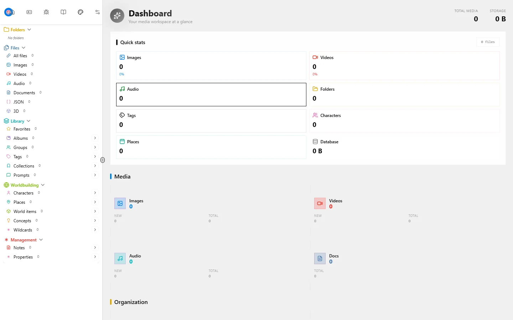
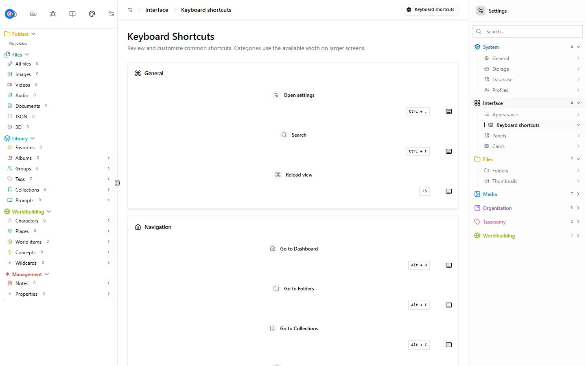
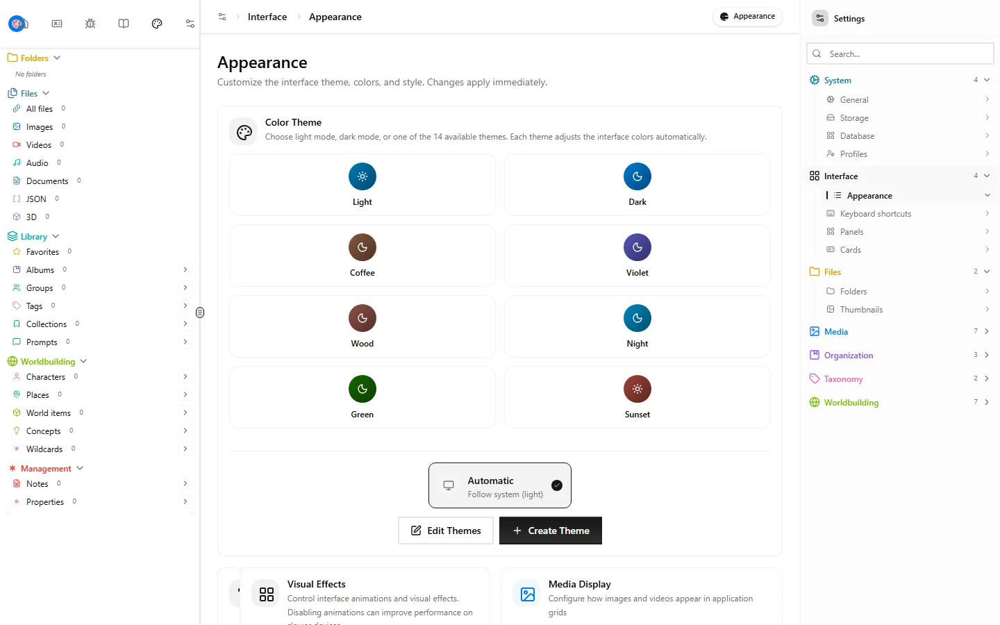
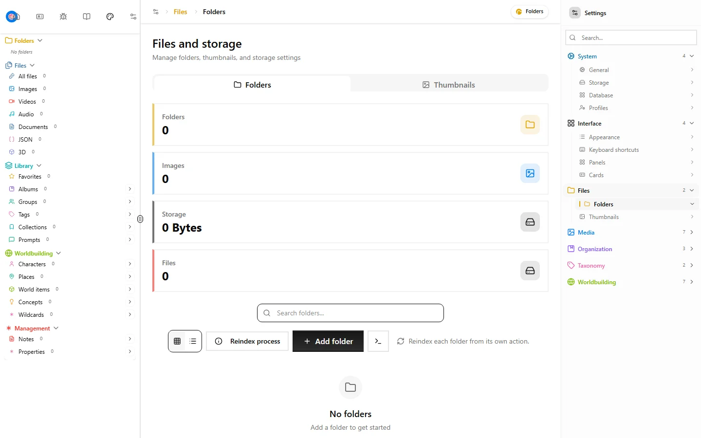

<p align="center">
  <picture>
    <source media="(prefers-color-scheme: dark)" srcset="https://shieldcn.dev/header/document.svg?title=Media+Manager&subtitle=Library%2C+not+a+landfill&logo=database&theme=orange&align=center&mode=dark" />
    
  </picture>
</p>

<p align="center">
  <a href="https://github.com/gvastethecreator/media-manager/actions/workflows/quality.yml"></a>
  <a href="https://gvastethecreator.github.io/media-manager/"></a>
  <a href="https://bun.sh/"></a>
  <a href="https://react.dev/"></a>
  <a href="https://github.com/gvastethecreator/media-manager/stargazers"></a>
</p>

Media Manager is a local-first workbench for large creative libraries. It indexes files in place and extracts useful metadata. It connects images, video, audio, documents, JSON, 3D models, prompts, notes, and worldbuilding objects in one searchable catalog.

[Project site](https://gvastethecreator.github.io/media-manager/) · [Source and issues](https://github.com/gvastethecreator/media-manager) · [Sponsor](https://ko-fi.com/gvaste)

## Product tour

The captures below come from the local application with an empty, privacy-safe library. No personal paths or files are shown.

| Library overview                                                                                                                        | Keyboard workflow                                                                                                                        |
| --------------------------------------------------------------------------------------------------------------------------------------- | ---------------------------------------------------------------------------------------------------------------------------------------- |
|   |                               |
| **Appearance and layout**                                                                                                               | **Settings and indexing**                                                                                                                |
|  |  |

## Why it exists

- Index existing folders without forcing a second managed copy.
- Search across filenames, extracted metadata, tags, relationships, and document text.
- Browse images, video, audio, documents, JSON, and 3D files through one interface.
- Organize creative context with collections, albums, groups, favorites, characters, places, concepts, prompts, and notes.
- Run as a local web app or through the Electron desktop shell.
- Report partial file-operation outcomes explicitly so recovery stays understandable.

## Current status

- The user-facing application, validation messages, recovery states, and primary error paths are English.
- Bun 1.3.14 owns installation, scripts, the server runtime, and the lockfile.
- Direct dependencies are current according to `bun outdated`.
- React 19, TypeScript 7, React Router 7, Vite 8, Express 5, Effect, Drizzle ORM, and SQLite/libsql form the main stack.
- Windows, macOS, and Linux can run the local web application.
- The desktop shell is Electron on Windows x64. Signing and macOS installers are not claimed.
- The repository is under active development. Treat packaging, signing, and installer validation as separate release gates.

## Quick start

Requirements:

- Bun 1.3.14 or newer
- Node.js 20 or newer for auxiliary tooling
- Optional FFmpeg support for selected thumbnail and metadata flows

```bash
bun install --frozen-lockfile
bun run dev:full
```

Open `http://localhost:5173`. The local API uses `http://localhost:4000` by default.

Copy `.env.example` when you need to customize ports, the database path, CORS, media limits, or logging. Do not point tests at a personal database. `bun run test` creates and removes isolated SQLite databases automatically.

## Development commands

`package.json` is the command list. Do not invent scripts.

| Command                   | Purpose                                     |
| ------------------------- | ------------------------------------------- |
| `bun run dev:full`        | Start the frontend and backend              |
| `bun run dev:vite`        | Start only the frontend                     |
| `bun run dev:server:hot`  | Start only the backend                      |
| `bun run desktop:dev`     | Start the Electron desktop shell            |
| `bun run desktop:package` | Copy extraResources, hash them, package Windows x64 |
| `bun run check`           | Run lint and TypeScript checks              |
| `bun run test`            | Run the isolated unit and integration suite |
| `bun run test:tooling`    | Verify repository tooling                   |
| `bun run test:e2e`        | Run Playwright browser coverage             |
| `bun run build`           | Build the frontend and Bun server           |
| `bun run db:schema:check` | Verify the generated schema contract        |
| `bun run deps:outdated`   | Check direct dependency freshness           |

The broad local gate is:

```bash
bun run check
bun run test:tooling
bun run test
bun run build
```

## Repository layout

| Area              | Responsibility                                                                      |
| ----------------- | ----------------------------------------------------------------------------------- |
| `src/components/` | Application shell, views, panels, cards, and file workflows                         |
| `src/server/`     | Express API, middleware, routes, and runtime integration                            |
| `src/services/`   | Media processing, indexing, metadata, and domain services                           |
| `src/store/`      | Zustand state and entity operations                                                 |
| `src/lib/`        | Drizzle, filesystem boundaries, logging, Effect adapters, and shared infrastructure |
| `src/types/`      | Domain types, validation contracts, and view configuration                          |
| `electron/`       | Electron supervisor, preload, and extraResources inventory                          |
| `scripts/`        | Bun automation, isolated tests, builds, and database operations                     |
| `docs/`           | Product site and contributor guides                                                 |

Start with these references when you change a major subsystem:

- [`docs/core/FRONTEND-GUIDE.md`](docs/core/FRONTEND-GUIDE.md)
- [`docs/core/API-REFERENCE.md`](docs/core/API-REFERENCE.md)
- [`docs/core/STYLES-AND-THEMES-GUIDE.md`](docs/core/STYLES-AND-THEMES-GUIDE.md)

## Security and data boundaries

- Filesystem mutations use authorized media roots and canonical asset identities.
- Recovery and partial-success states must remain visible to the user.
- The test runner refuses to start without an isolated disposable database.
- Dependency overrides in `package.json` pin patched transitive releases when an upstream range still resolves a vulnerable version.
- Do not commit personal databases, uploads, generated logs, or private library paths.

## Contributing

Read [`AGENTS.md`](AGENTS.md) before you change the application. Preserve the current Bun workflow. Add evidence at the narrowest public seam that can prove the behavior.

## Support

If Media Manager saves you time, you can sponsor continued work through [GitHub Sponsors](https://github.com/sponsors/gvastethecreator) or [Ko-fi](https://ko-fi.com/gvaste).

## License

[MIT](LICENSE)