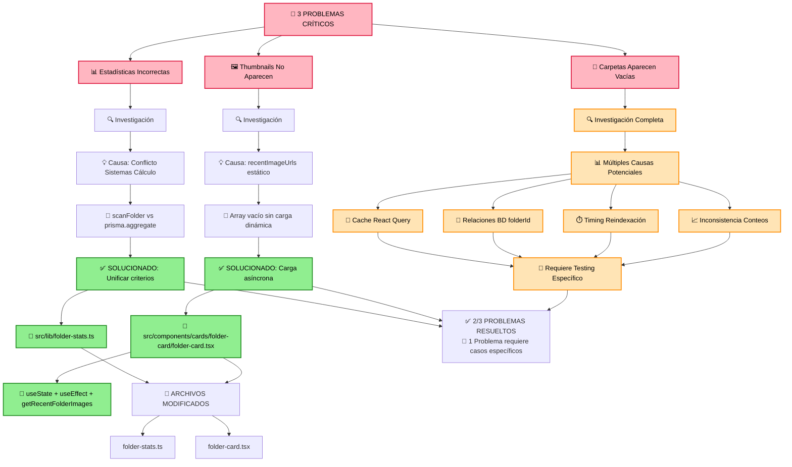
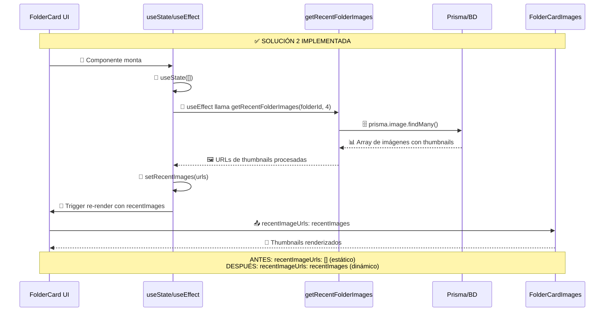
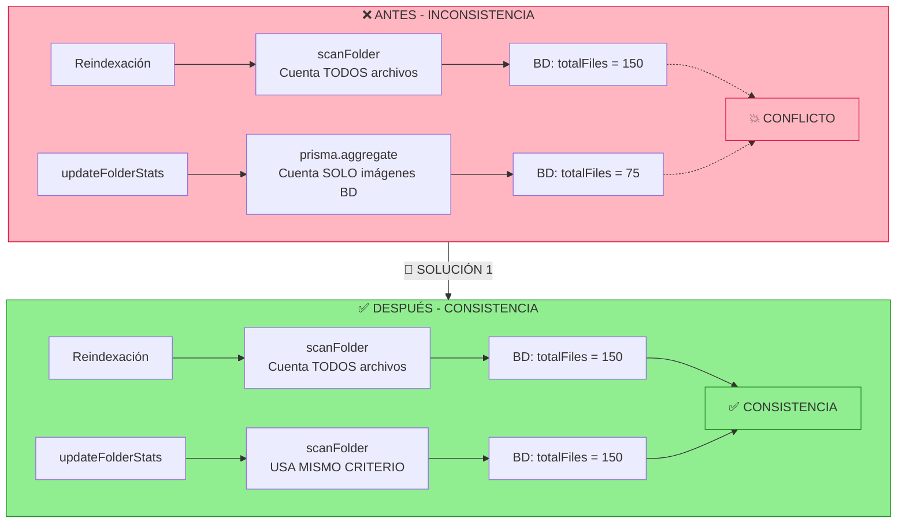

```mermaid
graph TD
    %% PROBLEMAS IDENTIFICADOS
    A[🚨 3 PROBLEMAS CRÍTICOS] --> B[📊 Estadísticas Incorrectas]
    A --> C[🖼️ Thumbnails No Aparecen]
    A --> D[📁 Carpetas Aparecen Vacías]

    %% SOLUCIÓN 1 - ESTADÍSTICAS
    B --> B1[🔍 Investigación]
    B1 --> B2[💡 Causa: Conflicto Sistemas Cálculo]
    B2 --> B3[📝 scanFolder vs prisma.aggregate]
    B3 --> B4[✅ SOLUCIONADO: Unificar criterios]
    B4 --> B5[📄 src/lib/folder-stats.ts]

    %% SOLUCIÓN 2 - THUMBNAILS
    C --> C1[🔍 Investigación]
    C1 --> C2[💡 Causa: recentImageUrls estático]
    C2 --> C3[📝 Array vacío sin carga dinámica]
    C3 --> C4[✅ SOLUCIONADO: Carga asíncrona]
    C4 --> C5[📄 src/components/cards/folder-card/folder-card.tsx]
    C5 --> C6[🔧 useState + useEffect + getRecentFolderImages]

    %% SOLUCIÓN 3 - CARPETAS VACÍAS
    D --> D1[🔍 Investigación Completa]
    D1 --> D2[📊 Múltiples Causas Potenciales]
    D2 --> D3[🔄 Cache React Query]
    D2 --> D4[🔗 Relaciones BD folderId]
    D2 --> D5[⏱️ Timing Reindexación]
    D2 --> D6[📈 Inconsistencia Conteos]

    D3 --> D7[🧪 Requiere Testing Específico]
    D4 --> D7
    D5 --> D7
    D6 --> D7

    %% ESTADO FINAL
    B4 --> FINAL[🎯 RESULTADO FINAL]
    C4 --> FINAL
    D7 --> FINAL[✅ 2/3 PROBLEMAS RESUELTOS<br/>🔄 1 Problema requiere casos específicos]

    %% ARCHIVOS CLAVE
    B5 --> FILES[📁 ARCHIVOS MODIFICADOS]
    C5 --> FILES
    FILES --> F1[folder-stats.ts]
    FILES --> F2[folder-card.tsx]

    %% ESTILOS
    classDef solved fill:#90EE90,stroke:#228B22,stroke-width:2px,color:#000
    classDef pending fill:#FFE4B5,stroke:#FF8C00,stroke-width:2px,color:#000
    classDef critical fill:#FFB6C1,stroke:#DC143C,stroke-width:2px,color:#000

    class B4,C4,B5,C5,C6 solved
    class D7,D1,D2,D3,D4,D5,D6 pending
    class A,B,C,D critical
```

## 🔧 FLUJO DE DATOS - FOLDER CARD THUMBNAILS

```mermaid
sequenceDiagram
    participant UI as FolderCard UI
    participant Hook as useState/useEffect
    participant Action as getRecentFolderImages
    participant DB as Prisma/BD
    participant Images as FolderCardImages

    Note over UI,Images: ✅ SOLUCIÓN 2 IMPLEMENTADA

    UI->>Hook: 🚀 Componente monta
    Hook->>Hook: 📝 useState([])
    Hook->>Action: 🔄 useEffect llama getRecentFolderImages(folderId, 4)
    Action->>DB: 🗄️ prisma.image.findMany()
    DB-->>Action: 📊 Array de imágenes con thumbnails
    Action-->>Hook: 🖼️ URLs de thumbnails procesadas
    Hook->>Hook: 💾 setRecentImages(urls)
    Hook->>UI: 🔄 Trigger re-render con recentImages
    UI->>Images: 📤 recentImageUrls: recentImages
    Images-->>UI: 🎨 Thumbnails renderizados

    Note over UI,Images: ANTES: recentImageUrls: [] (estático)<br/>DESPUÉS: recentImageUrls: recentImages (dinámico)
```

## 📊 FLUJO DE ESTADÍSTICAS - PROBLEMA RESUELTO

```mermaid
flowchart TD
    %% PROBLEMA ANTES
    subgraph ANTES[❌ ANTES - INCONSISTENCIA]
        RE1[Reindexación] --> SF1[scanFolder\nCuenta TODOS archivos]
        SF1 --> BD1[BD: totalFiles = 150]

        UP1[updateFolderStats] --> PA1[prisma.aggregate\nCuenta SOLO imágenes BD]
        PA1 --> BD2[BD: totalFiles = 75]

        BD1 -.-> CONF[💥 CONFLICTO]
        BD2 -.-> CONF
    end

    %% SOLUCIÓN DESPUÉS
    subgraph DESPUES[✅ DESPUÉS - CONSISTENCIA]
        RE2[Reindexación] --> SF2[scanFolder\nCuenta TODOS archivos]
        SF2 --> BD3[BD: totalFiles = 150]

        UP2[updateFolderStats] --> SF3[scanFolder\nUSA MISMO CRITERIO]
        SF3 --> BD4[BD: totalFiles = 150]

        BD3 --> CONS[✅ CONSISTENCIA]
        BD4 --> CONS
    end

    ANTES --> |🔧 SOLUCIÓN 1| DESPUES

    %% ESTILOS
    classDef problem fill:#FFB6C1,stroke:#DC143C
    classDef solution fill:#90EE90,stroke:#228B22
    classDef conflict fill:#FF6B6B,stroke:#FF0000
    classDef consistent fill:#4ECDC4,stroke:#008080

    class ANTES,CONF problem
    class DESPUES,CONS solution
```
