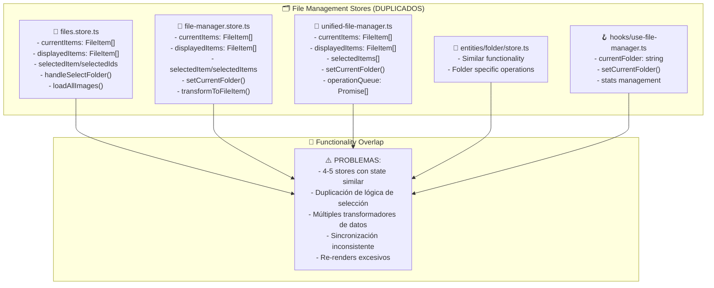
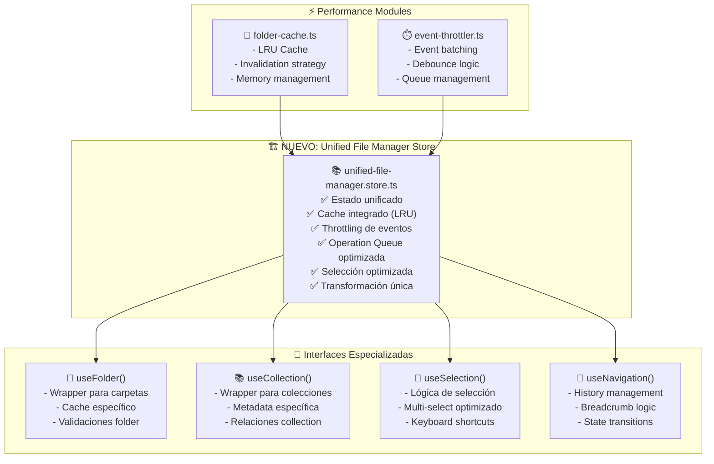

# 🔄 Plan de Consolidación de Stores - Image Manager

## 📊 Análisis Actual de Stores

### 🚨 Stores Duplicados Identificados



## 🎯 Store Unificado Propuesto

### 📋 Arquitectura Nueva



## 🛠️ Plan de Implementación

### Phase 1: Crear Store Unificado Base ⚡

1. **Crear nuevo store unificado**:
   - `src/store/unified-file-manager.store.ts` (ya existe, optimizar)
   - Integrar cache y throttling existentes
   - Unificar interfaces de todos los stores

2. **Migrar funcionalidad core**:
   - Selección de items (multi-select, keyboard)
   - Navegación entre contextos (folder/collection/tag)
   - Carga y display de items con batch loading
   - Estado de loading y error handling

### Phase 2: Crear Interfaces Especializadas 🎯

3. **useFolder() Hook**:

   ```typescript
   // src/lib/hooks/use-folder.ts
   export function useFolder() {
     const store = useUnifiedFileManager()
     return {
       currentFolder: store.currentFolder,
       setCurrentFolder: store.setCurrentFolder,
       folderImages: store.currentItems,
       // Folder-specific operations
     }
   }
   ```

4. **useSelection() Hook**:

   ```typescript
   // src/lib/hooks/use-selection.ts
   export function useSelection() {
     const store = useUnifiedFileManager()
     return {
       selectedItems: store.selectedItems,
       toggleSelection: store.toggleItemSelection,
       clearSelection: store.clearSelection,
       // Selection-specific logic
     }
   }
   ```

### Phase 3: Migrar Componentes 🔄

5. **Actualizar componentes existentes**:
   - Reemplazar `useFilesStore` → `useFolder()`
   - Reemplazar `useFileManager` → `useUnifiedFileManager()`
   - Actualizar importaciones y referencias

6. **Testing y validación**:
   - Verificar que la funcionalidad se mantiene
   - Comprobar performance improvements
   - Validar que no hay memory leaks

### Phase 4: Cleanup 🧹

7. **Eliminar stores obsoletos**:
   - `src/store/files/files.store.ts`
   - `src/store/files/file-manager.store.ts`
   - `src/store/entities/folder/store.ts`
   - `src/lib/hooks/use-file-manager.ts` (hook simple)

8. **Actualizar documentación**:
   - README con nueva arquitectura
   - Diagramas de flujo actualizados
   - Ejemplos de uso

## 🎯 Beneficios Esperados

### 📈 Performance Improvements

- ✅ **Menos re-renders**: Estado unificado reduce re-renders innecesarios
- ✅ **Cache inteligente**: LRU cache reduce fetches duplicados
- ✅ **Event throttling**: Menos eventos de revalidación
- ✅ **Operation queue**: Evita race conditions en navegación

### 🏗️ Architecture Benefits

- ✅ **Single source of truth**: Un solo store para file management
- ✅ **Mejor testing**: Lógica centralizada es más fácil de testear
- ✅ **Mantenibilidad**: Menos duplicación de código
- ✅ **Escalabilidad**: Arquitectura preparada para nuevas features

### 🐛 Bug Fixes

- ✅ **Sincronización**: Elimina inconsistencias entre stores
- ✅ **Memory leaks**: Mejor gestión de memoria con cache LRU
- ✅ **Race conditions**: Operation queue previene conflictos

## 🚀 Estado Actual: EN PROGRESO

- [x] Análisis de stores duplicados completado
- [x] Arquitectura unificada diseñada
- [x] Cache y throttling implementados
- [ ] **PRÓXIMO**: Consolidar unified-file-manager.store.ts
- [ ] Crear hooks especializados
- [ ] Migrar componentes
- [ ] Cleanup stores obsoletos

---

*Documento creado: ${new Date().toISOString()}*
*Última actualización: ${new Date().toISOString()}*
