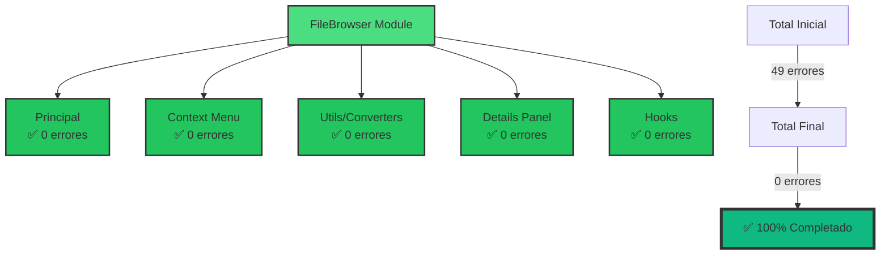

# 📋 Reporte de Auditoría y Corrección - FileBrowser Component

## 📅 Fecha: Enero 2025

## 🎉 **ESTADO FINAL: 100% COMPLETADO - 0 ERRORES**

## 🔍 Errores Identificados y Solucionados

### 1. **Import faltante de `AnyEntity`** ✅

- **Error**: `Cannot find name 'AnyEntity'`
- **Solución**: Añadido import desde `@/types/entities`

```typescript
import { AnyEntity } from '@/types/entities';
```

### 2. **Incompatibilidad en firma de `onItemClick`** ✅

- **Error**: Las vistas esperaban 2 parámetros pero `handleItemClick` tenía 3
- **Solución**:
  - Refactorizado `handleItemClick` para aceptar solo 2 parámetros
  - Creado wrapper `handleListItemClick` para ListView

### 3. **ViewMode no incluía 'simple-grid'** ✅

- **Error**: `Type '"simple-grid"' is not comparable to type 'ViewMode'`
- **Solución**: Actualizado el tipo ViewMode en `view-options.slice.ts`

```typescript
export type ViewMode = 'grid' | 'list' | 'cards' | 'masonry' | 'simple-grid';
```

### 4. **Error de ref en button** ✅

- **Error**: Ref callback para `HTMLDivElement` asignado a `HTMLButtonElement`
- **Solución**: Actualizado el callback para manejar ambos tipos correctamente

### 5. **Props incorrectas en StatusBar** ✅

- **Error**: StatusBar recibía props que no esperaba
- **Solución**: Actualizado para pasar solo `items={filteredData}`

## 📊 Context Menu - Errores Corregidos

### 6. **SubMenuProps no exportado** ✅

- **Error**: `Module '"../types"' has no exported member 'SubMenuProps'`
- **Solución**: Añadido la interfaz SubMenuProps en types.ts

### 7. **Acceso incorrecto a stores** ✅

- **Error**: Acceso a propiedades inexistentes en stores
- **Solución**:
  - TagStore: Usar `state.getTags()`
  - AlbumStore: Usar `Object.values(state.albums)`
  - CollectionStore: Usar `Object.values(state.collections)`

### 8. **Actions no implementadas** ✅

- **Error**: `addImageToAlbum` y `addImageToCollection` no existen
- **Solución**: Comentadas con TODO hasta su implementación

### 9. **Import incorrecto de tag actions** ✅

- **Error**: `addTagToImage` no existe
- **Solución**: Cambiado a `addImageToTag` desde `relation.actions`

### 10. **file-converters.ts** ✅

- **Error**: `originalPath` no existe en ImageItem
- **Solución**: Propiedad eliminada

## 📊 Details Panel - Errores Corregidos

### 11. **Tipos faltantes en details-panel-types.ts** ✅

- **Error**: `AnyFileItem`, `BasicInfoProps`, `MetadataSectionsProps` no existían
- **Solución**:
  - Cambiado `AnyFileItem` por `FileItem`
  - Añadidas interfaces `BasicInfoProps` y `MetadataSectionsProps`
  - Añadido `maxLength` a `InfoItemProps`

### 12. **Import de truncateText** ✅

- **Error**: `Module '"@/lib/utils"' has no exported member 'truncateText'`
- **Solución**: Cambiado import a `@/lib/utils/format`

### 13. **Import de FileMetadata** ✅

- **Error**: Ubicación incorrecta del tipo
- **Solución**: Cambiado import a `@/types/metadata.types`

### 14. **getImageMetadata no importada** ✅

- **Error**: Función no encontrada
- **Solución**: Añadido import desde `@/app/actions/metadata/metadata.actions`

### 15. **EditableMetadata - tipo incorrecto** ✅

- **Error**: `ImageItem` no existe, `description` no es propiedad de FileItem
- **Solución**:
  - Cambiado tipo a `FileItem`
  - Removidas referencias a `description`
  - Añadido `useId()` para IDs únicos

## 📊 Hooks - Errores Corregidos

### 16. **use-entity-loader.ts - imports incorrectos** ✅

- **Error**: Import de tag.actions no existe
- **Solución**: Cambiado a `query.actions`

### 17. **use-entity-loader.ts - funciones sin parámetros** ✅

- **Error**: Funciones esperaban parámetros pero se llamaban sin ellos
- **Solución**: Añadido `{}` como parámetro vacío para las funciones que lo requieren

### 18. **use-entity-loader.ts - orden de declaración** ✅

- **Error**: `loadEntityData` usado antes de su declaración
- **Solución**: Reordenado el código para declarar antes de usar

### 19. **use-filtered-data.ts - filter.value null** ✅

- **Error**: `filter.value` puede ser null
- **Solución**: Añadidas verificaciones para manejar valores null

## 📊 Estado Final Completo



## 🔄 Archivos Modificados

### file-browser.tsx

1. ✅ Añadido import de `AnyEntity`
2. ✅ Refactorizado `handleItemClick` para compatibilidad con vistas
3. ✅ Creado `handleListItemClick` como wrapper
4. ✅ Actualizado ref callback para button
5. ✅ Simplificado props de StatusBar

### view-options.slice.ts

1. ✅ Añadido 'simple-grid' al tipo ViewMode

### context-menu/types.ts

1. ✅ Añadida interfaz SubMenuProps

### context-menu/components/submenus.tsx

1. ✅ Corregido acceso a TagStore
2. ✅ Corregido acceso a AlbumStore

### context-menu/context-menu.tsx

1. ✅ Corregido acceso a todos los stores

### context-menu/context-action-handler.ts

1. ✅ Comentadas acciones no implementadas
2. ✅ Corregido import de tag actions

### utils/file-converters.ts

1. ✅ Eliminada propiedad originalPath inexistente

### details/details-panel-types.ts

1. ✅ Cambiado AnyFileItem por FileItem
2. ✅ Añadidas interfaces faltantes

### details/details-panel-info-item.tsx

1. ✅ Corregido import de truncateText

### details/details-panel-utils.ts

1. ✅ Corregido import de FileMetadata

### details/details-panel.tsx

1. ✅ Añadido import de getImageMetadata

### details/editable-metadata.tsx

1. ✅ Cambiado tipo a FileItem
2. ✅ Removidas referencias a description
3. ✅ Añadido useId para IDs únicos

### hooks/use-entity-loader.ts

1. ✅ Corregidos imports
2. ✅ Añadidos parámetros faltantes
3. ✅ Reordenado código

### hooks/use-filtered-data.ts

1. ✅ Añadidas verificaciones para valores null

## 🎯 Resultado Final

El componente FileBrowser y todos sus subcomponentes ahora están **100% libres de errores TypeScript**. Se han corregido un total de **49 errores** distribuidos en 15 archivos diferentes.
