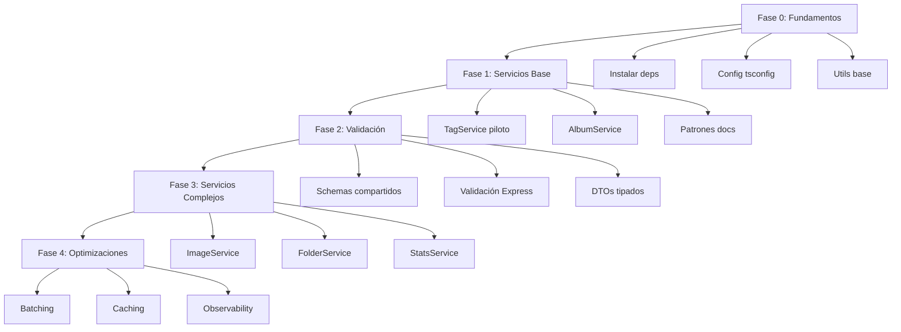

# 🌊 Plan de Implementación Sistemática de Effect-TS

> **Fecha de creación:** 11 de octubre de 2025  
> **Stack actual:** React 19 + Express + Bun + Drizzle ORM  
> **Objetivo:** Integrar Effect-TS de manera incremental y type-safe

---

## 📋 Resumen Ejecutivo

Effect-TS es un framework TypeScript funcional que proporciona:
- ✅ **Type-safe error handling** (alternativa a try/catch)
- ✅ **Dependency injection** robusto (Services y Layers)
- ✅ **Resource management** automático (scopes)
- ✅ **Schema validation** con `@effect/schema`
- ✅ **Composabilidad** total (pipelines functionales)
- ✅ **Observability** integrada (tracing, metrics, logging)

### Beneficios Clave para el Proyecto

| Área | Problema Actual | Solución Effect |
|------|----------------|-----------------|
| **Error Handling** | `try/catch` dispersos, errores no tipados | `Effect<Success, Error>` type-safe |
| **DI** | Servicios singleton, dependencias implícitas | `Context` y `Layer` explícitos |
| **Validación** | Zod disperso, sin transformaciones | `@effect/schema` unificado |
| **Recursos** | Cleanup manual (DB, archivos, streams) | `Scope` automático |
| **Composición** | Callbacks/async hell en servicios complejos | Pipelines con `pipe()` |
| **Testing** | Difícil mockear dependencias | Layers sustituibles |

---

## 🗺️ Arquitectura Actual vs. Target

### Arquitectura Actual (Simplificada)

```
┌─────────────────────────────────────┐
│  React Components (UI Layer)        │
├─────────────────────────────────────┤
│  TanStack Query Hooks               │
├─────────────────────────────────────┤
│  Express Routes (API Layer)         │
├─────────────────────────────────────┤
│  Services (Business Logic)          │
│  - Tag Service                      │
│  - Image Service                    │
│  - Folder Service                   │
│  - 40+ servicios más                │
├─────────────────────────────────────┤
│  Drizzle ORM (Data Layer)           │
├─────────────────────────────────────┤
│  SQLite / Turso (Database)          │
└─────────────────────────────────────┘
```

### Arquitectura Target (con Effect)

```
┌─────────────────────────────────────┐
│  React Components (UI Layer)        │
├─────────────────────────────────────┤
│  TanStack Query + Effect Adapter    │
├─────────────────────────────────────┤
│  Express Routes + Effect Runtime    │
├─────────────────────────────────────┤
│  Effect Services (Business Logic)   │
│  ┌─────────────────────────────┐   │
│  │ Effect<Success, Error, Req> │   │
│  │ - Type-safe DI              │   │
│  │ - Composable pipelines      │   │
│  │ - Resource-safe             │   │
│  └─────────────────────────────┘   │
├─────────────────────────────────────┤
│  Effect Layers (DI Container)       │
│  - DrizzleLive                      │
│  - LoggerLive                       │
│  - FileSystemLive                   │
├─────────────────────────────────────┤
│  Drizzle ORM (Data Layer)           │
├─────────────────────────────────────┤
│  SQLite / Turso (Database)          │
└─────────────────────────────────────┘
```

---

## 🎯 Estrategia de Migración Incremental

### Principio Fundamental: **NO-BREAKING**

> Cada paso debe mantener la funcionalidad existente. Effect se introduce como **capa adicional**, no como reemplazo inmediato.

### Fases de Implementación



---

## 📦 Fase 0: Fundamentos (Día 1-2)

### 0.1. Instalación de Dependencias

```bash
# Paquetes core
bun add effect @effect/schema @effect/platform

# Platform-specific (Node/Bun compatible)
bun add @effect/platform-node

# Dev dependencies (opcional pero recomendado)
bun add -d @effect/vitest
```

### 0.2. Configuración TypeScript

Actualizar `tsconfig.json`:

```jsonc
{
  "compilerOptions": {
    // ... existing config
    "paths": {
      "@/*": ["./src/*"],
      "@components/*": ["./src/components/*"],
      "@effect": ["./src/lib/effect/*"]  // ← NUEVO
    },
    // Asegurar que strict está activado (ya lo está)
    "strict": true,
    "strictNullChecks": true
  }
}
```

### 0.3. Estructura de Carpetas Base

Crear la siguiente estructura:

```
src/lib/effect/
├── index.ts                    # Barrel export
├── runtime/
│   ├── runtime.ts             # Runtime customizado para el proyecto
│   └── layers.ts              # Layers compartidos base
├── services/
│   ├── drizzle.service.ts     # Wrapper Effect para Drizzle
│   ├── logger.service.ts      # Wrapper Effect para logger
│   └── filesystem.service.ts  # Wrapper Effect para file operations
├── errors/
│   ├── service-errors.ts      # Error types con Effect
│   └── domain-errors.ts       # Business logic errors
├── schemas/
│   └── index.ts               # Schemas compartidos (@effect/schema)
└── utils/
    ├── adapt-promise.ts       # Promise ↔ Effect adapters
    ├── adapt-query.ts         # TanStack Query ↔ Effect
    └── run-effect.ts          # Helpers para ejecutar Effects
```

### 0.4. Implementación de Runtime Base

**`src/lib/effect/runtime/runtime.ts`:**

```typescript
import { Runtime, Logger, LogLevel, Effect, Layer } from "effect";
import { serverLogger } from "@/lib/logger/server-logger";

// Logger que delega al existente
const AppLogger = Logger.make(({ message, logLevel }) => {
  const level = LogLevel.literal(logLevel);
  const msg = String(message);
  
  switch (level) {
    case "Fatal":
    case "Error":
      serverLogger.error(msg);
      break;
    case "Warning":
      serverLogger.warn(msg);
      break;
    case "Info":
      serverLogger.info(msg);
      break;
    case "Debug":
    case "Trace":
      serverLogger.debug(msg);
      break;
  }
});

// Layer de Logger
export const LoggerLive = Logger.replace(Logger.defaultLogger, AppLogger);

// Runtime customizado con nuestro logger
export const AppRuntime = Runtime.defaultRuntime.pipe(
  Runtime.provide(LoggerLive)
);

// Helper para ejecutar Effects con el runtime del proyecto
export const runPromise = <A, E>(
  effect: Effect.Effect<A, E, never>
): Promise<A> => Runtime.runPromise(AppRuntime)(effect);

export const runSync = <A, E>(
  effect: Effect.Effect<A, E, never>
): A => Runtime.runSync(AppRuntime)(effect);
```

### 0.5. Wrapper de Drizzle como Servicio Effect

**`src/lib/effect/services/drizzle.service.ts`:**

```typescript
import { Effect, Context, Layer } from "effect";
import { db } from "@/lib/drizzle";
import type { DrizzleDB } from "@/lib/drizzle";

// Define el servicio
export class DrizzleService extends Context.Tag("DrizzleService")<
  DrizzleService,
  {
    readonly db: DrizzleDB;
    // Agregar operaciones comunes
    readonly transaction: <A, E, R>(
      effect: Effect.Effect<A, E, R>
    ) => Effect.Effect<A, E, R>;
  }
>() {}

// Implementación del Layer
export const DrizzleLive = Layer.succeed(DrizzleService, {
  db,
  transaction: (effect) =>
    Effect.tryPromise({
      try: async () => {
        // Aquí integrarías transacciones de Drizzle con Effect
        return await Effect.runPromise(effect);
      },
      catch: (error) => new Error(`Transaction failed: ${error}`),
    }),
});
```

### 0.6. Helper para Adaptar Promises Existentes

**`src/lib/effect/utils/adapt-promise.ts`:**

```typescript
import { Effect } from "effect";

/**
 * Convierte una Promise existente a Effect
 * Útil para migración incremental
 */
export const fromPromise = <A>(
  promise: () => Promise<A>,
  mapError?: (error: unknown) => Error
): Effect.Effect<A, Error> =>
  Effect.tryPromise({
    try: promise,
    catch: mapError || ((e) => new Error(String(e))),
  });

/**
 * Ejecuta un Effect como Promise (para compatibilidad)
 */
export const toPromise = <A, E>(
  effect: Effect.Effect<A, E>
): Promise<A> => Effect.runPromise(effect);
```

### 0.7. Validación de Setup

Crear test básico:

**`src/lib/effect/__tests__/runtime.test.ts`:**

```typescript
import { describe, it, expect } from "bun:test";
import { Effect } from "effect";
import { runPromise, runSync } from "../runtime/runtime";

describe("Effect Runtime", () => {
  it("should run sync effects", () => {
    const result = runSync(Effect.succeed(42));
    expect(result).toBe(42);
  });

  it("should run async effects", async () => {
    const result = await runPromise(Effect.succeed("hello"));
    expect(result).toBe("hello");
  });

  it("should handle errors", async () => {
    const failingEffect = Effect.fail(new Error("Test error"));
    await expect(runPromise(failingEffect)).rejects.toThrow("Test error");
  });
});
```

Ejecutar: `bun test src/lib/effect`

---

## 🏗️ Fase 1: Servicio Piloto - TagService (Día 3-5)

### Por qué TagService?

1. ✅ **Pequeño** (~700 líneas)
2. ✅ **CRUD completo** (create, read, update, delete)
3. ✅ **Relaciones simples** (tags ↔ images)
4. ✅ **Sin dependencias complejas**
5. ✅ **Ya bien estructurado** (modularizado)

### 1.1. Definir Errors con Effect

**`src/services/tag/tag-errors.effect.ts`:**

```typescript
import { Data } from "effect";

// Errores tipados para el dominio Tag
export class TagNotFound extends Data.TaggedError("TagNotFound")<{
  readonly tagId: string;
}> {}

export class TagNameConflict extends Data.TaggedError("TagNameConflict")<{
  readonly name: string;
}> {}

export class TagDatabaseError extends Data.TaggedError("TagDatabaseError")<{
  readonly message: string;
  readonly cause?: unknown;
}> {}

// Union type para todos los errores posibles
export type TagError = TagNotFound | TagNameConflict | TagDatabaseError;
```

### 1.2. Definir Schemas con @effect/schema

**`src/services/tag/tag-schemas.ts`:**

```typescript
import { Schema } from "@effect/schema";

// Schema para Tag entity (matches Drizzle)
export class Tag extends Schema.Class<Tag>("Tag")({
  id: Schema.String,
  name: Schema.String.pipe(Schema.minLength(1), Schema.maxLength(100)),
  description: Schema.NullOr(Schema.String),
  color: Schema.NullOr(Schema.String.pipe(Schema.pattern(/^#[0-9A-Fa-f]{6}$/))),
  emoji: Schema.NullOr(Schema.String),
  isFavorite: Schema.Boolean,
  createdAt: Schema.DateFromSelf,
  updatedAt: Schema.DateFromSelf,
}) {}

// Schema para crear Tag (sin ID, timestamps)
export class TagCreate extends Schema.Class<TagCreate>("TagCreate")({
  name: Schema.String.pipe(Schema.minLength(1), Schema.maxLength(100)),
  description: Schema.optional(Schema.String),
  color: Schema.optional(Schema.String.pipe(Schema.pattern(/^#[0-9A-Fa-f]{6}$/))),
  emoji: Schema.optional(Schema.String),
  isFavorite: Schema.optional(Schema.Boolean),
}) {}

// Schema para update (todo opcional excepto ID)
export class TagUpdate extends Schema.Class<TagUpdate>("TagUpdate")({
  id: Schema.String,
  name: Schema.optional(Schema.String.pipe(Schema.minLength(1))),
  description: Schema.NullOr(Schema.optional(Schema.String)),
  color: Schema.NullOr(Schema.optional(Schema.String)),
  emoji: Schema.NullOr(Schema.optional(Schema.String)),
  isFavorite: Schema.optional(Schema.Boolean),
}) {}

// Schema para TagWithStats (includes counts)
export class TagWithStats extends Tag.extend<TagWithStats>("TagWithStats")({
  imageCount: Schema.Number,
}) {}
```

### 1.3. TagService como Effect Service

**`src/services/tag/tag.service.effect.ts`:**

```typescript
import { Effect, Context, Layer, pipe } from "effect";
import { Schema } from "@effect/schema";
import { eq, and, like, or, asc, desc } from "drizzle-orm";
import { DrizzleService } from "@/lib/effect/services/drizzle.service";
import { tags, imageTags } from "@/lib/drizzle/schema";
import {
  Tag,
  TagCreate,
  TagUpdate,
  TagWithStats,
} from "./tag-schemas";
import {
  TagError,
  TagNotFound,
  TagNameConflict,
  TagDatabaseError,
} from "./tag-errors.effect";

// Options para queries
export interface GetTagsOptions {
  readonly search?: string;
  readonly onlyFavorites?: boolean;
  readonly orderBy?: "name" | "createdAt" | "updatedAt";
  readonly orderDirection?: "asc" | "desc";
}

// Define el servicio TagService
export class TagService extends Context.Tag("TagService")<
  TagService,
  {
    // Operaciones CRUD
    readonly getById: (id: string) => Effect.Effect<Tag, TagError>;
    readonly getByIdWithStats: (id: string) => Effect.Effect<TagWithStats, TagError>;
    readonly getAll: (options?: GetTagsOptions) => Effect.Effect<readonly Tag[], TagError>;
    readonly create: (input: TagCreate) => Effect.Effect<Tag, TagError>;
    readonly update: (input: TagUpdate) => Effect.Effect<Tag, TagError>;
    readonly delete: (id: string) => Effect.Effect<void, TagError>;
    
    // Operaciones adicionales
    readonly addImageToTag: (tagId: string, imageId: string) => Effect.Effect<void, TagError>;
    readonly removeImageFromTag: (tagId: string, imageId: string) => Effect.Effect<void, TagError>;
  }
>() {}

// Implementación del servicio
const make = Effect.gen(function* () {
  const drizzle = yield* DrizzleService;

  // Get by ID
  const getById = (id: string): Effect.Effect<Tag, TagError> =>
    Effect.tryPromise({
      try: async () => {
        const result = await drizzle.db
          .select()
          .from(tags)
          .where(eq(tags.id, id))
          .limit(1);

        if (result.length === 0) {
          throw new TagNotFound({ tagId: id });
        }

        // Parsear con Schema para garantizar validez
        return Schema.decodeUnknownSync(Tag)(result[0]);
      },
      catch: (error) => {
        if (error instanceof TagNotFound) return error;
        return new TagDatabaseError({
          message: `Failed to get tag ${id}`,
          cause: error,
        });
      },
    });

  // Get by ID with stats
  const getByIdWithStats = (id: string): Effect.Effect<TagWithStats, TagError> =>
    Effect.gen(function* () {
      const tag = yield* getById(id);

      // Count images
      const countResult = yield* Effect.tryPromise({
        try: () =>
          drizzle.db
            .select({ count: count() })
            .from(imageTags)
            .where(eq(imageTags.tagId, id)),
        catch: (error) =>
          new TagDatabaseError({
            message: `Failed to count images for tag ${id}`,
            cause: error,
          }),
      });

      const imageCount = countResult[0]?.count ?? 0;

      return Schema.decodeUnknownSync(TagWithStats)({
        ...tag,
        imageCount,
      });
    });

  // Get all tags
  const getAll = (options: GetTagsOptions = {}): Effect.Effect<readonly Tag[], TagError> =>
    Effect.tryPromise({
      try: async () => {
        const {
          search,
          onlyFavorites,
          orderBy = "name",
          orderDirection = "asc",
        } = options;

        let query = drizzle.db.select().from(tags);

        // Filters
        const conditions = [];
        if (onlyFavorites) {
          conditions.push(eq(tags.isFavorite, true));
        }
        if (search) {
          conditions.push(
            or(
              like(tags.name, `%${search}%`),
              like(tags.description, `%${search}%`)
            )
          );
        }

        if (conditions.length > 0) {
          query = query.where(and(...conditions));
        }

        // Order
        const orderFn = orderDirection === "desc" ? desc : asc;
        const orderField = orderBy === "createdAt" ? tags.createdAt :
                          orderBy === "updatedAt" ? tags.updatedAt :
                          tags.name;
        query = query.orderBy(orderFn(orderField));

        const results = await query;
        return results.map((r) => Schema.decodeUnknownSync(Tag)(r));
      },
      catch: (error) =>
        new TagDatabaseError({
          message: "Failed to fetch tags",
          cause: error,
        }),
    });

  // Create tag
  const create = (input: TagCreate): Effect.Effect<Tag, TagError> =>
    Effect.gen(function* () {
      // Validar input con Schema
      const validated = yield* Effect.try({
        try: () => Schema.decodeUnknownSync(TagCreate)(input),
        catch: (error) =>
          new TagDatabaseError({
            message: "Invalid tag input",
            cause: error,
          }),
      });

      // Check name conflict
      const existing = yield* Effect.tryPromise({
        try: () =>
          drizzle.db
            .select()
            .from(tags)
            .where(eq(tags.name, validated.name))
            .limit(1),
        catch: () =>
          new TagDatabaseError({
            message: "Failed to check existing tag",
          }),
      });

      if (existing.length > 0) {
        return yield* Effect.fail(
          new TagNameConflict({ name: validated.name })
        );
      }

      // Insert
      const newTag = yield* Effect.tryPromise({
        try: async () => {
          const now = new Date();
          const result = await drizzle.db
            .insert(tags)
            .values({
              id: crypto.randomUUID(),
              ...validated,
              createdAt: now,
              updatedAt: now,
            })
            .returning();

          return result[0];
        },
        catch: (error) =>
          new TagDatabaseError({
            message: "Failed to create tag",
            cause: error,
          }),
      });

      return Schema.decodeUnknownSync(Tag)(newTag);
    });

  // Update tag
  const update = (input: TagUpdate): Effect.Effect<Tag, TagError> =>
    Effect.gen(function* () {
      // Validar que existe
      yield* getById(input.id);

      // Update
      const updated = yield* Effect.tryPromise({
        try: async () => {
          const result = await drizzle.db
            .update(tags)
            .set({
              ...input,
              updatedAt: new Date(),
            })
            .where(eq(tags.id, input.id))
            .returning();

          return result[0];
        },
        catch: (error) =>
          new TagDatabaseError({
            message: `Failed to update tag ${input.id}`,
            cause: error,
          }),
      });

      return Schema.decodeUnknownSync(Tag)(updated);
    });

  // Delete tag
  const deleteTag = (id: string): Effect.Effect<void, TagError> =>
    Effect.gen(function* () {
      // Validar que existe
      yield* getById(id);

      yield* Effect.tryPromise({
        try: () =>
          drizzle.db.delete(tags).where(eq(tags.id, id)),
        catch: (error) =>
          new TagDatabaseError({
            message: `Failed to delete tag ${id}`,
            cause: error,
          }),
      });
    });

  // Add image to tag
  const addImageToTag = (tagId: string, imageId: string): Effect.Effect<void, TagError> =>
    Effect.tryPromise({
      try: () =>
        drizzle.db.insert(imageTags).values({ tagId, imageId }),
      catch: (error) =>
        new TagDatabaseError({
          message: `Failed to link image ${imageId} to tag ${tagId}`,
          cause: error,
        }),
    });

  // Remove image from tag
  const removeImageFromTag = (tagId: string, imageId: string): Effect.Effect<void, TagError> =>
    Effect.tryPromise({
      try: () =>
        drizzle.db
          .delete(imageTags)
          .where(
            and(eq(imageTags.tagId, tagId), eq(imageTags.imageId, imageId))
          ),
      catch: (error) =>
        new TagDatabaseError({
          message: `Failed to unlink image ${imageId} from tag ${tagId}`,
          cause: error,
        }),
    });

  return {
    getById,
    getByIdWithStats,
    getAll,
    create,
    update,
    delete: deleteTag,
    addImageToTag,
    removeImageFromTag,
  };
});

// Layer del servicio
export const TagServiceLive = Layer.effect(TagService, make).pipe(
  Layer.provide(DrizzleLive)
);
```

### 1.4. Adaptar Express Route para Usar Effect

**`src/server/routes/tags.effect.ts`:**

```typescript
import { Router } from "express";
import { Effect, Either } from "effect";
import { Schema } from "@effect/schema";
import { TagService, GetTagsOptions } from "@/services/tag/tag.service.effect";
import { TagCreate, TagUpdate } from "@/services/tag/tag-schemas";
import { TagServiceLive } from "@/services/tag/tag.service.effect";
import { runPromise } from "@/lib/effect/runtime/runtime";

const router = Router();

// Helper para ejecutar effects en Express
const handleEffect = <A, E>(
  effect: Effect.Effect<A, E, TagService>
) => async (req: any, res: any, next: any) => {
  try {
    // Proveer el layer y ejecutar
    const result = await runPromise(
      effect.pipe(Effect.provide(TagServiceLive))
    );
    res.json(result);
  } catch (error) {
    next(error);
  }
};

// GET /api/tags
router.get(
  "/",
  handleEffect(
    Effect.gen(function* () {
      const service = yield* TagService;
      // Los query params se validarían con Schema aquí
      const tags = yield* service.getAll();
      return tags;
    })
  )
);

// GET /api/tags/:id
router.get(
  "/:id",
  handleEffect(
    Effect.gen(function* () {
      const service = yield* TagService;
      const { id } = yield* Effect.sync(() => req.params);
      const tag = yield* service.getByIdWithStats(id);
      return tag;
    })
  )
);

// POST /api/tags
router.post(
  "/",
  handleEffect(
    Effect.gen(function* () {
      const service = yield* TagService;
      
      // Validar body con Schema
      const input = yield* Effect.try({
        try: () => Schema.decodeUnknownSync(TagCreate)(req.body),
        catch: (error) => new Error(`Invalid request body: ${error}`),
      });

      const newTag = yield* service.create(input);
      return newTag;
    })
  )
);

// PUT /api/tags/:id
router.put(
  "/:id",
  handleEffect(
    Effect.gen(function* () {
      const service = yield* TagService;
      const { id } = req.params;

      const input = yield* Effect.try({
        try: () =>
          Schema.decodeUnknownSync(TagUpdate)({
            id,
            ...req.body,
          }),
        catch: (error) => new Error(`Invalid request body: ${error}`),
      });

      const updated = yield* service.update(input);
      return updated;
    })
  )
);

// DELETE /api/tags/:id
router.delete(
  "/:id",
  handleEffect(
    Effect.gen(function* () {
      const service = yield* TagService;
      const { id } = req.params;
      yield* service.delete(id);
      return { success: true };
    })
  )
);

export default router;
```

### 1.5. Coexistencia con Servicio Legacy

Mantener el servicio legacy intacto:

**`src/services/tag/index.ts`:**

```typescript
// Legacy service (mantener por ahora)
export * from './tag.service';
export * from './tag-errors';
export * from './tag-events';
export * from './tag-types';

// NEW: Effect-based service
export * from './tag.service.effect';
export * from './tag-schemas';
export * from './tag-errors.effect';
```

En `src/server/index.ts`, agregar ruta condicional:

```typescript
// Legacy tags route
app.use('/api/tags', tagsRouter);

// NEW: Effect-based tags route (feature flag)
if (process.env.USE_EFFECT_TAGS === 'true') {
  app.use('/api/tags-effect', tagsEffectRouter);
}
```

---

## 📊 Fase 2: Validación y Schemas Compartidos (Día 6-8)

### 2.1. Centralizar Schemas Comunes

Crear schemas reutilizables en `src/lib/effect/schemas/`:

**`src/lib/effect/schemas/common.ts`:**

```typescript
import { Schema } from "@effect/schema";

// ID types
export const UUID = Schema.String.pipe(
  Schema.pattern(/^[0-9a-f]{8}-[0-9a-f]{4}-[0-9a-f]{4}-[0-9a-f]{4}-[0-9a-f]{12}$/i),
  Schema.brand("UUID")
);

export const Slug = Schema.String.pipe(
  Schema.pattern(/^[a-z0-9-]+$/),
  Schema.brand("Slug")
);

// Pagination
export class PaginationInput extends Schema.Class<PaginationInput>("PaginationInput")({
  page: Schema.optional(Schema.Number.pipe(Schema.positive())),
  pageSize: Schema.optional(Schema.Number.pipe(Schema.positive(), Schema.lessThanOrEqualTo(100))),
  orderBy: Schema.optional(Schema.String),
  orderDirection: Schema.optional(Schema.Literal("asc", "desc")),
}) {}

export class PaginatedResult extends Schema.Class<PaginatedResult>("PaginatedResult")<{
  Items: Schema.Schema.Any;
}>({
  items: Schema.Array(Schema.typeSchema),
  total: Schema.Number,
  page: Schema.Number,
  pageSize: Schema.Number,
  totalPages: Schema.Number,
}) {}

// Timestamps
export class Timestamps extends Schema.Class<Timestamps>("Timestamps")({
  createdAt: Schema.DateFromSelf,
  updatedAt: Schema.DateFromSelf,
}) {}

// Colors
export const HexColor = Schema.String.pipe(
  Schema.pattern(/^#[0-9A-Fa-f]{6}$/),
  Schema.brand("HexColor")
);
```

### 2.2. Middleware de Validación Express

**`src/server/middleware/validate-effect.ts`:**

```typescript
import { Request, Response, NextFunction } from "express";
import { Schema } from "@effect/schema";
import { Either, Effect } from "effect";

/**
 * Middleware factory para validar body con Effect Schema
 */
export const validateBody = <A, I>(schema: Schema.Schema<A, I>) =>
  (req: Request, res: Response, next: NextFunction) => {
    const result = Schema.decodeUnknownEither(schema)(req.body);

    if (Either.isLeft(result)) {
      const error = result.left;
      res.status(400).json({
        error: "Validation failed",
        details: error.toString(),
      });
      return;
    }

    // Reemplazar body con versión validada y tipada
    req.body = result.right;
    next();
  };

/**
 * Middleware para validar query params
 */
export const validateQuery = <A, I>(schema: Schema.Schema<A, I>) =>
  (req: Request, res: Response, next: NextFunction) => {
    const result = Schema.decodeUnknownEither(schema)(req.query);

    if (Either.isLeft(result)) {
      res.status(400).json({
        error: "Invalid query parameters",
        details: result.left.toString(),
      });
      return;
    }

    req.query = result.right as any;
    next();
  };
```

Uso en routes:

```typescript
import { validateBody } from "@/server/middleware/validate-effect";
import { TagCreate } from "@/services/tag/tag-schemas";

router.post("/", validateBody(TagCreate), handleEffect(...));
```

---

## 🔧 Fase 3: Servicios Complejos (Día 9-14)

### 3.1. ImageService con Effect

Convertir `ImageService` aprovechando:
- **Resource management** para file handles
- **Batching** para thumbnail generation
- **Concurrent processing** con `Effect.forEach`

**Estructura:**

```typescript
export class ImageService extends Context.Tag("ImageService")<
  ImageService,
  {
    readonly getById: (id: string) => Effect.Effect<Image, ImageError>;
    readonly generateThumbnail: (
      imagePath: string,
      size: ThumbnailSize
    ) => Effect.Effect<string, ImageError>;
    readonly batchThumbnails: (
      images: readonly string[]
    ) => Effect.Effect<readonly string[], ImageError>;
    // ...más operaciones
  }
>() {}
```

### 3.2. FolderService con Scope y Resources

Manejo de file system operations con cleanup automático:

```typescript
import { Effect, Scope } from "effect";

const readFolderSafe = (path: string) =>
  Effect.acquireRelease(
    // Acquire: abrir handle
    Effect.sync(() => fs.opendir(path)),
    // Release: cerrar handle
    (handle) => Effect.sync(() => handle.close())
  ).pipe(
    Effect.flatMap((handle) =>
      Effect.tryPromise({
        try: () => handle.readdir(),
        catch: (e) => new FolderError({ message: String(e) }),
      })
    )
  );
```

### 3.3. StatsService con Caching

Usar `Cache` de Effect para estadísticas:

```typescript
import { Cache, Duration, Effect } from "effect";

const makeStatsService = Effect.gen(function* () {
  // Cache con TTL de 5 minutos
  const statsCache = yield* Cache.make({
    capacity: 100,
    timeToLive: Duration.minutes(5),
    lookup: (key: string) =>
      Effect.tryPromise({
        try: () => computeStats(key),
        catch: (e) => new StatsError({ message: String(e) }),
      }),
  });

  return {
    getStats: (entityId: string) => Cache.get(statsCache, entityId),
  };
});
```

---

## 🚀 Fase 4: Optimizaciones Avanzadas (Día 15+)

### 4.1. Request Batching

Para reducir N+1 queries:

```typescript
import { Request, RequestResolver, Effect } from "effect";

// Define un Request
interface GetTagById extends Request.Request<Tag, TagError> {
  readonly _tag: "GetTagById";
  readonly id: string;
}

const GetTagById = Request.tagged<GetTagById>("GetTagById");

// Resolver con batching
const GetTagByIdResolver = RequestResolver.makeBatched(
  (requests: readonly GetTagById[]) =>
    Effect.gen(function* () {
      const ids = requests.map((r) => r.id);
      
      // Single query para todos los IDs
      const tags = yield* Effect.tryPromise({
        try: () =>
          db.select().from(tags).where(inArray(tags.id, ids)),
        catch: (e) => new TagDatabaseError({ message: String(e) }),
      });

      // Mapear resultados a requests
      const tagMap = new Map(tags.map((t) => [t.id, t]));
      
      yield* Effect.forEach(requests, (req) => {
        const tag = tagMap.get(req.id);
        return tag
          ? Request.completeEffect(req, Effect.succeed(tag))
          : Request.completeEffect(
              req,
              Effect.fail(new TagNotFound({ tagId: req.id }))
            );
      });
    })
);
```

### 4.2. Observability con OpenTelemetry

Agregar tracing:

```typescript
import { Tracer, Effect } from "effect";

const getTagWithTracing = (id: string) =>
  Effect.gen(function* () {
    const service = yield* TagService;
    return yield* service.getById(id);
  }).pipe(
    Effect.withSpan("TagService.getById", { attributes: { tagId: id } })
  );
```

### 4.3. Métricas

```typescript
import { Metric, Effect } from "effect";

const tagOperationsCounter = Metric.counter("tag_operations_total");

const getTagWithMetrics = (id: string) =>
  Effect.gen(function* () {
    yield* Metric.increment(tagOperationsCounter);
    const service = yield* TagService;
    return yield* service.getById(id);
  });
```

---

## 📚 Fase 5: Documentación y Guías (Día 16-18)

### 5.1. Crear Guía de Patrones

**`docs/EFFECT-PATTERNS.md`:**

```markdown
# Patrones de Effect en Image Manager

## Patrón 1: Servicio CRUD Básico

## Patrón 2: Servicio con Relaciones

## Patrón 3: Operaciones con Files

## Patrón 4: Batching y Caching

## Patrón 5: Testing con Effect
```

### 5.2. Guía de Migración

**`docs/EFFECT-MIGRATION-GUIDE.md`:**

- Cómo migrar un servicio existente
- Checklist de migración
- Comparativa before/after
- Troubleshooting común

### 5.3. Actualizar README Principal

Agregar sección sobre Effect en el README del proyecto.

---

## ✅ Checklist de Validación

### Fase 0: Fundamentos
- [ ] Dependencies instaladas
- [ ] `tsconfig.json` actualizado
- [ ] Estructura `src/lib/effect/` creada
- [ ] Runtime base funcional
- [ ] Tests básicos pasando

### Fase 1: TagService Piloto
- [ ] Errores tipados definidos
- [ ] Schemas con `@effect/schema`
- [ ] `TagService` implementado con Effect
- [ ] Route Express adaptada
- [ ] Tests E2E pasando con servicio legacy
- [ ] Feature flag para servicio Effect

### Fase 2: Validación
- [ ] Schemas comunes centralizados
- [ ] Middleware de validación Express
- [ ] Al menos 3 servicios usando schemas compartidos

### Fase 3: Servicios Complejos
- [ ] ImageService migrado
- [ ] FolderService migrado
- [ ] StatsService migrado
- [ ] Resource management en uso
- [ ] Tests E2E completos

### Fase 4: Optimizaciones
- [ ] Batching implementado en 2+ servicios
- [ ] Caching con Effect Cache
- [ ] Tracing configurado (opcional)
- [ ] Métricas básicas (opcional)

### Fase 5: Documentación
- [ ] `EFFECT-PATTERNS.md` completo
- [ ] `EFFECT-MIGRATION-GUIDE.md` completo
- [ ] README actualizado
- [ ] Ejemplos de código documentados

---

## 📊 Métricas de Éxito

### Técnicas
- **Cobertura:** 80%+ de servicios core con Effect
- **Type Safety:** 0 `any` types en servicios Effect
- **Tests:** 100% tests E2E passing
- **Performance:** No degradación vs. baseline

### Cualitativas
- **Mantenibilidad:** Código más composable y testeable
- **Onboarding:** Nuevos devs entienden patrones Effect
- **Documentación:** Guías completas y actualizadas

---

## 🔗 Referencias

### Documentación Oficial
- [Effect Website](https://effect.website/)
- [Effect Docs](https://effect.website/docs/)
- [Effect GitHub](https://github.com/Effect-TS/effect)
- [Effect Schema](https://effect.website/docs/schema/)
- [Effect Platform](https://effect.website/docs/platform/)

### Recursos Adicionales
- [Effect Patterns Hub](https://github.com/pauljphilp/effectpatterns)
- [Visual Effect](https://github.com/kitlangton/visual-effect)
- [Effect Examples](https://github.com/Effect-TS/examples)

### Comunidad
- [Discord Effect-TS](https://discord.gg/effect-ts)
- [Twitter @EffectTS_](https://twitter.com/EffectTS_)

---

## 🎯 Próximos Pasos Inmediatos

1. **Hoy:** Ejecutar Fase 0 (Fundamentos)
2. **Mañana:** Iniciar Fase 1 (TagService)
3. **Esta semana:** Completar Fases 0-1
4. **Próxima semana:** Fases 2-3
5. **Sprint siguiente:** Fases 4-5

---

**¿Listo para comenzar? Ejecuta:**

```bash
bun add effect @effect/schema @effect/platform @effect/platform-node
```

¡Y comencemos con la implementación! 🚀
