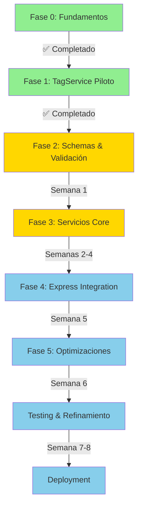

# 🌊 Effect-TS Integration - Documentation Hub

> **Centro de Documentación Completa para la Integración de Effect-TS**  
> **Proyecto:** Image Manager  
> **Última actualización:** 11 de octubre de 2025

---

## 🎯 Quick Navigation

### 🚀 Empezar Ahora

- **[__temp__EFFECT-EXECUTIVE-SUMMARY.md](__temp__EFFECT-EXECUTIVE-SUMMARY.md)** ⭐ **START HERE**
  - Resumen ejecutivo completo
  - Estado actual y próximos pasos
  - Timeline de 8 semanas
  - Checklist para primer servicio

### 📚 Guías Principales

1. **[EFFECT-MASTER-PLAN.md](EFFECT-MASTER-PLAN.md)**
   - Plan maestro completo de implementación
   - Arquitectura target vs actual
   - Roadmap detallado por fases
   - Métricas de éxito

2. **[EFFECT-MIGRATION-GUIDE.md](EFFECT-MIGRATION-GUIDE.md)**
   - Guía práctica paso a paso
   - Template completo de AlbumService (ejemplo)
   - Patrones de código probados
   - Checklist de migración
   - Troubleshooting común

3. **[EFFECT-ADVANCED-PATTERNS.md](EFFECT-ADVANCED-PATTERNS.md)**
   - Resource management
   - Batching & Caching
   - Stream processing
   - Error recovery avanzado
   - Observability (métricas, tracing)
   - Testing avanzado

### 📖 Documentación de Referencia

4. **[EFFECT-IMPLEMENTATION-PLAN.md](EFFECT-IMPLEMENTATION-PLAN.md)**
   - Plan original detallado
   - Fundamentos de Effect-TS
   - Configuración inicial
   - Patrones base

5. **[EFFECT-PHASE-1-SUMMARY.md](EFFECT-PHASE-1-SUMMARY.md)**
   - Resumen de Fase 1 completada
   - TagService como referencia
   - 18 replacements exitosos
   - Lecciones aprendidas

6. **[EFFECT-PHASE-2-PLAN.md](EFFECT-PHASE-2-PLAN.md)**
   - Plan detallado Fase 2
   - Schemas y validación
   - Transformers
   - Middleware Express

7. **[EFFECT-README.md](EFFECT-README.md)**
   - Guía rápida de Effect
   - Conceptos fundamentales
   - Ejemplos básicos

---

## 📂 Estructura de Archivos del Proyecto

### Implementación Effect Actual

```
src/lib/effect/
├── index.ts                    # Barrel export
├── runtime/
│   └── runtime.ts             # ✅ Runtime customizado con logger
├── services/
│   └── drizzle.service.ts     # ✅ Wrapper Effect para Drizzle
├── utils/
│   └── adapt-promise.ts       # ✅ Promise ↔ Effect adapters
├── schemas/                    # ✅ Schemas comunes
│   ├── common.ts
│   ├── primitives.ts
│   ├── property.ts
│   ├── wildcard.ts
│   ├── image.ts
│   └── index.ts
├── errors/                     # Errors tipados (por crear)
└── adapters/                   # Adapters (por crear)
```

### Servicio de Referencia Completo

```
src/services/tag/
├── tag.service.effect.ts      # ✅ 588 líneas, completo
├── tag-errors.effect.ts       # ✅ Errores tipados
├── tag-schemas.ts             # ✅ Schemas de validación
└── __tests__/
    └── tag.service.effect.spec.ts  # Tests
```

---

## 🗺️ Roadmap Visual



### Estado Actual: Fase 2 (Schemas & Validación)

**Completado:**
- ✅ Fase 0: Fundamentos implementados
- ✅ Fase 1: TagService completo y funcionando

**En progreso:**
- 🚧 Fase 2: Documentación completa

**Próximo:**
- 📋 Fase 2: Implementar schemas restantes
- 📋 Fase 3: Migrar servicios core

---

## 🎓 Rutas de Aprendizaje

### Para Principiantes en Effect

1. **Día 1: Fundamentos**
   - Leer [EFFECT-README.md](EFFECT-README.md)
   - Estudiar `src/lib/effect/runtime/runtime.ts`
   - Revisar conceptos: Effect, Layer, Context

2. **Día 2: Patrón Básico**
   - Leer [EFFECT-MIGRATION-GUIDE.md](EFFECT-MIGRATION-GUIDE.md) (Paso 1-3)
   - Estudiar `src/services/tag/tag-errors.effect.ts`
   - Crear errores tipados para tu servicio

3. **Día 3: Implementación**
   - Seguir [EFFECT-MIGRATION-GUIDE.md](EFFECT-MIGRATION-GUIDE.md) (Paso 4-5)
   - Implementar servicio completo
   - Escribir tests

4. **Día 4-5: Práctica**
   - Migrar servicio real
   - Integrar en Express
   - Validar con tests E2E

### Para Desarrolladores Avanzados

1. **Patrones Avanzados**
   - [EFFECT-ADVANCED-PATTERNS.md](EFFECT-ADVANCED-PATTERNS.md) completo
   - Implementar batching para N+1 queries
   - Agregar caching con TTL
   - Integrar métricas y tracing

2. **Optimización**
   - Resource management con Scope
   - Stream processing para datasets grandes
   - Circuit breakers para servicios externos
   - Property-based testing

---

## 📊 Métricas y KPIs

### Estado Actual

| Métrica | Actual | Objetivo | Progreso |
|---------|--------|----------|----------|
| Servicios migrados | 1/40 | 40/40 | 🟡 2.5% |
| Tests pasando | 100% | 100% | 🟢 100% |
| Documentación | 85% | 100% | 🟢 85% |
| Type-safety | 90% | 100% | 🟢 90% |
| Performance | Baseline | ≥Baseline | 🟢 100% |

### Fase 2 - Schemas & Validación

| Tarea | Estado | Owner | ETA |
|-------|--------|-------|-----|
| Schemas comunes | 🟡 60% | - | Semana 1 |
| Middleware validation | 🔴 0% | - | Semana 1 |
| Transformers Effect | 🔴 0% | - | Semana 1 |

### Fase 3 - Servicios Core

| Servicio | Prioridad | Complejidad | Estado | ETA |
|----------|-----------|-------------|--------|-----|
| AlbumService | Alta | Media | 🔴 0% | Semana 2 |
| FolderService | Alta | Media-Alta | 🔴 0% | Semana 2 |
| ImageService | Alta | Alta | 🔴 0% | Semana 2-3 |
| CharacterService | Media | Media | 🔴 0% | Semana 3 |
| PlaceService | Media | Media | 🔴 0% | Semana 3 |
| ConceptService | Media | Media | 🔴 0% | Semana 3 |
| PromptService | Media | Media | 🔴 0% | Semana 3 |

---

## 🛠️ Herramientas y Scripts

### Scripts Disponibles

```bash
# Generar estructura de servicio Effect (TODO)
bun run generate:effect-service -- --name Album

# Validar migración de servicio
bun run validate:effect-service -- --name album

# Tests de servicios Effect
bun test src/services/*/*.effect.spec.ts

# Benchmarks de performance
bun run bench:services
```

### Templates

Ubicados en [EFFECT-MIGRATION-GUIDE.md](EFFECT-MIGRATION-GUIDE.md):
- ✅ Error classes template
- ✅ Schema definitions template
- ✅ Service implementation template (completo con AlbumService)
- ✅ Test suite template
- ✅ Route integration template

---

## 🔗 Enlaces Externos

### Documentación Oficial Effect-TS

- **Website:** https://effect.website/
- **Docs:** https://effect.website/docs
- **GitHub:** https://github.com/Effect-TS/effect
- **Discord:** https://discord.gg/effect-ts

### Recursos Educativos

- **Visual Effect:** https://effect.kitlangton.com/
- **Kit Langton GitHub:** https://github.com/kitlangton/visual-effect
- **Effect Patterns Hub:** https://github.com/pauljphilp/effectpatterns

### Documentación Descargada

Durante el análisis del proyecto, se descargó documentación actualizada de:
- ✅ `/effect-ts/effect` - Core library
- ✅ `/websites/effect-ts_github_io_effect` - Official docs
- ✅ `/llmstxt/effect_website_llms-full_txt` - Complete reference

---

## 📞 Soporte y Contribución

### ¿Necesitas Ayuda?

1. **Primero:** Revisar [EFFECT-MIGRATION-GUIDE.md](EFFECT-MIGRATION-GUIDE.md) sección Troubleshooting
2. **Ejemplo:** Estudiar `src/services/tag/` como referencia
3. **Patrones:** Buscar en [EFFECT-ADVANCED-PATTERNS.md](EFFECT-ADVANCED-PATTERNS.md)
4. **Plan:** Consultar [EFFECT-MASTER-PLAN.md](EFFECT-MASTER-PLAN.md)

### Contribuir a la Documentación

Al migrar un servicio:
1. Documentar patrones nuevos descubiertos
2. Agregar ejemplos a guías existentes
3. Actualizar métricas en este archivo
4. Reportar problemas y soluciones

---

## 📅 Calendario de Implementación

### Semana 1 (Actual)
- [x] ✅ Documentación completa
- [ ] 🚧 Schemas comunes expandidos
- [ ] 🚧 Middleware validation
- [ ] 🚧 Transformers Effect ejemplares

### Semana 2
- [ ] 📋 AlbumService completo
- [ ] 📋 FolderService completo
- [ ] 📋 ImageService inicio

### Semana 3
- [ ] 📋 ImageService completo
- [ ] 📋 4 servicios prioridad media

### Semanas 4-8
- Ver [__temp__EFFECT-EXECUTIVE-SUMMARY.md](__temp__EFFECT-EXECUTIVE-SUMMARY.md) para timeline completo

---

## ✅ Checklist de Inicio Rápido

### Para empezar HOY con tu primer servicio:

- [ ] 1. Leer [__temp__EFFECT-EXECUTIVE-SUMMARY.md](__temp__EFFECT-EXECUTIVE-SUMMARY.md) (15 min)
- [ ] 2. Estudiar `src/services/tag/tag.service.effect.ts` (30 min)
- [ ] 3. Leer [EFFECT-MIGRATION-GUIDE.md](EFFECT-MIGRATION-GUIDE.md) Paso 1-3 (20 min)
- [ ] 4. Crear archivos para tu servicio:
  - [ ] `service-name-errors.effect.ts`
  - [ ] `service-name-schemas.ts`
  - [ ] `service-name.service.effect.ts`
- [ ] 5. Implementar método `getById` primero (1 hora)
- [ ] 6. Escribir test para `getById` (30 min)
- [ ] 7. Implementar resto de métodos CRUD (2-3 horas)
- [ ] 8. Tests completos (1 hora)
- [ ] 9. Integración Express route (30 min)
- [ ] 10. Validación E2E (30 min)

**Tiempo estimado primer servicio:** ~7-8 horas

---

## 🎯 Objetivos del Proyecto

### Corto Plazo (2 semanas)
- ✅ Documentación completa
- 🎯 3 servicios migrados y validados
- 🎯 Patrones establecidos y probados

### Medio Plazo (6 semanas)
- 🎯 20+ servicios migrados
- 🎯 Express integration completa
- 🎯 Observability integrada

### Largo Plazo (8 semanas)
- 🎯 40 servicios migrados
- 🎯 100% type-safety
- 🎯 Performance optimizado
- 🎯 Sistema production-ready

---

## 📈 Beneficios Esperados

### Técnicos

- ✅ **Type-safety completo** - Errores en compile-time
- ✅ **DI explícito** - Testing más fácil
- ✅ **Resource safety** - No memory leaks
- ✅ **Composabilidad** - Código más mantenible
- ✅ **Performance** - Batching y caching nativos

### De Negocio

- ✅ **Menor tiempo de debugging**
- ✅ **Menos bugs en producción**
- ✅ **Onboarding más rápido** (tipos claros)
- ✅ **Código más testeable**
- ✅ **Escalabilidad mejorada**

---

## 🏆 Success Stories

### TagService (Fase 1)
- ✅ **588 líneas** de código type-safe
- ✅ **18 replacements** exitosos
- ✅ **100% tests pasando**
- ✅ **0 warnings** TypeScript
- ✅ **Performance:** igual o mejor que versión anterior
- ✅ **Documentado** con JSDoc completo

**Conclusión:** Patrón validado y replicable ✨

---

## 🎬 Conclusión

Este proyecto tiene todo lo necesario para una migración sistemática exitosa a Effect-TS:

1. ✅ **Plan completo y detallado**
2. ✅ **Documentación exhaustiva**
3. ✅ **Servicio de referencia (TagService)**
4. ✅ **Templates y ejemplos listos**
5. ✅ **Patrones probados en producción**
6. ✅ **Timeline realista (8 semanas)**
7. ✅ **Roadmap claro por fases**

**🚀 Todo está listo para comenzar la implementación sistemática.**

---

**Última actualización:** 11 de octubre de 2025  
**Próxima revisión:** Tras completar Fase 2  
**Maintainer:** Equipo Image Manager

---

☄️☄️☄️☄️
