# Effect-TS Migration: Phase 5 Plan - Service Selection & Strategy

**Date:** 2025-10-11  
**Status:** 📋 **PLANNING**  
**Target Service:** CollectionService  
**Estimated Complexity:** Medium (similar to AlbumService)

---

## 📊 Service Analysis Summary

### Migration Progress So Far

| Phase | Service | Lines | Tests | Status |
|-------|---------|-------|-------|--------|
| Phase 1 | TagService | 599 | 20/20 | ✅ Complete |
| Phase 2 | AlbumService | 356 | 20/20 | ✅ Complete |
| Phase 3 | Documentation | 14 docs | N/A | ✅ Complete |
| Phase 4 | FolderService | 670 | 36/36 | ✅ Complete |
| **Phase 5** | **CollectionService** | **577** | **TBD** | 🎯 **Target** |

**Total Migrated:** 3 services, 76 tests passing, 0 failures

---

## 🔍 Candidate Services Analysis

### Full Service Inventory (by complexity)

| Service | Files | Lines | Complexity | Priority | Patterns Needed |
|---------|-------|-------|------------|----------|-----------------|
| **file** | 3 | 1685 | ⚠️ Very High | Low | Filesystem, streaming, batch ops |
| **image** | 3 | 1420 | ⚠️ Very High | Medium | Media processing, stats, relations |
| **folder-files** | 2 | 875 | ⚠️ High | Low | Filesystem + DB coordination |
| **stats** | 2 | 799 | ⚠️ High | Low | Aggregations, real-time computation |
| **folders** | 1 | 767 | ⚠️ High | N/A | ✅ Already migrated (folder.service.effect.ts) |
| **collection** | 4 | 703 | ✅ Medium | **High** | CRUD, relations, similar to Album |
| **tag** | 1 | 599 | ✅ Medium | N/A | ✅ Already migrated (Phase 1) |
| **queue-job** | 1 | 597 | ⚠️ High | Low | Background processing, state machine |
| **property** | 1 | 594 | ✅ Medium | Medium | CRUD, taxonomy |
| **prompt** | 1 | 585 | ✅ Medium | Medium | CRUD, AI integration |
| **wildcard** | 1 | 575 | ✅ Medium | Medium | CRUD, text processing |
| **audio** | 2 | 569 | ⚠️ High | Low | Media processing, similar to image |
| **character** | 1 | 548 | ✅ Medium | Medium | CRUD, worldbuilding entity |
| **world-item** | 1 | 548 | ✅ Medium | Medium | CRUD, worldbuilding entity |
| **place** | 1 | 443 | ✅ Medium | Medium | CRUD, worldbuilding entity |
| **concept** | 1 | 431 | ✅ Medium | Medium | CRUD, worldbuilding entity |
| **album** | 1 | 356 | ✅ Medium | N/A | ✅ Already migrated (Phase 2) |
| **group** | 3 | 318 | ✅ Low-Medium | High | CRUD, relations, simpler than collection |
| **video** | 2 | 319 | ⚠️ High | Low | Media processing, similar to image |

### Complexity Breakdown

**Very High Complexity (1685-875 lines):**
- Multiple subsystems (file operations, batch processing, media handling)
- External dependencies (filesystem, ffmpeg, image libraries)
- Performance-critical paths
- **Recommendation:** Migrate LAST after patterns are well-established

**High Complexity (799-597 lines):**
- Complex business logic
- Multiple integration points
- State management requirements
- **Recommendation:** Migrate in later phases (6-8)

**Medium Complexity (703-318 lines):**
- Standard CRUD operations
- Relation management
- Stats/counts integration
- **Recommendation:** Ideal for Phase 5-6 (next 2-3 services)

**Low-Medium Complexity (356-219 lines):**
- Simple CRUD
- Minimal relations
- **Recommendation:** Good for practicing patterns (already done)

---

## 🎯 Phase 5 Target: CollectionService

### Selection Rationale

**Why CollectionService?**

1. **✅ Similar Complexity to AlbumService**
   - Album: 356 lines → Collection: 577 lines (+62%)
   - Both manage media collections
   - Both have similar relation patterns

2. **✅ Proven Patterns Available**
   - Phase 2 AlbumService provides blueprint
   - Relation management already solved
   - Stats integration patterns established

3. **✅ Business Value**
   - Core entity for organization
   - High usage in UI
   - Good test coverage opportunity

4. **✅ Incremental Complexity**
   - Slightly more complex than Album (good progression)
   - No filesystem dependencies
   - No media processing (pure DB operations)

5. **✅ Reusable Patterns**
   - Will help with Group, Character, Place migrations
   - Establishes taxonomy service patterns
   - Tests parent-child relationships (has parentId)

### Service Overview

**File:** `src/services/collection/collection.service.ts` (577 lines)

**Current Structure:**
```typescript
// Main operations
getCollections(): Promise<CollectionWithStats[]>
getCollectionById(id: string): Promise<CollectionWithStats>
createCollection(input: CollectionCreateInput): Promise<CollectionWithStats>
updateCollection(id: string, input: CollectionUpdateInput): Promise<CollectionWithStats>
deleteCollection(id: string): Promise<void>

// Relations
addImagesToCollection(collectionId: string, imageIds: string[]): Promise<void>
removeImageFromCollection(collectionId: string, imageId: string): Promise<void>

// Stats/Counts
// Uses EntityAggregates table (similar to Album)

// Search
searchCollections(query: string): Promise<CollectionWithStats[]>

// Events
notifyCollectionChange(event: CollectionEvent): void
```

**Dependencies:**
- ✅ Drizzle ORM (already compatible)
- ✅ serverLogger (compatible with Effect)
- ✅ EntityAggregates (exists, needs Effect wrapper)
- ✅ revalidatePath (no Effect needed, server action)
- ✅ transformers (need migration or wrapping)

**External Systems:**
- ❌ No filesystem operations
- ❌ No media processing
- ✅ Pure database operations

**Complexity Factors:**
- Has parentId (hierarchical, but simpler than Folder)
- Multiple relation types (images, videos, albums, tags, etc.)
- Stats from EntityAggregates table
- Search functionality
- Event system

---

## 📋 Phase 5 Implementation Plan

### Step 1: Error Types (Est: 1 hour)

**File:** `src/services/collection/collection-errors.effect.ts`

**Error Types Needed:**
```typescript
export class CollectionNotFound extends TaggedError('CollectionNotFound')
export class CollectionValidationError extends TaggedError('CollectionValidationError')
export class CollectionDatabaseError extends TaggedError('CollectionDatabaseError')
export class CollectionRelationError extends TaggedError('CollectionRelationError')
export class CollectionHasContentError extends TaggedError('CollectionHasContentError')
export class CollectionUnknownError extends TaggedError('CollectionUnknownError')

export type CollectionError =
  | CollectionNotFound
  | CollectionValidationError
  | CollectionDatabaseError
  | CollectionRelationError
  | CollectionHasContentError
  | CollectionUnknownError;
```

**Pattern:** Follow Phase 1 TagService error structure

### Step 2: Service Implementation (Est: 4-5 hours)

**File:** `src/services/collection/collection.service.effect.ts`

**Operations to Implement:**

**CRUD (5 operations):**
```typescript
getById(id: string): Effect<CollectionWithStats, CollectionError>
getAll(options?: GetCollectionsOptions): Effect<GetCollectionsResult, CollectionError>
create(input: CollectionCreateInput): Effect<CollectionWithStats, CollectionError>
update(id: string, input: CollectionUpdateInput): Effect<CollectionWithStats, CollectionError>
delete(id: string, force?: boolean): Effect<void, CollectionError>
```

**Relations (4 operations):**
```typescript
addImages(collectionId: string, imageIds: string[]): Effect<void, CollectionError>
removeImage(collectionId: string, imageId: string): Effect<void, CollectionError>
getImages(collectionId: string, options?): Effect<ImageWithStats[], CollectionError>
bulkAddRelations(collectionId: string, relations: RelationInput[]): Effect<BulkResult, CollectionError>
```

**Stats (2 operations):**
```typescript
toggleFavorite(id: string): Effect<CollectionWithStats, CollectionError>
getStats(id: string): Effect<CollectionStats, CollectionError>
```

**Search (1 operation):**
```typescript
search(query: string, options?): Effect<CollectionWithStats[], CollectionError>
```

**Total:** 12 operations (similar to Folder)

**Helper Functions:**
```typescript
const getRelationsCounts: (id: string) => Effect<CollectionCounts, Error>
const enrichCollectionWithCounts: (collection) => Effect<CollectionWithStats, Error>
const validateParentExists: (parentId?: string | null) => Effect<void, Error>
const checkNameUnique: (name: string, excludeId?: string) => Effect<void, Error>
const getAggregatesForCollection: (id: string) => Effect<Aggregates, Error>
```

**Patterns to Reuse:**
- ✅ Drizzle async/await explicit (Phase 3)
- ✅ Effect.try for sync operations (Phase 3)
- ✅ Effect.tryPromise for async (Phase 3)
- ✅ serverLogger.withContext (Phase 3)
- ✅ Stats enrichment (Phase 2 Album)
- ✅ Relation management (Phase 2 Album)
- ✅ Parent validation (Phase 4 Folder - but optional)

### Step 3: Test Suite (Est: 3-4 hours)

**File:** `src/services/collection/__tests__/collection.service.effect.test.ts`

**Test Structure:**

**CRUD Tests (15 tests):**
- create: basic success, with parent, duplicate name, validation errors (4)
- getById: success with stats, not found (2)
- getAll: pagination, search, parentId filter, favorites (4)
- update: success, not found, validation (3)
- delete: success, has content error, force delete (3)

**Relations Tests (8 tests):**
- addImages: single, multiple, duplicate handling (3)
- removeImage: success, not found (2)
- getImages: with filters, pagination (2)
- bulkAddRelations: success, partial failures (2)

**Stats Tests (3 tests):**
- toggleFavorite: false→true, true→false, not found (3)
- getStats: from EntityAggregates

**Search Tests (2 tests):**
- search: by name, by description
- search: with filters

**Total:** ~28 tests (fewer than Folder due to no hierarchical complexity)

### Step 4: Schema Verification (Est: 30 min)

**Check Effect Schema:**
```typescript
// src/lib/effect/schemas/entities.ts
export class Collection extends Schema.Class<Collection>('Collection')({
  id: ID,
  name: Schema.String,
  emoji: Schema.NullOr(Schema.String),
  color: Schema.NullOr(Schema.String),
  description: Schema.NullOr(Schema.String),
  featuredImage: Schema.NullOr(Schema.String),
  isFavorite: Schema.Boolean,
  lastImageAddedAt: Schema.NullOr(Schema.DateFromSelf),
  lastVideoAddedAt: Schema.NullOr(Schema.DateFromSelf),
  parentId: Schema.NullOr(ID),
  createdAt: Schema.DateFromSelf,
  updatedAt: Schema.DateFromSelf,
}) {}
```

**Verify Against Drizzle:**
- Read `src/lib/drizzle/schema/organization/collections.ts`
- Compare field-by-field
- Fix mismatches BEFORE implementation

### Step 5: Documentation (Est: 1 hour)

**File:** `docs/EFFECT-PHASE-5-SUMMARY.md`

**Content:**
- Implementation summary
- Test results
- Patterns discovered
- Lessons learned
- Next phase recommendations

---

## 📊 Effort Estimates

| Task | Time | Complexity |
|------|------|------------|
| Error Types | 1h | Low |
| Service Implementation | 4-5h | Medium |
| Test Suite | 3-4h | Medium |
| Schema Verification | 0.5h | Low |
| Documentation | 1h | Low |
| **Total** | **9.5-11.5h** | **Medium** |

**Comparison:**
- Phase 1 TagService: ~8h
- Phase 2 AlbumService: ~10h
- Phase 4 FolderService: ~12h (hierarchical complexity)
- **Phase 5 CollectionService:** ~10h (similar to Album)

---

## 🎯 Success Criteria

- ✅ All 12 operations implemented
- ✅ 28+ tests passing (100% pass rate)
- ✅ Schema aligned with Drizzle
- ✅ Error handling comprehensive
- ✅ Logging consistent with previous phases
- ✅ Relations working correctly
- ✅ Stats integration from EntityAggregates
- ✅ Zero regressions

---

## 🚀 Alternative: GroupService (Plan B)

**If CollectionService proves too complex:**

**Service:** `src/services/group/group.service.ts` (318 lines)

**Why GroupService as backup?**
- Simpler than Collection (318 vs 577 lines)
- Similar patterns to Album
- No hierarchical complexity
- Good for practicing relation patterns

**Operations:**
```typescript
// CRUD (5)
get, getMany, create, update, delete

// Relations (2)
addItem, removeItem

// Stats (2)
getStats, getRecentMedia

// Total: 9 operations
```

**Estimated Time:** 7-8h (20% faster)

---

## 📅 Next Steps

### Immediate (Phase 5 Start)

1. ✅ Review CollectionService current implementation
2. ✅ Verify Effect schema matches Drizzle
3. ✅ Create collection-errors.effect.ts (10 error types)
4. ✅ Implement collection.service.effect.ts (12 operations)
5. ✅ Create comprehensive test suite (28+ tests)
6. ✅ Execute tests → 100% pass rate
7. ✅ Document Phase 5

### Medium Term (Phase 6)

**Option A: GroupService** (if Collection went well)
- Simpler service
- Consolidates patterns
- 318 lines, ~20 tests

**Option B: PropertyService** (taxonomy pattern)
- New pattern: taxonomy entities
- 594 lines
- Prepares for Prompt, Wildcard migrations

**Option C: Character/Place/Concept** (worldbuilding entities)
- Similar structure (431-548 lines each)
- Could migrate 2-3 in parallel
- Establishes worldbuilding patterns

### Long Term (Phases 7-10)

**Phase 7-8:** Image/Video Services (high complexity, 1420/319 lines)
- After all patterns established
- Most complex services
- Heavy media processing

**Phase 9-10:** File/Stats Services (very high complexity, 1685/799 lines)
- Final migrations
- Most complex business logic
- Filesystem integration

---

## 🎓 Lessons from Previous Phases

### Critical Success Factors

1. **Schema Alignment First** (Phase 4 lesson)
   - Verify Effect schema matches Drizzle BEFORE coding
   - One mismatch → 80% test failure rate
   - Use grep to verify field existence

2. **Start with Errors** (Phase 1 lesson)
   - Clear error types accelerate implementation
   - Required fields only pattern works well
   - 6-10 error types sufficient for most services

3. **Reuse Test Patterns** (All phases)
   - runEffect / runEffectExpectFailure helpers
   - afterEach cleanup
   - Consistent test structure

4. **Incremental Complexity** (Phase 1→4)
   - Tag (simple CRUD) → Album (relations) → Folder (hierarchical) → Collection (synthesis)
   - Each phase builds on previous patterns
   - Don't jump to complex services too early

5. **Comprehensive Tests First** (Phase 4 lesson)
   - Write all tests before fixing bugs
   - Tests reveal schema issues immediately
   - 100% coverage goal achievable

---

## 📈 Migration Roadmap

```mermaid
graph LR
    P1[Phase 1: Tag<br/>CRUD Basics] --> P2[Phase 2: Album<br/>Relations]
    P2 --> P3[Phase 3: Docs<br/>Patterns]
    P3 --> P4[Phase 4: Folder<br/>Hierarchical]
    P4 --> P5[Phase 5: Collection<br/>Synthesis]
    P5 --> P6[Phase 6: Group<br/>Consolidation]
    P6 --> P7[Phase 7-8: Media<br/>High Complexity]
    P7 --> P8[Phase 9-10: System<br/>Very High]
    
    style P1 fill:#90EE90
    style P2 fill:#90EE90
    style P3 fill:#90EE90
    style P4 fill:#90EE90
    style P5 fill:#FFD700
    style P6 fill:#E8E8E8
    style P7 fill:#E8E8E8
    style P8 fill:#E8E8E8
```



**Legend:**
- 🟢 Complete (Phases 1-4)
- 🟡 In Progress (Phase 5)
- ⚪ Planned (Phases 6-10)

---

**Phase 5 Ready to Start ✅**  
**Target:** CollectionService (577 lines, 12 operations, ~28 tests)  
**Estimated Time:** 9.5-11.5 hours  
**Confidence Level:** High (similar to Album, proven patterns available)
