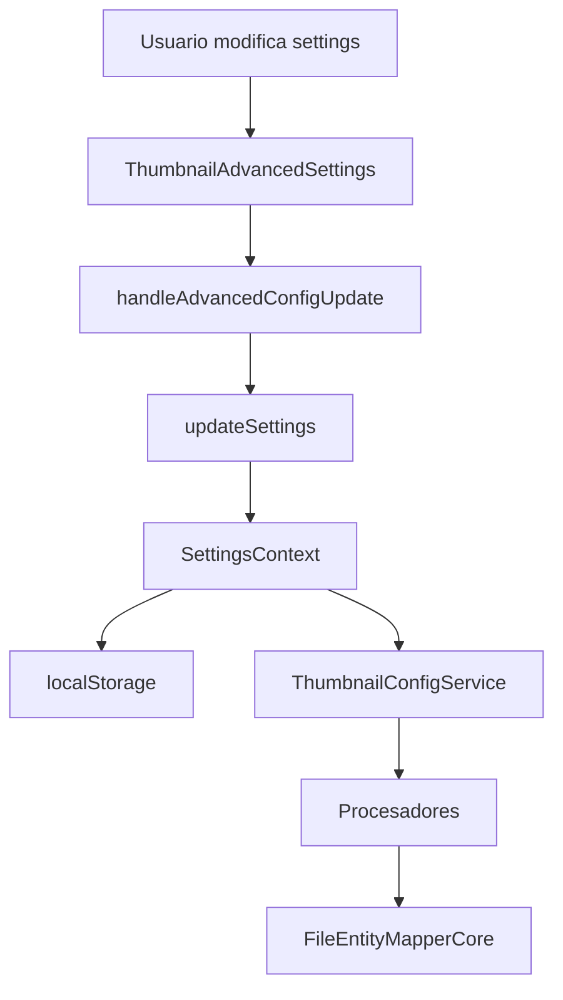

# 🎯 Sistema de Configuración Avanzada de Thumbnails

**Fecha**: 10 de octubre de 2025  
**Estado**: ✅ Implementado  
**Versión**: 1.0.0

## 📋 Resumen Ejecutivo

Se ha implementado un sistema completo de configuración avanzada para la generación de thumbnails, proporcionando control granular sobre todos los aspectos del proceso de generación, procesamiento y manejo de errores.

## 🆕 Características Implementadas

### 1. **Tipo `ThumbnailAdvancedConfig`**
📁 `src/types/thumbnails-advanced.config.ts`

Nuevo tipo TypeScript con configuración completa:

```typescript
interface ThumbnailAdvancedConfig {
  retry: ThumbnailRetryConfig;
  processing: ThumbnailProcessingConfig;
  entities: {
    video: EntityThumbnailConfig;
    audio: EntityThumbnailConfig;
    image: EntityThumbnailConfig;
    document: EntityThumbnailConfig;
    jsonFile: EntityThumbnailConfig;
    file3d: EntityThumbnailConfig;
  };
  verboseLogging: boolean;
  generateOnIndex: boolean;
  savePlaceholdersOnError: boolean;
  autoCleanOrphans: boolean;
  autoCleanInterval: number;
}
```

### 2. **Configuración por Tipo de Entidad**

Cada tipo de archivo tiene configuración independiente:

| Tipo | Timeout | Formato | Estrategia Fallback |
|------|---------|---------|-------------------|
| 🎬 Video | 30s | WebP | Aggressive |
| 🎵 Audio | 15s | PNG | Aggressive |
| 🖼️ Imagen | 10s | WebP | Conservative |
| 📄 Documento | 20s | PNG | Aggressive |
| 📝 JSON | 10s | SVG | Aggressive |
| 🎲 3D | 25s | PNG | Aggressive |

### 3. **Estrategias de Fallback**

```typescript
enum ThumbnailFallbackStrategy {
  AGGRESSIVE = 'aggressive',    // Intentar todos los fallbacks
  CONSERVATIVE = 'conservative', // Solo primer fallback
  NONE = 'none'                 // Fallar inmediatamente
}
```

### 4. **Sistema de Reintentos**

```typescript
interface ThumbnailRetryConfig {
  enabled: boolean;              // Habilitar reintentos
  maxRetries: number;            // Máximo 10 reintentos
  retryDelay: number;            // Delay base en ms
  exponentialBackoff: boolean;   // Backoff exponencial
}
```

### 5. **Configuración de Procesamiento**

```typescript
interface ThumbnailProcessingConfig {
  concurrency: number;           // 1-16 workers
  batchSize: number;             // 10-500 archivos por lote
  prioritizeRecent: boolean;     // Priorizar archivos nuevos
  pauseOnHighLoad: boolean;      // Pausar bajo carga alta
  cpuThreshold: number;          // Threshold de CPU (50-95%)
}
```

## 🎨 Componentes UI

### 1. **ThumbnailAdvancedSettings**
📁 `src/components/settings/thumbnails/thumbnail-advanced-settings.tsx`

Componente colapsable con secciones:

#### **🚀 Procesamiento**
- Slider de concurrencia (1-16)
- Slider de tamaño de lote (10-500)
- Switch para priorizar recientes

#### **🔄 Reintentos**
- Toggle para habilitar/deshabilitar
- Slider de máximo de reintentos (0-10)
- Toggle para backoff exponencial

#### **🎯 Configuración por Tipo**
Para cada tipo de entidad:
- Switch enable/disable
- Slider de timeout (5-120s)
- Selector de estrategia de fallback
- Selector de formato preferido

#### **🔧 Opciones Generales**
- Generar al indexar
- Guardar placeholders en error
- Logging detallado
- Botón de reset a defaults

### 2. **Integración en ThumbnailsSettings**
📁 `src/components/settings/thumbnails/thumbnails-settings.tsx`

- Agregado import de `ThumbnailAdvancedSettings`
- Integrado antes de las estadísticas
- Handler `handleAdvancedConfigUpdate` para persistencia

## 🔧 Servicios

### **ThumbnailConfigService**
📁 `src/services/thumbnail-config/thumbnail-config.service.ts`

Servicio singleton para acceso centralizado:

```typescript
// Obtener configuración de entidad
const videoConfig = thumbnailConfigService.getEntityConfig('video');

// Verificar fallback
const useFallback = thumbnailConfigService.shouldUseFallback('video', attemptNumber);

// Calcular delay de reintento
const delay = thumbnailConfigService.calculateRetryDelay(attemptNumber);

// Obtener concurrencia
const concurrency = thumbnailConfigService.getConcurrency();

// Logging condicional
thumbnailConfigService.log('Procesando video...', videoId);
```

### **Métodos Disponibles**

| Método | Descripción |
|--------|-------------|
| `setConfig(config)` | Actualizar configuración |
| `getConfig()` | Obtener configuración completa |
| `getEntityConfig(type)` | Obtener config específica |
| `shouldUseFallback(type, attempt)` | Verificar uso de fallback |
| `calculateRetryDelay(attempt)` | Calcular delay de reintento |
| `isRetryEnabled()` | Verificar reintentos habilitados |
| `getMaxRetries()` | Obtener máximo de reintentos |
| `getConcurrency()` | Obtener concurrencia |
| `getBatchSize()` | Obtener tamaño de lote |
| `isVerboseLogging()` | Verificar logging detallado |
| `shouldSavePlaceholders()` | Verificar guardar placeholders |
| `shouldGenerateOnIndex()` | Verificar generar al indexar |
| `subscribe(callback)` | Suscribirse a cambios |
| `log(message, ...args)` | Log condicional |
| `reset()` | Reset a defaults |

## 📊 Estructura de Datos

### **Esquema de Validación (Zod)**

```typescript
export const ThumbnailAdvancedConfigSchema = z.object({
  retry: ThumbnailRetryConfigSchema,
  processing: ThumbnailProcessingConfigSchema,
  entities: z.object({
    video: EntityThumbnailConfigSchema,
    audio: EntityThumbnailConfigSchema,
    image: EntityThumbnailConfigSchema,
    document: EntityThumbnailConfigSchema,
    jsonFile: EntityThumbnailConfigSchema,
    file3d: EntityThumbnailConfigSchema,
  }),
  verboseLogging: z.boolean(),
  generateOnIndex: z.boolean(),
  savePlaceholdersOnError: z.boolean(),
  autoCleanOrphans: z.boolean(),
  autoCleanInterval: z.number().int().min(0).max(168),
});
```

## 🔄 Flujo de Integración



## 📝 Próximos Pasos

### **Fase 1: Integración con Procesadores** ⚠️ PENDIENTE
- [ ] Modificar `VideoProcessor` para leer config
- [ ] Modificar `AudioProcessor` para leer config
- [ ] Modificar `File3DProcessor` para leer config
- [ ] Modificar `DocumentProcessor` para leer config
- [ ] Modificar `JsonProcessor` para leer config
- [ ] Modificar `ImageProcessor` para leer config

### **Fase 2: Concurrencia Dinámica** ⚠️ PENDIENTE
- [ ] Modificar `FileEntityMapperCore` para usar `getConcurrency()`
- [ ] Implementar pausado por carga alta
- [ ] Implementar priorización de archivos

### **Fase 3: Sistema de Reintentos** ⚠️ PENDIENTE
- [ ] Implementar lógica de reintentos en procesadores
- [ ] Implementar backoff exponencial
- [ ] Tracking de intentos en metadata

### **Fase 4: Stats Detalladas** ⚠️ PENDIENTE
- [ ] Agregar stats por tipo de entidad
- [ ] Gráficos de éxito/fallo por tipo
- [ ] Tiempos promedio por tipo
- [ ] Uso de fallbacks por tipo

## 🧪 Testing

### **Test Cases Necesarios**

```typescript
// Unit tests
describe('ThumbnailConfigService', () => {
  it('should calculate exponential backoff correctly');
  it('should respect fallback strategy');
  it('should notify subscribers on config change');
});

// Integration tests
describe('ThumbnailAdvancedSettings', () => {
  it('should persist config to localStorage');
  it('should update processors config');
});

// E2E tests
describe('Thumbnail Generation with Advanced Config', () => {
  it('should respect timeout settings');
  it('should use fallbacks according to strategy');
  it('should retry failed generations');
});
```

## 📚 Documentación para Desarrolladores

### **Agregar Nuevo Tipo de Entidad**

1. Agregar tipo en `ThumbnailAdvancedConfig['entities']`
2. Agregar label en `entityLabels` del componente
3. Agregar config por defecto en `DEFAULT_THUMBNAIL_ADVANCED_CONFIG`
4. Actualizar schema de validación

### **Cambiar Configuración Programáticamente**

```typescript
import { thumbnailConfigService } from '@/services/thumbnail-config';

// Actualizar concurrencia
thumbnailConfigService.setConfig({
  processing: {
    ...thumbnailConfigService.getConfig().processing,
    concurrency: 8
  }
});
```

### **Usar en Procesadores**

```typescript
import { thumbnailConfigService } from '@/services/thumbnail-config';

async generateThumbnail(entity: Video) {
  const config = thumbnailConfigService.getEntityConfig('video');
  
  // Usar timeout configurado
  const timeoutMs = config.timeout * 1000;
  
  // Verificar si usar fallback
  if (thumbnailConfigService.shouldUseFallback('video', attemptNumber)) {
    await this.tryFallback();
  }
  
  // Log condicional
  thumbnailConfigService.log('Generando thumbnail', entity.id);
}
```

## 🎯 Beneficios

### **Para Usuarios**
- ✅ Control total sobre generación de thumbnails
- ✅ Optimización de recursos (CPU, memoria)
- ✅ Mejor debugging con logging detallado
- ✅ Configuración específica por tipo de archivo

### **Para Desarrolladores**
- ✅ API centralizada y tipada
- ✅ Suscripción a cambios de configuración
- ✅ Helpers para casos comunes
- ✅ Validación con Zod

### **Para el Sistema**
- ✅ Menor carga con concurrencia ajustable
- ✅ Mejor resiliencia con reintentos
- ✅ Fallbacks configurables
- ✅ Métricas más detalladas

## 📈 Métricas de Impacto

### **Antes**
- ❌ Concurrencia hardcoded (4)
- ❌ Timeout hardcoded (30s)
- ❌ Sin reintentos
- ❌ Fallbacks no configurables

### **Después**
- ✅ Concurrencia configurable (1-16)
- ✅ Timeout por tipo (5-120s)
- ✅ Reintentos con backoff exponencial
- ✅ 3 estrategias de fallback

## 🔗 Enlaces Relacionados

- [Audit de Dependencias](__temp__THUMBNAIL-AUDIT.md)
- [Diagnóstico del Sistema](../reports/thumbnail-diagnosis-2025-10-11T01-12-33.md)
- [Configuración de Thumbnails](../src/lib/config/thumbnail.config.ts)
- [Generadores de Thumbnails](../src/config/thumbnail-generators.ts)

---

**Documentado por**: GitHub Copilot  
**Última actualización**: 10 de octubre de 2025  
**Versión**: 1.0.0
