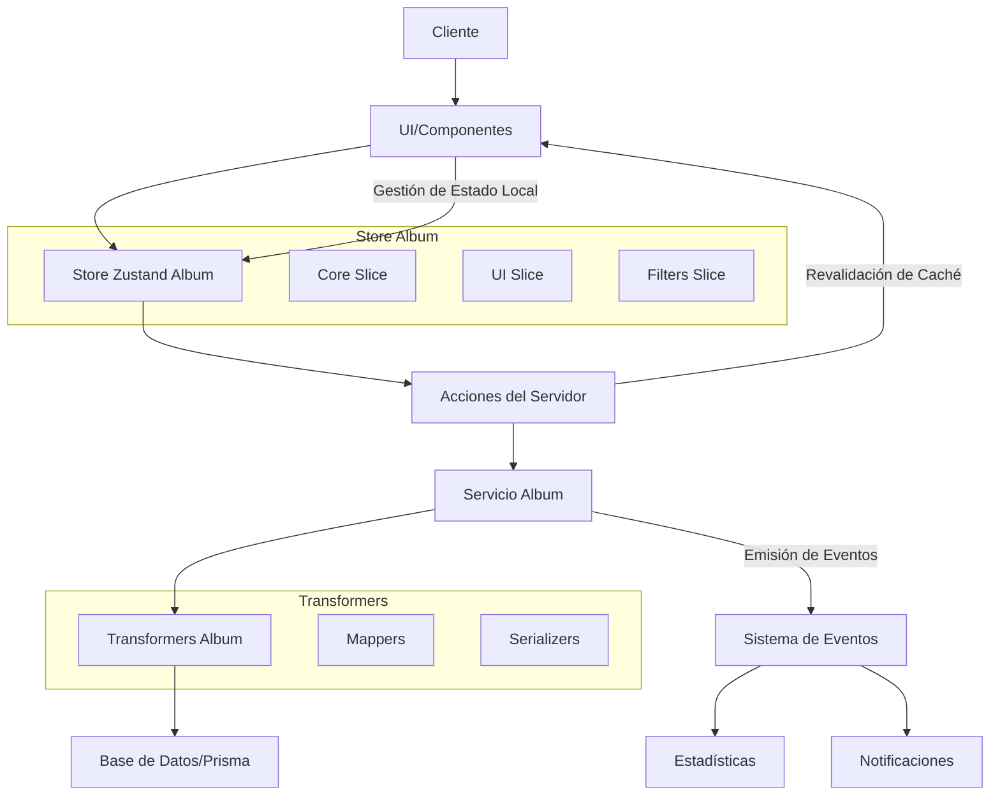

# Documentación del Componente Album

## Descripción

El componente Album proporciona la funcionalidad para gestionar álbumes de imágenes y videos en la aplicación. Permite organizar, categorizar y presentar colecciones de contenido multimedia.

## Estructura de Archivos

```
📁 src/
│
├── 📁 types/entities/album/
│   ├── 📄 index.ts         # Exportaciones principales de tipos
│   ├── 📄 types.ts         # Tipos base para Album
│   ├── 📄 enums.ts         # Enumeraciones relacionadas con Album
│   ├── 📄 extended.ts      # Tipos extendidos con relaciones
│   ├── 📄 stats-types.ts   # Tipos para estadísticas de álbumes
│   └── 📄 schema.ts        # Esquemas de validación
│
├── 📁 transformers/album/
│   ├── 📄 index.ts         # Exportaciones principales y funciones de alto nivel
│   ├── 📄 mappers.ts       # Funciones para mapear datos entre formatos
│   └── 📄 serializers.ts   # Funciones para serializar/deserializar datos
│
├── 📁 store/entities/album/
│   ├── 📄 index.ts         # Store principal con zustand
│   ├── 📄 types.ts         # Tipos para el store
│   └── 📁 slices/
│       ├── 📄 core.ts      # Slice para operaciones CRUD
│       ├── 📄 ui.ts        # Slice para estado de UI
│       └── 📄 filters.ts   # Slice para filtros y ordenamiento
│
├── 📁 services/
│   ├── 📄 album.service.ts        # Implementación funcional del servicio
│   └── 📄 album-service-export.ts # Exportación del servicio
│
├── 📁 app/actions/albums/
│   ├── 📄 index.ts              # Exportación de acciones
│   ├── 📄 album.actions.ts      # Acciones principales para álbumes
│   └── 📄 album-images.actions.ts # Acciones específicas para imágenes en álbumes
│
└── 📁 components/examples/
    └── 📄 AlbumsExample.tsx     # Componente de ejemplo
```

## Diagrama de Flujo



## Tipos Principales

### AlbumBase

```typescript
interface AlbumBase {
  id: string;
  name: string;
  emoji: string;
  color: string;
  description?: string | null;
  shortcut?: string | null;
  category: string;
  sortBy: string;
  filters: string;
  featuredImage?: string | null;
  isFavorite: boolean;
  createdAt: Date;
  updatedAt: Date;
}
```

### AlbumRelations

```typescript
interface AlbumRelations {
  images?: { id: string }[];
  videos?: { id: string }[];
  collections?: { id: string }[];
  tags?: { id: string }[];
  characters?: { id: string }[];
  places?: { id: string }[];
  worldItems?: { id: string }[];
  concepts?: { id: string }[];
  prompts?: { id: string }[];
  notes?: { id: string }[];
  wildcards?: { id: string }[];
  properties?: { id: string }[];
  groups?: { id: string }[];
}
```

### AlbumWithStats

```typescript
interface AlbumWithStats extends AlbumBase {
  _count: {
    images: number;
    groups: number;
    properties: number;
    wildcards: number;
  };
  totalSize: number;
  lastUpdated: Date;
  distribution?: Array<{
    name: string;
    count: number;
  }>;
}
```

## Servicios y Funciones Principales

### Transformers

```typescript
// Búsqueda de álbumes
searchAlbums(options: AlbumSearchOptions): Promise<AlbumSearchResult>

// Obtener álbum por ID
getAlbumById(id: string): Promise<AlbumComplete | null>

// Crear álbum
createAlbum(data: AlbumCreateInput): Promise<AlbumComplete>

// Actualizar álbum
updateAlbum(id: string, data: AlbumUpdateInput): Promise<AlbumComplete>

// Eliminar álbum
deleteAlbum(id: string): Promise<void>
```

### Servicios

```typescript
// Operaciones CRUD
albumService.get(id: string): Promise<AlbumComplete | null>
albumService.search(options: AlbumSearchOptions): Promise<AlbumSearchResult>
albumService.create(data: AlbumCreateInput): Promise<AlbumComplete>
albumService.update(id: string, data: AlbumUpdateInput): Promise<AlbumComplete>
albumService.delete(id: string): Promise<void>

// Operaciones especiales
albumService.getStats(id: string): Promise<AlbumWithStats>
albumService.addImage(albumId: string, imageId: string): Promise<void>
albumService.removeImage(albumId: string, imageId: string): Promise<void>
```

### Store Zustand

```typescript
// Operaciones principales
useAlbumStore.getState().getAlbum(id): Album | undefined
useAlbumStore.getState().getAlbums(): Album[]
useAlbumStore.getState().addAlbum(album): void
useAlbumStore.getState().updateAlbum(id, data): void
useAlbumStore.getState().deleteAlbum(id): void

// Gestión de elementos
useAlbumStore.getState().addItemToAlbum(albumId, itemId, itemType): void
useAlbumStore.getState().removeItemFromAlbum(albumId, itemId): void

// Operaciones asíncronas
useAlbumStore.getState().fetchAlbum(id): Promise<Album | undefined>
useAlbumStore.getState().fetchAlbums(): Promise<Album[]>
useAlbumStore.getState().createAlbum(data): Promise<Album | undefined>
```

## Acciones del Servidor

```typescript
// Obtener álbumes con estadísticas
getAlbums(): Promise<AlbumWithStats[]>

// Obtener un álbum específico
getAlbum(id: string): Promise<Album>

// Crear un nuevo álbum
createAlbum(data: CreateAlbumData): Promise<Album>

// Actualizar un álbum existente
updateAlbum(id: string, data: UpdateAlbumData): Promise<Album>

// Eliminar un álbum
deleteAlbum(id: string): Promise<void>

// Obtener imágenes de un álbum
getAlbumImages(id: string): Promise<FileItem[]>

// Añadir imagen a un álbum
addImageToAlbum(albumId: string, imageId: string): Promise<void>

// Eliminar imagen de un álbum
removeImageFromAlbum(albumId: string, imageId: string): Promise<void>
```

## Eventos

El componente Album emite los siguientes eventos:

- `album:created`: Cuando se crea un nuevo álbum
- `album:updated`: Cuando se actualiza un álbum existente
- `album:deleted`: Cuando se elimina un álbum
- `album:items:added`: Cuando se añaden elementos a un álbum
- `album:items:removed`: Cuando se eliminan elementos de un álbum
- `album:stats:updated`: Cuando se actualizan las estadísticas de un álbum

## Ejemplos de Uso

### Crear un Nuevo Álbum

```tsx
import albumService from '@/services/album.service';

// En un componente o acción:
const createNewAlbum = async () => {
  try {
    const newAlbum = await albumService.create({
      name: 'Vacaciones 2023',
      emoji: '🏖️',
      color: '#e67e22',
      description: 'Fotos de nuestras vacaciones de verano',
      category: 'personal',
      sortBy: 'dateCreated:desc',
      filters: '{}',
      isFavorite: true
    });

    console.log('Álbum creado:', newAlbum);
  } catch (error) {
    console.error('Error al crear álbum:', error);
  }
};
```

### Añadir Imágenes a un Álbum

```tsx
import albumService from '@/services/album.service';

// En un componente o acción:
const addImagesToAlbum = async (albumId: string, imageIds: string[]) => {
  try {
    for (const imageId of imageIds) {
      await albumService.addImage(albumId, imageId);
    }

    console.log('Imágenes añadidas al álbum');
  } catch (error) {
    console.error('Error al añadir imágenes:', error);
  }
};
```

### Usar el Store de Álbumes en un Componente

```tsx
import { useAlbumStore } from '@/store/entities/album';
import { useEffect } from 'react';

function AlbumsList() {
  // Acceder al estado y acciones del store
  const albums = useAlbumStore(state => Object.values(state.core.albums));
  const fetchAlbums = useAlbumStore(state => state.fetchAlbums);
  const isLoading = useAlbumStore(state => state.core.isLoading);

  // Cargar álbumes al montar el componente
  useEffect(() => {
    fetchAlbums();
  }, [fetchAlbums]);

  return (
    <div>
      <h2>Mis Álbumes</h2>
      {isLoading ? (
        <p>Cargando álbumes...</p>
      ) : (
        <ul>
          {albums.map(album => (
            <li key={album.id}>
              <span>{album.emoji}</span> {album.name}
            </li>
          ))}
        </ul>
      )}
    </div>
  );
}
```

## Componente de Ejemplo

Se proporciona un componente de ejemplo `AlbumsExample.tsx` que muestra cómo implementar:

1. Listado de álbumes
2. Creación de nuevos álbumes
3. Visualización detallada de un álbum
4. Edición de álbumes existentes
5. Eliminación de álbumes
6. Consulta de estadísticas

## Integración con Otras Entidades

El componente Album se integra con las siguientes entidades del sistema:

- **Image**: Los álbumes pueden contener imágenes
- **Video**: Los álbumes pueden contener videos
- **Tag**: Los álbumes pueden estar etiquetados
- **Folder**: Los álbumes pueden mostrar distribución por carpetas
- **Group**: Los álbumes pueden pertenecer a grupos
- **Collection**: Los álbumes pueden formar parte de colecciones

## Mejores Prácticas

1. Utilizar siempre los transformadores para manipular datos antes de enviarlos a la API
2. Manejar adecuadamente los errores con try/catch en cada operación
3. Implementar revalidación de rutas después de operaciones de mutación
4. Utilizar el store para estado de UI y operaciones locales
5. Emitir eventos apropiados para mantener la coherencia del sistema

## Roadmap Futuro

- Implementar soporte para álbumes anidados
- Añadir funcionalidad de compartir álbumes
- Mejorar el rendimiento de las consultas de álbumes grandes
- Implementar caché optimizada para thumbnails de álbumes
- Añadir soporte para plantillas de álbumes