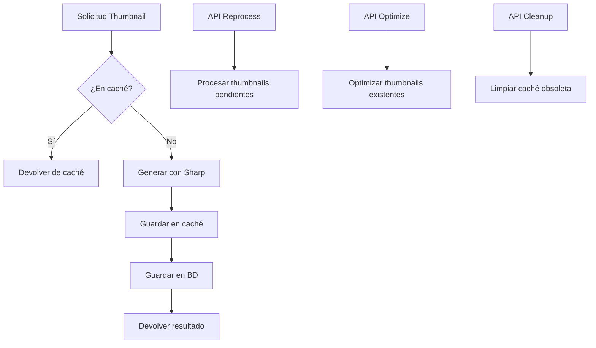

# Análisis del Sistema de Thumbnails

## Estado Actual

El sistema de miniaturas (thumbnails) está implementado principalmente en los siguientes archivos:

- `src/lib/thumbnail.ts`: Implementación principal de generación de thumbnails
- `src/lib/image.ts`: Funciones generales de procesamiento de imágenes
- `src/services/thumbnail.service.ts`: Servicio para operaciones con thumbnails
- `src/app/api/thumbnails/*`: Endpoints para procesamiento en background
- `src/config/thumbnail.config.ts`: Configuración de calidad y dimensiones

El flujo actual para la generación de miniaturas es:

1. Se solicita la generación de un thumbnail para una imagen
2. Se verifica si existe en caché (directorio `.thumbnail-cache`)
3. Si no existe, se procesa con Sharp según la configuración
4. Se almacena el resultado en caché y en la base de datos

## Arquitectura del Sistema



### Configuración Actual

```typescript
// Calidades configuradas
export enum ThumbnailQuality {
  LOW = 'low',
  MEDIUM = 'medium',
  HIGH = 'high',
}

export const THUMBNAIL_QUALITY_CONFIG = {
  [ThumbnailQuality.LOW]: {
    width: 200,
    height: 200,
    quality: 60,
  },
  [ThumbnailQuality.MEDIUM]: {
    width: 400,
    height: 400,
    quality: 75,
  },
  [ThumbnailQuality.HIGH]: {
    width: 800,
    height: 800,
    quality: 85,
  },
};
```

## Problemas Identificados

1. **Gestión de Memoria**:
   - Potencial riesgo de memory leaks durante procesamiento de imágenes grandes
   - No hay limitaciones efectivas para procesos concurrentes
   - Falta de limpieza proactiva de recursos

2. **Sistema de Caché**:
   - Caché basado en sistema de archivos sin validación periódica
   - No hay estadísticas de hit/miss rate
   - Desincronización potencial entre caché y base de datos

3. **Procesamiento en Background**:
   - Sistema de colas incompleto (uso parcial de Bull)
   - Falta de workers dedicados para procesamiento asíncrono
   - Control limitado de fallos y reintentos

4. **Optimización de Formato**:
   - Soporte limitado para formatos modernos (AVIF solo parcialmente soportado)
   - No hay adaptación automática según dispositivo/navegador
   - Configuración fija de calidad sin adaptación dinámica

5. **Monitoreo y Logging**:
   - Logs básicos sin métricas de rendimiento
   - Falta de dashboard para monitorear el estado del sistema
   - Errores capturados pero sin sistema de alertas

## Recomendaciones

### 1. Implementación Completa del Sistema de Colas

Migrar a un sistema de colas completo con Bull:

```typescript
// Configuración de cola de thumbnails
import Bull from 'bull';
import { createBullBoard } from '@bull-board/api';
import { BullAdapter } from '@bull-board/api/bullAdapter';
import { ExpressAdapter } from '@bull-board/express';

// Crear cola de procesamiento
export const thumbnailQueue = new Bull('image-thumbnails', {
  redis: {
    host: process.env.REDIS_HOST || 'localhost',
    port: Number(process.env.REDIS_PORT) || 6379,
  },
  defaultJobOptions: {
    attempts: 3,
    backoff: {
      type: 'exponential',
      delay: 1000,
    },
    removeOnComplete: true,
    removeOnFail: false,
  },
});

// Configurar procesamiento
thumbnailQueue.process(async (job) => {
  const { filePath, options } = job.data;

  // Actualizar progreso
  await job.progress(10);

  try {
    // Proceso de generación
    const thumbnail = await generateThumbnail(filePath, options);

    // Actualizar BD
    await prisma.image.update({
      where: { path: filePath },
      data: {
        thumbnail: thumbnail.buffer,
        thumbnailSize: thumbnail.size,
        thumbnailWidth: thumbnail.width,
        thumbnailHeight: thumbnail.height,
        thumbnailError: null,
      }
    });

    return { success: true, size: thumbnail.size };
  } catch (error) {
    // Gestión de errores
    console.error('Thumbnail generation failed:', error);
    throw error;
  }
});

// Configurar dashboard
const serverAdapter = new ExpressAdapter();
serverAdapter.setBasePath('/admin/queues');

createBullBoard({
  queues: [new BullAdapter(thumbnailQueue)],
  serverAdapter,
});
```

### 2. Mejora del Sistema de Caché

Implementar una estrategia de caché más robusta:

```typescript
import { LRUCache } from 'lru-cache';
import fs from 'fs/promises';
import path from 'path';

// Configuración LRU para metadatos de caché
const cacheMetadata = new LRUCache<string, ThumbnailCacheEntry>({
  max: 5000,           // Máximo número de entradas
  ttl: 1000 * 60 * 60, // 1 hora de TTL
  updateAgeOnGet: true,
  allowStale: true,
});

// Estructura para metadatos de caché
interface ThumbnailCacheEntry {
  key: string;
  path: string;
  size: number;
  width: number;
  height: number;
  format: string;
  createdAt: number;
  lastAccessed: number;
  hits: number;
}

// Implementación mejorada
async function getFromCache(cacheKey: string): Promise<ThumbnailResult | null> {
  // Verificar en memoria primero
  const metadata = cacheMetadata.get(cacheKey);
  if (!metadata) return null;

  try {
    // Verificar en disco
    const cachePath = path.join(CACHE_DIR, `${cacheKey}.${metadata.format}`);
    const buffer = await fs.readFile(cachePath);

    // Actualizar estadísticas
    metadata.hits += 1;
    metadata.lastAccessed = Date.now();
    cacheMetadata.set(cacheKey, metadata);

    return {
      buffer,
      width: metadata.width,
      height: metadata.height,
      format: metadata.format as ImageFormat,
      size: buffer.length,
    };
  } catch (error) {
    // Si falló lectura de disco, eliminar de metadatos
    cacheMetadata.delete(cacheKey);
    return null;
  }
}

// Función de mantenimiento periódico
async function maintainCache() {
  // Limpiar entradas antiguas
  const now = Date.now();
  const maxAge = 7 * 24 * 60 * 60 * 1000; // 7 días
  const oldEntries = [...cacheMetadata.values()]
    .filter(entry => (now - entry.lastAccessed) > maxAge)
    .map(entry => entry.key);

  for (const key of oldEntries) {
    const entry = cacheMetadata.get(key);
    if (entry) {
      try {
        await fs.unlink(path.join(CACHE_DIR, `${key}.${entry.format}`));
      } catch (error) {
        console.warn(`Could not delete cache file: ${key}`, error);
      }
      cacheMetadata.delete(key);
    }
  }

  // Reporte de estadísticas
  const totalEntries = cacheMetadata.size;
  const totalHits = [...cacheMetadata.values()].reduce((sum, entry) => sum + entry.hits, 0);

  console.info(`Cache maintenance complete. Entries: ${totalEntries}, Hits: ${totalHits}`);
}
```

### 3. Optimización de Formatos de Imagen

Implementar soporte avanzado para formatos modernos:

```typescript
// Detectar formato óptimo según agente de usuario
function determineOptimalFormat(userAgent: string): ImageFormat {
  if (userAgent.includes('Safari') && !userAgent.includes('Chrome')) {
    return 'jpeg'; // Safari tiene mejor soporte para JPEG que WebP
  }

  // Comprobar soporte para AVIF
  const supportsAVIF = userAgent.includes('Chrome/85') ||
                      userAgent.includes('Firefox/93');
  if (supportsAVIF) return 'avif';

  // WebP como formato por defecto para navegadores modernos
  return 'webp';
}

// Ajuste dinámico de calidad basado en contenido
async function determineOptimalQuality(imagePath: string): Promise<number> {
  const metadata = await sharp(imagePath).metadata();

  // Para imágenes con mucho detalle (como fotografías), usamos mayor calidad
  if (metadata.format === 'jpeg' || metadata.format === 'jpg') {
    return 82; // Mayor calidad para fotografías
  }

  // Para imágenes con áreas planas de color (como gráficos)
  if (metadata.format === 'png' || metadata.format === 'gif') {
    return 75; // Menor calidad es suficiente
  }

  return 80; // Calidad por defecto
}

// Procesamiento adaptativo
async function generateAdaptiveThumbnail(
  filePath: string,
  userAgent: string,
  options: Partial<ThumbnailOptions> = {}
): Promise<ThumbnailResult> {
  // Determinar formato óptimo según navegador
  const format = options.format || determineOptimalFormat(userAgent);

  // Calcular calidad óptima según contenido
  const suggestedQuality = await determineOptimalQuality(filePath);
  const quality = options.quality || suggestedQuality;

  // Generar thumbnail con parámetros optimizados
  return generateThumbnail(filePath, {
    ...options,
    format,
    quality
  });
}
```

### 4. Monitoreo y Métricas

Implementar un sistema de monitoreo completo:

```typescript
// Sistema de métricas para thumbnails
import { Counter, Gauge, Histogram } from 'prom-client';

// Definir métricas
export const thumbnailMetrics = {
  generationCount: new Counter({
    name: 'thumbnail_generation_total',
    help: 'Total number of thumbnails generated',
    labelNames: ['quality', 'format', 'status']
  }),

  cacheHits: new Counter({
    name: 'thumbnail_cache_hits_total',
    help: 'Total number of thumbnail cache hits',
  }),

  cacheMisses: new Counter({
    name: 'thumbnail_cache_misses_total',
    help: 'Total number of thumbnail cache misses',
  }),

  processingTime: new Histogram({
    name: 'thumbnail_processing_duration_seconds',
    help: 'Time spent generating thumbnails',
    buckets: [0.1, 0.5, 1, 2, 5, 10], // buckets in seconds
  }),

  queueSize: new Gauge({
    name: 'thumbnail_queue_size',
    help: 'Current size of the thumbnail processing queue',
  }),

  // Instrumentar funciones clave
  instrumentedGenerateThumbnail: async function(
    filePath: string,
    options: Partial<ThumbnailOptions> = {}
  ): Promise<ThumbnailResult> {
    const timer = this.processingTime.startTimer();

    try {
      const result = await generateThumbnail(filePath, options);
      this.generationCount.inc({
        quality: options.quality || 'medium',
        format: result.format,
        status: 'success'
      });
      return result;
    } catch (error) {
      this.generationCount.inc({
        quality: options.quality || 'medium',
        format: options.format || 'unknown',
        status: 'error'
      });
      throw error;
    } finally {
      timer();
    }
  }
};

// Actualizar periódicamente la métrica de cola
setInterval(() => {
  thumbnailQueue.getJobCounts().then(counts => {
    thumbnailMetrics.queueSize.set(
      counts.waiting + counts.active + counts.delayed
    );
  });
}, 5000);
```

## Plan de Implementación

1. **Fase 1: Implementación de Sistema de Colas**
   - Configurar instancia de Redis (o adaptador de almacenamiento)
   - Implementar Bull Queue para procesamiento de thumbnails
   - Crear panel de administración para monitoreo de colas

2. **Fase 2: Optimización de Caché**
   - Migrar a sistema LRU para metadatos
   - Implementar mantenimiento periódico
   - Añadir métricas y estadísticas

3. **Fase 3: Mejoras de Formato**
   - Implementar detección de formato óptimo
   - Añadir soporte mejorado para AVIF y WebP
   - Optimizar estrategia de calidad

4. **Fase 4: Monitoreo**
   - Implementar sistema de métricas
   - Crear dashboard para visualización
   - Configurar alertas para errores recurrentes

## Conclusión

El sistema actual de thumbnails funciona pero presenta varias oportunidades de mejora significativas. La implementación de un sistema completo de colas con Bull, una estrategia de caché más robusta, y soporte mejorado para formatos modernos resultaría en una solución más eficiente, escalable y fácil de mantener.

El procesamiento de imágenes es una tarea costosa en términos de recursos, por lo que las optimizaciones propuestas no solo mejorarían el rendimiento sino que también reducirían la carga del servidor durante operaciones masivas.