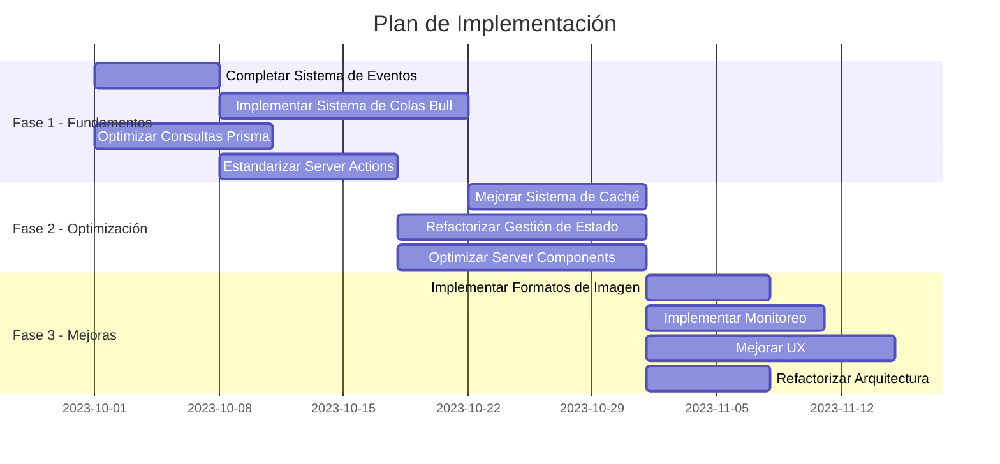

# Plan de Acción para Mejoras

## Resumen de Áreas a Mejorar

Basado en el análisis completo del proyecto Image Manager, hemos identificado cinco áreas principales que requieren mejoras:

1. **Sistema de Procesamiento de Imágenes y Thumbnails**
2. **Gestión de Estado y Caché**
3. **Server Components y Server Actions**
4. **Arquitectura y Organización del Código**
5. **Experiencia de Usuario y Rendimiento**

## Priorización de Tareas

Las tareas están categorizadas por prioridad (Alta, Media, Baja) y complejidad (Alta, Media, Baja):

### Prioridad Alta

1. **Completar el Sistema de Eventos** (Complejidad: Media)

   - Finalizar migración según docs/progress.md
   - Implementar tipado estricto para eventos
   - Estandarizar emisión y manejo de eventos

2. **Implementar Sistema de Colas Bull** (Complejidad: Alta)

   - Configurar Redis para colas de procesamiento
   - Implementar workers dedicados
   - Crear panel de administración con @bull-board

3. **Optimizar Consultas Prisma** (Complejidad: Media)

   - Auditar y optimizar consultas existentes
   - Implementar paginación y filtros eficientes
   - Mejorar manejo de relaciones

4. **Estandarizar Server Actions** (Complejidad: Media)
   - Implementar patrón con validación Zod
   - Mejorar manejo de errores
   - Estandarizar revalidación

### Prioridad Media

5. **Mejorar Sistema de Caché** (Complejidad: Alta)

   - Implementar sistema LRU para metadatos
   - Establecer estrategia de caché por tipo de datos
   - Optimizar invalidación

6. **Refactorizar Gestión de Estado** (Complejidad: Media)

   - Estandarizar stores Zustand
   - Implementar estrategia optimizada para React Query
   - Separar estado UI vs estado de datos

7. **Optimizar Server Components** (Complejidad: Media)

   - Auditar y refactorizar componentes
   - Establecer límites claros entre Server/Client
   - Reducir JavaScript innecesario en cliente

8. **Implementar Formatos de Imagen Modernos** (Complejidad: Media)
   - Añadir soporte mejorado para AVIF
   - Implementar detección de formato óptimo
   - Optimizar estrategia de calidad

### Prioridad Baja

9. **Implementar Monitoreo y Métricas** (Complejidad: Alta)

   - Añadir sistema de métricas
   - Crear dashboard para visualización
   - Configurar alertas para errores

10. **Mejorar Experiencia de Usuario** (Complejidad: Media)

    - Implementar animaciones con Motion
    - Mejorar accesibilidad
    - Optimizar para dispositivos móviles

11. **Refactorizar Arquitectura de Carpetas** (Complejidad: Baja)
    - Reorganizar estructura para mayor claridad
    - Mejorar nombrado de archivos
    - Consolidar componentes similares

## Roadmap de Implementación

## Detalles de Implementación por Fase

### Fase 1: Fundamentos (4-6 semanas)

**Objetivo**: Establecer una base sólida para el resto de mejoras abordando problemas críticos.

1. **Completar Sistema de Eventos**

   - Seguir plan en docs/progress.md
   - Implementar tipos estrictos para eventos
   - Refactorizar para emisión consistente

2. **Implementar Sistema de Colas Bull**

   - Instalar y configurar Redis
   - Implementar colas para procesamiento de imágenes
   - Crear workers dedicados
   - Implementar panel de administración

3. **Optimizar Consultas Prisma**

   - Auditar consultas existentes
   - Implementar paginación y filtrado
   - Optimizar relaciones y includes

4. **Estandarizar Server Actions**
   - Implementar patrón con Zod
   - Estandarizar manejo de errores
   - Establecer estrategia de revalidación

### Fase 2: Optimización (4-6 semanas)

**Objetivo**: Optimizar rendimiento y experiencia de usuario mejorando sistemas clave.

1. **Mejorar Sistema de Caché**

   - Implementar sistema LRU para metadatos
   - Establecer estrategia de limpieza
   - Añadir métricas y estadísticas

2. **Refactorizar Gestión de Estado**

   - Estandarizar stores Zustand
   - Optimizar React Query
   - Implementar hooks para Server Actions

3. **Optimizar Server Components**
   - Auditar uso actual
   - Refactorizar límites Server/Client
   - Implementar estrategia de streaming

### Fase 3: Mejoras (3-4 semanas)

**Objetivo**: Añadir características avanzadas y pulir la aplicación.

1. **Implementar Formatos de Imagen Modernos**

   - Añadir soporte AVIF
   - Implementar detección automática
   - Optimizar calidad/tamaño

2. **Implementar Monitoreo**

   - Añadir métricas de rendimiento
   - Crear dashboard
   - Configurar alertas

3. **Mejorar UX**

   - Implementar animaciones
   - Mejorar accesibilidad
   - Optimizar para móviles

4. **Refactorizar Arquitectura**
   - Reorganizar estructura
   - Mejorar nombrado
   - Consolidar componentes similares

## Beneficios Esperados

1. **Rendimiento**

   - Reducción de tiempos de carga en 30-50%
   - Mejora en la eficiencia de procesamiento de imágenes
   - Menor consumo de memoria

2. **Experiencia de Usuario**

   - Interfaz más fluida con animaciones
   - Mejor accesibilidad
   - Soporte mejorado para móviles

3. **Mantenibilidad**

   - Código más estructurado y predecible
   - Tipado estricto para reducir errores
   - Patrones consistentes

4. **Escalabilidad**
   - Mejor manejo de grandes volúmenes de imágenes
   - Procesamiento en segundo plano
   - Monitoreo y alertas

## Conclusión

Este plan de acción proporciona una hoja de ruta clara para mejorar significativamente la aplicación Image Manager. Las mejoras propuestas abordan tanto problemas técnicos como de experiencia de usuario, y están organizadas para proporcionar valor incremental en cada fase.

El enfoque en fases permite realizar las mejoras más críticas primero, estableciendo una base sólida para optimizaciones futuras. Al finalizar la implementación, el proyecto será más rápido, mantenible y proporciona una mejor experiencia de usuario.
