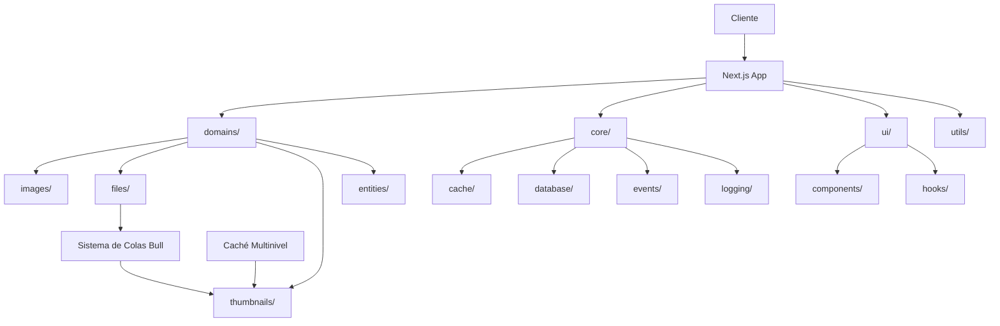

# Análisis del Proyecto Image Manager

Este directorio contiene una serie de documentos que analizan el estado actual del proyecto Image Manager y proponen mejoras en diferentes áreas.

## Índice de Documentos

1. [**Análisis General**](./01-analisis-general.md) - Visión general del proyecto, sus fortalezas y áreas de mejora
2. [**Gestión de Estado**](./02-gestion-estado.md) - Análisis de la implementación de Zustand y React Query
3. [**Sistema de Thumbnails**](./03-sistema-thumbnails.md) - Evaluación del sistema de miniaturas y procesamiento de imágenes
4. [**Server Components y Actions**](./04-server-components-actions.md) - Análisis de la implementación de Server Components y Server Actions
5. [**Plan de Acción**](./05-plan-accion.md) - Plan detallado de implementación con priorización de tareas
6. [**Estructura de Carpetas**](./06-analisis-estructura-carpetas.md) - Análisis de la estructura actual de carpetas y propuesta de reorganización
7. [**Refactorización de Archivos Grandes**](./07-refactorizacion-archivos-grandes.md) - Plan para dividir archivos excesivamente grandes
8. [**Optimización del Sistema de Caché**](./08-optimizacion-sistema-cache.md) - Mejoras propuestas para el sistema de caché

## Resumen Ejecutivo

El proyecto Image Manager está construido con tecnologías modernas (Next.js 15, React 19, Prisma, TailwindCSS 4) y tiene una base sólida, pero se han identificado varias áreas con potencial de mejora:

1. **Sistema de Procesamiento de Imágenes**: Optimización del sistema de thumbnails y mejora del procesamiento en segundo plano
2. **Gestión de Estado**: Estandarización de stores Zustand y optimización de React Query
3. **Server Components y Actions**: Mejora en la implementación para seguir las mejores prácticas de Next.js 15
4. **Arquitectura**: Refinamiento de la organización del código y patrones de diseño
5. **Experiencia de Usuario**: Mejoras en rendimiento, accesibilidad y soporte móvil
6. **Estructura de Carpetas**: Reorganización hacia una estructura orientada a dominios
7. **Refactorización de Código**: División de archivos grandes en módulos más pequeños y enfocados
8. **Sistema de Caché**: Optimización del sistema de caché para mejorar rendimiento y persistencia

## Metodología de Análisis

El análisis se ha realizado siguiendo estos pasos:

1. **Revisión de Código**: Evaluación del código base actual
2. **Identificación de Patrones**: Análisis de patrones comunes utilizados
3. **Comparación con Mejores Prácticas**: Contraste con las mejores prácticas de la industria
4. **Benchmarking**: Evaluación de rendimiento en puntos clave
5. **Priorización**: Clasificación de problemas por impacto y complejidad

## Principales Recomendaciones

Los documentos detallados proporcionan recomendaciones específicas, pero a nivel general se recomienda:

1. **Completar la Migración del Sistema de Eventos** según el documento de progreso existente
2. **Implementar un Sistema de Colas Completo con Bull** para el procesamiento en segundo plano
3. **Estandarizar Patrones de Server Actions** con mejor manejo de errores y validación
4. **Optimizar las Consultas a Prisma** para mejorar el rendimiento
5. **Refactorizar la Gestión de Estado** para mayor consistencia y mantenibilidad
6. **Reorganizar la Estructura de Carpetas** hacia un enfoque orientado a dominios
7. **Dividir los Archivos Grandes** en módulos más pequeños y enfocados
8. **Mejorar el Sistema de Caché** con una implementación más robusta y eficiente

## Próximos Pasos

Ver el [Plan de Acción](./05-plan-accion.md) para un detalle completo de la implementación propuesta, incluyendo:

- Priorización de tareas
- Estimación de complejidad
- Roadmap de implementación
- Beneficios esperados

## Diagrama de Arquitectura Propuesta

Este análisis proporciona un punto de partida para la mejora continua del proyecto Image Manager, con un enfoque en estabilidad, rendimiento, mantenibilidad y escalabilidad.