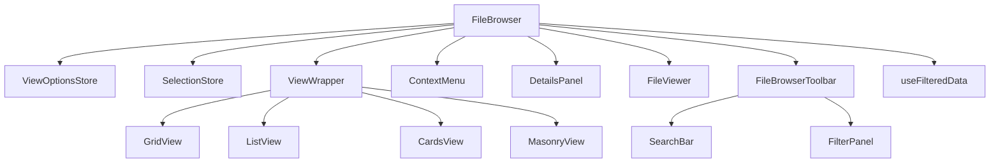

# Arquitectura del FileBrowser

> **🔄 ESTADO DE MIGRACIÓN**: Este proyecto está en proceso de migración de Next.js a Vite + React y de Prisma a Drizzle ORM. Ver [documentación de migración](./migration-drizzle/) para detalles sobre la coexistencia temporal de ambos ORMs.

## Visión general

El FileBrowser es un componente central para la visualización y gestión de archivos en la aplicación. Está diseñado con una arquitectura modular que separa las preocupaciones y permite una fácil extensión y mantenimiento.



## Componentes principales

### 1. FileBrowser

El componente principal que orquesta todos los demás componentes. Sus responsabilidades son:
- Gestionar el estado de selección de archivos
- Manejar la navegación y visualización de carpetas
- Coordinar las interacciones entre componentes
- Proporcionar la interfaz para acciones como seleccionar, mover, eliminar, etc.

### 2. Stores (Zustand)

#### ViewOptionsStore
Gestiona las preferencias de visualización:
- Modo de vista (grid, list, cards, masonry)
- Tamaño de los elementos
- Opciones de ordenación
- Opciones de filtrado
- Consulta de búsqueda

```typescript
type ViewOptionsState = {
  viewMode: 'grid' | 'list' | 'cards' | 'masonry';
  itemSize: number;
  sortOptions: { field: string; direction: 'asc' | 'desc' }[];
  filterOptions: { field: string; value: any; operator: string }[];
  searchQuery: string;
  // Acciones
  setViewMode: (mode: string) => void;
  setItemSize: (size: number) => void;
  // etc.
}
```

#### SelectionStore
Gestiona la selección de archivos:
- IDs de elementos seleccionados
- ID del elemento activo
- Historial de selección para operaciones como deshacer/rehacer

```typescript
type SelectionState = {
  selectedIds: string[];
  activeId: string | null;
  // Acciones
  selectAll: (ids: string[]) => void;
  clearSelection: () => void;
  toggleSelectedId: (id: string) => void;
  setSelectedIds: (ids: string[]) => void;
  // etc.
}
```

### 3. Vistas

#### GridView
Muestra los elementos en una cuadrícula, optimizado para imágenes.

#### ListView
Muestra los elementos en una lista con detalles adicionales.

#### CardsView
Muestra los elementos como tarjetas con información resumida.

#### MasonryView
Muestra imágenes en un diseño de mosaico que se adapta al tamaño de cada imagen.

### 4. Sistema de Filtrado y Búsqueda

#### SearchBar
Componente para búsqueda por texto con debounce integrado.

#### FilterPanel
Panel de filtros avanzados que permite aplicar múltiples tipos de filtros.

#### useFilteredData
Hook que aplica filtros, búsqueda y ordenación a los datos.

```typescript
function useFilteredData<T extends FileItem[]>(
  data: T,
  searchFields: string[] = ['name', 'description', 'tags']
): T {
  // Obtener opciones del store
  const filterOptions = useViewOptionsStore((state) => state.filterOptions);
  const sortOptions = useViewOptionsStore((state) => state.sortOptions);
  const searchQuery = useViewOptionsStore((state) => state.searchQuery);

  // Aplicar filtros y devolver datos filtrados
  return useMemo(() => {
    // Lógica de filtrado...
    return filteredData as T;
  }, [data, filterOptions, sortOptions, searchQuery, searchFields]);
}
```

### 5. Panel de Detalles

El panel de detalles permite visualizar y editar información sobre los elementos seleccionados:

#### DetailsPanel
Componente principal que gestiona la visualización de detalles para uno o múltiples elementos.

#### MultipleSelectionInfo
Muestra información agregada cuando se seleccionan múltiples elementos, incluyendo acciones masivas.

#### EditableMetadata
Permite editar metadatos básicos (título y descripción) de un elemento individual.

#### BulkMetadataEditor
Permite aplicar cambios de metadatos a múltiples elementos seleccionados a la vez.

```typescript
// Ejemplo de integración con Server Actions para guardar metadatos
const handleUpdateMetadata = useCallback(
  async (id: string, data: { title?: string; description?: string }) => {
    return updateImageMetadata(id, {
      title: data.title,
      description: data.description,
    });
  },
  []
);
```

### 6. Componentes de soporte

#### VirtualizerWrapper
Proporciona virtualización para manejar grandes cantidades de elementos sin problemas de rendimiento.

#### ContextMenu
Menú contextual para acciones específicas en cada elemento.

#### ImageRenderer
Componente optimizado para la carga y visualización de imágenes.

#### FileBrowserToolbar
Barra de herramientas que integra búsqueda, filtros, selección y acciones sobre archivos.

## Flujo de datos

1. El usuario interactúa con la interfaz (selecciona un elemento, cambia el modo de vista, etc.)
2. La acción se procesa en el componente FileBrowser o se envía directamente al store correspondiente
3. Los stores actualizan su estado
4. Los componentes que dependen de ese estado se renderizan nuevamente

## Integración con otros sistemas

- **DetailsPanel**: Muestra información detallada de los elementos seleccionados
- **FileViewer**: Permite visualizar imágenes y otros archivos en pantalla completa
- **Server Actions**: Para operaciones que requieren interacción con el servidor

## Extensibilidad

La arquitectura está diseñada para ser extensible:
- Se pueden añadir nuevos modos de vista implementando componentes adicionales
- Las acciones del menú contextual se pueden ampliar según las necesidades
- Los stores pueden extenderse para soportar nuevas funcionalidades
- Se pueden añadir nuevos tipos de filtros implementando renderizadores adicionales

## Rendimiento

- Virtualización para manejar grandes cantidades de elementos
- Memorización de componentes y funciones para evitar renderizados innecesarios
- Carga progresiva de imágenes
- Optimización de eventos para evitar recálculos costosos
- Debounce en búsqueda para evitar actualizaciones excesivas

## Accesibilidad

- Soporte para navegación por teclado
- Etiquetas ARIA apropiadas
- Contraste adecuado para elementos visuales
- Mensajes de estado para lectores de pantalla

## Componentes integrados

Para facilitar el uso del FileBrowser, se proporcionan componentes integrados que combinan varias funcionalidades:

### IntegratedFileBrowser

Combina el FileBrowser con la barra de herramientas y el sistema de filtrado:

```tsx
<IntegratedFileBrowser
  items={files}
  isLoading={isLoading}
  onItemSelect={handleSelect}
  onItemDoubleClick={handleOpen}
  showSearch={true}
  showFilters={true}
  showDetailsToggle={true}
  filters={customFilters}
/>
```

Este componente proporciona una experiencia completa de navegación de archivos con todas las funcionalidades integradas.