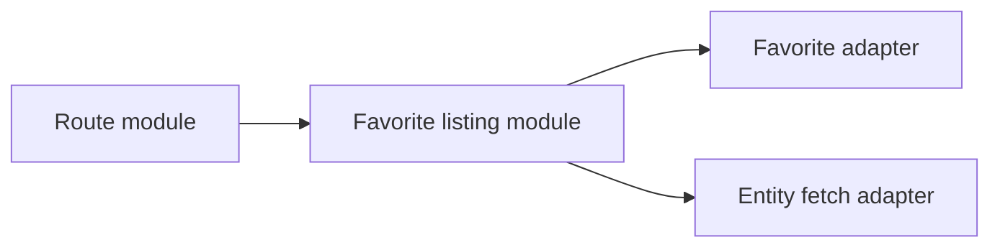

# Architecture review — media-manager

Date: 2026-05-29

## Documentation fan-out

- Task tracker: `docs/architecture/WORKPLAN.md`
- ADR-0008: `docs/adr/0008-favorite-listing-seam-and-facade-retirement.md`
- ADR-0009: `docs/adr/0009-filesystem-sync-real-seam-with-adapters.md`

Estado actual:

- Recomendaciones aceptadas por usuario.
- Slices activos en ejecución: Recommendation 1, 2, 3, 4, 5 y 6.
- Ver estado operativo en `docs/architecture/WORKPLAN.md`.

## Summary

- El mayor punto de fricción está en modules de listado y favorito: la interface pública repite parsing, ordenado, paginación, lookup de favoritos y proyección de `isFavorite` en muchos callers.
- Hay modules **shallow** en seams críticos: `src/server/routes/*.effect.ts` y `src/server/routes/worldbuilding.effect.ts` exponen interfaces grandes con implementation duplicada.
- En filesystem sync existe un seam nominal (`FileSystemSync`) sin adapters reales; la implementation vive repartida entre modules con acceso directo a FS + DB.
- El App Shell está funcional pero la interface está repartida entre `main.tsx`, `App.tsx`, `app-provider.tsx` y providers especializados, bajando locality para cambios de runtime.

## Recommendations

### 1) Deepen el module de Favorite Listing/Projection en el seam HTTP

**Recommendation strength**: Strong

**Files**

- `src/server/routes/albums.effect.ts`
- `src/server/routes/characters.effect.ts`
- `src/server/routes/worldbuilding.effect.ts`
- `src/server/routes/images.effect.ts`
- `src/server/routes/videos.effect.ts`
- `src/server/utils/favorite-route.ts`
- `src/services/favorite/favorite.service.ts`

**Problem**

El comportamiento de favoritos está fragmentado entre múltiples modules. Algunos callers usan `listFavoriteEntities`, otros reimplementan la misma idea (`images`/`videos`), y además persisten rutas `/:id/favorite` por entidad. La interface que un caller debe conocer para “listar con favoritos” es más grande de lo necesario.

**Solution**

Deepen un module único de listing/projection de favoritos para consumo HTTP: un seam que reciba filtros/sort/paginación y devuelva datos + metadata paginada para cualquier `FavoriteEntityType`. Los callers de rutas pasan a delegar toda la variación de favorito en ese module.

**Benefits**

- locality: reglas de favoritos y paginación viven en un solo module.
- leverage: un caller obtiene listado favorito completo sin repetir implementation.
- testability: tests atraviesan una sola interface para favoritos en listados, en vez de testear N rutas por separado.

**Before / After**

Before: cada route module combina parsing + favorite lookup + entity hydration + sort.

After: route modules sólo traducen request/response; el comportamiento favorito vive detrás de un seam único.

**Dependencies / sequencing**

- Primero unificar `images` y `videos` con el mismo module usado por `albums/characters/worldbuilding`.
- Después reducir facades por entidad (`/:id/favorite`) donde ya exista contrato canónico.
- Desbloquea borrado de implementation duplicada en rutas.

**Documentation follow-ups**

- Actualizar `CONTEXT.md` con término explícito para este seam (si se introduce uno nuevo).
- Revisar `docs/adr/0002-context-owned-apis-and-transitional-facades.md` con estado de facades retiradas.
- Crear/actualizar tracker en `docs/architecture/WORKPLAN.md`.

---

### 2) Deepen `worldbuilding.effect` en modules por capacidad en lugar de un module agregado

**Recommendation strength**: Strong

**Files**

- `src/server/routes/worldbuilding.effect.ts`
- `src/server/routes/places.effect.ts` (objetivo)
- `src/server/routes/concepts.effect.ts` (objetivo)
- `src/server/routes/prompts.effect.ts` (objetivo)
- `src/server/index.ts`

**Problem**

`worldbuilding.effect.ts` agrupa `places`, `concepts` y `prompts` en un solo module con bloques casi idénticos de interface/implementation. Cambiar una regla de listado o favorito obliga a navegar un archivo largo y repetir ajustes en tres secciones.

**Solution**

Deepen separando por capacidad (`place`, `concept`, `prompt`) con un module base compartido para el patrón de listado + favoritos. El seam de cada capacidad queda pequeño; la variación real queda en adapters por tipo.

**Benefits**

- locality: bugs y cambios de una capacidad dejan de contaminar el mega-module.
- leverage: el module base compartido evita triplicar implementation.
- testability: pruebas por capacidad cruzan interfaces más pequeñas y estables.

**Before / After**

Before: un module contiene tres mini-sistemas con reglas repetidas.

After: tres modules profundos por capacidad + un module compartido para patrón de listado.

**Dependencies / sequencing**

- Depende de la recomendación 1 para no duplicar otra vez favorito.
- Desbloquea limpieza en `src/server/index.ts` y ownership más claro por capacidad.

**Documentation follow-ups**

- Actualizar `docs/core/ARCHITECTURE.md` con nuevo mapa de seams HTTP por capacidad.
- Si se redefine ownership de rutas, considerar ADR breve en `docs/adr/`.
- Reflejar progreso por capacidad en `docs/architecture/WORKPLAN.md`.

---

### 3) Convertir `FileSystemSync` de seam hipotético a seam real con adapters explícitos

**Recommendation strength**: Strong

**Files**

- `src/lib/filesystem/sync-interface.ts`
- `src/lib/filesystem/file-sync.service.ts`
- `src/lib/filesystem/folder-sync.ts`
- `src/lib/filesystem/folder-scanner.ts`
- `src/lib/filesystem/index.ts`

**Problem**

Existe una interface `FileSystemSync`, pero no hay adapters que la implementen. La implementation real está distribuida en modules con mezcla de filesystem scanning, reglas de reconciliación y persistencia en DB. El seam actual no ofrece leverage; sólo documenta intención.

**Solution**

Deepen un module de sincronización con una interface real y al menos dos adapters visibles (por ejemplo, adapter de scanner y adapter de persistencia). `folder-sync` y `file-sync` delegan orquestación al module profundo en vez de mezclar reglas de dominio operativo con detalles de infraestructura.

**Benefits**

- locality: reglas de reconciliación y cleanup quedan concentradas.
- leverage: callers disparan sync sin conocer detalles de DB/FS.
- testability: se pueden ejecutar tests deterministas del seam usando adapter in-memory (segundo adapter = seam real).

**Before / After**

Before: interface sin implementación efectiva + implementation repartida.

After: seam real con adapters concretos y orquestación central.

**Dependencies / sequencing**

- Requiere decidir el contrato mínimo de `FolderSyncResult`/errores en un solo module.
- Desbloquea reducción de complejidad en `folder-sync.ts` (especialmente limpieza en cascada).

**Documentation follow-ups**

- Actualizar `CONTEXT.md` si aparece nueva terminología en Platform Process de sync.
- Evaluar ADR si se fija una estructura de adapters difícil de revertir.
- Agregar tareas por fase (extract/adapt/delete) en `docs/architecture/WORKPLAN.md`.

---

### 4) Deepen el App Shell module para concentrar composición de runtime

**Recommendation strength**: Worth exploring

**Files**

- `src/main.tsx`
- `src/App.tsx`
- `src/providers/app-provider.tsx`
- `src/providers/ViewTransitionProvider.tsx`
- `src/components/ui/theme-provider.tsx`
- `src/platform/app-shell-structure-plan.ts`

**Problem**

La composición global del runtime está repartida entre bootstrap (`main.tsx`), provider bundle (`app-provider.tsx`) y shell visual (`App.tsx`). El plan arquitectónico existe, pero la interface operativa sigue distribuida; cambiar orden o ownership de providers exige tocar varios modules.

**Solution**

Deepen un App Shell module canónico que posea la interface de composición (providers globales + router + bootstrap transversales). Los otros modules quedan como adapters internos de ese seam.

**Benefits**

- locality: composición global en un punto de cambio.
- leverage: agregar/quitar capacidades transversales sin cazar wiring en tres lugares.
- testability: smoke tests del shell cruzan una sola interface de composición.

**Before / After**

Before: caller necesita conocer `main` + `AppProvider` + `App` para entender runtime.

After: caller conoce un solo seam del App Shell.

**Dependencies / sequencing**

- No bloquea slices de dominio; puede correr en paralelo con recomendaciones 1–3.
- Desbloquea enforcement real del plan en `src/platform/`.

**Documentation follow-ups**

- Sincronizar `docs/planning/context-architecture/02-platform-system-context.md` con estado real.
- Si el seam del shell cambia de forma no obvia, registrar ADR en `docs/adr/`.
- Trackear migración en `docs/architecture/WORKPLAN.md`.

---

### 5) Deepen content-delivery module para streaming binario y mapping de errores

**Recommendation strength**: Worth exploring

**Files**

- `src/server/routes/images.effect.ts`
- `src/server/routes/videos.effect.ts`
- `src/lib/effect/adapters/express.adapter.ts`
- `src/server/utils/mime.ts`

**Problem**

Los endpoints de contenido/thumbnail implementan manejo de errores y streaming con variaciones locales (incluyendo `require(...)` dentro de handlers). La interface para “servir binario” no está consolidada; cada caller define su propio patrón.

**Solution**

Deepen un module de content delivery que encapsule negociación de mime, headers, fallback y mapping de errores. Las rutas sólo delegan al seam y traducen parámetros.

**Benefits**

- locality: reglas HTTP de binarios en un module.
- leverage: un mismo contrato para imagen/video/documentos.
- testability: tests de cabeceras/status/fallback cruzan un seam común, no N handlers.

**Before / After**

Before: handlers mezclan lógica de dominio, IO y respuesta HTTP.

After: handlers finos + module profundo de delivery.

**Dependencies / sequencing**

- Conviene ejecutar después de recomendación 1 para reutilizar patrón de seam HTTP común.
- Desbloquea simplificación de handlers largos en `images` y `videos`.

**Documentation follow-ups**

- Actualizar guía técnica (`docs/core/API-REFERENCE.md` o equivalente) con contrato de delivery.
- Si se define política transversal de errores binarios, considerar ADR.

---

### 6) Deepen route registry module en backend para reducir wiring manual

**Recommendation strength**: Speculative

**Files**

- `src/server/index.ts`
- `src/server/routes/**/*.ts`

**Problem**

`src/server/index.ts` concentra un registro largo y manual de routes con mezcla de slices migrados y transicionales. La interface del registry es extensa y sensible a drift cuando crecen capacidades.

**Solution**

Deepen un route registry module declarativo por contexto/capacidad que compile el wiring final. `server/index.ts` quedaría como bootstrap mínimo.

**Benefits**

- locality: alta/baja de routes en un catálogo único.
- leverage: menos riesgo de inconsistencias al migrar slices.
- testability: tests de wiring cruzan un solo seam (catálogo + bootstrap).

**Before / After**

Before: wiring explícito línea por línea en el bootstrap.

After: bootstrap del servidor delega a un module de registry.

**Dependencies / sequencing**

- Recomendable después de separar modules grandes de rutas (recomendación 2).
- Desbloquea enforcement de ownership por contexto.

**Documentation follow-ups**

- Actualizar `docs/core/ARCHITECTURE.md` con seam de route registry.
- Añadir tareas de migración de rutas al `WORKPLAN`.

## Suggested execution order

1. **Recommendation 1** (Favorite Listing/Projection) — mayor leverage inmediato y reduce duplicación transversal que hoy bloquea otros deepening.
2. **Recommendation 2** (`worldbuilding.effect` split) — aprovecha el seam de favoritos ya consolidado para cortar un module largo sin reintroducir duplicación.
3. **Recommendation 3** (`FileSystemSync` real seam) — ataca deuda operativa profunda con alto impacto en locality y testability.
4. **Recommendation 5** (content-delivery module) — consolida patrones HTTP binarios una vez ordenados seams de rutas base.
5. **Recommendation 4** (App Shell module) — mejora composición global sin bloquear dominio; puede avanzarse en paralelo parcial.
6. **Recommendation 6** (route registry) — último paso para capturar nueva estructura y evitar drift futuro.

## Notes on ADR alignment

- Alinea con ADR-0002: reduce facades transicionales de favoritos una vez consolidado seam canónico.
- Alinea con ADR-0003: favorece slices acotados (favorite, worldbuilding routes, filesystem sync).
- Alinea con ADR-0001: mejora ownership por contexto sin big bang global.

Backlinks:

- `docs/architecture/WORKPLAN.md`
- `docs/adr/0008-favorite-listing-seam-and-facade-retirement.md`
- `docs/adr/0009-filesystem-sync-real-seam-with-adapters.md`
