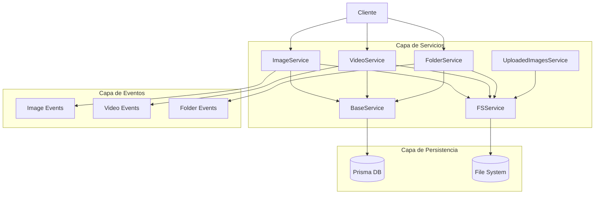
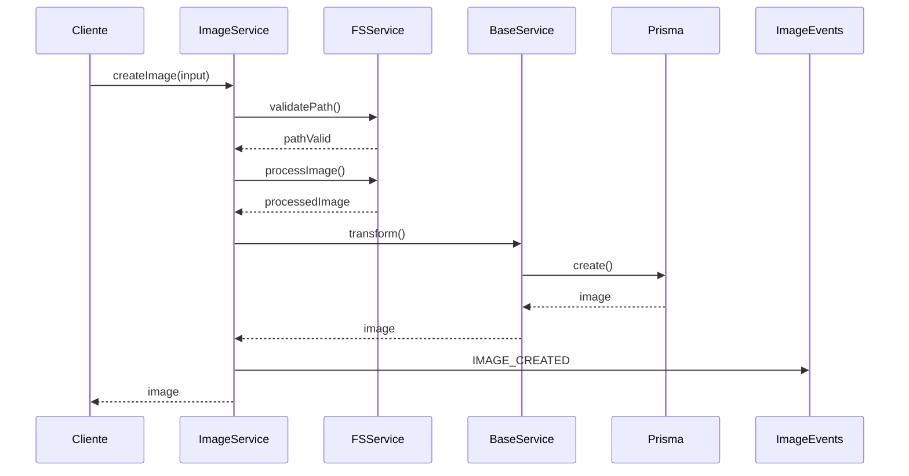
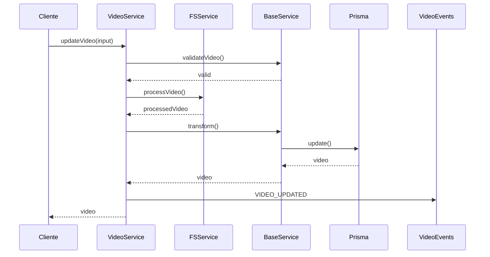
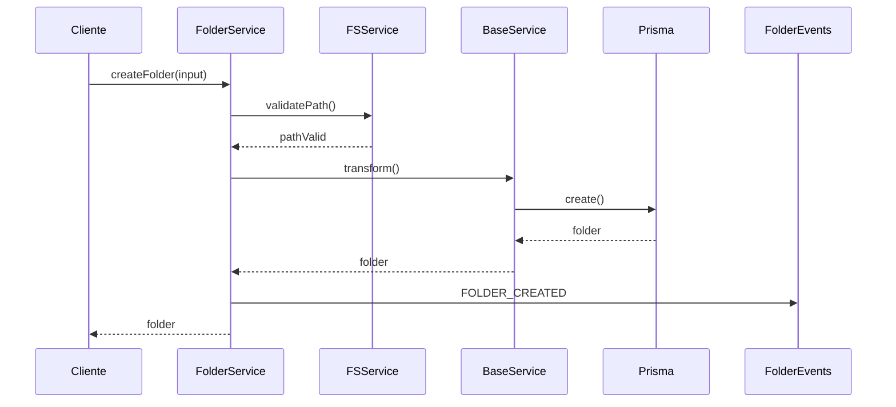

# Arquitectura de Servicios

## Descripción General
Este documento describe la arquitectura y el flujo de datos de los servicios principales del sistema de gestión de imágenes.

## Diagrama General de Servicios



## Servicios Principales

### BaseService
- **Propósito**: Servicio base que proporciona funcionalidad común para otros servicios
- **Responsabilidades**:
  - Manejo de errores común
  - Conexión con Prisma
  - Logging centralizado
  - Transformaciones básicas

### FSService
- **Propósito**: Gestión de operaciones del sistema de archivos
- **Responsabilidades**:
  - Validación de rutas
  - Verificación de tipos de archivo
  - Operaciones CRUD en el sistema de archivos
  - Manejo de permisos

### ImageService
- **Propósito**: Gestión de imágenes
- **Responsabilidades**:
  - CRUD de imágenes
  - Procesamiento de imágenes
  - Generación de miniaturas
  - Manejo de metadatos
  - Eventos relacionados con imágenes

### VideoService
- **Propósito**: Gestión de videos
- **Responsabilidades**:
  - CRUD de videos
  - Procesamiento de videos
  - Manejo de metadatos
  - Control de reproducción
  - Eventos relacionados con videos

### FolderService
- **Propósito**: Gestión de carpetas
- **Responsabilidades**:
  - CRUD de carpetas
  - Organización jerárquica
  - Manejo de permisos
  - Eventos relacionados con carpetas

### UploadedImagesService
- **Propósito**: Gestión de carga de imágenes
- **Responsabilidades**:
  - Procesamiento de carga
  - Validación de archivos
  - Optimización de imágenes
  - Eventos de carga

## Flujo de Datos

### Creación de Imagen


### Actualización de Video


### Gestión de Carpetas


## Patrones de Implementación

### Singleton
- Utilizado en servicios que requieren una única instancia
- Ejemplo: UploadedImagesService

### Event-Driven
- Sistema de eventos para notificar cambios
- Permite desacoplamiento entre componentes

### Repository Pattern
- Abstracción de la capa de datos
- Implementado a través de BaseService

### Factory Pattern
- Creación de instancias de entidades
- Utilizado en la creación de transformers

## Manejo de Errores
- Errores específicos por servicio
- Transformación de errores a ServiceError
- Logging centralizado
- Propagación controlada

## Eventos del Sistema
- Eventos por tipo de entidad
- Suscripción/desuscripción dinámica
- Propagación asíncrona
- Manejo de fallos

## Ejemplos de Uso

### Crear una Imagen
```typescript
const imageService = ImageService.getInstance();
const result = await imageService.createImage({
  path: '/ruta/imagen.jpg',
  metadata: {
    width: 1920,
    height: 1080,
    format: 'jpg'
  }
});
```

### Actualizar un Video
```typescript
const videoService = VideoService.getInstance();
const result = await videoService.updateVideo(videoId, {
  title: 'Nuevo título',
  metadata: {
    duration: 120,
    format: 'mp4'
  }
});
```

### Crear una Carpeta
```typescript
const folderService = FolderService.getInstance();
const result = await folderService.createFolder({
  name: 'Nueva Carpeta',
  parentId: parentFolderId
});
```

## Consideraciones de Rendimiento
- Caché de resultados frecuentes
- Procesamiento asíncrono de operaciones pesadas
- Optimización de consultas a base de datos
- Manejo eficiente de recursos del sistema de archivos

## Seguridad
- Validación de rutas y permisos
- Sanitización de entradas
- Control de acceso por servicio
- Protección contra inyección de código

## Monitoreo y Logging
- Logging centralizado por servicio
- Métricas de rendimiento
- Trazabilidad de operaciones
- Alertas configurables