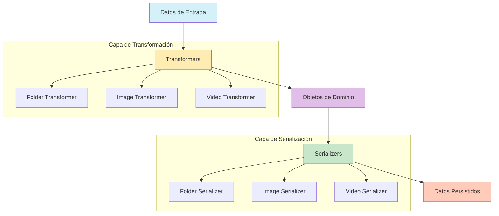
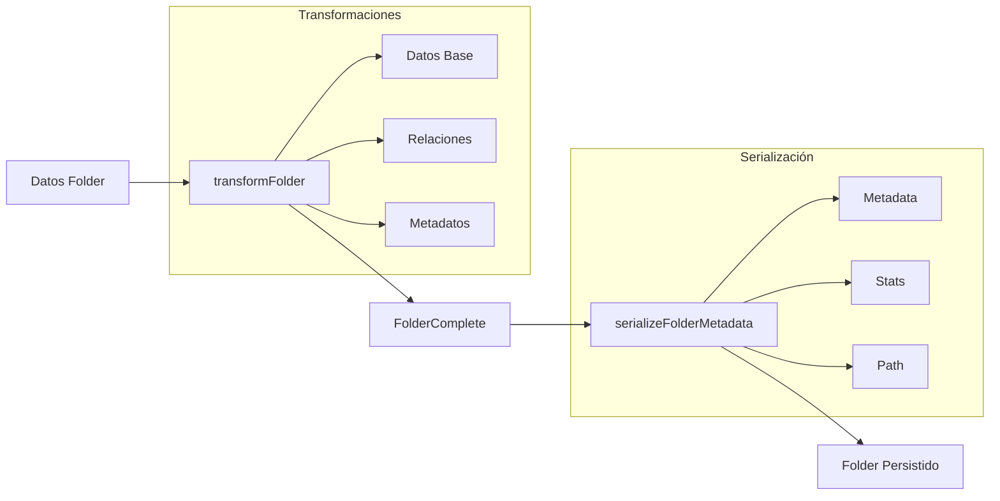
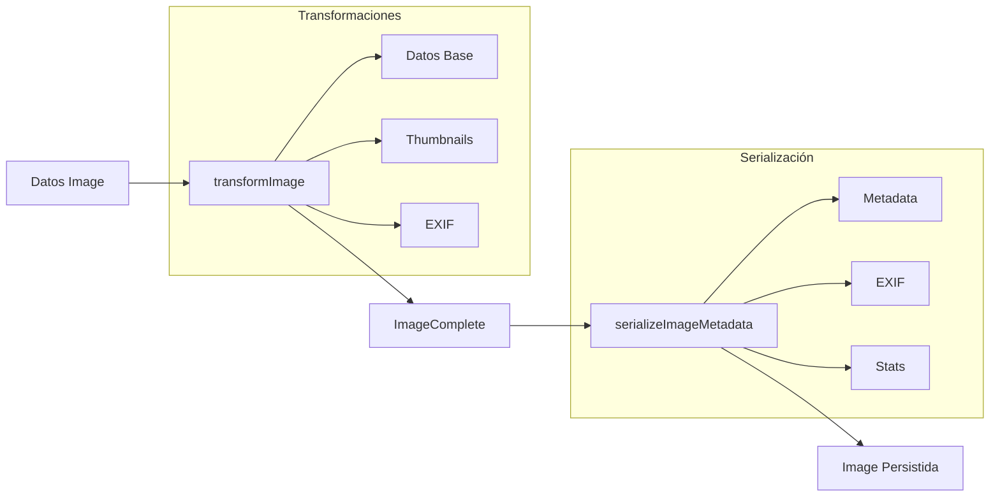
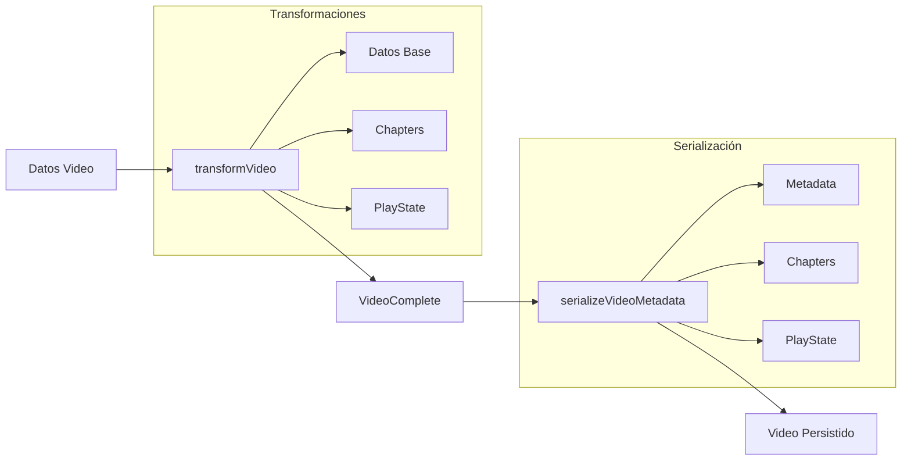

# Arquitectura de Transformers y Serializers

Este documento describe la arquitectura y flujo de datos de los transformers y serializers en el sistema.

## Diagrama de Flujo General



## Flujo de Datos por Entidad

### Folder



### Image



### Video



## Patrones de Implementación

### Transformers

Los transformers son responsables de:
- Convertir datos crudos a objetos de dominio tipados
- Validar y sanitizar datos de entrada
- Aplicar transformaciones de datos necesarias
- Manejar relaciones entre entidades

### Serializers

Los serializers son responsables de:
- Convertir objetos de dominio a formato persistible
- Manejar serialización de metadatos complejos
- Aplicar normalización de datos
- Gestionar el formato de almacenamiento

## Ejemplos de Uso

### Transformación de Folder

```typescript
// Transformación básica
const folderData = {
  id: 'folder-1',
  name: 'My Folder',
  path: '/my-folder'
};
const folder = transformFolder(folderData);

// Transformación con relaciones
const folderWithRelations = transformFolderToComplete({
  ...folderData,
  children: [],
  parent: null
});
```

### Serialización de Image

```typescript
// Serialización de metadatos
const imageMetadata = {
  width: 1920,
  height: 1080,
  format: 'jpeg'
};
const serializedMetadata = serializeImageMetadata(imageMetadata);

// Deserialización
const metadata = deserializeImageMetadata(serializedMetadata);
```

### Transformación de Video

```typescript
// Transformación con estado de reproducción
const videoData = {
  id: 'video-1',
  name: 'My Video',
  playState: JSON.stringify({
    position: 120,
    lastPlayed: new Date()
  })
};
const video = transformVideo(videoData);

// Serialización de capítulos
const chapters = [
  { id: 'ch1', title: 'Intro', startTime: 0 },
  { id: 'ch2', title: 'Main', startTime: 60 }
];
const serializedChapters = serializeVideoChapters(chapters);
```